# Sistem Rekonsiliasi Stok

Sistem pencatatan dan rekonsiliasi stok untuk brand skincare Indonesia yang berjualan melalui Shopee dan TikTok Shop.

Tujuan utamanya sederhana, tetapi tidak boleh dinegosiasikan:

> **Tidak ada angka stok yang berubah tanpa jejak.**

Sistem dirancang untuk mencatat setiap pergerakan barang, mengalokasikan batch secara otomatis dengan FEFO, membedakan reservasi dari barang yang benar-benar keluar, menangani retur berdasarkan hasil inspeksi gudang, serta menjelaskan selisih stok sampai ke sumber transaksinya.

---

## Daftar Isi

- [Ringkasan](#ringkasan)
- [Masalah yang Diselesaikan](#masalah-yang-diselesaikan)
- [Keputusan Bisnis Utama](#keputusan-bisnis-utama)
- [Cakupan Fase 1](#cakupan-fase-1)
- [Di Luar Cakupan](#di-luar-cakupan)
- [Arsitektur](#arsitektur)
- [Model Stok](#model-stok)
- [Teknologi](#teknologi)
- [Struktur Repository](#struktur-repository)
- [Peta Dokumentasi](#peta-dokumentasi)
- [Menjalankan Proyek Secara Lokal](#menjalankan-proyek-secara-lokal)
- [Konfigurasi Environment](#konfigurasi-environment)
- [Database, Migration, dan Seed](#database-migration-dan-seed)
- [Akun Admin Demo](#akun-admin-demo)
- [Perintah Pengembangan](#perintah-pengembangan)
- [Testing](#testing)
- [Golden Demo](#golden-demo)
- [Keamanan](#keamanan)
- [Deployment](#deployment)
- [Workflow Kontribusi](#workflow-kontribusi)
- [Troubleshooting](#troubleshooting)
- [Status Implementasi Fase 1](#status-implementasi-fase-1)
- [Definition of Done](#definition-of-done)
- [Referensi Resmi](#referensi-resmi)

---

## Ringkasan

Klien adalah brand skincare Indonesia dengan karakteristik berikut:

- sekitar 70 produk;
- produksi melalui maklon;
- penjualan melalui Shopee dan TikTok Shop;
- ratusan paket keluar setiap hari;
- jumlah retur yang signifikan;
- pencatatan stok lama berbasis spreadsheet;
- hasil stok opname sering berbeda dengan catatan;
- sumber selisih sulit ditelusuri.

Repository ini menggunakan dokumentasi domain sebagai **source of truth** sebelum dan selama implementasi.

Stack wajib:

```text
Next.js
TypeScript
Supabase
PostgreSQL
```

Model pengguna fase 1:

```text
Satu role aplikasi: ADMIN
Beberapa akun Admin individual tetap diperbolehkan
```

---

## Masalah yang Diselesaikan

Selisih stok muncul dari beberapa jalur yang sebelumnya tidak tercatat secara konsisten:

1. **Pesanan dibatalkan**
   - Barang sudah dicatat keluar.
   - Pesanan kemudian batal.
   - Catatan tidak dikoreksi dengan benar.

2. **Retur memiliki hasil berbeda**
   - Barang kembali layak jual.
   - Barang kembali dalam kondisi rusak.
   - Barang hilang dan tidak pernah tiba.

3. **Barang keluar tanpa pesanan**
   - Bonus.
   - Promo.
   - Sampel.
   - Penjualan offline.
   - Barang rusak atau kedaluwarsa.

4. **Saldo awal tidak akurat**
   - Selisih sudah ada sebelum sistem baru dipakai.

5. **Stok opname hanya menemukan angka selisih**
   - Tidak ada histori yang cukup untuk menjelaskan pembentuknya.

Sistem ini tidak hanya menghitung saldo akhir. Sistem harus mampu menjawab:

```text
Mengapa saldo menjadi sebesar ini?
Transaksi apa yang membentuknya?
Batch mana yang terpengaruh?
Siapa atau proses apa yang mencatatnya?
Apakah stok fisik, reservasi, retur, atau adjustment?
```

---

## Keputusan Bisnis Utama

### 1. Ledger adalah sumber kebenaran

Semua perubahan quantity fisik ditulis sebagai ledger entry.

Saldo tidak boleh diedit langsung.

```text
ledger entries
-> projection saldo
-> dashboard dan laporan
```

### 2. Ledger bersifat append-only

Transaksi yang sudah diposting:

- tidak diedit;
- tidak dihapus;
- dikoreksi dengan reversal atau corrective transaction.

### 3. Reservasi bukan barang keluar

Pesanan baru hanya mengurangi `available`, bukan stok fisik.

```text
available = sellable - active reservation
```

### 4. Trigger keluar fisik berbeda per marketplace

| Marketplace | Trigger physical outbound |
|---|---|
| Shopee | `SHIPPED` |
| TikTok Shop | `IN_TRANSIT` |

Status sebelum trigger tersebut hanya membentuk reservasi.

### 5. Batch dialokasikan otomatis dengan FEFO

Admin tidak memilih batch untuk outbound normal.

Urutan FEFO:

```text
expiry terdekat
-> waktu penerimaan lebih awal
-> batch code
-> batch ID
```

Batch berikut tidak eligible:

- kedaluwarsa;
- diblokir;
- quarantine;
- damaged;
- unidentified return batch;
- berada dalam safety buffer yang dikonfigurasi.

### 6. Bundle tidak mempunyai stok

Listing bundle dipecah menjadi produk penyusunnya saat data masuk.

Contoh:

```text
1 Glow Starter Bundle
=
2 Serum
1 Cleanser
```

Recipe disimpan sebagai snapshot pada order agar perubahan recipe di masa depan tidak mengubah histori.

### 7. Alasan dan kanal dipisahkan

Contoh:

```text
channel = MANUAL
reason = BONUS
```

`MANUAL` menjelaskan jalur input.

`BONUS` menjelaskan mengapa barang keluar.

### 8. Retur ditentukan gudang

Marketplace dapat menyatakan retur sedang dikirim atau diterima, tetapi kondisi fisik ditentukan melalui inspeksi gudang.

Alur default:

```text
expected return
-> physical receipt
-> QUARANTINE
-> inspection
-> SELLABLE atau DAMAGED
```

### 9. Klaim tidak mengubah stok

Retur hilang dan klaim TikTok adalah status operasional.

Keduanya tidak membuat inbound ledger.

Default batas klaim TikTok:

```text
40 hari kalender
```

### 10. Dua ritme rekonsiliasi

- **Harian:** memeriksa konsistensi ledger, projection, order, allocation, reservation, return, dan notification.
- **Saat stok opname:** membandingkan catatan dengan hitung fisik dan membuat adjustment yang dapat diaudit.

---

## Cakupan Fase 1

### Master Data

- organisasi;
- akun Admin;
- produk;
- batch;
- tanggal kedaluwarsa;
- channel;
- movement reason;
- recipe bundle;
- mapping listing marketplace.

### Pergerakan Stok

- saldo awal;
- penerimaan barang dari maklon;
- physical outbound marketplace;
- penjualan offline;
- bonus;
- promo;
- sampel;
- damaged transfer/disposal;
- expired disposal;
- return receipt;
- return inspection;
- stocktake adjustment;
- reversal.

### Marketplace

- pesanan baru;
- reservasi;
- status pesanan;
- pembatalan;
- trigger physical outbound;
- retur;
- event duplicate;
- event out-of-order;
- simulator Shopee dan TikTok Shop;
- impor CSV.

### Retur dan Klaim

- expected return;
- partial return;
- physical receipt stock-neutral;
- pending inspection operasional;
- sellable inspection sebagai inbound ke batch `RETURN` baru;
- damaged inspection tanpa movement stok kedua;
- lost return;
- late arrival;
- klaim TikTok;
- pengingat deadline.

### Stok Opname

- frozen atau continuous mode;
- blind count;
- count attempt append-only;
- recount;
- tolerance;
- review;
- approval version;
- atomic posting;
- adjustment ledger;
- reconciliation.

### Rekonsiliasi

- ledger vs batch projection;
- batch vs product projection;
- reservation vs available;
- allocation vs outbound;
- return receipt operasional vs ledger;
- sellable return inbound vs batch `RETURN` baru;
- damaged/lost return tanpa movement stok kedua;
- duplicate source effect;
- negative bucket;
- reversal limit;
- notification consistency.

### Notifikasi

- batch mendekati kedaluwarsa;
- batch kedaluwarsa dengan saldo;
- return menunggu inspeksi;
- claim mendekati deadline;
- claim overdue;
- issue rekonsiliasi `HIGH` atau `CRITICAL`;
- import failure;
- stocktake failure;
- marketplace event stalled;
- system job failure.

---

## Di Luar Cakupan

Fase 1 tidak mencakup:

- integrasi API marketplace production;
- pencatatan harga;
- nilai inventory;
- accounting;
- payment;
- multi-warehouse;
- serial-number tracking;
- native mobile app;
- customer-facing application;
- email, WhatsApp, SMS, atau browser push notification;
- automatic marketplace claim submission.

Simulator dan impor menggantikan API marketplace pada fase 1.

Keduanya harus menghasilkan event kanonis yang sama dengan adapter API masa depan.

---

## Arsitektur

### Aliran Domain Utama

```mermaid
flowchart LR
    SOURCE[Simulator / CSV / Future API]
    EVENT[Canonical Marketplace Event]
    ORDER[Order and Reservation]
    TRIGGER[Physical Outbound Trigger]
    FEFO[FEFO Allocation]
    LEDGER[Append-only Stock Ledger]
    PROJECTION[Stock Projection]
    RECON[Reconciliation]
    NOTIF[Notification Center]

    SOURCE --> EVENT
    EVENT --> ORDER
    ORDER --> TRIGGER
    TRIGGER --> FEFO
    FEFO --> LEDGER
    LEDGER --> PROJECTION
    LEDGER --> RECON
    PROJECTION --> RECON
    RECON --> NOTIF
```



### Boundary Aplikasi

```text
Admin browser
-> Next.js server boundary
-> authenticated Supabase client
-> safe API view or RPC
-> database function
-> ledger + projection + audit
```

### Komponen

| Komponen | Tanggung jawab |
|---|---|
| Next.js | UI, Server Components, Server Actions, Route Handlers |
| TypeScript | domain contract, validation, DTO, adapters |
| Supabase Auth | authentication dan session |
| PostgreSQL | transaction, ledger, projection, constraint, RLS |
| Supabase Storage | evidence dan import file privat |
| Supabase Realtime | sinyal refresh UI, bukan source of truth |
| Supabase Cron | rekonsiliasi dan notification evaluation |
| Vercel | deployment Next.js |
| GitHub Actions | CI, test, dan migration deployment |

---

## Model Stok

### Bucket Fisik

```text
SELLABLE
QUARANTINE
DAMAGED
```

### Reservation

Reservation bukan bucket fisik.

```text
sellable
reserved
available = sellable - reserved
```

### Product Position

Setiap produk minimal mempunyai:

```text
sellable_qty
quarantine_qty
damaged_qty
reserved_qty
available_qty
```

### Batch Position

Setiap batch minimal mempunyai:

```text
product
batch code
expiry date
status
sellable_qty
quarantine_qty
damaged_qty
last ledger sequence
```

### Invariant

```text
quantity bucket tidak boleh negatif
internal transfer harus net zero
allocation total harus sama dengan physical outbound
reversal tidak boleh melebihi original movement
projection harus dapat dibangun ulang dari ledger
duplicate command/event menghasilkan maksimal satu domain effect
```

---

## Teknologi

### Application

- Next.js App Router
- TypeScript
- React
- Server Components
- Server Actions dan Route Handlers
- pnpm

### Backend dan Data

- Supabase Auth
- Supabase PostgreSQL
- Supabase Storage
- Supabase Realtime
- Supabase Cron
- Row Level Security
- PostgreSQL functions dan transactions

### Testing

- Vitest
- React Testing Library
- pgTAP
- Supabase CLI
- Playwright
- k6

### Deployment

- GitHub
- GitHub Actions
- Vercel
- Supabase Cloud

---

## Struktur Repository

Struktur yang direkomendasikan:

```text
.
├── app/
├── components/
├── public/
├── src/
│   ├── domain/
│   ├── lib/
│   ├── server/
│   │   ├── auth/
│   │   ├── commands/
│   │   ├── dal/
│   │   └── supabase/
│   ├── types/
│   └── validation/
├── supabase/
│   ├── config.toml
│   ├── functions/
│   ├── migrations/
│   ├── seed.sql
│   └── tests/
├── tests/
│   ├── unit/
│   ├── component/
│   ├── integration/
│   ├── contract/
│   ├── e2e/
│   ├── concurrency/
│   ├── property/
│   ├── accessibility/
│   └── performance/
├── scripts/
├── .github/
│   └── workflows/
├── .env.example
├── package.json
├── pnpm-lock.yaml
├── next.config.ts
├── README.md
└── vercel.json
```

Dokumen spesifikasi saat ini dapat tetap berada di root atau dipindahkan ke `docs/`, selama seluruh relative link diperbarui secara konsisten.

---

## Peta Dokumentasi

| File | Isi |
|---|---|
| [`stok-management-system.pdf`](./stok-management-system.pdf) | Brief asli proyek |
| [`01-project-brief.md`](./01-project-brief.md) | Masalah, visi, scope, prinsip, dan acceptance |
| [`02-product-requirements.md`](./02-product-requirements.md) | Product requirements lengkap |
| [`03-business-rules.md`](./03-business-rules.md) | Business rules dan decision table |
| [`04-stock-ledger-design.md`](./04-stock-ledger-design.md) | Ledger, transaction, idempotency, reversal |
| [`05-database-schema.md`](./05-database-schema.md) | Schema PostgreSQL dan relasi |
| [`06-user-roles-and-flows.md`](./06-user-roles-and-flows.md) | Flow Admin dan navigasi aplikasi |
| [`07-marketplace-simulator.md`](./07-marketplace-simulator.md) | Simulator, canonical event, preset |
| [`08-reconciliation-logic.md`](./08-reconciliation-logic.md) | Checks, issue, fingerprint, rebuild |
| [`09-return-and-claim-flow.md`](./09-return-and-claim-flow.md) | Retur, inspection, lost, claim |
| [`10-fefo-batch-allocation.md`](./10-fefo-batch-allocation.md) | Eligibility, sorting, locking, split |
| [`11-stock-opname-flow.md`](./11-stock-opname-flow.md) | Snapshot, count, recount, adjustment |
| [`12-notification-rules.md`](./12-notification-rules.md) | Rule engine, escalation, outbox |
| [`13-security-and-rls.md`](./13-security-and-rls.md) | Auth, RLS, grants, storage, security |
| [`14-testing-scenarios.md`](./14-testing-scenarios.md) | Strategi dan katalog pengujian |
| [`15-demo-script.md`](./15-demo-script.md) | Runbook demo live |
| [`16-deployment-guide.md`](./16-deployment-guide.md) | Environment, CI/CD, deploy, rollback |
| [`seed.sql`](./seed.sql) | Golden fixture local, test, staging, dan demo |

### Urutan Membaca yang Direkomendasikan

Developer baru:

```text
README
-> 01 Project Brief
-> 03 Business Rules
-> 04 Ledger Design
-> 05 Database Schema
-> 13 Security and RLS
-> dokumen fitur yang sedang dikerjakan
-> 14 Testing Scenarios
```

Reviewer produk:

```text
README
-> 01 Project Brief
-> 02 Product Requirements
-> 15 Demo Script
```

Reviewer database:

```text
03 Business Rules
-> 04 Ledger Design
-> 05 Database Schema
-> 08 Reconciliation
-> 10 FEFO
-> 13 Security and RLS
```

---

## Menjalankan Proyek Secara Lokal

### Prasyarat

- Git
- Node.js versi yang ditetapkan repository
- pnpm
- Docker Desktop atau container runtime yang kompatibel dengan Docker API
- Supabase CLI

Verifikasi:

```bash
node --version
pnpm --version
docker --version
supabase --version
```

### 1. Clone Repository

```bash
git clone <REPOSITORY_URL>
cd <PROJECT_DIRECTORY>
```

### 2. Install Dependency

```bash
pnpm install --frozen-lockfile
```

Untuk instalasi pertama sebelum lockfile tersedia:

```bash
pnpm install
```

Commit lockfile setelah dependency disepakati.

### 3. Buat Environment Lokal

```bash
cp .env.example .env.local
```

Isi nilai lokal berdasarkan output:

```bash
supabase status
```

### 4. Jalankan Supabase Lokal

```bash
supabase start
```

Supabase lokal menjalankan layanan seperti:

- PostgreSQL;
- Auth;
- Storage;
- Realtime;
- Studio.

### 5. Terapkan Migration dan Seed

```bash
supabase db reset
```

Perintah tersebut:

1. membuat ulang database lokal;
2. menjalankan seluruh migration;
3. menjalankan `supabase/seed.sql`.

> `seed.sql` hanya dapat berjalan setelah migration nyata telah membuat schema dan tabel yang dijelaskan dalam [`05-database-schema.md`](./05-database-schema.md).

### 6. Jalankan Database Test

```bash
supabase test db
```

### 7. Jalankan Next.js

```bash
pnpm dev
```

Buka:

```text
http://localhost:3000
```

### 8. Hentikan Supabase Lokal

```bash
supabase stop
```

---

## Konfigurasi Environment

Contoh baseline:

```dotenv
# Application
APP_ENV=local
APP_BASE_URL=http://localhost:3000
NEXT_PUBLIC_APP_MODE=LOCAL
NEXT_PUBLIC_APP_VERSION=dev
NEXT_PUBLIC_TIMEZONE=Asia/Jakarta

# Browser-safe Supabase values
NEXT_PUBLIC_SUPABASE_URL=http://127.0.0.1:54321
NEXT_PUBLIC_SUPABASE_PUBLISHABLE_KEY=replace-with-local-key

# Server-only
SUPABASE_SERVICE_ROLE_KEY=replace-with-local-service-key
DATABASE_URL=replace-with-local-pooled-url
DIRECT_URL=replace-with-local-direct-url

# Simulator
MARKETPLACE_SIMULATOR_ENABLED=true
MARKETPLACE_SIMULATOR_ALLOW_COMMIT=true
MARKETPLACE_SIMULATOR_MAX_EVENTS_PER_RUN=50
MARKETPLACE_SIMULATOR_DEMO_ORG_ID=00000000-0000-4000-8000-000000000001

# Optional
LOG_LEVEL=debug
SENTRY_DSN=
```

### Browser-Safe

Variable dengan prefix berikut dapat masuk bundle browser:

```text
NEXT_PUBLIC_
```

Jangan pernah memasukkan secret pada prefix tersebut.

### Server-Only

Berikut harus tetap berada di server:

```text
SUPABASE_SERVICE_ROLE_KEY
DATABASE_URL
DIRECT_URL
SUPABASE_ACCESS_TOKEN
SUPABASE_DB_PASSWORD
SMTP_PASSWORD
VERCEL_TOKEN
```

### Environment Guard

Production build harus gagal jika:

- `APP_BASE_URL` masih localhost;
- project Supabase salah;
- simulator production aktif tanpa isolated demo policy;
- secret server hilang;
- preview menunjuk production;
- production menunjuk staging.

Lihat [`16-deployment-guide.md`](./16-deployment-guide.md).

---

## Database, Migration, dan Seed

### Migration adalah Source of Truth

Semua perubahan database harus ditulis sebagai migration:

```bash
supabase migration new <migration_name>
```

Setelah mengubah schema lokal melalui Studio, generate dan review diff:

```bash
supabase db diff -f <migration_name>
```

Kemudian:

```bash
supabase db reset
supabase test db
```

### Aturan Migration

- jangan mengedit migration yang sudah diterapkan ke environment bersama;
- jangan membuat schema hanya melalui dashboard production;
- jangan membuat `SECURITY DEFINER` tanpa fixed `search_path`;
- jangan memberi `EXECUTE` ke `PUBLIC`;
- jangan menonaktifkan RLS untuk menyelesaikan bug authorization;
- jangan menulis initial balance langsung ke projection;
- gunakan expand-contract untuk perubahan breaking.

### `seed.sql`

Seed berisi:

- organisasi demo;
- channel;
- movement reason;
- settings;
- produk;
- batch;
- bundle recipe;
- notification rules;
- initial balance melalui ledger;
- projection rebuild;
- private Storage buckets;
- verification assertions.

Seed tidak boleh digunakan untuk:

- data production;
- customer data;
- production opening balance;
- membuat password;
- menggantikan migration;
- memasukkan harga.

Golden initial state:

```text
Serum sellable    = 25
Cleanser sellable = 15
Toner sellable    = 12
Reserved          = 0
Quarantine        = 0
Damaged           = 0
```

---

## Akun Admin Demo

Email yang direkomendasikan:

```text
demo.admin@glowlab.invalid
```

`seed.sql` sengaja tidak menulis langsung ke `auth.users`.

Buat user melalui:

- trusted server-side bootstrap script;
- Supabase Auth Admin API;
- Supabase Studio hanya untuk local development.

Setelah user tersedia:

- buat atau upsert `app.user_profiles`;
- gunakan organization `GLOWLAB_DEMO`;
- gunakan role `ADMIN`;
- pastikan `is_active = true`.

Jangan:

- menaruh service-role key pada Client Component;
- menulis langsung struktur internal Auth;
- memakai akun Admin bersama untuk production;
- memasukkan password demo ke repository.

Production menggunakan invite-only flow dan akun individual.

---

## Perintah Pengembangan

Script final mengikuti `package.json`.

Baseline:

```bash
# Development
pnpm dev

# Production build
pnpm build
pnpm start

# Static checks
pnpm typecheck
pnpm lint

# Unit and component
pnpm test
pnpm test:run
pnpm test:coverage

# Database
supabase start
supabase db reset
supabase test db

# E2E
pnpm test:e2e

# Demo smoke
pnpm test:demo
```

Contoh script yang direkomendasikan:

```json
{
  "scripts": {
    "dev": "next dev",
    "build": "next build",
    "start": "next start",
    "lint": "eslint .",
    "typecheck": "tsc --noEmit",
    "test": "vitest",
    "test:run": "vitest run",
    "test:coverage": "vitest run --coverage",
    "test:db": "supabase test db",
    "test:e2e": "playwright test",
    "test:demo": "playwright test --grep @demo"
  }
}
```

---

## Testing

Strategi lengkap tersedia di [`14-testing-scenarios.md`](./14-testing-scenarios.md).

### Lapisan Test

| Lapisan | Tool |
|---|---|
| Type dan lint | TypeScript, ESLint |
| Unit | Vitest |
| Component | React Testing Library |
| Database | pgTAP |
| Integration | Vitest/Node + Supabase lokal |
| E2E | Playwright |
| Concurrency | parallel DB/API harness |
| Property-based | generator domain |
| Performance | k6 |
| Security | pgTAP, Playwright, OWASP checklist |
| Accessibility | Playwright dan manual WCAG |

### P0 Invariant

Release harus berhenti bila test menemukan:

```text
negative stock
duplicate ledger effect
cross-organization access
direct ledger mutation
FEFO memilih batch tidak eligible
cancel post-shipment melakukan auto-restock
return melewati quarantine
claim mengubah stok
stocktake posting parsial
ledger dan projection berbeda tanpa penjelasan
```

### Quick Test Gate

```bash
pnpm typecheck
pnpm lint
pnpm test:run
supabase db reset
supabase test db
pnpm build
pnpm test:e2e --grep @smoke
```

---

## Golden Demo

Runbook lengkap tersedia di [`15-demo-script.md`](./15-demo-script.md).

### Golden Story

```text
25 initial serum
+10 maklon
-8 Shopee shipped
-1 TikTok in transit
-2 bonus
-2 bundle component
+2 return sellable
-1 stocktake adjustment
=
23 sellable
```

State tambahan:

```text
damaged = 1
quarantine = 0
reserved = 0
one lost return
one active claim
```

### FEFO Shopee

Order quantity:

```text
8
```

Allocation:

```text
SER-2608-A -> 5
SER-2612-B -> 3
```

### Return Mixed Inspection

```text
physical receipt -> QUARANTINE +3
inspection       -> SELLABLE +2
inspection       -> DAMAGED +1
```

### Demo Principles

- gunakan data sintetis;
- tampilkan banner `DEMO MODE`;
- jangan edit database manual;
- jangan gunakan production organization;
- jangan menyembunyikan failed invariant;
- setiap perubahan quantity harus dibuka sampai ledger/source.

---

## Keamanan

Baseline lengkap tersedia di [`13-security-and-rls.md`](./13-security-and-rls.md).

### Authentication

- Supabase Auth;
- public signup production dinonaktifkan;
- invite-only;
- profil Admin harus aktif;
- MFA/AAL2 untuk tindakan sensitif production.

### Authorization

Organization dan actor berasal dari trusted session/profile.

Client tidak dipercaya untuk menentukan:

```text
organization_id
actor_user_id
role
stock balance
batch allocation
ledger sequence
posted status
```

### RLS

Rekomendasi:

```text
only api schema exposed
internal schemas hidden
anon has no application data access
authenticated access scoped by organization
```

### Direct Mutation

Browser tidak boleh menulis langsung:

- stock ledger;
- projection;
- allocation;
- audit;
- posted document;
- reconciliation history;
- notification lifecycle.

Mutation kritis menggunakan database function terkontrol.

### Service Role

```text
server-only
never NEXT_PUBLIC
never browser
never default user request client
```

### Storage

Bucket:

```text
evidence
imports
exports
```

Semua private.

Gunakan short-lived signed URL setelah authorization.

---

## Deployment

Baseline lengkap tersedia di [`16-deployment-guide.md`](./16-deployment-guide.md).

### Topologi

```text
GitHub
-> GitHub Actions
-> Vercel Next.js
-> Supabase Cloud
```

### Environment

```text
LOCAL
TEST
PREVIEW/STAGING
DEMO
PRODUCTION
```

Minimum:

- satu Supabase project staging/demo;
- satu Supabase project production;
- Preview Vercel menunjuk staging;
- Production Vercel menunjuk production.

### Release Sequence

```text
CI pass
-> backup verified
-> backward-compatible migration
-> database verification
-> production build
-> deployment checks
-> promote
-> smoke test
-> reconciliation
-> observation window
```

### Production Defaults

```text
MARKETPLACE_SIMULATOR_ENABLED=false
public signup disabled
custom SMTP
private Storage
MFA for sensitive actions
RLS enabled
daily backup
```

### Rollback

Application:

```text
rollback ke Vercel deployment sebelumnya
```

Database:

```text
forward-fix sebagai default
```

Business stock:

```text
reversal, bukan menghapus ledger
```

---

## Workflow Kontribusi

### Branch

Contoh:

```text
main
feature/<name>
fix/<name>
migration/<name>
```

### Sebelum Pull Request

```bash
pnpm typecheck
pnpm lint
pnpm test:run
supabase db reset
supabase test db
pnpm build
```

### Pull Request Harus Menjelaskan

- masalah;
- perubahan;
- business rule terkait;
- migration;
- test;
- security impact;
- screenshot/trace bila UI;
- rollback atau forward-fix bila perlu.

### Perubahan yang Memerlukan Review Tambahan

- ledger;
- FEFO;
- reservation;
- return quantity;
- stocktake;
- reconciliation;
- RLS;
- `SECURITY DEFINER`;
- service-role usage;
- storage policy;
- production migration;
- simulator production behavior.

### Larangan

- force-push ke `main`;
- secret pada commit;
- production fix langsung melalui SQL dashboard tanpa migration;
- mengubah saldo agar test lulus;
- men-disable RLS;
- men-skip P0 test tanpa defect dan approval;
- menggunakan data production pada test/demo.

---

## Troubleshooting

### `supabase start` gagal

Periksa:

```bash
docker info
supabase --version
```

Pastikan Docker atau container runtime kompatibel sedang berjalan.

### `supabase db reset` gagal pada `seed.sql`

Kemungkinan:

- migration belum membuat schema yang diperlukan;
- nama tabel/kolom belum sesuai [`05-database-schema.md`](./05-database-schema.md);
- migration dan seed berbeda versi;
- seed dijalankan pada environment production.

Periksa error pertama, bukan hanya error terakhir.

### Login berhasil tetapi aplikasi menolak akses

Periksa:

```text
auth user exists
app.user_profiles exists
is_active = true
role_code = ADMIN
organization_id benar
session valid
```

### Semua query ditolak RLS

Periksa:

- session authenticated;
- profile aktif;
- helper authorization;
- grants;
- `api` exposed schema;
- policy recursion;
- migration security sudah diterapkan.

Jangan menyelesaikannya dengan service-role pada browser.

### Stok tidak sesuai setelah mutation

1. buka stock transaction;
2. buka ledger entries;
3. hitung balance dari ledger;
4. bandingkan projection;
5. jalankan reconciliation;
6. perbaiki projection bila drift;
7. gunakan reversal bila business movement salah.

Jangan update angka saldo langsung.

### Simulator tidak dapat commit

Periksa:

```text
MARKETPLACE_SIMULATOR_ENABLED
MARKETPLACE_SIMULATOR_ALLOW_COMMIT
MARKETPLACE_SIMULATOR_DEMO_ORG_ID
APP_ENV
```

Production harus menolak simulator secara default.

### Environment variable berubah tetapi deployment lama tetap sama

Buat deployment baru.

Public environment variables dapat tertanam saat build.

---

## Status Implementasi Saat Ini

Status berikut menggambarkan source pada branch saat ini. Status ini bukan pengganti acceptance test dan bukan klaim bahwa seluruh Fase 1 telah selesai.

| Area | Status | Tersedia saat ini | Sisa utama |
|---|---|---|---|
| Identitas dan Admin Auth | **Implemented** | Login/logout, session server-only, validasi profil aktif `ADMIN`, proteksi route, dan audit actor individual | UI pengelolaan akun Admin |
| Shared Admin shell | **Implemented** | Sidebar desktop, navigasi mobile, active route, organisasi, mode aplikasi, akun, logout, serta unread badge Notification Center berbasis data live | Status rekonsiliasi global berbasis data live |
| Produk dan batch | **Partial** | Schema, seed, read model, posisi produk/batch, dan pilihan transaksi | CRUD master data, pengarsipan, detail batch, bundle, dan mapping listing |
| Ledger dan projection | **Implemented** | Ledger append-only, idempotent posting, bucket fisik, serta projection produk dan batch | Drill-down lengkap, reversal umum, damaged disposal, dan expired disposal melalui Admin UI |
| Receipt dan manual outbound | **Implemented** | Receipt dari maklon, outbound manual dengan reason/channel, dan alokasi FEFO | Preview/reversal receipt dan workflow disposal khusus |
| Marketplace lifecycle | **Implemented** | Reservasi, release/cancel, trigger shipment, physical outbound FEFO, dan simulator Admin | CSV import dan penyelesaian bundle/listing flow |
| Return dan claim | **Partial** | Expected return stock-neutral, receipt operasional tanpa ledger, inspeksi sellable sebagai inbound idempoten ke batch `RETURN` baru, damaged/lost tanpa movement kedua, partial item, provenance batch asal, dan lost return | Claim reminder, overdue, late-arrival administration, dan claim lifecycle lengkap |
| Stocktake | **Implemented** | Create, prepare, continuous count, blind/non-blind count, review, approval immutable, posting adjustment, dan audit linkage | Frozen mode dan penyempurnaan UX lanjutan |
| Reconciliation | **Implemented** | Manual run, delapan integrity checks, issue, evidence, history, Admin UI, serta alert Notification Center untuk issue dan run failure | Scheduled daily run production |
| Notification Center | **Implemented** | Lifecycle OPEN/ACKNOWLEDGED/RESOLVED, per-Admin read state, unread badge aktif, evaluator expiry/return/reconciliation/stocktake, dedup episode, transactional outbox, retry, RLS, detail/history, deep link, dan Admin Operations UI | Claim deadline, import failure, marketplace stalled evaluator, production scheduler/cron, dan optional realtime refresh |
| CSV import | **Not started** | Contract kanonis telah didokumentasikan | Upload privat, parsing, validation, preview, commit, error report, dan idempotency |
| Release engineering | **Partial** | Lint, typecheck, build, pgTAP, seed, dan demo bootstrap tersedia secara lokal | GitHub Actions, deployment live, smoke test production, dan final golden demo |

Keterangan:

- **Implemented** berarti alur utama tersedia pada source dan telah memiliki validasi terkait.
- **Partial** berarti fondasi atau sebagian alur tersedia, tetapi acceptance criteria Fase 1 belum lengkap.
- **Not started** berarti belum ditemukan implementasi runtime pada source.

---
## Definition of Done

Fase 1 tidak selesai hanya karena halaman dapat dibuka.

Checkbox `[x]` berarti requirement utama telah tersedia pada source saat ini. Item parsial tetap dibiarkan belum dicentang sampai seluruh acceptance criteria dan release gate terkait selesai.

Minimum:

- [x] Login Admin aktif.
- [ ] Produk dan batch. **Partial:** schema, seed, projection, dan read model tersedia; Admin CRUD dan detail master data belum lengkap.
- [ ] Initial balance melalui ledger. **Partial:** ledger mendukung source movement, tetapi workflow cutover khusus belum lengkap.
- [x] Maklon receipt.
- [x] Shopee reservation dan `SHIPPED`.
- [x] TikTok reservation dan `IN_TRANSIT`.
- [x] FEFO split.
- [ ] Pembatalan sebelum dan sesudah outbound. **Partial:** release/cancel reservation tersedia; koreksi setelah physical outbound masih memerlukan reversal/return flow yang lengkap.
- [x] Manual outbound dengan reason/channel.
- [ ] Bundle expansion.
- [x] Return expected.
- [x] Return receipt operasional tanpa perubahan stok.
- [x] Return inspection: sellable inbound ke batch `RETURN` baru; damaged tanpa movement stok kedua.
- [ ] Lost return dan claim. **Partial:** lost return tersedia; claim deadline, reminder, overdue, dan administrasi claim belum lengkap.
- [x] Expiry notification.
- [x] Stocktake.
- [x] Reconciliation.
- [ ] Drill-down ledger.
- [x] Simulator.
- [ ] CSV import.
- [x] RLS dan security tests.
- [ ] Concurrency tests. **Partial:** idempotency dan duplicate-effect guardrail tersedia; pengujian race condition paralel masih menjadi release gate.
- [ ] Deployment live.
- [ ] Demo script lulus.
- [ ] Tidak ada unexpected critical reconciliation issue. **Release gate:** harus dibuktikan dari clean reconciliation run sebelum rilis.
- [x] Tidak ada harga atau nilai uang.
---

## Referensi Resmi

### Next.js

- Getting Started:  
  `https://nextjs.org/docs/app/getting-started`
- Installation:  
  `https://nextjs.org/docs/app/getting-started/installation`
- Deploying:  
  `https://nextjs.org/docs/app/getting-started/deploying`
- Production Checklist:  
  `https://nextjs.org/docs/app/guides/production-checklist`

### Supabase

- Local Development:  
  `https://supabase.com/docs/guides/local-development`
- CLI Getting Started:  
  `https://supabase.com/docs/guides/local-development/cli/getting-started`
- Schema Migrations:  
  `https://supabase.com/docs/guides/local-development/overview`
- Seeding:  
  `https://supabase.com/docs/guides/local-development/seeding-your-database`
- Testing:  
  `https://supabase.com/docs/guides/local-development/testing/overview`
- Row Level Security:  
  `https://supabase.com/docs/guides/database/postgres/row-level-security`

### Vercel

- Next.js on Vercel:  
  `https://vercel.com/docs/frameworks/full-stack/nextjs`
- Deployments:  
  `https://vercel.com/docs/deployments`
- Environment Variables:  
  `https://vercel.com/docs/environment-variables`
- Deployment Protection:  
  `https://vercel.com/docs/deployment-protection`

### GitHub

- About README files:  
  `https://docs.github.com/en/repositories/managing-your-repositorys-settings-and-features/customizing-your-repository/about-readmes`
- Repository best practices:  
  `https://docs.github.com/en/repositories/creating-and-managing-repositories/best-practices-for-repositories`

---

## Status Dokumentasi

Dokumentasi dalam repository ini adalah kontrak implementasi fase 1.

Jika implementasi dan dokumentasi berbeda:

1. periksa keputusan bisnis terbaru;
2. perbarui dokumen yang menjadi source of truth;
3. perbarui migration, code, dan test;
4. jangan mempertahankan perbedaan diam-diam.

Sistem ini dibangun agar selisih stok memiliki cerita yang dapat dibuktikan. Repository harus mengikuti prinsip yang sama: setiap keputusan penting harus memiliki jejak.
