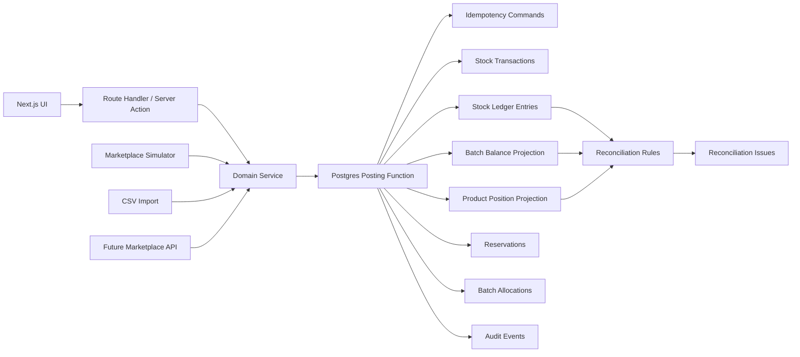
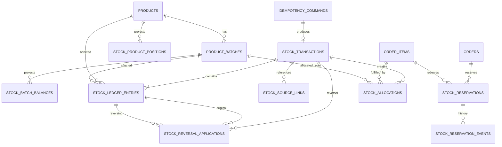
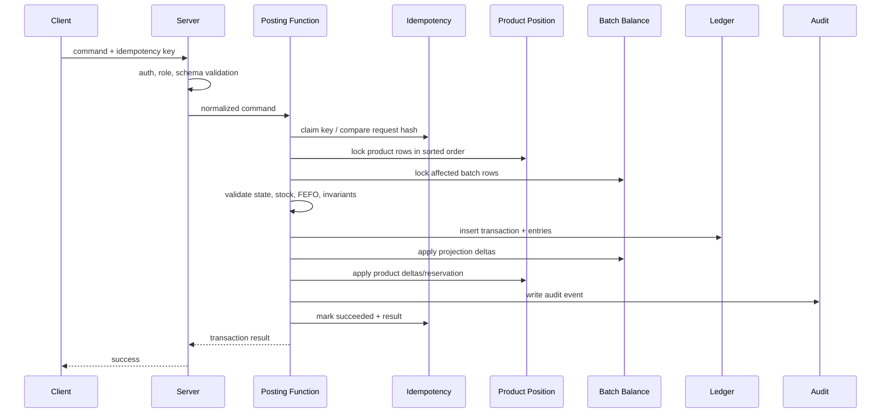

# Stock Ledger Design: Sistem Rekonsiliasi Stok

## 1. Tujuan Dokumen

Dokumen ini mendefinisikan desain teknis buku besar stok yang menjadi sumber kebenaran seluruh kuantitas barang dalam aplikasi.

Fokusnya adalah memastikan bahwa:

1. setiap perubahan stok menghasilkan jejak immutable;
2. saldo dapat direkonstruksi dari ledger;
3. reservasi tidak tercampur dengan perpindahan fisik;
4. alokasi FEFO aman terhadap transaksi konkuren;
5. reversal tidak menghapus histori;
6. simulator, impor CSV, dan API marketplace masa depan memakai pipeline yang sama;
7. selisih dapat ditelusuri dari posisi stok sampai ke kejadian sumber.

Dokumen ini berada satu tingkat di bawah `03-business-rules.md` dan satu tingkat di atas implementasi skema final. Nama tabel dan fungsi di sini adalah desain kanonis yang direkomendasikan. Detail migration final boleh disempurnakan dalam `05-database-schema.md` selama invariant dan kontrak pada dokumen ini tidak berubah.

> **Prinsip utama:** saldo adalah hasil dari histori, bukan angka yang berdiri sendiri.

## 2. Ringkasan Keputusan Desain

| ID | Keputusan |
|---|---|
| SLD-DEC-001 | Ledger menggunakan model `transaction header + signed bucket entries`. |
| SLD-DEC-002 | Setiap entry merepresentasikan perubahan kuantitas pada tepat satu kombinasi produk, batch, dan bucket. |
| SLD-DEC-003 | Transfer antar-bucket menghasilkan dua entry dalam satu transaksi: negatif pada bucket asal dan positif pada bucket tujuan. |
| SLD-DEC-004 | Reservasi disimpan terpisah dari ledger fisik karena reservasi tidak memindahkan barang. |
| SLD-DEC-005 | Tabel saldo adalah projection/cache yang diperbarui sinkron dalam transaksi yang sama dan harus dapat dibangun ulang dari ledger. |
| SLD-DEC-006 | Semua posting stok dilakukan melalui database function atau domain transaction terkontrol. |
| SLD-DEC-007 | Tabel ledger tidak menerima `UPDATE` atau `DELETE` dari role aplikasi. |
| SLD-DEC-008 | Reversal dibuat sebagai transaksi baru dengan entry kebalikan dan mapping ke entry asal. |
| SLD-DEC-009 | Proteksi overallocation menggunakan lock pada posisi produk dan baris batch dalam urutan deterministik. |
| SLD-DEC-010 | Phase 1 menggunakan `READ COMMITTED` dengan explicit row locking; implementasi `SERIALIZABLE` dapat dipilih kemudian bila retry serialization sudah matang. |
| SLD-DEC-011 | `SKIP LOCKED` tidak digunakan untuk FEFO normal karena dapat melewati batch paling dekat kedaluwarsa. |
| SLD-DEC-012 | Waktu kejadian bisnis dan waktu posting sistem disimpan terpisah. |
| SLD-DEC-013 | Semua command stok memakai idempotency key dan request hash. |
| SLD-DEC-014 | Kuantitas disimpan sebagai integer `bigint`; sistem fase 1 tidak menyimpan pecahan atau nilai uang. |
| SLD-DEC-015 | Urutan commit ledger memakai sequence monotonik untuk audit dan rebuild deterministik. |

## 3. Ruang Lingkup

### 3.1 Termasuk

- saldo awal;
- penerimaan barang dari maklon;
- outbound marketplace;
- outbound manual;
- penerimaan retur stock-neutral;
- hasil inspeksi sellable sebagai inbound ke batch RETURN baru;
- hasil damaged/lost sebagai audit tanpa movement kedua;
- disposal rusak dan kedaluwarsa;
- koreksi stok opname;
- reversal;
- projection saldo batch dan produk;
- reservasi produk;
- alokasi FEFO per batch;
- idempotensi;
- concurrency control;
- rekonsiliasi ledger terhadap projection;
- query posisi stok dan drill-down;
- keamanan tabel dan fungsi;
- strategi rebuild.

### 3.2 Tidak Termasuk

- harga pokok;
- nilai persediaan;
- jurnal akuntansi;
- multi-gudang;
- transfer antar-gudang;
- nomor seri individual;
- lot genealogy produksi;
- sinkronisasi API marketplace nyata;
- forecasting permintaan;
- optimasi penempatan barang di rak.

Desain tetap menyediakan ruang evolusi, tetapi fase 1 tidak boleh mengorbankan kejelasan hanya demi masa depan hipotetis yang belum membayar tagihan teknis hari ini.

## 4. Istilah

| Istilah | Definisi |
|---|---|
| `Stock transaction` | Satu unit posting atomik yang mewakili satu kejadian bisnis. |
| `Ledger entry` | Perubahan kuantitas bertanda pada satu produk, batch, dan bucket. |
| `Bucket` | Kondisi fisik stok: `SELLABLE`, `QUARANTINE`, atau `DAMAGED`. |
| `External` | Dunia di luar stok fisik gudang, misalnya barang dari maklon atau barang yang sudah meninggalkan gudang. |
| `Projection` | Tabel turunan untuk membaca saldo secara cepat. Bukan sumber kebenaran utama. |
| `Reservation` | Komitmen produk untuk pesanan yang belum keluar fisik. |
| `Allocation` | Pemilihan batch nyata saat outbound dengan FEFO. |
| `Reversal` | Transaksi baru yang membalik dampak transaksi atau entry terdahulu. |
| `Occurred time` | Waktu kejadian bisnis menurut sumber. |
| `Recorded time` | Waktu transaksi benar-benar diposting ke database. |
| `Correlation ID` | Identitas untuk menghubungkan seluruh langkah dalam satu alur. |
| `Idempotency key` | Identitas command agar retry atau duplikasi tidak menggandakan efek. |

## 5. Invariant Ledger

Invariant berikut bersifat non-negotiable.

| ID | Invariant |
|---|---|
| SLD-INV-001 | Semua perubahan kuantitas fisik harus memiliki ledger entry. |
| SLD-INV-002 | Entry posted tidak dapat diedit atau dihapus oleh aplikasi. |
| SLD-INV-003 | `quantity_delta` tidak boleh nol. |
| SLD-INV-004 | Setiap entry harus mereferensikan produk dan batch yang konsisten. |
| SLD-INV-005 | Satu entry hanya memengaruhi satu bucket. |
| SLD-INV-006 | Transfer antar-bucket harus memiliki total delta nol untuk produk dan batch yang sama. |
| SLD-INV-007 | Inbound eksternal harus memiliki total delta positif. |
| SLD-INV-008 | Outbound eksternal harus memiliki total delta negatif. |
| SLD-INV-009 | Saldo bucket setelah posting tidak boleh negatif. |
| SLD-INV-010 | `reserved <= sellable` pada tingkat produk. |
| SLD-INV-011 | Projection batch harus sama dengan penjumlahan entry ledger. |
| SLD-INV-012 | Projection produk harus sama dengan agregasi seluruh projection batch produk tersebut. |
| SLD-INV-013 | Entry dalam satu transaction harus berhasil seluruhnya atau gagal seluruhnya. |
| SLD-INV-014 | Satu idempotency key hanya boleh menghasilkan satu hasil domain. |
| SLD-INV-015 | Reversal tidak boleh melebihi kuantitas yang belum dibalik. |
| SLD-INV-016 | Saldo tidak boleh dimutasi melalui endpoint atau query umum di luar pipeline posting. |
| SLD-INV-017 | Semua posting menyimpan reason, channel, source, actor/process, occurred time, dan recorded time. |
| SLD-INV-018 | Bundle harus sudah diekspansi menjadi produk satuan sebelum mencapai ledger. |
| SLD-INV-019 | Reservasi tidak membuat ledger entry fisik. |
| SLD-INV-020 | Batch expired, blocked, archived, atau quarantined tidak boleh dialokasikan untuk outbound penjualan. |

## 6. Model Ledger yang Dipilih

### 6.1 Alasan Memakai Signed Bucket Entries

Model ini menyimpan delta per bucket, bukan menyimpan saldo sebelum dan sesudah sebagai sumber utama.

Contoh penerimaan 100 unit ke `SELLABLE`:

| Transaction | Product | Batch | Bucket | Delta |
|---|---|---|---|---:|
| RCV-001 | Serum A | A-2407 | `SELLABLE` | +100 |

Contoh inspeksi retur layak jual 3 unit:

| Transaction | Product | Batch | Bucket | Delta |
|---|---|---|---|---:|
| RET-SELL-001 | Serum A | RETURN-RET-001 | `SELLABLE` | +3 |

Penerimaan fisik sebelumnya tidak membuat entry. `RETURN-RET-001` adalah batch baru bertanda `RETURN`; batch outbound asal hanya disimpan sebagai provenance. Hasil `DAMAGED` dan `LOST` tidak membuat entry kedua.

Contoh outbound 5 unit:

| Transaction | Product | Batch | Bucket | Delta |
|---|---|---|---|---:|
| OUT-001 | Serum A | A-2407 | `SELLABLE` | -5 |

Keuntungan:

- saldo bucket cukup dihitung dengan `SUM(quantity_delta)`;
- transfer internal mudah diverifikasi bernilai neto nol;
- reversal cukup membuat delta kebalikan;
- satu transaksi dapat memiliki banyak batch;
- split FEFO terwakili alami;
- rebuild projection tidak memerlukan interpretasi kompleks atas kolom `from` dan `to`.

### 6.2 Ledger Bukan Double-Entry Akuntansi

Model ini meminjam disiplin double-entry untuk transfer internal, tetapi bukan jurnal keuangan.

- Tidak ada debit/kredit.
- Tidak ada nominal.
- Tidak ada akun akuntansi.
- Sisi eksternal tidak dibuat sebagai bucket stok fiktif.
- Inbound/outbound cukup memiliki entry positif/negatif pada bucket fisik.

## 7. Arsitektur Konseptual



Tidak ada jalur mutasi stok yang boleh menulis langsung ke `stock_batch_balances`, `stock_product_positions`, atau `stock_ledger_entries` dari UI.

## 8. Model Entitas



## 9. Tabel Inti

### 9.1 `inventory.stock_transactions`

Header immutable untuk satu posting atomik.

| Kolom | Tipe konseptual | Wajib | Keterangan |
|---|---|:---:|---|
| `id` | `uuid` | Ya | ID transaksi. |
| `transaction_no` | `text` | Ya | Nomor manusiawi, unik. |
| `transaction_type_code` | `text` | Ya | Jenis transaksi kanonis. |
| `reason_id` | `uuid` | Ya | Alasan bisnis. |
| `reason_code_snapshot` | `text` | Ya | Snapshot kode alasan. |
| `channel_id` | `uuid` | Ya | Kanal asal. |
| `channel_code_snapshot` | `text` | Ya | Snapshot kanal. |
| `source_type` | `text` | Ya | Tipe dokumen sumber. |
| `source_id` | `uuid` | Tidak | ID internal sumber bila tersedia. |
| `source_ref_snapshot` | `text` | Ya | Nomor pesanan/dokumen untuk audit. |
| `occurred_at` | `timestamptz` | Ya | Waktu bisnis. |
| `recorded_at` | `timestamptz` | Ya | Waktu commit. |
| `effective_local_date` | `date` | Ya | Tanggal operasional Asia/Jakarta. |
| `actor_user_id` | `uuid` | Tidak | Pengguna manusia. |
| `process_name` | `text` | Tidak | Proses otomatis. |
| `correlation_id` | `uuid` | Ya | Penghubung alur. |
| `idempotency_scope` | `text` | Ya | Namespace idempotensi. |
| `idempotency_key` | `text` | Ya | Key unik dalam scope. |
| `request_hash` | `text` | Ya | Hash payload normalisasi. |
| `reversal_of_transaction_id` | `uuid` | Tidak | Shortcut untuk full reversal. |
| `note` | `text` | Tidak | Catatan operator/admin. |
| `metadata` | `jsonb` | Tidak | Metadata nonkritis dan versioned. |
| `created_by_role` | `text` | Ya | Role saat posting. |
| `schema_version` | `integer` | Ya | Versi bentuk posting. |

Aturan:

- header hanya dibuat ketika posting berhasil;
- draft tetap berada pada tabel dokumen sumber;
- header posted tidak memiliki status editable;
- satu `(idempotency_scope, idempotency_key)` unik;
- minimal satu dari `actor_user_id` dan `process_name` harus terisi;
- `actor_user_id` tidak boleh diisi dengan akun palsu untuk proses otomatis.

### 9.2 `inventory.stock_ledger_entries`

Baris immutable perubahan kuantitas.

| Kolom | Tipe konseptual | Wajib | Keterangan |
|---|---|:---:|---|
| `id` | `uuid` | Ya | ID entry. |
| `ledger_seq` | `bigint identity` | Ya | Urutan commit monotonik. |
| `transaction_id` | `uuid` | Ya | Header transaksi. |
| `line_no` | `integer` | Ya | Urutan baris dalam transaksi. |
| `pair_no` | `integer` | Tidak | Pasangan entry transfer. |
| `product_id` | `uuid` | Ya | Produk. |
| `batch_id` | `uuid` | Ya | Batch. |
| `bucket_code` | `text` | Ya | `SELLABLE`, `QUARANTINE`, `DAMAGED`. |
| `quantity_delta` | `bigint` | Ya | Positif atau negatif, tidak nol. |
| `entry_role` | `text` | Ya | `INBOUND`, `OUTBOUND`, `TRANSFER_SOURCE`, `TRANSFER_DESTINATION`, `ADJUSTMENT`, `REVERSAL`. |
| `occurred_at` | `timestamptz` | Ya | Disalin dari header untuk query. |
| `recorded_at` | `timestamptz` | Ya | Disalin dari header untuk query. |
| `source_line_ref` | `text` | Tidak | Referensi item sumber. |
| `allocation_id` | `uuid` | Tidak | Hubungan ke alokasi outbound. |
| `stocktake_line_id` | `uuid` | Tidak | Hubungan ke baris opname. |

Constraint minimum:

- `quantity_delta <> 0`;
- `line_no > 0`;
- unik `(transaction_id, line_no)`;
- unik `ledger_seq`;
- composite foreign key menjamin batch milik product;
- bucket hanya salah satu bucket resmi;
- tidak ada direct update/delete.

### 9.3 `inventory.stock_batch_balances`

Projection terkini per batch dan bucket.

| Kolom | Tipe | Keterangan |
|---|---|---|
| `product_id` | `uuid` | Produk. |
| `batch_id` | `uuid` | Batch. |
| `bucket_code` | `text` | Bucket. |
| `quantity` | `bigint` | Saldo terkini. |
| `last_ledger_seq` | `bigint` | Entry terakhir yang diterapkan. |
| `version` | `bigint` | Optimistic diagnostics. |
| `updated_at` | `timestamptz` | Waktu update. |

Primary key:

```text
(product_id, batch_id, bucket_code)
```

Setiap batch dibuat bersama tiga baris projection bernilai nol agar locking tidak bergantung pada race saat melakukan upsert baris baru.

### 9.4 `inventory.stock_product_positions`

Projection agregat per produk.

| Kolom | Tipe | Keterangan |
|---|---|---|
| `product_id` | `uuid` | Primary key. |
| `sellable_qty` | `bigint` | Total sellable seluruh batch. |
| `quarantine_qty` | `bigint` | Total quarantine. |
| `damaged_qty` | `bigint` | Total damaged. |
| `reserved_qty` | `bigint` | Total reservasi aktif. |
| `last_ledger_seq` | `bigint` | Entry terakhir. |
| `version` | `bigint` | Versi update. |
| `updated_at` | `timestamptz` | Waktu update. |

Nilai turunan disediakan melalui view:

```text
on_hand_qty  = sellable_qty + quarantine_qty + damaged_qty
available_qty = sellable_qty - reserved_qty
```

Tabel ini menjadi lock utama per produk pada semua command stok dan reservasi.

### 9.5 `inventory.stock_reservations`

Reservasi produk pada level order item.

| Kolom | Tipe | Keterangan |
|---|---|---|
| `id` | `uuid` | ID reservasi. |
| `order_id` | `uuid` | Pesanan. |
| `order_item_id` | `uuid` | Item satuan hasil normalisasi. |
| `product_id` | `uuid` | Produk. |
| `quantity` | `bigint` | Kuantitas reservasi. |
| `status` | `text` | `ACTIVE`, `RELEASED`, `CONSUMED`, `CANCELLED`. |
| `created_at` | `timestamptz` | Dibuat. |
| `closed_at` | `timestamptz` | Ditutup. |
| `idempotency_key` | `text` | Pencegah duplikasi. |

Reservasi tidak mereferensikan batch karena batch baru dipilih saat barang benar-benar keluar.

### 9.6 `inventory.stock_reservation_events`

Histori append-only reservasi.

Event minimum:

- `CREATED`;
- `RELEASED`;
- `CONSUMED`;
- `CANCELLED`;
- `FAILED_INSUFFICIENT_STOCK`.

### 9.7 `inventory.stock_allocations`

Relasi pemenuhan outbound ke batch.

| Kolom | Tipe | Keterangan |
|---|---|---|
| `id` | `uuid` | ID alokasi. |
| `transaction_id` | `uuid` | Transaksi outbound. |
| `order_item_id` | `uuid` | Item yang dipenuhi. |
| `reservation_id` | `uuid` | Reservasi yang dikonsumsi. |
| `product_id` | `uuid` | Produk. |
| `batch_id` | `uuid` | Batch FEFO. |
| `quantity` | `bigint` | Kuantitas dari batch. |
| `fefo_rank` | `integer` | Urutan alokasi. |
| `expiry_date_snapshot` | `date` | Tanggal expiry saat alokasi. |

Total allocation per item harus sama dengan kuantitas outbound item.

### 9.8 `inventory.stock_reversal_applications`

Mapping reversal ke entry asal.

| Kolom | Tipe | Keterangan |
|---|---|---|
| `id` | `uuid` | ID mapping. |
| `original_entry_id` | `uuid` | Entry asal. |
| `reversal_entry_id` | `uuid` | Entry pembalik. |
| `quantity_applied` | `bigint` | Nilai absolut yang dibalik. |
| `created_at` | `timestamptz` | Waktu. |

Tabel ini memungkinkan validasi `sum(quantity_applied) <= abs(original.quantity_delta)`.

UI fase 1 sebaiknya hanya menawarkan full document reversal. Struktur ini tetap mendukung partial reversal terkontrol bila kelak dibutuhkan.

### 9.9 `inventory.idempotency_commands`

| Kolom | Tipe | Keterangan |
|---|---|---|
| `scope` | `text` | Namespace command. |
| `key` | `text` | Idempotency key. |
| `request_hash` | `text` | Hash payload normalisasi. |
| `status` | `text` | `PROCESSING`, `SUCCEEDED`, `FAILED_RETRYABLE`, `FAILED_FINAL`. |
| `result_transaction_id` | `uuid` | Hasil bila sukses. |
| `response_snapshot` | `jsonb` | Respons aman untuk retry. |
| `started_at` | `timestamptz` | Mulai. |
| `completed_at` | `timestamptz` | Selesai. |
| `error_code` | `text` | Kode error bisnis. |

Primary key:

```text
(scope, key)
```

Perilaku:

- key baru: proses;
- key sama + hash sama + sukses: kembalikan hasil lama;
- key sama + hash berbeda: tolak `IDEMPOTENCY_PAYLOAD_CONFLICT`;
- key sedang diproses: tunggu terbatas atau kembalikan `COMMAND_IN_PROGRESS`;
- retry kegagalan sementara tidak boleh menghasilkan efek ganda.

## 10. Kode Transaction Type

| Code | Pola entry | Dampak on hand |
|---|---|---:|
| `INITIAL_BALANCE` | entry positif ke bucket hasil cutover | Naik |
| `RECEIPT` | entry positif ke `SELLABLE`/`QUARANTINE` | Naik |
| `OUTBOUND_MARKETPLACE` | entry negatif dari `SELLABLE` per batch | Turun |
| `OUTBOUND_MANUAL` | entry negatif dari bucket sumber resmi | Turun |
| `RETURN_SELLABLE_INBOUND` | entry positif ke `SELLABLE` pada batch baru bertanda `RETURN` | Naik |
| `STOCKTAKE_ADJUSTMENT` | entry positif/negatif pada bucket | Sesuai selisih |
| `DISPOSAL_DAMAGED` | entry negatif dari `DAMAGED` | Turun |
| `DISPOSAL_EXPIRED` | entry negatif dari bucket fisik | Turun |
| `REVERSAL` | kebalikan entry asal | Membalik |
| `ADMIN_CORRECTION` | tidak diizinkan sebagai shortcut generik fase 1 | N/A |

`ADMIN_CORRECTION` generik sengaja tidak disediakan. Semua koreksi harus memiliki konteks yang jelas, misalnya reversal atau stocktake adjustment. Tombol “set stok” adalah cara elegan untuk menghapus bukti, jadi ia tidak mendapat tempat di sistem ini.

## 11. Validasi Pola Entry

### 11.1 Inbound Eksternal

```text
sum(quantity_delta) > 0
semua entry quantity_delta > 0
```

### 11.2 Outbound Eksternal

```text
sum(quantity_delta) < 0
semua entry quantity_delta < 0
```

### 11.3 Transfer Internal

Untuk setiap `pair_no`:

```text
jumlah entry = 2
product sama
batch sama
bucket berbeda
delta pertama + delta kedua = 0
abs(delta pertama) = abs(delta kedua)
```

### 11.4 Stocktake Adjustment

- delta = `physical_count - expected_balance`;
- delta nol tidak menghasilkan entry;
- entry harus mereferensikan `stocktake_line_id`;
- reason review wajib;
- posting seluruh sesi atomik.

### 11.5 Reversal

Untuk setiap reversal application:

```text
reversal.quantity_delta = -sign(original.quantity_delta) * quantity_applied
quantity_applied > 0
total applied <= abs(original.quantity_delta)
```

## 12. Contoh Posting Lengkap

### 12.1 Penerimaan 100 Unit

```text
Transaction RCV-20260712-0001
- type: RECEIPT
- source: Maklon Receipt MR-7781
- reason: PURCHASE_RECEIPT
- channel: MANUAL
- entries:
  1. Serum A / Batch A-2407 / SELLABLE / +100
```

Saldo setelah posting:

```text
SELLABLE = 100
QUARANTINE = 0
DAMAGED = 0
ON_HAND = 100
```

### 12.2 Pesanan Baru 12 Unit

Tidak ada ledger entry.

```text
Reservation:
- Product: Serum A
- Quantity: 12
- Status: ACTIVE
```

Posisi:

```text
SELLABLE = 100
RESERVED = 12
AVAILABLE = 88
ON_HAND = 100
```

### 12.3 Outbound FEFO Split Batch

Kondisi:

```text
Batch A1: SELLABLE 5, expiry 2026-08-01
Batch A2: SELLABLE 20, expiry 2026-09-01
Kebutuhan: 12
```

Hasil:

```text
Transaction OUT-20260712-0001
Entry 1: A1 / SELLABLE / -5
Entry 2: A2 / SELLABLE / -7

Allocation 1: A1 / 5 / rank 1
Allocation 2: A2 / 7 / rank 2

Reservation: ACTIVE -> CONSUMED
Order: READY -> PHYSICALLY_OUT
```

### 12.4 Retur Layak Jual

Saat fisik tiba:

```text
return receipt recorded
pending inspection +2
stock transaction = none
ledger entry = none
projection delta = 0
```

Setelah inspeksi:

```text
Transaction RET-SELL-001
Type: RETURN_SELLABLE_INBOUND
Entry: RETURN-RET-001 / SELLABLE / +2
Original outbound batch: provenance only
```

Hasil `DAMAGED` atau `LOST` hanya memperbarui histori operasional/audit dan tidak membuat movement stok kedua.

### 12.5 Reversal Penerimaan

Transaksi asal:

```text
Entry original: SELLABLE +100
```

Reversal penuh:

```text
Entry reversal: SELLABLE -100
Reversal application: original -> reversal, quantity 100
```

Reversal ditolak jika saldo sellable yang tersisa kurang dari 100 karena sebagian barang sudah keluar. Dalam kasus tersebut, operator harus membalik dokumen yang relevan secara berurutan atau menggunakan koreksi bisnis yang sah, bukan memaksa sejarah menyesuaikan kenyamanan.

## 13. Posting Pipeline

Semua mutasi stok mengikuti urutan berikut.



Jika satu langkah gagal, seluruh transaksi database rollback.

## 14. Kontrak Fungsi Posting

### 14.1 Fungsi Internal Utama

```text
inventory.post_stock_transaction(command jsonb) returns uuid
```

Fungsi ini tidak menerima SQL bebas. Payload harus mengikuti schema versioned.

Input minimum:

```json
{
  "schemaVersion": 1,
  "transactionType": "RECEIPT",
  "reasonCode": "PURCHASE_RECEIPT",
  "channelCode": "MANUAL",
  "source": {
    "type": "RECEIPT",
    "id": "uuid",
    "reference": "MR-7781"
  },
  "occurredAt": "2026-07-12T08:30:00+07:00",
  "correlationId": "uuid",
  "idempotency": {
    "scope": "receipt:post",
    "key": "receipt-uuid:v1",
    "requestHash": "sha256"
  },
  "entries": [
    {
      "productId": "uuid",
      "batchId": "uuid",
      "bucket": "SELLABLE",
      "quantityDelta": 100,
      "entryRole": "INBOUND"
    }
  ]
}
```

### 14.2 Fungsi Domain Khusus

UI dan server sebaiknya memanggil fungsi domain khusus, bukan fungsi generik secara langsung.

| Fungsi | Tanggung jawab |
|---|---|
| `api.create_opening_balance_cutover(...)` | Membuat cutover `DRAFT`. |
| `api.save_opening_balance_cutover_draft(...)` | Menyimpan header dan line draft dengan optimistic version. |
| `api.submit_opening_balance_cutover_review(...)` | Membekukan draft ke `REVIEW`. |
| `api.preview_opening_balance_cutover(...)` | Preview stock-neutral dan basis hash authoritative. |
| `api.post_opening_balance_cutover(...)` | Posting `INITIAL_BALANCE` atomik dan projection delta yang sama. |
| `api.preview_opening_balance_reversal(...)` | Preview exact opposite effect untuk cutover aktif. |
| `api.reverse_opening_balance_cutover(...)` | Exact reversal dan pelepasan active-cutover pointer. |
| `inventory.post_receipt(...)` | Validasi dan posting penerimaan. |
| `inventory.reserve_order(...)` | Membuat reservasi produk. |
| `inventory.release_order_reservation(...)` | Melepas reservasi. |
| `inventory.post_marketplace_outbound(...)` | FEFO, allocation, ledger, consume reservation, status order. |
| `inventory.post_manual_outbound(...)` | Outbound manual dengan reason. |
| `api.confirm_return_receipt(...)` | Catat penerimaan operasional tanpa stock transaction atau ledger. |
| `api.inspect_return(...)` | Posting `RETURN_SELLABLE_INBOUND` ke batch `RETURN` baru untuk sellable; damaged/lost tetap movement-free. |
| `inventory.post_disposal(...)` | Disposal rusak/expired. |
| `inventory.post_stocktake(...)` | Posting seluruh adjustment opname. |
| `inventory.reverse_stock_transaction(...)` | Reversal terkontrol. |
| `inventory.rebuild_stock_projections(...)` | Maintenance-only rebuild. |
| `inventory.reconcile_stock(...)` | Menjalankan rule rekonsiliasi. |

Fungsi domain boleh memanggil helper internal, tetapi hanya satu lapisan yang memegang tanggung jawab commit.

## 15. Reservasi

### 15.1 Prinsip

- reservasi berada pada level produk;
- tidak memilih batch;
- tidak membuat entry ledger;
- mengurangi `available`, bukan `on_hand`;
- harus atomik untuk seluruh item pesanan;
- gagal penuh jika satu produk tidak cukup pada fase 1.

### 15.2 Algoritma Reservasi Multi-Produk

1. normalisasi bundle menjadi produk satuan;
2. gabungkan produk duplikat;
3. urutkan `product_id` secara deterministik;
4. lock seluruh `stock_product_positions` terkait dengan `FOR UPDATE`;
5. validasi `available_qty >= requested_qty` untuk seluruh produk;
6. jika satu gagal, rollback seluruh reservasi;
7. insert reservation;
8. tambah `reserved_qty`;
9. tulis reservation event;
10. ubah status pesanan.

### 15.3 Pelepasan

Pada pembatalan pra-pengiriman:

- lock posisi produk;
- ubah reservation `ACTIVE -> RELEASED`;
- kurangi `reserved_qty`;
- tulis event;
- tidak ada ledger entry.

### 15.4 Konsumsi

Saat outbound:

- reservation `ACTIVE -> CONSUMED`;
- `reserved_qty` berkurang;
- `sellable_qty` juga berkurang melalui ledger;
- kedua perubahan berada dalam transaksi yang sama.

Contoh:

```text
sebelum:
sellable 100
reserved 12
available 88

setelah outbound reservasi 12:
sellable 88
reserved 0
available 88
```

## 16. FEFO Allocation

### 16.1 Kandidat Batch

Batch eligible bila:

- product sesuai;
- status aktif;
- expiry tersedia;
- expiry belum lewat menurut `Asia/Jakarta`;
- tidak blocked;
- tidak archived;
- bukan quarantine;
- saldo `SELLABLE > 0`.

### 16.2 Urutan

```sql
ORDER BY
  expiry_date ASC,
  received_at ASC,
  batch_id ASC
```

`batch_id` menjadi tie-breaker deterministik.

### 16.3 Algoritma

1. lock product position;
2. validasi reservation masih aktif atau outbound manual sah;
3. ambil kandidat batch dalam urutan FEFO;
4. lock baris `stock_batch_balances` kandidat;
5. alokasikan sampai kebutuhan terpenuhi;
6. jika kurang, rollback tanpa entry;
7. insert allocation;
8. insert ledger entry negatif per batch;
9. update projection;
10. consume reservation bila marketplace;
11. update status sumber;
12. audit.

### 16.4 Lock dan FEFO

Query konseptual:

```sql
select
  b.id,
  b.expiry_date,
  bb.quantity
from inventory.product_batches b
join inventory.stock_batch_balances bb
  on bb.batch_id = b.id
 and bb.product_id = b.product_id
 and bb.bucket_code = 'SELLABLE'
where b.product_id = p_product_id
  and b.status = 'ACTIVE'
  and b.expiry_date >= p_operational_date
  and bb.quantity > 0
order by b.expiry_date, b.received_at, b.id
for update of bb;
```

Jangan memakai `SKIP LOCKED` untuk alokasi reguler. Melewati baris batch yang terkunci dapat membuat transaksi mengambil batch expiry lebih jauh dan melanggar FEFO. Lebih aman menunggu lock dalam batas timeout atau melakukan retry command idempoten.

## 17. Concurrency Control

### 17.1 Strategi Fase 1

- isolation: `READ COMMITTED`;
- explicit row locks;
- lock order konsisten;
- transaksi singkat;
- retry terbatas untuk deadlock atau kegagalan sementara;
- seluruh retry memakai idempotency key yang sama.

### 17.2 Urutan Lock Wajib

Untuk setiap command:

1. idempotency command;
2. product position, diurutkan `product_id`;
3. batch balance, diurutkan `product_id`, expiry, batch, bucket;
4. reservation/order row;
5. source document row;
6. ledger insert;
7. projection update.

Semua domain function harus mengikuti urutan yang sama untuk menekan risiko deadlock.

### 17.3 Mengapa Product-Level Lock

Dengan skala sekitar 70 produk dan ratusan paket per hari, serialisasi singkat per produk memberikan desain yang mudah dibuktikan benar.

Ia mencegah:

- dua reservasi mengambil availability yang sama;
- reservasi dan outbound membaca posisi berbeda;
- adjustment dan outbound mengonsumsi stok yang sama;
- dua proses FEFO mengalokasikan unit terakhir yang sama.

### 17.4 Retry Policy

| Error | Retry |
|---|---|
| deadlock detected | Ya, maksimum 2-3 kali dengan jitter |
| serialization failure | Ya jika isolation kemudian berubah |
| lock timeout | Ya terbatas atau tampilkan konflik operasional |
| insufficient stock | Tidak |
| illegal state transition | Tidak |
| idempotency payload conflict | Tidak |
| validation error | Tidak |

Retry tidak boleh dilakukan tanpa batas. Mesin yang mengulang kesalahan selamanya bukan resilien, hanya keras kepala dengan listrik.

## 18. Projection Saldo

### 18.1 Tujuan

Projection menyediakan pembacaan cepat untuk dashboard, form, dan FEFO.

Projection bukan sumber kebenaran final.

### 18.2 Update Sinkron

Setelah entry ledger berhasil diinsert:

```text
new_batch_quantity = old_batch_quantity + quantity_delta
new_product_bucket = old_product_bucket + quantity_delta
```

Sebelum commit:

- hasil tidak boleh negatif;
- `reserved <= sellable`;
- `last_ledger_seq` diperbarui;
- versi bertambah.

### 18.3 Mengapa Bukan Materialized View untuk Posisi Operasional

PostgreSQL materialized view menyimpan hasil query dan perlu di-refresh. Karena data materialized view dapat tidak selalu mutakhir, ia tidak cocok menjadi posisi stok operasional yang dipakai untuk mencegah overselling.

Materialized view masih boleh digunakan untuk:

- laporan historis berat;
- agregat harian;
- analitik tren;
- dashboard non-transaksional.

Posisi operasional memakai tabel projection yang diperbarui dalam transaksi yang sama dengan ledger.

### 18.4 Rebuild

Rebuild harus:

1. masuk maintenance mode atau menggunakan snapshot konsisten;
2. membuat projection baru dari ledger;
3. memvalidasi invariant;
4. membandingkan dengan projection lama;
5. menukar projection secara atomik;
6. menyimpan report;
7. membuka issue jika ada mismatch.

Query dasar:

```sql
select
  product_id,
  batch_id,
  bucket_code,
  sum(quantity_delta) as quantity,
  max(ledger_seq) as last_ledger_seq
from inventory.stock_ledger_entries
group by product_id, batch_id, bucket_code;
```

## 19. Query Posisi Stok

### 19.1 View Batch

`api.stock_batch_positions`

Kolom minimum:

- product;
- SKU;
- batch;
- expiry;
- status;
- sellable;
- quarantine;
- damaged;
- on hand;
- days to expiry;
- last movement;
- warning state.

### 19.2 View Produk

`api.stock_product_positions`

Kolom minimum:

- product;
- SKU;
- sellable;
- quarantine;
- damaged;
- on hand;
- reserved;
- available;
- jumlah batch aktif;
- batch expiry terdekat;
- status risiko.

### 19.3 Ledger Search

Filter minimum:

- `recorded_at`;
- `occurred_at`;
- product;
- batch;
- transaction type;
- reason;
- channel;
- source reference;
- actor/process;
- correlation ID;
- transaction number;
- reversal state.

Pagination menggunakan keyset:

```text
ORDER BY ledger_seq DESC
WHERE ledger_seq < :cursor
LIMIT :page_size
```

Offset pagination tidak disarankan untuk ledger besar karena hasil dapat bergeser ketika entry baru masuk.

## 20. Waktu dan Urutan

### 20.1 Dua Waktu

- `occurred_at`: kapan kejadian bisnis berlangsung;
- `recorded_at`: kapan database mencatatnya.

Keduanya wajib dipertahankan.

### 20.2 Urutan Audit

Urutan audit kanonis:

```text
ledger_seq ASC
```

### 20.3 Urutan Bisnis

Untuk timeline kejadian:

```text
occurred_at ASC,
recorded_at ASC,
ledger_seq ASC
```

### 20.4 Backdated Posting

Backdated posting:

- hanya role berwenang;
- wajib alasan;
- `recorded_at` tetap waktu aktual;
- diberi flag audit;
- dapat mengubah laporan berbasis occurred time;
- tidak boleh mengubah sequence commit lama.

### 20.5 As-Of Query

Sistem membedakan:

1. **As recorded:** entry dengan `ledger_seq <= cutoff_seq`.
2. **Business effective:** entry dengan `occurred_at <= cutoff_time`.

Laporan harus menyebut mode yang digunakan. Dua angka berbeda tanpa label adalah cara yang sangat efisien untuk memulai rapat tiga jam.

## 21. Reversal Design

### 21.1 Prinsip

- original tetap ada;
- reversal adalah transaction baru;
- reason dan actor wajib;
- quantity kebalikan;
- full document reversal menjadi default UI;
- partial reversal hanya melalui fungsi terkontrol.

### 21.2 Full Reversal

1. lock original transaction;
2. ambil seluruh original entry;
3. hitung remaining reversible quantity;
4. lock affected product dan batch positions;
5. validasi reversal tidak membuat saldo negatif;
6. buat transaction `REVERSAL`;
7. insert entry kebalikan;
8. insert reversal applications;
9. update projection;
10. audit;
11. reconcile entitas terdampak.

### 21.3 Batasan

Tidak boleh:

- membalik reversal dengan menghapus reversal;
- membuat reversal kedua melebihi sisa;
- mengubah source transaction;
- menggunakan reversal untuk menyelesaikan perbedaan yang belum dianalisis;
- membalik outbound yang sudah memiliki retur tanpa mempertimbangkan keseluruhan lifecycle.

### 21.4 Reversal of Reversal

Kebutuhan ini sebaiknya ditangani sebagai reversal transaction baru terhadap reversal sebelumnya, bukan mengaktifkan kembali entry lama. Pipeline harus memastikan hasil akhir tetap valid dan jejak tetap lengkap.

## 22. Stok Opname

### 22.1 Snapshot

Saat sesi mulai:

- simpan snapshot per product, batch, bucket;
- simpan `snapshot_ledger_seq`;
- snapshot immutable setelah counting.

### 22.2 Mode Frozen

```text
expected = snapshot
```

Transaksi pada scope terkait ditolak selama counting.

### 22.3 Mode Continuous

```text
expected =
  snapshot
  + sum(entry setelah snapshot_ledger_seq sampai comparison_cutoff_seq)
```

Cutoff harus disimpan.

### 22.4 Adjustment

```text
variance = physical_count - expected
```

- variance positif: ledger delta positif;
- variance negatif: ledger delta negatif;
- variance nol: tidak ada entry;
- posting seluruh sesi atomik;
- setiap entry mereferensikan stocktake line.

## 23. Rekonsiliasi Ledger

### 23.1 Pemeriksaan Minimum

| Rule | Pemeriksaan |
|---|---|
| `REC_LEDGER_PROJECTION_BATCH` | Sum ledger = batch projection. |
| `REC_LEDGER_PROJECTION_PRODUCT` | Sum batch projection = product projection. |
| `REC_NEGATIVE_BUCKET` | Tidak ada bucket negatif. |
| `REC_RESERVED_EXCEEDS_SELLABLE` | Reserved tidak melebihi sellable. |
| `REC_TRANSFER_UNBALANCED` | Transfer neto nol. |
| `REC_ALLOCATION_TOTAL` | Total alokasi = outbound. |
| `REC_OUTBOUND_WITHOUT_LEDGER` | Status physically out punya ledger. |
| `REC_LEDGER_WITHOUT_SOURCE` | Setiap transaction punya sumber valid. |
| `REC_DUPLICATE_IDEMPOTENCY_EFFECT` | Satu key tidak menghasilkan lebih dari satu transaksi. |
| `REC_OVER_REVERSAL` | Reversal tidak melebihi original. |
| `RETURN_RECEIPT_CONSISTENCY` | Receipt operasional tidak menghasilkan transaction, ledger, atau projection delta. |
| `RETURN_INSPECTION_CONSISTENCY` | Hanya sellable menghasilkan satu inbound ke batch RETURN baru; damaged/lost tidak menghasilkan movement kedua. |
| `REC_EXPIRED_ALLOCATION` | Tidak ada batch expired pada allocation penjualan. |

### 23.2 Evidence

Setiap issue menyimpan:

- rule code dan version;
- severity;
- product/batch/order/transaction terkait;
- expected;
- actual;
- sample IDs;
- detected_at;
- first_seen_at;
- last_seen_at;
- run_id.

### 23.3 Ledger Menang atas Projection

Jika ledger dan projection berbeda:

1. hentikan mutasi entitas terdampak bila severity critical;
2. buat issue;
3. rebuild projection dari ledger;
4. jangan “memperbaiki” ledger agar cocok dengan projection.

## 24. Idempotensi Berdasarkan Jalur

| Jalur | Scope contoh | Key contoh |
|---|---|---|
| Shopee event | `marketplace:shopee:event` | external event ID |
| TikTok event | `marketplace:tiktok:event` | external event ID |
| CSV row | `import:{job_id}:row` | row fingerprint |
| Receipt post | `receipt:post` | receipt ID + version |
| Stocktake post | `stocktake:post` | stocktake ID + approval version |
| Manual outbound | `manual-outbound:post` | draft ID + version |
| Return receipt | `return:receive` | return ID + receipt sequence |
| Return inspection | `return:inspect` | inspection ID + version |
| Reversal | `stock-transaction:reverse` | original transaction + reversal request ID |
| Simulator | mengikuti event marketplace | deterministic scenario event ID |

Simulator tidak memiliki jalur ledger khusus. Ia menghasilkan event yang sama dengan adapter marketplace masa depan.

## 25. Constraint Database

### 25.1 Constraint Lokal

Gunakan:

- primary key;
- foreign key;
- not null;
- unique;
- check constraint;
- composite foreign key untuk konsistensi product-batch.

Contoh konseptual:

```sql
check (quantity_delta <> 0);

check (bucket_code in ('SELLABLE', 'QUARANTINE', 'DAMAGED'));

unique (transaction_id, line_no);

unique (idempotency_scope, idempotency_key);
```

### 25.2 Invariant Lintas Baris

Invariant seperti transfer seimbang atau over-reversal tidak cukup ditangani oleh check constraint per baris.

Penegakan dilakukan melalui:

1. domain posting function;
2. transaction;
3. lock;
4. optional deferred constraint trigger;
5. reconciliation test.

### 25.3 Product-Batch Consistency

Pada `product_batches`:

```text
unique (id, product_id)
```

Pada ledger entry:

```text
foreign key (batch_id, product_id)
references product_batches(id, product_id)
```

Ini mencegah entry memasangkan produk A dengan batch milik produk B, sebuah jenis kesalahan yang terlihat kecil sampai seluruh laporan batch berubah menjadi karya surealis.

## 26. Immutability Enforcement

### 26.1 Privilege

Role aplikasi:

- tidak mendapat `INSERT`, `UPDATE`, atau `DELETE` langsung ke tabel ledger internal;
- hanya mendapat `SELECT` melalui view yang sesuai;
- hanya mendapat `EXECUTE` pada fungsi domain yang diizinkan.

### 26.2 Trigger Pertahanan

Tambahkan trigger yang menolak update/delete pada:

- `stock_transactions`;
- `stock_ledger_entries`;
- `stock_reversal_applications`;
- `stock_reservation_events`.

Trigger adalah pertahanan tambahan, bukan pengganti privilege.

### 26.3 Migration Role

Hanya migration/owner role yang dapat mengubah struktur. Operasi perbaikan darurat harus terdokumentasi, diaudit, dan tidak dilakukan menggunakan akun aplikasi.

## 27. Supabase Security

### 27.1 Schema Boundary

Rekomendasi:

| Schema | Isi |
|---|---|
| `inventory` | tabel ledger, projection, helper function internal; tidak diekspos langsung |
| `domain` | fungsi domain internal |
| `api` | view dan RPC yang sengaja diekspos |
| `audit` | audit event dan security log |
| `public` | diminimalkan atau tidak dipakai untuk objek sensitif |

### 27.2 RLS dan Grants

- aktifkan RLS pada objek exposed;
- grant minimum;
- ledger read hanya untuk role berwenang;
- mutation dilakukan melalui RPC;
- fungsi sensitif tidak executable oleh `anon`;
- viewer tidak dapat memanggil fungsi posting;
- operator tidak dapat reversal;
- admin tetap melalui fungsi, bukan direct table write.

### 27.3 Security Definer

Gunakan `security invoker` bila cukup.

Jika `security definer` dibutuhkan:

- set `search_path = ''`;
- referensikan semua object dengan schema lengkap;
- revoke execute dari `public`, `anon`, dan role yang tidak membutuhkan;
- validasi role dan actor di dalam fungsi;
- jangan menerima nama tabel/kolom dinamis dari client;
- jangan mencatat token atau payload sensitif ke log.

## 28. SQL Baseline Ilustratif

Potongan berikut bukan migration final, tetapi menunjukkan bentuk constraint inti.

```sql
create schema if not exists inventory;

create table inventory.stock_transactions (
  id uuid primary key,
  transaction_no text not null unique,
  transaction_type_code text not null,
  reason_id uuid not null,
  reason_code_snapshot text not null,
  channel_id uuid not null,
  channel_code_snapshot text not null,
  source_type text not null,
  source_id uuid,
  source_ref_snapshot text not null,
  occurred_at timestamptz not null,
  recorded_at timestamptz not null default now(),
  effective_local_date date not null,
  actor_user_id uuid,
  process_name text,
  correlation_id uuid not null,
  idempotency_scope text not null,
  idempotency_key text not null,
  request_hash text not null,
  reversal_of_transaction_id uuid references inventory.stock_transactions(id),
  note text,
  metadata jsonb not null default '{}'::jsonb,
  created_by_role text not null,
  schema_version integer not null default 1,
  constraint stock_transaction_actor_ck
    check (actor_user_id is not null or process_name is not null),
  constraint stock_transaction_idempotency_uq
    unique (idempotency_scope, idempotency_key)
);

create table inventory.stock_ledger_entries (
  id uuid primary key,
  ledger_seq bigint generated always as identity unique,
  transaction_id uuid not null
    references inventory.stock_transactions(id),
  line_no integer not null check (line_no > 0),
  pair_no integer,
  product_id uuid not null,
  batch_id uuid not null,
  bucket_code text not null
    check (bucket_code in ('SELLABLE', 'QUARANTINE', 'DAMAGED')),
  quantity_delta bigint not null
    check (quantity_delta <> 0),
  entry_role text not null,
  occurred_at timestamptz not null,
  recorded_at timestamptz not null,
  source_line_ref text,
  allocation_id uuid,
  stocktake_line_id uuid,
  unique (transaction_id, line_no),
  foreign key (batch_id, product_id)
    references inventory.product_batches(id, product_id)
);
```

## 29. Index Strategy

### 29.1 Ledger

```text
unique (ledger_seq)
(transaction_id, line_no)
(product_id, ledger_seq desc)
(batch_id, ledger_seq desc)
(recorded_at desc, ledger_seq desc)
(occurred_at desc, ledger_seq desc)
(transaction_type_code via join/header)
(source_type, source_id)
(correlation_id)
```

Karena transaction type berada di header, pencarian ledger dapat memakai join atau denormalisasi terbatas bila profiling menunjukkan kebutuhan nyata.

### 29.2 FEFO

```text
product_batches(product_id, status, expiry_date, received_at, id)
stock_batch_balances(product_id, bucket_code, batch_id)
```

Pertimbangkan partial index untuk batch aktif dan sellable positif setelah pola query stabil.

### 29.3 Reservasi

```text
(product_id, status)
(order_item_id)
unique active reservation per order item
```

### 29.4 Idempotensi

```text
primary key(scope, key)
(status, started_at)
```

## 30. Partitioning Policy

Tidak perlu mempartisi ledger pada fase 1.

Alasan:

- sekitar 70 produk;
- ratusan paket per hari;
- volume belum membenarkan kompleksitas operasional;
- query masih dapat ditangani indeks biasa.

Review partitioning ketika salah satu kondisi tercapai:

- puluhan juta ledger entry;
- maintenance/index bloat terukur;
- retention dan archiving membutuhkan pemisahan;
- query historis mulai mengganggu transaksi.

Jangan mempartisi hanya karena PostgreSQL bisa. Mesin basis data memiliki banyak tombol; kedewasaan arsitektur terlihat dari berapa banyak yang tidak disentuh tanpa alasan.

## 31. Error Contract

Fungsi domain mengembalikan atau melempar kode bisnis stabil.

| Code | Makna |
|---|---|
| `INVALID_QUANTITY` | Kuantitas tidak valid. |
| `ZERO_MOVEMENT_FORBIDDEN` | Delta nol. |
| `INSUFFICIENT_BUCKET_BALANCE` | Bucket tidak cukup. |
| `INSUFFICIENT_STOCK_AT_OUTBOUND` | FEFO tidak dapat memenuhi kebutuhan. |
| `RESERVED_EXCEEDS_SELLABLE` | Reservasi melampaui sellable. |
| `CONCURRENT_OVERALLOCATION` | Konflik alokasi konkuren. |
| `IDEMPOTENCY_PAYLOAD_CONFLICT` | Key sama, payload berbeda. |
| `COMMAND_IN_PROGRESS` | Command yang sama masih diproses. |
| `ILLEGAL_ORDER_TRANSITION` | State order tidak valid. |
| `BATCH_NOT_ALLOCATABLE` | Batch tidak eligible. |
| `FEFO_ORDER_VIOLATION` | Alokasi melanggar FEFO. |
| `LEDGER_MUTATION_FORBIDDEN` | Upaya edit/delete ledger. |
| `OVER_REVERSAL` | Reversal berlebih. |
| `REVERSAL_CAUSES_NEGATIVE_STOCK` | Reversal membuat saldo negatif. |
| `LEDGER_PROJECTION_MISMATCH` | Projection drift. |
| `SERVER_AUTHORIZATION_REQUIRED` | Role tidak berwenang. |

Respons UI harus menerjemahkan kode ke pesan operasional tanpa membocorkan detail SQL.

## 32. Observability

Catat metrik:

- waktu posting per transaction type;
- lock wait duration;
- deadlock count;
- retry count;
- idempotency duplicate count;
- failed posting by error code;
- projection mismatch count;
- reconciliation duration;
- ledger growth;
- FEFO batch split count;
- stocktake adjustment magnitude;
- reversal frequency.

Log minimum:

- correlation ID;
- transaction ID;
- source reference;
- process;
- duration;
- result code.

Jangan log:

- access token;
- service role key;
- payload mentah yang mengandung data sensitif;
- stack trace penuh ke client.

## 33. Testing Strategy

### 33.1 Database Unit Test

| Test ID | Skenario |
|---|---|
| SLD-TST-001 | Receipt membuat satu entry positif dan projection bertambah. |
| SLD-TST-002 | Reservation menurunkan available tanpa ledger entry. |
| SLD-TST-003 | Cancel pre-shipment melepaskan reservation tanpa ledger. |
| SLD-TST-004 | FEFO memilih expiry terdekat. |
| SLD-TST-005 | FEFO split menghasilkan total allocation tepat. |
| SLD-TST-006 | Batch expired dilewati. |
| SLD-TST-007 | Outbound insufficient rollback tanpa entry parsial. |
| SLD-TST-008 | Dua outbound konkuren tidak overallocate. |
| SLD-TST-009 | Duplicate idempotency key dengan hash sama mengembalikan hasil lama. |
| SLD-TST-010 | Duplicate key dengan hash berbeda ditolak. |
| SLD-TST-011 | Sellable return membuat tepat satu RETURN_SELLABLE_INBOUND ke batch RETURN baru. |
| SLD-TST-011A | Receipt, damaged, dan lost tidak membuat movement stok. |
| SLD-TST-012 | Retur lost tidak membuat ledger. |
| SLD-TST-013 | Reversal mempertahankan original. |
| SLD-TST-014 | Over-reversal ditolak. |
| SLD-TST-015 | Direct update ledger ditolak. |
| SLD-TST-016 | Projection dapat dibangun ulang identik. |
| SLD-TST-017 | Product-batch mismatch ditolak FK. |
| SLD-TST-018 | Stocktake continuous memakai movement setelah snapshot. |
| SLD-TST-019 | Backdated entry menyimpan recorded time aktual. |
| SLD-TST-020 | Viewer/operator tidak dapat memanggil reversal RPC. |

### 33.2 Property-Based Test

Generate rangkaian acak:

- receipt;
- reserve;
- release;
- outbound;
- return;
- transfer;
- disposal;
- reversal.

Setelah setiap langkah valid, cek:

```text
semua bucket >= 0
reserved <= sellable
projection = ledger sum
product total = batch total
transfer net = 0
reversal applied <= original
```

### 33.3 Concurrency Test

Jalankan dua transaksi paralel pada unit terakhir:

```text
stock = 1
outbound A = 1
outbound B = 1
```

Hasil wajib:

- tepat satu sukses;
- satu gagal dengan insufficient/conflict;
- saldo akhir nol;
- hanya satu outbound ledger entry;
- tidak ada reservation atau status menggantung.

## 34. Cutover ke Ledger

### 34.1 Persiapan

- freeze atau tetapkan cutoff;
- bersihkan master produk;
- definisikan batch;
- hitung fisik;
- klasifikasikan kondisi;
- tandai batch tidak dikenal sebagai quarantine;
- siapkan report selisih spreadsheet vs fisik.

### 34.2 Posting

- buat cutover `DRAFT`;
- simpan line per product, batch, bucket, dan quantity;
- submit ke `REVIEW`;
- jalankan preview authoritative yang tidak mengubah stok;
- validasi basis hash dan konfirmasi final;
- posting satu transaction `INITIAL_BALANCE` dengan satu ledger entry per line positif;
- update batch dan product projection dengan delta yang identik dalam transaksi yang sama;
- simpan exact cutover-line-to-ledger linkage dan ledger boundaries;
- tampilkan status awal `UNVERIFIED`;
- jalankan rekonsiliasi tanpa rebuild projection sebagai bagian posting normal.

### 34.3 First-stocktake verification

First verification bukan movement stok. Trigger internal hanya membuat immutable evidence ketika stocktake posted pertama memenuhi exact organization, product, batch, dan bucket scope setelah basis cutover.

```text
opening line positive -> UNVERIFIED
first qualifying zero variance count -> VERIFIED, no adjustment ledger
first qualifying nonzero variance count -> VERIFIED + ordinary STOCKTAKE_ADJUSTMENT
partial scope -> PARTIALLY_VERIFIED
all positive lines verified -> VERIFIED
```

Evidence menautkan opening-balance line, stocktake, approval version, posting, posting line, count attempt, actor/process, waktu, physical quantity, variance, dan optional adjustment ledger entry.

### 34.4 Koreksi

Cutover posted tidak diedit atau dihapus. Command reversal:

- mem-preview exact opposite effect;
- memakai product, batch, bucket, dan quantity asal tanpa FEFO;
- memblokir negative bucket dan reserved conflict;
- menulis transaction dan ledger reversal baru;
- mempertahankan original cutover serta verification history;
- mengizinkan replacement cutover hanya setelah active cutover sebelumnya berstatus `REVERSED`.

## 35. Traceability

| Sumber | Implementasi pada dokumen |
|---|---|
| Prinsip tidak ada perubahan tanpa jejak | Ledger immutable dan posting pipeline. |
| Data produk dan batch | Entry selalu product-batch. |
| Barang masuk maklon | `RECEIPT`. |
| Keluar manual | `OUTBOUND_MANUAL`. |
| Pesanan baru hanya reservasi | Reservation terpisah. |
| Shopee `SHIPPED` | Trigger domain outbound. |
| TikTok `IN_TRANSIT` | Trigger domain outbound. |
| FEFO otomatis | Allocation algorithm dan lock. |
| Bundle satuan | Ledger hanya menerima item hasil ekspansi. |
| Retur diputuskan gudang | Quarantine lalu transfer hasil inspeksi. |
| Retur hilang | Tidak ada inbound ledger. |
| Stok opname | Snapshot dan adjustment. |
| Rekonsiliasi | Ledger vs projection dan cross-domain rules. |
| Simulator menggantikan API | Adapter masuk ke pipeline event/domain yang sama. |
| Tanpa harga | Quantity `bigint`, tidak ada monetary field. |
| LED-001 sampai LED-009 | Struktur ledger, query, reversal, export. |
| BR-LED-* | Invariant dan enforcement. |
| BR-OUT-* | FEFO, split, atomisitas, concurrency. |
| BR-REV-* | Reversal application. |
| BR-RSV-* | Reservasi terpisah. |
| BR-STK-* | Stocktake snapshot dan posting. |

## 36. Keputusan yang Masih Terbuka

| ID | Keputusan | Rekomendasi Default |
|---|---|---|
| SLD-OPEN-001 | Nomor transaksi dibuat database atau service | Database sequence per type/date. |
| SLD-OPEN-002 | Semua movement reason memakai master mutable atau seeded code | Master dengan code immutable dan label editable. |
| SLD-OPEN-003 | Full reversal saja pada UI fase 1 | Ya. |
| SLD-OPEN-004 | Batas lock timeout | Mulai 3-5 detik, tuning dari observability. |
| SLD-OPEN-005 | Mode default stocktake | `FROZEN_OPERATIONS` untuk demo; support continuous. |
| SLD-OPEN-006 | Retur tanpa provenance batch terverifikasi | Hasil SELLABLE diblokir; provenance tidak direkayasa; DAMAGED tetap audit-only tanpa movement. |
| SLD-OPEN-007 | Expiry pada hari yang sama masih sellable | Tidak expired sampai tanggal lokal berakhir, tetapi kebijakan operasional dapat memblokir lebih awal. |
| SLD-OPEN-008 | Retention payload mentah marketplace | Tetapkan pada security/data policy berikutnya. |
| SLD-OPEN-009 | Penggunaan deferred constraint trigger | Gunakan hanya untuk invariant lintas entry yang memberi nilai tambah setelah profiling. |
| SLD-OPEN-010 | UUID generation | Finalkan berdasarkan versi PostgreSQL/Supabase aktual; ledger sequence tetap terpisah. |

## 37. Urutan Implementasi

1. buat schema internal dan role/grant;
2. buat master product, batch, bucket, reason, channel;
3. buat transaction header dan ledger entries;
4. buat immutability guard;
5. buat batch/product projection;
6. buat generic internal posting primitive;
7. buat receipt dan initial balance;
8. buat reconciliation ledger vs projection;
9. buat reservation;
10. buat FEFO allocation dan outbound;
11. buat manual outbound;
12. buat return receipt dan inspection transfer;
13. buat disposal;
14. buat stocktake;
15. buat reversal;
16. buat API views;
17. buat RLS/RPC grants;
18. buat concurrency dan property tests;
19. buat simulator dan CSV adapter;
20. lakukan end-to-end golden scenarios.

## 38. Definition of Done

Desain ledger dianggap terimplementasi apabila:

- semua mutasi stok memakai domain function;
- direct mutation terhadap ledger/projection ditolak;
- ledger dapat membangun ulang saldo yang sama;
- reservation tidak mengubah on hand;
- FEFO split benar;
- dua transaksi konkuren tidak overallocate;
- reversal tidak menghapus original;
- stocktake menghasilkan adjustment yang dapat ditelusuri;
- simulator dan impor tidak memiliki jalur posting khusus;
- RLS, grants, dan function privilege diuji;
- seluruh test pada Bagian 33 lulus;
- reconciliation tidak menemukan issue critical pada golden dataset;
- export dan drill-down dapat melacak source ↔ transaction ↔ entry ↔ batch.

## 39. Rujukan Teknis Resmi

Rujukan berikut digunakan untuk menguatkan keputusan implementasi, bukan menggantikan aturan bisnis proyek.

1. PostgreSQL Documentation — Transaction Isolation  
   https://www.postgresql.org/docs/current/transaction-iso.html

2. PostgreSQL Documentation — Explicit Locking  
   https://www.postgresql.org/docs/current/explicit-locking.html

3. PostgreSQL Documentation — Data Definition and Constraints  
   https://www.postgresql.org/docs/current/ddl.html

4. PostgreSQL Documentation — Materialized Views  
   https://www.postgresql.org/docs/current/rules-materializedviews.html

5. Supabase Documentation — Row Level Security  
   https://supabase.com/docs/guides/database/postgres/row-level-security

6. Supabase Documentation — Database Functions  
   https://supabase.com/docs/guides/database/functions

7. Supabase Documentation — Securing the Data API  
   https://supabase.com/docs/guides/api/securing-your-api

## 40. Sumber Proyek

Dokumen ini diturunkan dari:

- `stok-management-system.pdf`;
- `01-project-brief.md`;
- `02-product-requirements.md`;
- `03-business-rules.md`.

Jika terdapat konflik:

1. keputusan eksplisit pada source brief memiliki prioritas;
2. business rules mengikat perilaku domain;
3. dokumen ledger ini mengikat desain penyimpanan dan posting;
4. skema final tidak boleh melemahkan invariant ledger.

---

## Traceability Listing, Bundle, dan Ledger

Marketplace listing dan bundle recipe berada sebelum batas ledger. Normalisasi menghasilkan jalur audit:

```text
external event
-> source listing line
-> mapping/recipe version
-> canonical product component
-> reservation
-> FEFO allocation
-> stock transaction
-> ledger entry
```

Ledger hanya menerima produk satuan dan batch nyata. Tidak ada bundle-level movement. Source-line snapshot, mapping fingerprint, recipe version, component snapshot, reservation, allocation, transaction, dan ledger linkage harus memungkinkan penelusuran dua arah tanpa mengubah entry lama.

Preview listing, draft recipe, aktivasi mapping, retirement, dan archive tidak menulis ledger. Efek fisik baru terjadi ketika canonical component mencapai trigger outbound marketplace yang berlaku. Pembatalan pasca-shipment tetap memakai exact linked reversal terhadap allocation dan ledger shipment asli.
