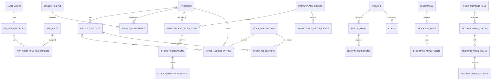

# Database Schema: Sistem Rekonsiliasi Stok

## 1. Tujuan Dokumen

Dokumen ini menerjemahkan kebutuhan produk, aturan bisnis, dan desain stock ledger menjadi rancangan skema PostgreSQL yang dapat dijadikan baseline migration untuk aplikasi Sistem Rekonsiliasi Stok.

Dokumen ini menetapkan:

- pembagian schema database;
- tabel dan relasi utama;
- tipe data;
- primary key dan foreign key;
- unique constraint dan check constraint;
- strategi indeks;
- batas antara source of truth dan projection;
- aturan immutability ledger;
- desain Row Level Security;
- kontrak database function;
- urutan migration;
- seed data minimum;
- strategi pengujian database;
- keputusan yang harus dipertahankan selama implementasi.

Dokumen ini bukan pengganti migration SQL final. Namun, implementasi yang menyimpang dari struktur dan invariant di sini harus disertai alasan teknis, dampak, serta pembaruan dokumen terkait. Database bukan tempat untuk improvisasi diam-diam. Ia menyimpan dendam dalam bentuk data korup dan baru menunjukkannya saat demo.

## 2. Sasaran Desain

| ID | Sasaran |
|---|---|
| DBS-GOAL-001 | Setiap perubahan kuantitas fisik dapat ditelusuri ke transaksi dan kejadian sumber. |
| DBS-GOAL-002 | Saldo stok tidak dapat diubah langsung oleh client. |
| DBS-GOAL-003 | Ledger posted bersifat append-only. |
| DBS-GOAL-004 | Reservasi dipisahkan dari pergerakan fisik. |
| DBS-GOAL-005 | FEFO dapat dieksekusi secara atomik dan aman terhadap transaksi konkuren. |
| DBS-GOAL-006 | Event marketplace, simulasi, dan impor memakai pipeline domain yang sama. |
| DBS-GOAL-007 | Retry tidak menggandakan transaksi melalui idempotency key dan request hash. |
| DBS-GOAL-008 | Projection saldo dapat direkonstruksi dari ledger. |
| DBS-GOAL-009 | Seluruh foreign key penting dan invariant lokal ditegakkan database. |
| DBS-GOAL-010 | Hak akses mengikuti prinsip least privilege dan defense in depth. |
| DBS-GOAL-011 | Query operasional utama dapat dilayani tanpa full table scan. |
| DBS-GOAL-012 | Schema dapat diuji otomatis melalui migration dan pgTAP. |

## 3. Batas Sistem Fase 1

### 3.1 Termasuk

- satu organisasi;
- satu gudang logis;
- sekitar 70 produk;
- batch dan tanggal kedaluwarsa;
- bundle marketplace yang dipecah menjadi SKU satuan;
- Shopee;
- TikTok Shop;
- transaksi manual;
- ledger stok;
- reservasi;
- FEFO;
- retur;
- klaim TikTok;
- stok opname;
- rekonsiliasi;
- simulator marketplace;
- impor file;
- notifikasi kedaluwarsa;
- audit trail;
- autentikasi Supabase Auth.

### 3.2 Tidak Termasuk

- pencatatan harga;
- costing persediaan;
- jurnal akuntansi;
- multi-gudang;
- transfer antar-gudang;
- serial number per unit;
- purchase order lengkap;
- perencanaan produksi;
- integrasi API marketplace nyata;
- forecasting;
- barcode management lanjutan.

## 4. Prinsip Skema

### 4.1 Ledger adalah Source of Truth Kuantitas

Tabel `inventory.stock_ledger_entries` adalah sumber kebenaran utama untuk perubahan kuantitas fisik. Tabel saldo seperti `inventory.stock_batch_balances` dan `inventory.stock_product_positions` merupakan projection untuk pembacaan cepat.

### 4.2 Saldo Tidak Disimpan pada Master Produk atau Batch

Tabel `catalog.products` dan `catalog.product_batches` tidak memiliki kolom saldo yang dapat diedit. Menaruh `stock_qty` pada master produk terlihat praktis selama sekitar dua hari, lalu berubah menjadi lomba menebak tabel mana yang paling benar.

### 4.3 Reservasi Bukan Ledger Fisik

Reservasi dicatat di `inventory.stock_reservations`. Reservasi mengurangi ketersediaan untuk dijual, tetapi tidak mengurangi stok fisik sampai barang benar-benar meninggalkan gudang.

### 4.4 Draft dan Posted Dipisahkan

Dokumen operasional dapat memiliki status draft. Ledger hanya menerima transaksi final yang berhasil diposting secara atomik. Draft tidak boleh menghasilkan entri stok.

### 4.5 Data Historis Penting Memakai Snapshot

Referensi master tetap menggunakan foreign key, tetapi kode penting seperti SKU, reason code, channel code, batch code, dan nomor sumber disalin sebagai snapshot pada transaksi atau entry. Dengan demikian, perubahan nama master tidak mengubah makna histori.

### 4.6 Constraint Lokal Diletakkan di Database

Aturan seperti kuantitas positif, delta bukan nol, status valid, dan kombinasi unik ditegakkan dengan constraint. Aturan lintas baris yang memerlukan lock dan agregasi ditegakkan melalui database function transaksi.

### 4.7 JSONB Bukan Tempat Membuang Ketidakpastian

`jsonb` hanya dipakai untuk metadata tambahan, payload sumber, atau snapshot yang tidak menjadi inti relasi. Kolom yang dipakai untuk filter, join, constraint, dan laporan rutin harus menjadi kolom terstruktur.

## 5. Konvensi Umum

### 5.1 Penamaan

- schema, tabel, kolom, constraint, dan index memakai `snake_case`;
- nama tabel memakai bentuk jamak;
- primary key memakai `id`;
- foreign key memakai `<entity>_id`;
- waktu memakai suffix `_at`;
- tanggal memakai suffix `_date`;
- kuantitas memakai suffix `_qty` atau `_delta`;
- kode enumerasi memakai suffix `_code`;
- boolean memakai prefix `is_` atau `has_`;
- nama constraint diawali `pk_`, `fk_`, `uq_`, `ck_`, atau `ex_`;
- nama index diawali `idx_` atau `uidx_`.

### 5.2 Tipe Data

| Kebutuhan | Tipe | Keputusan |
|---|---|---|
| ID domain | `uuid` | Default `gen_random_uuid()`. |
| Urutan ledger | `bigint generated always as identity` | Urutan commit monotonik untuk audit dan rebuild. |
| Kuantitas | `bigint` | Unit bulat; tidak ada pecahan. |
| Waktu absolut | `timestamptz` | Disimpan dengan zona waktu. |
| Tanggal operasional | `date` | Dihitung menurut Asia/Jakarta. |
| Kode | `text` | Dibatasi check atau lookup table. |
| Metadata tambahan | `jsonb` | Bukan pengganti desain relasional. |
| Hash payload | `text` | SHA-256 dalam format hex. |
| Nomor manusiawi | `text` | Dibuat fungsi server/database, bukan urutan client. |

### 5.3 Kolom Audit Standar

Tabel mutable normal minimal memiliki:

```sql
created_at timestamptz not null default now(),
created_by uuid null references auth.users(id),
updated_at timestamptz not null default now(),
updated_by uuid null references auth.users(id),
row_version bigint not null default 1
```

Tabel append-only cukup memiliki `created_at` dan identitas pembuat. Tabel tersebut tidak memakai `updated_at` karena secara definisi tidak boleh diperbarui.

### 5.4 Soft Delete

Master yang pernah direferensikan tidak dihapus secara fisik. Gunakan:

- `is_active boolean`;
- `archived_at timestamptz`;
- atau status domain.

Soft delete tidak dipakai untuk ledger. Ledger tidak dihapus, titik.

## 6. Pembagian Schema PostgreSQL

| Schema | Tujuan | Diekspos ke Supabase Data API |
|---|---|:---:|
| `app` | Profil, role, konfigurasi organisasi | Tidak langsung |
| `catalog` | Produk, batch, bundle, reason, channel | Tidak langsung |
| `commerce` | Pesanan marketplace, item, event, impor | Tidak langsung |
| `inventory` | Ledger, reservasi, alokasi, projection | Tidak langsung |
| `returns` | Retur dan klaim | Tidak langsung |
| `operations` | Penerimaan, outbound manual, stok opname | Tidak langsung |
| `reconciliation` | Run, check, issue, evidence | Tidak langsung |
| `notification` | Rule dan notifikasi | Tidak langsung |
| `audit` | Audit event dan data perubahan | Tidak langsung |
| `integration` | Simulator, staging impor, inbox event | Tidak langsung |
| `api` | View aman dan database function publik | Ya, bila dikonfigurasi |

Prinsipnya: client tidak diberi jalur bebas ke tabel internal. UI membaca melalui view aman dan memanggil function domain yang telah diberi grant eksplisit. Menyembunyikan tombol di frontend bukan kontrol keamanan. Itu cuma dekorasi dengan rasa percaya diri.

## 7. Extension dan Prasyarat

Extension minimum:

```sql
create extension if not exists pgcrypto;
create extension if not exists pgtap with schema extensions;
```

Catatan:

- `pgcrypto` dipakai untuk `gen_random_uuid()` dan hash bila diperlukan;
- `pgtap` dipakai pada environment development/test;
- extension harus dikelola melalui migration, bukan klik manual yang tak pernah masuk repo.

## 8. Diagram Entitas Tingkat Tinggi



## 9. Schema `app`

### 9.1 `app.organizations`

Walaupun fase 1 hanya satu organisasi, organisasi tetap direpresentasikan eksplisit agar konfigurasi dan ownership data jelas.

| Kolom | Tipe | Null | Default | Keterangan |
|---|---|:---:|---|---|
| `id` | `uuid` | Tidak | `gen_random_uuid()` | PK. |
| `code` | `text` | Tidak |  | Kode unik. |
| `name` | `text` | Tidak |  | Nama brand/perusahaan. |
| `timezone` | `text` | Tidak | `'Asia/Jakarta'` | Zona waktu operasional. |
| `is_active` | `boolean` | Tidak | `true` | Status organisasi. |
| `created_at` | `timestamptz` | Tidak | `now()` | Audit. |
| `created_by` | `uuid` | Ya |  | FK auth user. |

Constraint:

- `uq_organizations_code unique (code)`;
- `ck_organizations_code_nonblank`;
- `ck_organizations_name_nonblank`.

### 9.2 `app.user_profiles`

Ekstensi profil untuk `auth.users`.

| Kolom | Tipe | Null | Keterangan |
|---|---|:---:|---|
| `user_id` | `uuid` | Tidak | PK dan FK ke `auth.users(id)`. |
| `organization_id` | `uuid` | Tidak | FK organisasi. |
| `display_name` | `text` | Tidak | Nama tampilan. |
| `employee_code` | `text` | Ya | Kode operator. |
| `is_active` | `boolean` | Tidak | Default `true`. |
| `created_at` | `timestamptz` | Tidak | Default `now()`. |
| `updated_at` | `timestamptz` | Tidak | Default `now()`. |

Unique:

```sql
unique nulls not distinct (organization_id, employee_code)
```

Bila versi PostgreSQL target belum mendukung pola yang dipilih, gunakan partial unique index `where employee_code is not null`.

### 9.3 `app.roles`

| Kolom | Tipe | Keterangan |
|---|---|---|
| `id` | `uuid` | PK. |
| `code` | `text` | `ADMIN`, `WAREHOUSE_OPERATOR`, `OWNER_VIEWER`. |
| `name` | `text` | Nama manusiawi. |
| `description` | `text` | Penjelasan. |
| `is_system` | `boolean` | Role bawaan. |
| `is_active` | `boolean` | Status. |

### 9.4 `app.user_role_assignments`

| Kolom | Tipe | Keterangan |
|---|---|---|
| `id` | `uuid` | PK. |
| `user_id` | `uuid` | FK `app.user_profiles`. |
| `role_id` | `uuid` | FK `app.roles`. |
| `assigned_at` | `timestamptz` | Waktu pemberian. |
| `assigned_by` | `uuid` | Admin pemberi. |
| `revoked_at` | `timestamptz` | Null bila aktif. |

Index unik aktif:

```sql
create unique index uidx_user_role_assignments_active
on app.user_role_assignments (user_id, role_id)
where revoked_at is null;
```

### 9.5 `app.settings`

Konfigurasi versioned per organisasi.

| Kolom | Tipe | Keterangan |
|---|---|---|
| `id` | `uuid` | PK. |
| `organization_id` | `uuid` | FK organisasi. |
| `key` | `text` | Kunci konfigurasi. |
| `value` | `jsonb` | Nilai. |
| `version` | `integer` | Versi konfigurasi. |
| `effective_from` | `timestamptz` | Mulai berlaku. |
| `effective_to` | `timestamptz` | Null bila aktif. |
| `created_by` | `uuid` | Pembuat. |
| `created_at` | `timestamptz` | Audit. |

Contoh key:

- `expiry.warning_days`;
- `claim.tiktok.deadline_days`;
- `stocktake.mode`;
- `reconciliation.daily_hour`.

## 10. Schema `catalog`

### 10.1 `catalog.products`

| Kolom | Tipe | Null | Keterangan |
|---|---|:---:|---|
| `id` | `uuid` | Tidak | PK. |
| `organization_id` | `uuid` | Tidak | FK organisasi. |
| `sku` | `text` | Tidak | SKU internal unik. |
| `name` | `text` | Tidak | Nama produk. |
| `unit_code` | `text` | Tidak | Default `UNIT`. |
| `barcode` | `text` | Ya | Barcode bila ada. |
| `description` | `text` | Ya | Deskripsi. |
| `is_batch_tracked` | `boolean` | Tidak | Wajib `true` pada fase 1. |
| `is_expiry_tracked` | `boolean` | Tidak | Wajib `true` untuk skincare. |
| `is_active` | `boolean` | Tidak | Default `true`. |
| `created_at` | `timestamptz` | Tidak | Audit. |
| `created_by` | `uuid` | Ya | Audit. |
| `updated_at` | `timestamptz` | Tidak | Audit. |
| `updated_by` | `uuid` | Ya | Audit. |
| `row_version` | `bigint` | Tidak | Optimistic concurrency. |

Constraint:

```sql
unique (organization_id, sku),
check (btrim(sku) <> ''),
check (btrim(name) <> ''),
check (unit_code = 'UNIT')
```

Index:

- `(organization_id, is_active, name)`;
- partial unique barcode bila barcode tidak null.

### 10.2 `catalog.product_batches`

| Kolom | Tipe | Null | Keterangan |
|---|---|:---:|---|
| `id` | `uuid` | Tidak | PK. |
| `organization_id` | `uuid` | Tidak | FK organisasi. |
| `product_id` | `uuid` | Tidak | FK produk. |
| `batch_code` | `text` | Tidak | Kode batch. |
| `manufactured_date` | `date` | Ya | Tanggal produksi. |
| `expiry_date` | `date` | Tidak | Tanggal kedaluwarsa. |
| `received_first_at` | `timestamptz` | Ya | Penerimaan pertama. |
| `status_code` | `text` | Tidak | `ACTIVE`, `BLOCKED`, `EXPIRED`, `ARCHIVED`. |
| `block_reason` | `text` | Ya | Alasan blokir. |
| `created_at` | `timestamptz` | Tidak | Audit. |
| `created_by` | `uuid` | Ya | Audit. |
| `updated_at` | `timestamptz` | Tidak | Audit. |
| `updated_by` | `uuid` | Ya | Audit. |
| `row_version` | `bigint` | Tidak | Concurrency. |

Constraint:

```sql
unique (organization_id, product_id, batch_code),
check (btrim(batch_code) <> ''),
check (manufactured_date is null or manufactured_date <= expiry_date),
check (status_code in ('ACTIVE','BLOCKED','EXPIRED','ARCHIVED'))
```

Index FEFO:

```sql
create index idx_product_batches_fefo
on catalog.product_batches
  (organization_id, product_id, expiry_date, received_first_at, batch_code, id)
where status_code = 'ACTIVE';
```

### 10.3 `catalog.movement_reasons`

| Kolom | Tipe | Keterangan |
|---|---|---|
| `id` | `uuid` | PK. |
| `code` | `text` | Kode unik. |
| `name` | `text` | Nama. |
| `direction_code` | `text` | `INBOUND`, `OUTBOUND`, `TRANSFER`, `ADJUSTMENT`. |
| `requires_note` | `boolean` | Apakah catatan wajib. |
| `is_system` | `boolean` | Kode sistem. |
| `is_active` | `boolean` | Status. |

Seed minimum:

- `INITIAL_BALANCE`;
- `MAKLON_RECEIPT`;
- `MARKETPLACE_SALE`;
- `OFFLINE_SALE`;
- `BONUS`;
- `PROMO`;
- `SAMPLE`;
- `RETURN_RECEIVED`;
- `RETURN_SELLABLE`;
- `RETURN_DAMAGED`;
- `DAMAGED_FOUND`;
- `EXPIRED_DISPOSAL`;
- `DAMAGED_DISPOSAL`;
- `STOCKTAKE_GAIN`;
- `STOCKTAKE_LOSS`;
- `REVERSAL`.

### 10.4 `catalog.channels`

Seed:

- `MANUAL`;
- `SHOPEE`;
- `TIKTOK_SHOP`;
- `IMPORT`;
- `SIMULATOR`;
- `SYSTEM`.

Kolom:

- `id uuid primary key`;
- `code text unique not null`;
- `name text not null`;
- `is_marketplace boolean not null`;
- `is_active boolean not null default true`.

### 10.5 `catalog.bundle_recipes`

| Kolom | Tipe | Keterangan |
|---|---|---|
| `id` | `uuid` | PK. |
| `organization_id` | `uuid` | FK organisasi. |
| `channel_id` | `uuid` | Marketplace terkait. |
| `external_listing_sku` | `text` | SKU listing marketplace. |
| `external_listing_name` | `text` | Snapshot nama listing. |
| `version` | `integer` | Versi resep. |
| `effective_from` | `timestamptz` | Mulai berlaku. |
| `effective_to` | `timestamptz` | Null bila aktif. |
| `is_active` | `boolean` | Status. |
| `created_by` | `uuid` | Audit. |
| `created_at` | `timestamptz` | Audit. |

Index unik versi aktif:

```sql
create unique index uidx_bundle_recipe_active
on catalog.bundle_recipes
  (organization_id, channel_id, external_listing_sku)
where effective_to is null and is_active;
```

### 10.6 `catalog.bundle_components`

| Kolom | Tipe | Keterangan |
|---|---|---|
| `id` | `uuid` | PK. |
| `bundle_recipe_id` | `uuid` | FK recipe. |
| `product_id` | `uuid` | FK produk satuan. |
| `component_qty` | `bigint` | Jumlah unit per satu bundle. |
| `line_no` | `integer` | Urutan. |

Constraint:

```sql
unique (bundle_recipe_id, product_id),
unique (bundle_recipe_id, line_no),
check (component_qty > 0),
check (line_no > 0)
```

## 11. Schema `commerce`

### 11.1 `commerce.marketplace_orders`

| Kolom | Tipe | Null | Keterangan |
|---|---|:---:|---|
| `id` | `uuid` | Tidak | PK. |
| `organization_id` | `uuid` | Tidak | FK organisasi. |
| `channel_id` | `uuid` | Tidak | Shopee/TikTok. |
| `external_order_id` | `text` | Tidak | ID marketplace. |
| `external_order_no` | `text` | Tidak | Nomor tampil. |
| `status_code` | `text` | Tidak | Status domain normalisasi. |
| `source_status_code` | `text` | Ya | Status mentah marketplace. |
| `ordered_at` | `timestamptz` | Tidak | Waktu pesanan. |
| `shipped_at` | `timestamptz` | Ya | Waktu keluar menurut aturan kanal. |
| `cancelled_at` | `timestamptz` | Ya | Waktu batal. |
| `completed_at` | `timestamptz` | Ya | Waktu selesai. |
| `recipient_name_masked` | `text` | Ya | Data minimum, dimasking. |
| `latest_event_at` | `timestamptz` | Tidak | Event bisnis terbaru. |
| `created_at` | `timestamptz` | Tidak | Audit. |
| `updated_at` | `timestamptz` | Tidak | Audit. |
| `row_version` | `bigint` | Tidak | Concurrency. |

Unique:

```sql
unique (organization_id, channel_id, external_order_id)
```

Status domain:

- `RESERVED`;
- `READY_TO_SHIP`;
- `IN_TRANSIT`;
- `SHIPPED`;
- `COMPLETED`;
- `CANCELLED`;
- `RETURN_REQUESTED`;
- `RETURNED`.

Catatan: status keluar fisik tetap ditentukan aturan kanal. Shopee mem-posting outbound pada `SHIPPED`; TikTok Shop pada `IN_TRANSIT`.

### 11.2 `commerce.marketplace_order_items`

Setelah parsing, bundle sudah dipecah menjadi produk satuan. Item mentah tetap dapat disimpan pada payload/event.

| Kolom | Tipe | Keterangan |
|---|---|---|
| `id` | `uuid` | PK. |
| `order_id` | `uuid` | FK order. |
| `line_no` | `integer` | Urutan. |
| `external_item_id` | `text` | ID line marketplace. |
| `external_listing_sku_snapshot` | `text` | SKU listing sumber. |
| `product_id` | `uuid` | Produk satuan hasil resolusi. |
| `product_sku_snapshot` | `text` | Snapshot SKU internal. |
| `ordered_qty` | `bigint` | Unit hasil ekspansi. |
| `bundle_recipe_id` | `uuid` | Null bila bukan bundle. |
| `bundle_multiplier` | `bigint` | Jumlah bundle sumber. |
| `created_at` | `timestamptz` | Audit. |

Constraint:

```sql
unique (order_id, line_no),
check (line_no > 0),
check (ordered_qty > 0),
check (bundle_multiplier is null or bundle_multiplier > 0)
```

### 11.3 `commerce.marketplace_order_events`

Inbox histori event yang immutable.

| Kolom | Tipe | Keterangan |
|---|---|---|
| `id` | `uuid` | PK. |
| `organization_id` | `uuid` | FK organisasi. |
| `order_id` | `uuid` | FK order bila sudah dipetakan. |
| `channel_id` | `uuid` | Kanal. |
| `external_event_id` | `text` | ID event sumber. |
| `event_type_code` | `text` | Jenis normalisasi. |
| `source_status_code` | `text` | Status mentah. |
| `occurred_at` | `timestamptz` | Waktu bisnis. |
| `received_at` | `timestamptz` | Waktu sistem menerima. |
| `payload` | `jsonb` | Payload sumber. |
| `payload_hash` | `text` | Hash canonical payload. |
| `processing_status_code` | `text` | `RECEIVED`, `PROCESSED`, `IGNORED`, `FAILED`. |
| `processed_at` | `timestamptz` | Waktu selesai. |
| `error_code` | `text` | Error domain. |
| `error_detail` | `jsonb` | Detail aman. |

Unique:

```sql
unique (organization_id, channel_id, external_event_id)
```

Fallback bila sumber tidak memiliki event ID:

```sql
create unique index uidx_marketplace_event_payload_fallback
on commerce.marketplace_order_events
  (organization_id, channel_id, event_type_code, payload_hash, occurred_at)
where external_event_id is null;
```

## 12. Schema `inventory`

### 12.1 `inventory.idempotency_commands`

Mencegah retry atau impor ulang menghasilkan efek ganda.

| Kolom | Tipe | Keterangan |
|---|---|---|
| `id` | `uuid` | PK. |
| `organization_id` | `uuid` | FK organisasi. |
| `scope` | `text` | Namespace command. |
| `key` | `text` | Idempotency key. |
| `request_hash` | `text` | Hash payload canonical. |
| `status_code` | `text` | `STARTED`, `SUCCEEDED`, `FAILED`. |
| `started_at` | `timestamptz` | Mulai. |
| `completed_at` | `timestamptz` | Selesai. |
| `result_transaction_id` | `uuid` | FK transaksi stok. |
| `response_snapshot` | `jsonb` | Respons aman untuk retry. |
| `error_code` | `text` | Kode error terakhir. |
| `expires_at` | `timestamptz` | Opsional untuk command non-ledger. |

Constraint:

```sql
unique (organization_id, scope, key),
check (btrim(scope) <> ''),
check (btrim(key) <> ''),
check (request_hash ~ '^[0-9a-f]{64}$'),
check (status_code in ('STARTED','SUCCEEDED','FAILED'))
```

Idempotency untuk transaksi ledger tidak boleh dihapus selama histori ledger masih dipertahankan.

### 12.2 `inventory.stock_transactions`

Header posting atomik dan immutable.

| Kolom | Tipe | Null | Keterangan |
|---|---|:---:|---|
| `id` | `uuid` | Tidak | PK. |
| `organization_id` | `uuid` | Tidak | FK organisasi. |
| `transaction_no` | `text` | Tidak | Nomor manusiawi unik. |
| `transaction_type_code` | `text` | Tidak | Jenis transaksi. |
| `reason_id` | `uuid` | Tidak | FK reason. |
| `reason_code_snapshot` | `text` | Tidak | Snapshot. |
| `channel_id` | `uuid` | Tidak | FK channel. |
| `channel_code_snapshot` | `text` | Tidak | Snapshot. |
| `source_type_code` | `text` | Tidak | Tipe sumber. |
| `source_id` | `uuid` | Ya | ID internal sumber. |
| `source_ref_snapshot` | `text` | Tidak | Nomor/order/doc sumber. |
| `occurred_at` | `timestamptz` | Tidak | Waktu bisnis. |
| `recorded_at` | `timestamptz` | Tidak | Default `clock_timestamp()`. |
| `effective_local_date` | `date` | Tidak | Tanggal Asia/Jakarta. |
| `actor_user_id` | `uuid` | Ya | User manusia. |
| `process_name` | `text` | Ya | Proses otomatis. |
| `created_by_role_code` | `text` | Tidak | Snapshot role. |
| `correlation_id` | `uuid` | Tidak | Penghubung alur. |
| `idempotency_command_id` | `uuid` | Tidak | FK command unik. |
| `reversal_of_transaction_id` | `uuid` | Ya | Full reversal. |
| `note` | `text` | Ya | Catatan. |
| `metadata` | `jsonb` | Tidak | Default `{}`. |
| `schema_version` | `integer` | Tidak | Default `1`. |

Constraint:

```sql
unique (organization_id, transaction_no),
unique (idempotency_command_id),
check (btrim(transaction_no) <> ''),
check (btrim(source_ref_snapshot) <> ''),
check ((actor_user_id is not null) <> (process_name is not null)),
check (schema_version > 0),
check (reversal_of_transaction_id is null or reversal_of_transaction_id <> id)
```

Transaction type minimum:

- `INITIAL_BALANCE`;
- `RECEIPT`;
- `MARKETPLACE_OUTBOUND`;
- `MANUAL_OUTBOUND`;
- `RETURN_SELLABLE_INBOUND`;
- `DISPOSAL`;
- `STOCKTAKE_ADJUSTMENT`;
- `REVERSAL`.

### 12.3 `inventory.stock_ledger_entries`

Tabel paling kritis dalam sistem.

| Kolom | Tipe | Null | Keterangan |
|---|---|:---:|---|
| `id` | `uuid` | Tidak | PK. |
| `ledger_seq` | `bigint identity` | Tidak | Urutan global unik. |
| `organization_id` | `uuid` | Tidak | FK organisasi. |
| `transaction_id` | `uuid` | Tidak | FK header. |
| `line_no` | `integer` | Tidak | Urutan entry dalam transaksi. |
| `product_id` | `uuid` | Tidak | FK produk. |
| `batch_id` | `uuid` | Tidak | FK batch. |
| `product_sku_snapshot` | `text` | Tidak | Snapshot SKU. |
| `batch_code_snapshot` | `text` | Tidak | Snapshot batch. |
| `expiry_date_snapshot` | `date` | Tidak | Snapshot kedaluwarsa. |
| `bucket_code` | `text` | Tidak | `SELLABLE`, `QUARANTINE`, `DAMAGED`. |
| `quantity_delta` | `bigint` | Tidak | Delta signed. |
| `entry_role_code` | `text` | Tidak | `SOURCE`, `DESTINATION`, `EXTERNAL_IN`, `EXTERNAL_OUT`, `ADJUSTMENT`, `REVERSAL`. |
| `pair_no` | `integer` | Ya | Pasangan transfer internal. |
| `source_line_ref` | `text` | Ya | Referensi line sumber. |
| `occurred_at` | `timestamptz` | Tidak | Disalin untuk query cepat. |
| `recorded_at` | `timestamptz` | Tidak | Waktu commit. |
| `created_at` | `timestamptz` | Tidak | Default `now()`. |

Constraint:

```sql
unique (ledger_seq),
unique (transaction_id, line_no),
check (line_no > 0),
check (quantity_delta <> 0),
check (bucket_code in ('SELLABLE','QUARANTINE','DAMAGED')),
check (entry_role_code in (
  'SOURCE','DESTINATION','EXTERNAL_IN','EXTERNAL_OUT','ADJUSTMENT','REVERSAL'
)),
check (pair_no is null or pair_no > 0)
```

Konsistensi product-batch tidak cukup dijamin dua FK terpisah. Gunakan salah satu:

1. composite foreign key `(organization_id, product_id, batch_id)` ke unique key pada `product_batches`; atau
2. trigger internal yang memvalidasi `product_batches.product_id`.

Pilihan utama: composite foreign key.

Tambahkan pada `catalog.product_batches`:

```sql
unique (organization_id, product_id, id)
```

Lalu:

```sql
foreign key (organization_id, product_id, batch_id)
references catalog.product_batches (organization_id, product_id, id)
```

### 12.4 `inventory.stock_batch_balances`

Projection mutable, bukan ledger.

| Kolom | Tipe | Keterangan |
|---|---|---|
| `organization_id` | `uuid` | Bagian PK. |
| `batch_id` | `uuid` | Bagian PK. |
| `product_id` | `uuid` | FK produk. |
| `sellable_qty` | `bigint` | Default 0. |
| `quarantine_qty` | `bigint` | Default 0. |
| `damaged_qty` | `bigint` | Default 0. |
| `last_ledger_seq` | `bigint` | Entry terakhir terproses. |
| `updated_at` | `timestamptz` | Waktu proyeksi. |
| `version` | `bigint` | Naik pada mutasi. |

Primary key:

```sql
primary key (organization_id, batch_id)
```

Check:

```sql
check (sellable_qty >= 0),
check (quarantine_qty >= 0),
check (damaged_qty >= 0),
check (last_ledger_seq >= 0),
check (version >= 0)
```

Client tidak mendapatkan `INSERT`, `UPDATE`, atau `DELETE` pada tabel ini.

### 12.5 `inventory.stock_product_positions`

Projection agregat produk dan row lock utama untuk reservasi/alokasi.

| Kolom | Tipe | Keterangan |
|---|---|---|
| `organization_id` | `uuid` | PK komposit. |
| `product_id` | `uuid` | PK komposit. |
| `sellable_qty` | `bigint` | Agregat batch. |
| `quarantine_qty` | `bigint` | Agregat batch. |
| `damaged_qty` | `bigint` | Agregat batch. |
| `reserved_qty` | `bigint` | Reservasi aktif. |
| `last_ledger_seq` | `bigint` | Entry terakhir. |
| `updated_at` | `timestamptz` | Audit projection. |
| `version` | `bigint` | Concurrency. |

Available dihitung di view:

```sql
sellable_qty - reserved_qty as available_qty
```

Check:

```sql
check (sellable_qty >= 0),
check (quarantine_qty >= 0),
check (damaged_qty >= 0),
check (reserved_qty >= 0),
check (reserved_qty <= sellable_qty)
```

### 12.6 `inventory.stock_reservations`

| Kolom | Tipe | Keterangan |
|---|---|---|
| `id` | `uuid` | PK. |
| `organization_id` | `uuid` | FK organisasi. |
| `order_id` | `uuid` | FK marketplace order. |
| `order_item_id` | `uuid` | FK order item. |
| `product_id` | `uuid` | Produk. |
| `reserved_qty` | `bigint` | Jumlah reservasi awal. |
| `consumed_qty` | `bigint` | Sudah menjadi outbound. |
| `released_qty` | `bigint` | Dilepas karena batal/perubahan. |
| `status_code` | `text` | `ACTIVE`, `PARTIALLY_CONSUMED`, `CONSUMED`, `RELEASED`. |
| `reserved_at` | `timestamptz` | Waktu. |
| `closed_at` | `timestamptz` | Waktu tutup. |
| `created_at` | `timestamptz` | Audit. |

Constraint:

```sql
unique (order_item_id),
check (reserved_qty > 0),
check (consumed_qty >= 0),
check (released_qty >= 0),
check (consumed_qty + released_qty <= reserved_qty),
check (status_code in ('ACTIVE','PARTIALLY_CONSUMED','CONSUMED','RELEASED'))
```

Index aktif:

```sql
create index idx_stock_reservations_active_product
on inventory.stock_reservations
  (organization_id, product_id, reserved_at, id)
where status_code in ('ACTIVE','PARTIALLY_CONSUMED');
```

### 12.7 `inventory.stock_reservation_events`

Append-only history.

| Kolom | Tipe | Keterangan |
|---|---|---|
| `id` | `uuid` | PK. |
| `reservation_id` | `uuid` | FK reservation. |
| `event_type_code` | `text` | `CREATED`, `CONSUMED`, `RELEASED`, `CORRECTED`. |
| `quantity` | `bigint` | Kuantitas event. |
| `occurred_at` | `timestamptz` | Waktu bisnis. |
| `actor_user_id` | `uuid` | User. |
| `process_name` | `text` | Proses. |
| `correlation_id` | `uuid` | Korelasi. |
| `metadata` | `jsonb` | Metadata. |

Check:

```sql
check (quantity > 0),
check ((actor_user_id is not null) <> (process_name is not null))
```

### 12.8 `inventory.stock_allocations`

Mencatat batch yang dipilih FEFO untuk outbound.

| Kolom | Tipe | Keterangan |
|---|---|---|
| `id` | `uuid` | PK. |
| `organization_id` | `uuid` | Organisasi. |
| `transaction_id` | `uuid` | FK stock transaction outbound. |
| `order_item_id` | `uuid` | Null untuk manual outbound. |
| `source_line_ref` | `text` | Referensi line manual/import. |
| `product_id` | `uuid` | Produk. |
| `batch_id` | `uuid` | Batch terpilih. |
| `allocated_qty` | `bigint` | Jumlah. |
| `fefo_rank` | `integer` | Urutan kandidat saat alokasi. |
| `expiry_date_snapshot` | `date` | Snapshot. |
| `created_at` | `timestamptz` | Audit. |

Constraint:

```sql
check (allocated_qty > 0),
check (fefo_rank > 0),
unique (transaction_id, product_id, batch_id, source_line_ref)
```

### 12.9 `inventory.stock_reversal_applications`

Mendukung full maupun partial reversal dengan jejak kuantitas.

| Kolom | Tipe | Keterangan |
|---|---|---|
| `id` | `uuid` | PK. |
| `original_entry_id` | `uuid` | FK entry asli. |
| `reversal_entry_id` | `uuid` | FK entry pembalik. |
| `quantity_applied` | `bigint` | Nilai absolut. |
| `created_at` | `timestamptz` | Audit. |

Constraint:

```sql
unique (reversal_entry_id),
check (original_entry_id <> reversal_entry_id),
check (quantity_applied > 0)
```

Jumlah reversal terhadap entry asli harus divalidasi di function posting agar tidak melebihi nilai absolut entry yang belum dibalik.

## 13. Schema `operations`

### 13.1 `operations.receipts`

Header penerimaan barang dari maklon.

| Kolom | Tipe | Keterangan |
|---|---|---|
| `id` | `uuid` | PK. |
| `organization_id` | `uuid` | Organisasi. |
| `receipt_no` | `text` | Nomor internal. |
| `supplier_name_snapshot` | `text` | Nama maklon. |
| `source_document_no` | `text` | Surat jalan/dokumen. |
| `received_at` | `timestamptz` | Waktu fisik diterima. |
| `status_code` | `text` | `DRAFT`, `POSTED`, `REVERSED`. |
| `posted_transaction_id` | `uuid` | FK ledger transaction. |
| `note` | `text` | Catatan. |
| `created_by` | `uuid` | Audit. |
| `created_at` | `timestamptz` | Audit. |
| `posted_by` | `uuid` | Audit. |
| `posted_at` | `timestamptz` | Audit. |

### 13.2 `operations.receipt_lines`

| Kolom | Tipe | Keterangan |
|---|---|---|
| `id` | `uuid` | PK. |
| `receipt_id` | `uuid` | FK header. |
| `line_no` | `integer` | Urutan. |
| `product_id` | `uuid` | Produk. |
| `batch_id` | `uuid` | Batch. |
| `received_qty` | `bigint` | Jumlah. |
| `condition_code` | `text` | Fase 1 `SELLABLE` atau `QUARANTINE`. |
| `note` | `text` | Catatan. |

### 13.3 `operations.manual_outbounds`

Header transaksi keluar manual untuk penjualan offline, bonus, promo, sampel, rusak, atau kedaluwarsa.

Kolom minimum:

- `id`;
- `organization_id`;
- `outbound_no`;
- `reason_id`;
- `occurred_at`;
- `status_code`;
- `source_ref`;
- `posted_transaction_id`;
- `note`;
- audit columns.

### 13.4 `operations.manual_outbound_lines`

Operator memilih produk dan jumlah, bukan batch.

| Kolom | Tipe | Keterangan |
|---|---|---|
| `id` | `uuid` | PK. |
| `manual_outbound_id` | `uuid` | FK header. |
| `line_no` | `integer` | Urutan. |
| `product_id` | `uuid` | Produk. |
| `requested_qty` | `bigint` | Jumlah. |
| `source_line_ref` | `text` | Referensi. |
| `note` | `text` | Catatan. |

Batch allocation dibuat otomatis di `inventory.stock_allocations` ketika posted.

## 14. Schema `returns`

### 14.1 `returns.returns`

| Kolom | Tipe | Keterangan |
|---|---|---|
| `id` | `uuid` | PK. |
| `organization_id` | `uuid` | Organisasi. |
| `return_no` | `text` | Nomor internal. |
| `channel_id` | `uuid` | Kanal. |
| `order_id` | `uuid` | FK order bila dikenal. |
| `external_return_id` | `text` | ID marketplace. |
| `status_code` | `text` | `EXPECTED`, `RECEIVED`, `INSPECTED`, `LOST`, `CLOSED`. |
| `requested_at` | `timestamptz` | Waktu request. |
| `received_at` | `timestamptz` | Fisik tiba secara operasional; tidak memposting stok. |
| `closed_at` | `timestamptz` | Selesai. |
| `return_receipt_transaction_id` | `uuid` | Nullable untuk kompatibilitas legacy; receipt Phase 2 tidak membuat transaction. |
| `created_at` | `timestamptz` | Audit dan dasar deadline klaim TikTok 40 hari. |
| `updated_at` | `timestamptz` | Audit. |

Unique:

```sql
create unique index uidx_returns_external
on returns.returns (organization_id, channel_id, external_return_id)
where external_return_id is not null;
```

### 14.2 `returns.return_items`

| Kolom | Tipe | Keterangan |
|---|---|---|
| `id` | `uuid` | PK. |
| `return_id` | `uuid` | FK header. |
| `order_item_id` | `uuid` | FK line order bila ada. |
| `product_id` | `uuid` | Produk. |
| `expected_qty` | `bigint` | Diharapkan. |
| `received_qty` | `bigint` | Tiba fisik. |
| `lost_qty` | `bigint` | Tidak kembali. |
| `batch_id` | `uuid` | Batch outbound asal sebagai provenance bila tersedia; bukan batch tujuan inbound retur. |
| `batch_identification_status_code` | `text` | Kualitas provenance: `KNOWN`, `INFERRED`, `UNKNOWN`. |

Constraint:

```sql
check (expected_qty > 0),
check (received_qty >= 0),
check (lost_qty >= 0),
check (received_qty + lost_qty <= expected_qty)
```

Receipt tidak membuat saldo batch. Jika provenance batch asal belum jelas, simpan status `UNKNOWN` tanpa membuat batch produksi palsu. Batch tujuan baru hanya dibuat oleh command inspeksi `SELLABLE` dan harus bertanda jenis `RETURN`.

### 14.3 `returns.return_inspections`

Append-only hasil inspeksi per item dan kuantitas.

| Kolom | Tipe | Keterangan |
|---|---|---|
| `id` | `uuid` | PK. |
| `return_item_id` | `uuid` | FK item. |
| `inspection_no` | `integer` | Urutan. |
| `condition_code` | `text` | `SELLABLE`, `DAMAGED`. |
| `inspected_qty` | `bigint` | Jumlah. |
| `inspected_at` | `timestamptz` | Waktu. |
| `inspected_by` | `uuid` | Operator. |
| `transaction_id` | `uuid` | Nullable; hanya hasil `SELLABLE` menunjuk transaction `RETURN_SELLABLE_INBOUND`, sedangkan `DAMAGED` tidak membuat transaction. |
| `note` | `text` | Catatan. |
| `evidence_metadata` | `jsonb` | Referensi bukti. |

Constraint:

```sql
unique (return_item_id, inspection_no),
check (inspection_no > 0),
check (inspected_qty > 0),
check (condition_code in ('SELLABLE','DAMAGED'))
```

Untuk hasil `SELLABLE`, database membuat batch baru bertanda `RETURN`, menyimpan provenance batch outbound asal bila tersedia, lalu memposting tepat satu inbound ke `SELLABLE`. Hasil `DAMAGED` hanya menyimpan audit kondisi fisik dan tidak membuat ledger entry atau projection delta.

### 14.4 `returns.claims`

| Kolom | Tipe | Keterangan |
|---|---|---|
| `id` | `uuid` | PK. |
| `organization_id` | `uuid` | Organisasi. |
| `return_id` | `uuid` | FK retur. |
| `channel_id` | `uuid` | Kanal. |
| `claim_type_code` | `text` | Misalnya `LOST_RETURN`. |
| `deadline_at` | `timestamptz` | Batas klaim. |
| `status_code` | `text` | `OPEN`, `SUBMITTED`, `APPROVED`, `REJECTED`, `EXPIRED`. |
| `submitted_at` | `timestamptz` | Waktu. |
| `resolved_at` | `timestamptz` | Waktu. |
| `external_claim_ref` | `text` | Referensi. |
| `note` | `text` | Catatan. |
| `created_at` | `timestamptz` | Audit. |
| `updated_at` | `timestamptz` | Audit. |

Untuk TikTok, `deadline_at` dihitung 40 hari kalender dari `operations.returns.created_at`. Nilai dasar, policy version, timezone, dan window snapshot tetap disimpan agar hasil historis dapat diaudit.

## 15. Stok Opname

### 15.1 `operations.stocktakes`

| Kolom | Tipe | Keterangan |
|---|---|---|
| `id` | `uuid` | PK. |
| `organization_id` | `uuid` | Organisasi. |
| `stocktake_no` | `text` | Nomor. |
| `mode_code` | `text` | `FROZEN` atau `CONTINUOUS`. |
| `status_code` | `text` | `DRAFT`, `COUNTING`, `REVIEW`, `APPROVED`, `POSTED`, `CANCELLED`. |
| `scope_json` | `jsonb` | Produk/batch yang dihitung. |
| `snapshot_ledger_seq` | `bigint` | Cut-off ledger. |
| `started_at` | `timestamptz` | Mulai. |
| `counted_at` | `timestamptz` | Selesai hitung. |
| `approved_at` | `timestamptz` | Approval. |
| `posted_at` | `timestamptz` | Posting adjustment. |
| `created_by` | `uuid` | Pembuat. |
| `approved_by` | `uuid` | Admin. |
| `posted_transaction_id` | `uuid` | FK adjustment transaction. |
| `note` | `text` | Catatan. |

### 15.2 `operations.stocktake_lines`

Satu baris per batch dan bucket yang dihitung.

| Kolom | Tipe | Keterangan |
|---|---|---|
| `id` | `uuid` | PK. |
| `stocktake_id` | `uuid` | FK header. |
| `line_no` | `integer` | Urutan. |
| `product_id` | `uuid` | Produk. |
| `batch_id` | `uuid` | Batch. |
| `bucket_code` | `text` | Bucket. |
| `system_qty_at_snapshot` | `bigint` | Saldo pada cut-off. |
| `movement_qty_after_snapshot` | `bigint` | Untuk mode continuous. |
| `expected_qty_at_count` | `bigint` | Sistem setelah penyesuaian waktu. |
| `physical_qty` | `bigint` | Hasil hitung. |
| `variance_qty` | `bigint` | `physical - expected`. |
| `counted_by` | `uuid` | Penghitung. |
| `counted_at` | `timestamptz` | Waktu hitung. |
| `review_status_code` | `text` | `PENDING`, `ACCEPTED`, `RECOUNT`. |
| `review_note` | `text` | Catatan. |

`variance_qty` dapat berupa generated column atau dihitung dan divalidasi saat submit. Pilihan baseline: generated stored column bila versi PostgreSQL target dan pola migration mendukung secara stabil.

### 15.3 `operations.stocktake_adjustments`

Mapping line opname ke entry adjustment.

| Kolom | Tipe | Keterangan |
|---|---|---|
| `id` | `uuid` | PK. |
| `stocktake_line_id` | `uuid` | FK line unik. |
| `transaction_id` | `uuid` | FK stock transaction. |
| `ledger_entry_id` | `uuid` | FK entry. |
| `adjustment_qty` | `bigint` | Signed. |
| `reason_code_snapshot` | `text` | Gain/loss. |
| `created_at` | `timestamptz` | Audit. |

### 15.4 Opening-balance cutover runtime

Migration runtime menggunakan:

- `operations.opening_balance_cutovers` untuk header lifecycle, active-cutover identity, transaction linkage, ledger boundaries, actor/process, note, metadata, dan reversal state;
- `operations.opening_balance_cutover_lines` untuk exact product, batch, bucket, quantity, source-line reference, snapshots, original ledger entry, dan per-line verification linkage;
- view `api.opening_balance_cutovers` dan `api.opening_balance_cutover_lines` untuk organization-scoped list, progress `UNVERIFIED`/`PARTIALLY_VERIFIED`/`VERIFIED`, serta drill-down Admin;
- view `api.opening_balance_cutover_reversals` untuk immutable original-to-reversal audit.

Baris draft dapat bernilai nol, tetapi hanya baris positif yang memperoleh ledger entry. Posted cutover dan line tidak menerima direct authenticated write atau update/delete.

### 15.5 `operations.opening_balance_verification_applications`

Tabel append-only ini menyimpan satu first-verification application per opening-balance line. Link wajib meliputi:

- opening-balance cutover dan line;
- stocktake dan stocktake line;
- approval ID dan version;
- posting dan posting line;
- count attempt;
- physical quantity, variance, count cutoff, dan opening-balance ledger boundary;
- actor atau process, waktu verifikasi, rule version, serta metadata.

`stocktake_adjustment_ledger_entry_id` dapat null untuk zero variance. Null tersebut sah karena verifikasi membuktikan hitung fisik, bukan memaksa movement stok. Trigger internal menulis evidence atomik saat stocktake posting line berhasil dibuat.

## 16. Schema `reconciliation`

### 16.1 `reconciliation.runs`

| Kolom | Tipe | Keterangan |
|---|---|---|
| `id` | `uuid` | PK. |
| `organization_id` | `uuid` | Organisasi. |
| `run_type_code` | `text` | `DAILY_INTERNAL`, `STOCKTAKE`, `MANUAL`. |
| `status_code` | `text` | `RUNNING`, `SUCCEEDED`, `FAILED`. |
| `started_at` | `timestamptz` | Mulai. |
| `completed_at` | `timestamptz` | Selesai. |
| `ledger_seq_from` | `bigint` | Awal scope. |
| `ledger_seq_to` | `bigint` | Akhir scope. |
| `triggered_by_user_id` | `uuid` | User. |
| `process_name` | `text` | Scheduler. |
| `summary` | `jsonb` | Ringkasan. |
| `error_detail` | `jsonb` | Error aman. |

### 16.2 `reconciliation.checks`

| Kolom | Tipe | Keterangan |
|---|---|---|
| `id` | `uuid` | PK. |
| `run_id` | `uuid` | FK run. |
| `check_code` | `text` | Kode check. |
| `status_code` | `text` | `PASS`, `WARN`, `FAIL`. |
| `checked_count` | `bigint` | Jumlah objek. |
| `issue_count` | `bigint` | Temuan. |
| `duration_ms` | `integer` | Durasi. |
| `detail` | `jsonb` | Ringkasan. |

Check minimum:

- `LEDGER_VS_BATCH_PROJECTION`;
- `BATCH_VS_PRODUCT_PROJECTION`;
- `RESERVED_NOT_EXCEED_SELLABLE`;
- `NEGATIVE_BALANCE`;
- `TRANSFER_NET_ZERO`;
- `DUPLICATE_SOURCE_EVENT`;
- `ORPHAN_TRANSACTION_SOURCE`;
- `UNPROCESSED_MARKETPLACE_EVENT`;
- `RETURN_INSPECTION_COMPLETENESS`;
- `EXPIRED_BATCH_STILL_ALLOCATABLE`.

### 16.3 `reconciliation.issues`

| Kolom | Tipe | Keterangan |
|---|---|---|
| `id` | `uuid` | PK. |
| `organization_id` | `uuid` | Organisasi. |
| `run_id` | `uuid` | FK run. |
| `check_id` | `uuid` | FK check. |
| `issue_code` | `text` | Kode. |
| `severity_code` | `text` | `INFO`, `WARNING`, `CRITICAL`. |
| `status_code` | `text` | `OPEN`, `INVESTIGATING`, `RESOLVED`, `DISMISSED`. |
| `product_id` | `uuid` | Opsional. |
| `batch_id` | `uuid` | Opsional. |
| `transaction_id` | `uuid` | Opsional. |
| `source_type_code` | `text` | Opsional. |
| `source_ref` | `text` | Opsional. |
| `expected_value` | `jsonb` | Nilai sistem. |
| `actual_value` | `jsonb` | Nilai ditemukan. |
| `detected_at` | `timestamptz` | Waktu. |
| `resolved_at` | `timestamptz` | Waktu. |
| `resolved_by` | `uuid` | User. |
| `resolution_note` | `text` | Penjelasan. |

### 16.4 `reconciliation.evidence`

Menyediakan drill-down penyebab.

| Kolom | Tipe | Keterangan |
|---|---|---|
| `id` | `uuid` | PK. |
| `issue_id` | `uuid` | FK issue. |
| `evidence_type_code` | `text` | `LEDGER_ENTRY`, `ORDER_EVENT`, `RETURN`, `STOCKTAKE`, `AUDIT_EVENT`, `QUERY_RESULT`. |
| `entity_schema` | `text` | Schema referensi. |
| `entity_table` | `text` | Tabel referensi. |
| `entity_id` | `uuid` | ID bila ada. |
| `ledger_seq_from` | `bigint` | Opsional. |
| `ledger_seq_to` | `bigint` | Opsional. |
| `snapshot` | `jsonb` | Bukti ringkas immutable. |
| `created_at` | `timestamptz` | Audit. |

## 17. Schema `notification`

### 17.1 `notification.rules`

| Kolom | Tipe | Keterangan |
|---|---|---|
| `id` | `uuid` | PK. |
| `organization_id` | `uuid` | Organisasi. |
| `code` | `text` | Kode rule. |
| `event_type_code` | `text` | Jenis pemicu. |
| `severity_code` | `text` | Level. |
| `config` | `jsonb` | Threshold. |
| `is_active` | `boolean` | Status. |
| `created_at` | `timestamptz` | Audit. |
| `updated_at` | `timestamptz` | Audit. |

### 17.2 `notification.notifications`

| Kolom | Tipe | Keterangan |
|---|---|---|
| `id` | `uuid` | PK. |
| `organization_id` | `uuid` | Organisasi. |
| `rule_id` | `uuid` | FK rule. |
| `notification_type_code` | `text` | `EXPIRY`, `CLAIM_DEADLINE`, `RECONCILIATION`, `IMPORT_ERROR`. |
| `severity_code` | `text` | Level. |
| `title` | `text` | Judul. |
| `message` | `text` | Pesan. |
| `entity_type_code` | `text` | Tipe entity. |
| `entity_id` | `uuid` | ID. |
| `deduplication_key` | `text` | Mencegah duplikat aktif. |
| `status_code` | `text` | `OPEN`, `READ`, `RESOLVED`, `DISMISSED`. |
| `due_at` | `timestamptz` | Deadline. |
| `created_at` | `timestamptz` | Audit. |
| `read_at` | `timestamptz` | Waktu. |
| `resolved_at` | `timestamptz` | Waktu. |
| `resolved_by` | `uuid` | User. |

Partial unique index:

```sql
create unique index uidx_notifications_open_dedup
on notification.notifications (organization_id, deduplication_key)
where status_code in ('OPEN','READ');
```

## 18. Schema `integration`

### 18.1 `integration.import_jobs`

| Kolom | Tipe | Keterangan |
|---|---|---|
| `id` | `uuid` | PK. |
| `organization_id` | `uuid` | Organisasi. |
| `import_type_code` | `text` | `PRODUCT`, `BATCH`, `ORDER`, `RETURN`, `INITIAL_BALANCE`. |
| `channel_id` | `uuid` | Kanal bila relevan. |
| `file_name` | `text` | Nama file. |
| `file_hash` | `text` | Hash. |
| `status_code` | `text` | `UPLOADED`, `VALIDATING`, `READY`, `PROCESSING`, `COMPLETED`, `FAILED`. |
| `total_rows` | `integer` | Jumlah. |
| `valid_rows` | `integer` | Jumlah valid. |
| `invalid_rows` | `integer` | Jumlah invalid. |
| `processed_rows` | `integer` | Jumlah diproses. |
| `uploaded_by` | `uuid` | User. |
| `uploaded_at` | `timestamptz` | Waktu. |
| `completed_at` | `timestamptz` | Waktu. |
| `summary` | `jsonb` | Ringkasan. |

Unique file retry dapat menggunakan `(organization_id, import_type_code, file_hash)` bila kebijakan melarang file sama diproses ulang. Bila file sama memang boleh dipakai ulang dengan mode berbeda, gunakan idempotency command saat posting, bukan constraint ini.

### 18.2 `integration.import_rows`

Staging per baris.

| Kolom | Tipe | Keterangan |
|---|---|---|
| `id` | `uuid` | PK. |
| `job_id` | `uuid` | FK job. |
| `row_no` | `integer` | Nomor baris. |
| `raw_data` | `jsonb` | Data asli. |
| `normalized_data` | `jsonb` | Data normalisasi. |
| `validation_status_code` | `text` | `VALID`, `INVALID`, `WARNING`. |
| `validation_errors` | `jsonb` | Error. |
| `processing_status_code` | `text` | `PENDING`, `PROCESSED`, `SKIPPED`, `FAILED`. |
| `result_entity_type` | `text` | Tipe hasil. |
| `result_entity_id` | `uuid` | ID hasil. |
| `processed_at` | `timestamptz` | Waktu. |

Constraint:

```sql
unique (job_id, row_no),
check (row_no > 0)
```

### 18.3 `integration.simulation_runs`

| Kolom | Tipe | Keterangan |
|---|---|---|
| `id` | `uuid` | PK. |
| `organization_id` | `uuid` | Organisasi. |
| `scenario_code` | `text` | Skenario. |
| `seed_value` | `bigint` | Seed deterministik. |
| `requested_payload` | `jsonb` | Input. |
| `status_code` | `text` | Status. |
| `created_by` | `uuid` | User. |
| `created_at` | `timestamptz` | Audit. |
| `result_summary` | `jsonb` | Hasil. |

Simulator harus menulis event ke inbox yang sama dengan impor/API masa depan. Simulator tidak boleh memanggil jalur khusus yang melewati aturan domain hanya karena data dibuat oleh tombol lucu di dashboard.

## 19. Schema `audit`

### 19.1 `audit.events`

Audit append-only untuk aksi penting, termasuk perubahan master dan keputusan administratif.

| Kolom | Tipe | Keterangan |
|---|---|---|
| `id` | `uuid` | PK. |
| `audit_seq` | `bigint identity` | Urutan. |
| `organization_id` | `uuid` | Organisasi. |
| `occurred_at` | `timestamptz` | Waktu. |
| `actor_user_id` | `uuid` | User. |
| `process_name` | `text` | Proses. |
| `actor_role_code` | `text` | Snapshot role. |
| `action_code` | `text` | Aksi. |
| `entity_schema` | `text` | Schema. |
| `entity_table` | `text` | Tabel. |
| `entity_id` | `uuid` | ID. |
| `correlation_id` | `uuid` | Korelasi. |
| `request_id` | `text` | Request trace. |
| `before_data` | `jsonb` | Snapshot sebelum, bila relevan. |
| `after_data` | `jsonb` | Snapshot sesudah. |
| `metadata` | `jsonb` | Tambahan. |

PII dan secret tidak boleh masuk audit payload. Audit trail bukan tempat menyimpan semua hal “untuk jaga-jaga” sampai akhirnya menjadi kebocoran data dengan dokumentasi lengkap.

## 20. View pada Schema `api`

### 20.1 `api.product_stock_positions`

Kolom minimum:

- product ID;
- SKU;
- nama;
- sellable;
- reserved;
- available;
- quarantine;
- damaged;
- on hand;
- expiry terdekat;
- jumlah batch aktif;
- last ledger sequence;
- updated at.

Contoh:

```sql
create view api.product_stock_positions
with (security_invoker = true)
as
select
  p.organization_id,
  p.id as product_id,
  p.sku,
  p.name,
  coalesce(s.sellable_qty, 0) as sellable_qty,
  coalesce(s.reserved_qty, 0) as reserved_qty,
  coalesce(s.sellable_qty - s.reserved_qty, 0) as available_qty,
  coalesce(s.quarantine_qty, 0) as quarantine_qty,
  coalesce(s.damaged_qty, 0) as damaged_qty,
  coalesce(s.sellable_qty + s.quarantine_qty + s.damaged_qty, 0) as on_hand_qty,
  s.last_ledger_seq,
  s.updated_at
from catalog.products p
left join inventory.stock_product_positions s
  on s.organization_id = p.organization_id
 and s.product_id = p.id;
```

### 20.2 `api.batch_stock_positions`

Menyediakan batch, expiry date, status, bucket quantities, available for FEFO, dan warning days.

### 20.3 `api.stock_ledger_search`

View baca yang menggabungkan transaction header dan entry untuk drill-down, tanpa mengekspos metadata sensitif atau internal idempotency payload.

### 20.4 `api.open_reconciliation_issues`

View issue terbuka yang telah diperkaya nama produk, batch, transaction number, dan source reference.

### 20.5 `api.expiry_alerts`

View batch aktif dengan `sellable_qty > 0` dan expiry date dalam threshold konfigurasi.

## 21. Database Function Publik

Client tidak melakukan multi-step mutation sendiri. Ia memanggil function domain yang menyelesaikan validasi, lock, posting, dan audit dalam satu transaksi.

### 21.1 Daftar Function

| Function | Peran minimum | Efek |
|---|---|---|
| `api.create_product` | Admin | Membuat master produk. |
| `api.create_or_update_bundle_recipe` | Admin | Versioning resep bundle. |
| `api.create_opening_balance_cutover` | Admin | Membuat cutover draft. |
| `api.save_opening_balance_cutover_draft` | Admin | Menyimpan header dan line draft. |
| `api.submit_opening_balance_cutover_review` | Admin | Memindahkan draft ke review. |
| `api.preview_opening_balance_cutover` | Admin | Preview stock-neutral dan basis hash. |
| `api.post_opening_balance_cutover` | Admin | Posting `INITIAL_BALANCE` atomik. |
| `api.preview_opening_balance_reversal` | Admin | Preview exact cutover reversal. |
| `api.reverse_opening_balance_cutover` | Admin | Posting exact reversal dan membuka replacement. |
| `api.post_receipt` | Admin, Operator | Posting penerimaan. |
| `api.reserve_marketplace_order` | Sistem/Admin | Membuat reservasi. |
| `api.process_marketplace_event` | Sistem/Admin | Menjalankan state transition. |
| `api.post_marketplace_outbound` | Sistem/Admin | Konsumsi reservasi dan FEFO outbound. |
| `api.post_manual_outbound` | Admin, Operator | FEFO outbound manual. |
| `api.receive_return` | Admin, Operator | Masuk ke quarantine. |
| `api.inspect_return` | Admin, Operator | Transfer quarantine ke sellable/damaged. |
| `api.post_disposal` | Admin, Operator | Keluar fisik dari damaged/sellable sesuai reason. |
| `api.submit_stocktake` | Operator | Submit hitung. |
| `api.approve_and_post_stocktake` | Admin | Posting adjustment. |
| `api.reverse_stock_transaction` | Admin | Posting reversal. |
| `api.run_reconciliation` | Admin/Sistem | Menjalankan checks. |
| `api.rebuild_stock_projections` | Service role/Migration | Rebuild projection terkontrol. |

### 21.2 Pola Signature

```sql
api.post_manual_outbound(
  p_command jsonb,
  p_idempotency_key text,
  p_request_hash text,
  p_correlation_id uuid
) returns jsonb
```

Respons minimum:

```json
{
  "success": true,
  "transaction_id": "uuid",
  "transaction_no": "OUT-20260712-000001",
  "ledger_seq_from": 1201,
  "ledger_seq_to": 1203,
  "allocations": [
    {
      "product_id": "uuid",
      "batch_id": "uuid",
      "quantity": 5
    }
  ]
}
```

### 21.3 Security Definer

Function mutasi dapat memakai `security definer` hanya bila:

- owner function bukan role client;
- `search_path` ditetapkan eksplisit dan aman;
- seluruh object direferensikan dengan schema-qualified name;
- authorization diperiksa di dalam function;
- `execute` dicabut dari `public`;
- hanya role yang diperlukan mendapat grant;
- input tervalidasi;
- function tidak membocorkan data lintas organisasi.

Template:

```sql
create or replace function api.post_receipt(...)
returns jsonb
language plpgsql
security definer
set search_path = pg_catalog, app, catalog, operations, inventory, audit
as $$
begin
  -- authorize
  -- validate
  -- acquire idempotency row
  -- lock product positions in deterministic order
  -- create transaction and entries
  -- update projections
  -- write audit event
  -- return result
end;
$$;

revoke all on function api.post_receipt(...) from public;
grant execute on function api.post_receipt(...) to authenticated;
```

## 22. Posting Pipeline Database

Urutan wajib untuk command stok:

1. validasi identitas dan organisasi actor;
2. validasi role;
3. normalisasi payload;
4. hitung dan validasi request hash;
5. insert atau lock `idempotency_commands`;
6. jika command sukses sebelumnya, kembalikan respons lama;
7. jika key sama tetapi hash berbeda, tolak `IDEMPOTENCY_PAYLOAD_MISMATCH`;
8. lock product position dalam urutan `product_id` ascending;
9. untuk outbound, lock kandidat batch FEFO dalam urutan deterministik;
10. validasi available quantity;
11. buat/ubah dokumen sumber bila relevan;
12. buat `stock_transactions`;
13. buat `stock_ledger_entries`;
14. buat allocation/reversal mapping;
15. update batch projection;
16. update product projection;
17. update reservasi bila relevan;
18. tulis audit event;
19. tandai idempotency command sukses;
20. commit.

Semua langkah berjalan dalam satu transaksi database.

## 23. Concurrency dan Locking

### 23.1 Lock Produk

Untuk setiap command yang memengaruhi produk:

```sql
select 1
from inventory.stock_product_positions
where organization_id = p_organization_id
  and product_id = any(p_product_ids)
order by product_id
for update;
```

Baris position harus dibuat ketika produk diaktifkan atau melalui upsert sebelum lock.

### 23.2 Lock Batch FEFO

```sql
select b.id
from catalog.product_batches b
join inventory.stock_batch_balances s
  on s.organization_id = b.organization_id
 and s.batch_id = b.id
where b.organization_id = p_organization_id
  and b.product_id = p_product_id
  and b.status_code = 'ACTIVE'
  and b.expiry_date >= p_effective_date
  and s.sellable_qty > 0
order by
  b.expiry_date,
  b.received_first_at nulls last,
  b.batch_code,
  b.id
for update of s;
```

Jangan memakai `SKIP LOCKED` pada FEFO normal karena dapat melewati batch yang seharusnya dipilih pertama.

### 23.3 Isolation

Baseline fase 1:

- `READ COMMITTED`;
- explicit row locking;
- urutan lock deterministik;
- retry terbatas untuk deadlock atau serialization error;
- tidak melakukan external network call di dalam transaksi.

## 24. Immutability Ledger

### 24.1 Privilege

```sql
revoke insert, update, delete, truncate
on inventory.stock_transactions,
   inventory.stock_ledger_entries,
   inventory.stock_reservation_events,
   audit.events
from anon, authenticated;
```

Insert hanya melalui function internal yang dimiliki role terkontrol.

### 24.2 Trigger Pertahanan

```sql
create or replace function inventory.reject_ledger_mutation()
returns trigger
language plpgsql
as $$
begin
  raise exception using
    errcode = 'P0001',
    message = 'IMMUTABLE_LEDGER_RECORD';
end;
$$;

create trigger trg_stock_transactions_immutable
before update or delete on inventory.stock_transactions
for each row execute function inventory.reject_ledger_mutation();

create trigger trg_stock_ledger_entries_immutable
before update or delete on inventory.stock_ledger_entries
for each row execute function inventory.reject_ledger_mutation();
```

Migration role harus memiliki prosedur terpisah dan terdokumentasi untuk perubahan struktur, bukan mematikan trigger saat aplikasi sedang berjalan.

## 25. Row Level Security dan Grants

### 25.1 Matriks Akses

| Domain | Admin | Operator | Owner/Viewer |
|---|:---:|:---:|:---:|
| Produk/batch | CRUD terbatas | Read | Read |
| Bundle/reason/channel | CRUD | Read | Read |
| Receipt/manual outbound | Create/Post/Read | Create/Post/Read | Read |
| Order/event | Read/Process | Read/Process sesuai flow | Read |
| Retur/inspection | Full | Create/Inspect/Read | Read |
| Stocktake | Full | Create/Count | Read |
| Ledger | Read | Read | Read |
| Reversal | Execute | Tidak | Tidak |
| Rekonsiliasi | Run/Resolve | Read | Read |
| User/role | Full | Tidak | Tidak |

### 25.2 Helper Authorization

Buat helper internal, misalnya:

```sql
app.current_organization_id()
app.has_role(p_role_code text)
app.require_role(p_allowed text[])
```

Helper harus stabil, sederhana, schema-qualified, dan diuji. Hindari policy yang memanggil query kompleks berulang kali tanpa index karena keamanan yang lambat tetap akan dibenci manusia dan akhirnya dicari jalan pintasnya.

### 25.3 Contoh Policy Baca

```sql
alter table catalog.products enable row level security;

create policy products_read_same_org
on catalog.products
for select
to authenticated
using (organization_id = app.current_organization_id());
```

Untuk tabel internal yang tidak diekspos, tetap aktifkan RLS bila Data API dapat menjangkaunya. Namun, defense utama tetap kombinasi schema exposure, grants, dan RLS.

## 26. Constraint Lintas Tabel

Aturan berikut tidak cukup dengan satu check constraint:

- saldo bucket tidak boleh negatif setelah entry diposting;
- reserved tidak boleh melebihi sellable;
- total transfer internal harus neto nol;
- FEFO harus memilih batch eligible paling awal;
- reversal tidak boleh melebihi sisa reversible;
- total inspection tidak boleh melebihi received return;
- stocktake adjustment harus sama dengan variance yang disetujui;
- order outbound hanya sekali per lifecycle fisik;
- event status tidak boleh mundur kecuali transition eksplisit;
- channel dan reason harus sesuai transaction type.

Aturan tersebut ditegakkan dalam domain function dan diverifikasi ulang oleh reconciliation check.

## 27. Index Strategy

### 27.1 Prinsip

- index mengikuti query nyata;
- foreign key yang sering dipakai join diberi index;
- partial index dipakai untuk status aktif/terbuka;
- index lebar tidak dibuat hanya karena “mungkin berguna”;
- semua index ditinjau dengan `EXPLAIN (ANALYZE, BUFFERS)` pada dataset representatif;
- index deployment besar menggunakan strategi yang sesuai kondisi production.

### 27.2 Index Ledger

```sql
create index idx_ledger_product_seq
on inventory.stock_ledger_entries
  (organization_id, product_id, ledger_seq desc);

create index idx_ledger_batch_seq
on inventory.stock_ledger_entries
  (organization_id, batch_id, ledger_seq desc);

create index idx_ledger_transaction
on inventory.stock_ledger_entries (transaction_id, line_no);

create index idx_transactions_source
on inventory.stock_transactions
  (organization_id, source_type_code, source_ref_snapshot);

create index idx_transactions_occurred
on inventory.stock_transactions
  (organization_id, occurred_at desc, id);
```

### 27.3 Index Pesanan dan Event

```sql
create index idx_orders_status_latest
on commerce.marketplace_orders
  (organization_id, channel_id, status_code, latest_event_at desc);

create index idx_order_events_processing
on commerce.marketplace_order_events
  (organization_id, processing_status_code, received_at)
where processing_status_code in ('RECEIVED','FAILED');
```

### 27.4 Index Retur dan Klaim

```sql
create index idx_returns_status
on returns.returns
  (organization_id, status_code, requested_at desc);

create index idx_claims_open_deadline
on returns.claims
  (organization_id, deadline_at, id)
where status_code in ('OPEN','SUBMITTED');
```

### 27.5 Index Rekonsiliasi

```sql
create index idx_reconciliation_issues_open
on reconciliation.issues
  (organization_id, severity_code, detected_at desc)
where status_code in ('OPEN','INVESTIGATING');
```

### 27.6 JSONB Index

Tidak ada GIN index global pada semua metadata. Tambahkan hanya bila query terukur memang memfilter key tertentu. Untuk key penting dan rutin, promosikan menjadi kolom biasa.

## 28. Partitioning Policy

Fase 1 tidak langsung memakai table partitioning karena:

- hanya sekitar 70 produk;
- volume ratusan paket per hari masih masuk akal untuk tabel tunggal dengan index baik;
- partitioning menambah kompleksitas migration, unique constraint, dan operasi maintenance.

Trigger evaluasi partitioning:

- ledger mencapai puluhan juta entry;
- query as-of dan retention mulai membebani;
- maintenance index/vacuum tidak memenuhi target;
- observability menunjukkan bottleneck tabel, bukan query buruk.

Kandidat partitioning masa depan:

- `inventory.stock_ledger_entries` berdasarkan `recorded_at` bulanan/kuartalan;
- `audit.events` berdasarkan `occurred_at`;
- `commerce.marketplace_order_events` berdasarkan `received_at`.

## 29. Retention dan Arsip

| Data | Retensi minimum fase 1 |
|---|---|
| Ledger dan transaction header | Tidak dihapus. |
| Reversal mapping | Tidak dihapus. |
| Audit event kritis | Tidak dihapus selama proyek. |
| Order/event source | Dipertahankan untuk traceability. |
| Import row staging | Dapat diarsip setelah kebijakan retensi disepakati. |
| Simulation payload | Dapat dihapus setelah masa demo/test jika tidak terkait ledger. |
| Notification resolved | Dapat diarsip setelah periode yang disepakati. |

Penghapusan data yang memiliki referensi ledger harus ditolak atau hanya menghapus payload nonkritis setelah snapshot audit tersedia.

## 30. Nomor Dokumen

Nomor manusiawi dibuat server-side menggunakan sequence per tipe dan tanggal, contoh:

- `RCV-20260712-000001`;
- `OUT-20260712-000001`;
- `RET-20260712-000001`;
- `STK-20260712-000001`;
- `TXN-20260712-000001`.

Gunakan tabel counter yang di-lock atau sequence database. Jangan menghasilkan nomor berdasarkan `count(*) + 1`. Itu bukan algoritma, itu undangan race condition.

## 31. Updated Timestamp dan Row Version

Untuk tabel mutable:

```sql
create or replace function app.touch_mutable_row()
returns trigger
language plpgsql
as $$
begin
  new.updated_at := clock_timestamp();
  new.row_version := old.row_version + 1;
  return new;
end;
$$;
```

Function domain tetap bertanggung jawab mengisi `updated_by`. Trigger hanya menangani aspek mekanis.

## 32. Error Code Database

Function domain mengembalikan atau melempar kode yang stabil.

| Kode | Makna |
|---|---|
| `AUTH_REQUIRED` | Tidak terautentikasi. |
| `ROLE_NOT_ALLOWED` | Role tidak berwenang. |
| `ORGANIZATION_SCOPE_VIOLATION` | Entity di luar organisasi user. |
| `IDEMPOTENCY_PAYLOAD_MISMATCH` | Key sama, payload berbeda. |
| `COMMAND_ALREADY_IN_PROGRESS` | Command sedang diproses. |
| `PRODUCT_NOT_FOUND` | Produk tidak ditemukan. |
| `BATCH_NOT_FOUND` | Batch tidak ditemukan. |
| `BATCH_NOT_ELIGIBLE` | Batch blocked/expired/tidak layak. |
| `INSUFFICIENT_AVAILABLE_STOCK` | Available tidak cukup. |
| `INSUFFICIENT_BUCKET_STOCK` | Bucket tertentu tidak cukup. |
| `INVALID_STATE_TRANSITION` | Transisi status tidak valid. |
| `ORDER_ALREADY_POSTED_OUTBOUND` | Outbound ganda. |
| `RETURN_QUANTITY_EXCEEDED` | Retur melebihi batas. |
| `INSPECTION_QUANTITY_EXCEEDED` | Inspeksi melebihi barang diterima. |
| `REVERSAL_QUANTITY_EXCEEDED` | Reversal melebihi sisa. |
| `STOCKTAKE_NOT_APPROVED` | Belum disetujui. |
| `PROJECTION_MISMATCH` | Projection tidak konsisten. |
| `IMMUTABLE_LEDGER_RECORD` | Percobaan update/delete ledger. |
| `CONCURRENT_MODIFICATION` | Konflik versi/lock. |

API layer memetakan error tersebut ke HTTP status dan pesan operator yang dapat dipahami.

## 33. Migration Strategy

### 33.1 Semua Perubahan melalui Migration

Perubahan schema disimpan di repo, direview, dan dijalankan melalui Supabase CLI. Dashboard boleh dipakai untuk observasi, bukan sebagai tempat perubahan misterius yang hanya diingat satu orang.

### 33.2 Urutan Migration Awal

1. extension;
2. schema dan roles internal;
3. organisasi dan user profile;
4. catalog master;
5. commerce;
6. inventory core;
7. operations;
8. returns;
9. reconciliation;
10. notification;
11. integration;
12. audit;
13. helper functions;
14. domain functions;
15. triggers;
16. views `api`;
17. grants;
18. RLS policies;
19. seed code tables;
20. pgTAP tests.

### 33.3 Contoh Nama File

```text
supabase/migrations/
  20260712000100_enable_extensions.sql
  20260712000200_create_schemas.sql
  20260712000300_create_app_tables.sql
  20260712000400_create_catalog_tables.sql
  20260712000500_create_commerce_tables.sql
  20260712000600_create_inventory_tables.sql
  20260712000700_create_operations_tables.sql
  20260712000800_create_return_tables.sql
  20260712000900_create_reconciliation_tables.sql
  20260712001000_create_api_functions.sql
  20260712001100_create_views.sql
  20260712001200_apply_rls_and_grants.sql
  20260712001300_seed_reference_data.sql
```

### 33.4 Backward Compatibility

Migration production harus:

- additive lebih dahulu;
- backfill secara terkontrol;
- deploy code kompatibel;
- baru menegakkan `not null` atau drop kolom lama;
- tidak mengubah makna ledger historis tanpa migration dan rebuild terverifikasi.

## 34. Seed Data Minimum

### 34.1 Roles

- `ADMIN`;
- `WAREHOUSE_OPERATOR`;
- `OWNER_VIEWER`.

### 34.2 Channels

- `MANUAL`;
- `SHOPEE`;
- `TIKTOK_SHOP`;
- `IMPORT`;
- `SIMULATOR`;
- `SYSTEM`.

### 34.3 Buckets

Bucketing dapat berupa check constraint atau reference table. Baseline menggunakan check constraint agar invariant sederhana:

- `SELLABLE`;
- `QUARANTINE`;
- `DAMAGED`.

### 34.4 Reasons

Sesuai daftar pada Bagian 10.3.

### 34.5 Notification Rules

- expiry 90 hari;
- expiry 60 hari;
- expiry 30 hari;
- TikTok claim approaching deadline;
- reconciliation critical issue;
- import failure.

Threshold akhir configurable dan tidak perlu diperlakukan sebagai wahyu permanen.

## 35. Baseline DDL Ringkas

Cuplikan ini ilustratif dan bukan migration lengkap.

```sql
create schema if not exists app;
create schema if not exists catalog;
create schema if not exists commerce;
create schema if not exists inventory;
create schema if not exists operations;
create schema if not exists returns;
create schema if not exists reconciliation;
create schema if not exists notification;
create schema if not exists integration;
create schema if not exists audit;
create schema if not exists api;

create table catalog.products (
  id uuid primary key default gen_random_uuid(),
  organization_id uuid not null references app.organizations(id),
  sku text not null,
  name text not null,
  unit_code text not null default 'UNIT',
  barcode text null,
  is_batch_tracked boolean not null default true,
  is_expiry_tracked boolean not null default true,
  is_active boolean not null default true,
  created_at timestamptz not null default now(),
  created_by uuid null references auth.users(id),
  updated_at timestamptz not null default now(),
  updated_by uuid null references auth.users(id),
  row_version bigint not null default 1,
  constraint uq_products_org_sku unique (organization_id, sku),
  constraint ck_products_sku_nonblank check (btrim(sku) <> ''),
  constraint ck_products_name_nonblank check (btrim(name) <> ''),
  constraint ck_products_unit check (unit_code = 'UNIT')
);

create table catalog.product_batches (
  id uuid primary key default gen_random_uuid(),
  organization_id uuid not null references app.organizations(id),
  product_id uuid not null references catalog.products(id),
  batch_code text not null,
  manufactured_date date null,
  expiry_date date not null,
  received_first_at timestamptz null,
  status_code text not null default 'ACTIVE',
  block_reason text null,
  created_at timestamptz not null default now(),
  created_by uuid null references auth.users(id),
  updated_at timestamptz not null default now(),
  updated_by uuid null references auth.users(id),
  row_version bigint not null default 1,
  constraint uq_batches_org_product_code
    unique (organization_id, product_id, batch_code),
  constraint uq_batches_org_product_id
    unique (organization_id, product_id, id),
  constraint ck_batches_dates
    check (manufactured_date is null or manufactured_date <= expiry_date),
  constraint ck_batches_status
    check (status_code in ('ACTIVE','BLOCKED','EXPIRED','ARCHIVED'))
);

create table inventory.stock_transactions (
  id uuid primary key default gen_random_uuid(),
  organization_id uuid not null references app.organizations(id),
  transaction_no text not null,
  transaction_type_code text not null,
  reason_id uuid not null references catalog.movement_reasons(id),
  reason_code_snapshot text not null,
  channel_id uuid not null references catalog.channels(id),
  channel_code_snapshot text not null,
  source_type_code text not null,
  source_id uuid null,
  source_ref_snapshot text not null,
  occurred_at timestamptz not null,
  recorded_at timestamptz not null default clock_timestamp(),
  effective_local_date date not null,
  actor_user_id uuid null references auth.users(id),
  process_name text null,
  created_by_role_code text not null,
  correlation_id uuid not null,
  idempotency_command_id uuid not null,
  reversal_of_transaction_id uuid null
    references inventory.stock_transactions(id),
  note text null,
  metadata jsonb not null default '{}'::jsonb,
  schema_version integer not null default 1,
  constraint uq_stock_transactions_no
    unique (organization_id, transaction_no),
  constraint ck_stock_transaction_actor
    check ((actor_user_id is not null) <> (process_name is not null)),
  constraint ck_stock_transaction_version check (schema_version > 0),
  constraint ck_stock_transaction_not_self_reversal
    check (reversal_of_transaction_id is null or reversal_of_transaction_id <> id)
);

create table inventory.stock_ledger_entries (
  id uuid primary key default gen_random_uuid(),
  ledger_seq bigint generated always as identity unique,
  organization_id uuid not null references app.organizations(id),
  transaction_id uuid not null
    references inventory.stock_transactions(id),
  line_no integer not null,
  product_id uuid not null,
  batch_id uuid not null,
  product_sku_snapshot text not null,
  batch_code_snapshot text not null,
  expiry_date_snapshot date not null,
  bucket_code text not null,
  quantity_delta bigint not null,
  entry_role_code text not null,
  pair_no integer null,
  source_line_ref text null,
  occurred_at timestamptz not null,
  recorded_at timestamptz not null,
  created_at timestamptz not null default now(),
  constraint uq_ledger_transaction_line unique (transaction_id, line_no),
  constraint fk_ledger_product_batch
    foreign key (organization_id, product_id, batch_id)
    references catalog.product_batches (organization_id, product_id, id),
  constraint ck_ledger_line_no check (line_no > 0),
  constraint ck_ledger_nonzero check (quantity_delta <> 0),
  constraint ck_ledger_bucket
    check (bucket_code in ('SELLABLE','QUARANTINE','DAMAGED')),
  constraint ck_ledger_entry_role
    check (entry_role_code in (
      'SOURCE','DESTINATION','EXTERNAL_IN','EXTERNAL_OUT','ADJUSTMENT','REVERSAL'
    ))
);
```

## 36. Testing Database

### 36.1 Structure Tests

pgTAP harus memverifikasi:

- schema tersedia;
- tabel tersedia;
- kolom dan tipe benar;
- primary key tersedia;
- foreign key tersedia;
- unique/check constraints tersedia;
- index kritis tersedia;
- function signature benar;
- RLS aktif;
- grant tidak terlalu luas.

### 36.2 Domain Tests

| ID | Skenario |
|---|---|
| DBS-TST-001 | Receipt menambah sellable batch dan produk. |
| DBS-TST-002 | Reservation hanya menambah reserved, tidak menulis ledger. |
| DBS-TST-003 | Shopee outbound hanya diposting saat `SHIPPED`. |
| DBS-TST-004 | TikTok outbound hanya diposting saat `IN_TRANSIT`. |
| DBS-TST-005 | FEFO memilih expiry terdekat. |
| DBS-TST-006 | FEFO dapat split ke beberapa batch. |
| DBS-TST-007 | Batch expired/blocked dilewati. |
| DBS-TST-008 | Dua request konkuren tidak membuat stok negatif. |
| DBS-TST-009 | Idempotency retry mengembalikan hasil sama. |
| DBS-TST-010 | Key sama dengan hash berbeda ditolak. |
| DBS-TST-011 | Pembatalan sebelum outbound melepas reservasi. |
| DBS-TST-012 | Pembatalan setelah outbound tidak mengedit ledger. |
| DBS-TST-013 | Return receipt mencatat received/pending inspection tanpa transaction, ledger, atau projection delta. |
| DBS-TST-014 | Inspection sellable membuat satu inbound idempoten ke batch `RETURN` baru dengan provenance batch asal. |
| DBS-TST-015 | Inspection damaged dan lost tidak membuat movement stok kedua. |
| DBS-TST-016 | Stocktake gain/loss menghasilkan adjustment signed. |
| DBS-TST-017 | Reversal menghasilkan delta kebalikan dan mapping. |
| DBS-TST-018 | Partial reversal tidak melebihi sisa. |
| DBS-TST-019 | Update/delete ledger ditolak. |
| DBS-TST-020 | Rebuild projection sama dengan projection live. |
| DBS-TST-021 | RLS menolak akses organisasi lain. |
| DBS-TST-022 | Operator tidak dapat menjalankan reversal. |
| DBS-TST-023 | Viewer tidak dapat melakukan mutation. |
| DBS-TST-024 | Duplicate marketplace event tidak menggandakan posting. |
| DBS-TST-025 | Bundle diekspansi sebelum reservasi dan ledger. |

### 36.3 Concurrency Tests

Minimal jalankan:

- 20 request outbound bersamaan pada produk dengan stok terbatas;
- reservation dan outbound bersamaan;
- cancellation dan outbound pada order sama;
- dua stocktake approval pada session sama;
- duplicate import processing pada file sama;
- reversal bersamaan terhadap entry yang sama.

Expected result:

- satu state final deterministik;
- tidak ada saldo negatif;
- tidak ada duplicate ledger effect;
- loser menerima error domain atau retry, bukan partial commit.

### 36.4 Rebuild Test

1. simpan snapshot projection;
2. kosongkan projection pada database test;
3. rebuild dari ledger dan reservasi;
4. bandingkan seluruh row;
5. test gagal bila ada perbedaan.

## 37. Observability Database

Log minimum per posting:

- correlation ID;
- request ID;
- idempotency scope/key yang dimasking bila perlu;
- function name;
- actor/process;
- transaction ID;
- transaction number;
- ledger sequence range;
- affected product count;
- affected batch count;
- duration;
- result/error code.

Monitor:

- deadlock;
- lock wait;
- long transaction;
- sequential scan pada ledger besar;
- index bloat;
- failed reconciliation;
- projection mismatch;
- idempotency command stuck;
- unprocessed marketplace event;
- RLS advisor warning;
- missing index advisor warning.

## 38. Backup dan Recovery

- aktifkan backup sesuai kemampuan plan Supabase;
- uji restore secara berkala, bukan hanya percaya ikon hijau;
- ledger dan migration repo harus cukup untuk membangun ulang projection;
- simpan seed reference data dalam migration;
- jangan mengandalkan export CSV sebagai strategi disaster recovery;
- dokumentasikan Recovery Point Objective dan Recovery Time Objective sebelum production nyata.

## 39. Data Privacy

Sistem tidak membutuhkan data pelanggan lengkap. Simpan hanya data minimum yang diperlukan untuk traceability order.

- hindari alamat lengkap bila tidak dibutuhkan;
- mask recipient name bila hanya untuk identifikasi ringan;
- jangan simpan token marketplace di payload event;
- hapus secret sebelum menyimpan raw payload;
- batasi audit snapshot;
- gunakan role dan RLS untuk organisasi yang sama;
- jangan menaruh service-role key di browser.

## 40. Traceability ke Dokumen Sebelumnya

| Keputusan schema | Sumber |
|---|---|
| Ledger pusat seluruh pergerakan | Project Brief, PRD, Business Rules, Stock Ledger Design |
| Ledger append-only | Project Brief dan Stock Ledger Design |
| FEFO otomatis | Project Brief dan Business Rules |
| Reservasi sebelum fisik keluar | Project Brief dan Stock Ledger Design |
| Shopee `SHIPPED`, TikTok `IN_TRANSIT` | Project Brief dan Business Rules |
| Bundle menjadi SKU satuan | Project Brief dan PRD |
| Reason dan channel terpisah | Project Brief dan Business Rules |
| Return inspection manual | Project Brief dan PRD |
| Rekonsiliasi harian dan stocktake | Project Brief dan PRD |
| Simulator dan import memakai pipeline sama | Project Brief dan Stock Ledger Design |
| Tidak mencatat harga | Project Brief |

## 41. Keputusan yang Masih Terbuka

| ID | Pertanyaan | Default sementara |
|---|---|---|
| DBS-OPEN-001 | Apakah satu organisasi cukup permanen? | Tetap simpan `organization_id`. |
| DBS-OPEN-002 | Apakah batch unknown memakai satu synthetic batch per produk? | Gunakan quarantine dan proses identifikasi terkontrol. |
| DBS-OPEN-003 | Anchor tepat deadline klaim TikTok 40 hari? | Konfigurasi eksplisit per channel. |
| DBS-OPEN-004 | Apakah stocktake fase 1 `FROZEN` atau `CONTINUOUS`? | Implement `FROZEN` lebih dahulu. |
| DBS-OPEN-005 | Apakah partial shipment marketplace diperlukan? | Schema mendukung reservation partial, UI MVP dapat membatasi. |
| DBS-OPEN-006 | Berapa lama raw import rows dipertahankan? | 90 hari, menunggu persetujuan. |
| DBS-OPEN-007 | Apakah barcode unik global atau per organisasi? | Per organisasi. |
| DBS-OPEN-008 | Apakah owner boleh melihat audit detail penuh? | Read-only dengan field sensitif disaring. |
| DBS-OPEN-009 | Apakah return lost mengubah stok? | Tidak, bila barang tidak pernah kembali fisik. |
| DBS-OPEN-010 | Apakah damaged goods tetap on hand sampai disposal? | Ya. |

## 42. Definition of Done

Dokumen schema dinyatakan terimplementasi apabila:

- seluruh schema dan tabel inti dibuat melalui migration;
- tidak ada kolom stok mutable pada master produk/batch;
- ledger header dan entry immutable;
- seluruh mutation stok hanya melalui function domain;
- idempotency diterapkan pada seluruh command stok;
- product dan batch projection selalu nonnegative;
- reservasi tidak melebihi sellable;
- FEFO aman terhadap concurrency;
- RLS dan grants lulus test;
- role application tidak dapat update/delete ledger;
- API views tidak membocorkan data internal;
- seed reason, channel, dan role tersedia;
- pgTAP lulus pada CI;
- rebuild projection menghasilkan data identik;
- acceptance scenario pada PRD dan business rules memiliki test terkait;
- migration dapat dijalankan dari database kosong tanpa langkah manual;
- rollback atau forward-fix strategy tersedia untuk setiap migration production.

## 43. Rekomendasi Struktur Repo

```text
supabase/
  config.toml
  migrations/
  seed.sql
  tests/
    00000_test_helpers.sql
    01000_schema_structure.test.sql
    02000_constraints.test.sql
    03000_rls.test.sql
    04000_receipt_posting.test.sql
    05000_reservation.test.sql
    06000_fefo_outbound.test.sql
    07000_returns.test.sql
    08000_stocktake.test.sql
    09000_reversal.test.sql
    10000_reconciliation.test.sql
    11000_concurrency.test.sql
src/
  modules/
    catalog/
    marketplace/
    inventory/
    returns/
    stocktake/
    reconciliation/
  lib/
    supabase/
    domain-errors/
docs/
  01-project-brief.md
  02-product-requirements.md
  03-business-rules.md
  04-stock-ledger-design.md
  05-database-schema.md
```

## 44. Dokumen Berikutnya yang Direkomendasikan

Setelah schema disetujui, lanjutkan dengan:

```text
06-api-contracts.md
```

Dokumen tersebut harus menetapkan:

- endpoint atau server action;
- request/response schema;
- mapping database function;
- authorization;
- idempotency header;
- error mapping;
- pagination dan filtering;
- contoh payload;
- contract test.

## 45. Rujukan Teknis Resmi

1. PostgreSQL Documentation, [Data Types](https://www.postgresql.org/docs/current/datatype.html): pemilihan tipe native seperti UUID, `timestamptz`, `bigint`, dan `jsonb`.
2. PostgreSQL Documentation, [Constraints](https://www.postgresql.org/docs/current/ddl-constraints.html) dan [CREATE INDEX](https://www.postgresql.org/docs/current/sql-createindex.html): primary key, foreign key, unique/check constraint, partial index, dan pertimbangan pembuatan index.
3. PostgreSQL Documentation, [Transaction Isolation](https://www.postgresql.org/docs/current/transaction-iso.html) dan [Explicit Locking](https://www.postgresql.org/docs/current/explicit-locking.html): perilaku transaksi konkuren dan row-level lock.
4. PostgreSQL Documentation, [Generated Columns](https://www.postgresql.org/docs/current/ddl-generated-columns.html): penggunaan generated value bila sesuai versi target.
5. Supabase Documentation, [Row Level Security](https://supabase.com/docs/guides/database/postgres/row-level-security): perlindungan row berdasarkan user dan organisasi.
6. Supabase Documentation, [Securing your API](https://supabase.com/docs/guides/api/securing-your-api): kombinasi grants dan RLS.
7. Supabase Documentation, [Database Functions](https://supabase.com/docs/guides/database/functions): pembuatan dan pengamanan database function.
8. Supabase Documentation, [Local Development with Schema Migrations](https://supabase.com/docs/guides/local-development/overview): perubahan database melalui migration.
9. Supabase Documentation, [Testing Overview](https://supabase.com/docs/guides/local-development/testing/overview) dan [pgTAP](https://supabase.com/docs/guides/database/extensions/pgtap): pengujian struktur, RLS, function, dan integritas data.
10. Supabase Documentation, [Database Advisors](https://supabase.com/docs/guides/database/database-advisors): pemeriksaan security dan performance.

## 46. Sumber Proyek

- `stok-management-system.pdf`, VibeDev Brief Bounty Sistem Rekonsiliasi Stok.
- `01-project-brief.md`.
- `02-product-requirements.md`.
- `03-business-rules.md`.
- `04-stock-ledger-design.md`.

---

**Status dokumen:** baseline implementasi. Perubahan yang memengaruhi invariant ledger, FEFO, reservasi, idempotensi, atau rekonsiliasi harus melalui review lintas dokumen sebelum migration digabungkan.

---

## Schema Marketplace Listing Versioned yang Telah Diimplementasikan

Migration `202607220013` sampai `202607220016` menambahkan kontrak berikut:

- `catalog.marketplace_listings`;
- `catalog.marketplace_single_listing_versions`;
- integrasi versioned `catalog.bundle_recipes` dan `catalog.bundle_components`;
- `operations.marketplace_normalization_events`;
- `operations.marketplace_source_lines`;
- `operations.marketplace_source_line_components`;
- read model `api.marketplace_listing_catalog`, listing versions, recipe components, normalization trace, dan canonical component lifecycle;
- trusted RPC untuk create/save draft, preview activation, activate, retire, archive, preview expansion, normalized reserve, shipment, cancellation, dan downstream lookup.

Semua data organisasi dibatasi dengan RLS/read contract yang sesuai. Direct mutation oleh browser ditolak. Mutation memakai trusted function dengan fixed `search_path`, optimistic row version, idempotency identity, payload hash, dan atomic rollback.

Effective period memakai boundary setengah terbuka `[effective_from, effective_to)`. Aktivasi version baru menutup version lama tepat pada boundary tersebut tanpa menulis ulang snapshot order historis.

---

## Schema Product dan Batch Master Data yang Telah Diimplementasikan

Migration `202607230017_product_batch_master_data.sql` menambahkan lifecycle master data yang terpisah dari ledger. `catalog.products` dan `catalog.product_batches` memiliki `row_version` untuk optimistic concurrency; mutasi master tidak membuat entry ledger, balance, projection, atau reservation.

Identitas dinormalisasi oleh `catalog.normalize_master_identifier(text)`. Unique index `uidx_products_org_normalized_sku` membatasi SKU per organisasi, sedangkan `uidx_product_batches_org_product_normalized_code` membatasi kode Batch per organisasi dan Product. Product/Batch tidak dapat dihapus langsung; Product linkage dan Batch kind dilindungi setelah Batch dibuat.

Audit immutable disimpan di `catalog.master_data_audit_events`, dengan index `idx_master_data_audit_entity` dan `idx_master_data_audit_action`. Snapshot before/after merekam create, update, archive/reactivate, block/unblock, serta correction expiry. Read model organisasi tersedia melalui:

- `api.product_master` dan `api.product_batch_master` untuk daftar/detail master dan angka bucket/reserved/available;
- `api.product_master_audit` dan `api.product_batch_master_audit` untuk histori audit yang tetap dapat dibaca setelah archive.

Command lifecycle memakai sepuluh trusted RPC berikut: `api.create_product`, `api.update_product`, `api.archive_product`, `api.reactivate_product`, `api.create_product_batch`, `api.update_product_batch`, `api.block_product_batch`, `api.unblock_product_batch`, `api.archive_product_batch`, dan `api.reactivate_product_batch`. Command memverifikasi caller dan organization scope, menerima idempotency identity, serta mengembalikan hasil lama untuk replay identik tanpa menggandakan effect.

Migration `202607230018_product_batch_integration_guardrails.sql` menambahkan trigger trusted-boundary `trg_stock_ledger_entries_master_guardrails` melalui `inventory.enforce_new_stock_master_guardrails()` dan `trg_opening_balance_lines_master_guardrails` melalui `operations.enforce_opening_balance_line_master_guardrails()`. Receipt baru hanya menerima Product aktif dan Batch `STANDARD`, lifecycle `ACTIVE`, milik Product yang sama, serta belum effectively expired; Batch `BLOCKED` ditolak sebagai `RECEIPT_BATCH_NOT_ACTIVE`. Opening Balance baru menolak Product inactive, Batch archived/effectively expired, dan kind `RETURN`; `UNIDENTIFIED_RETURN` hanya untuk exception `QUARANTINE` dengan identity belum terverifikasi dan reference exception sesuai kontrak.

`operations.resolve_stocktake_scope(uuid, jsonb, date, bigint)` tetap menghitung bucket fisik `SELLABLE`, `QUARANTINE`, dan `DAMAGED` secara terpisah. Resolver memasukkan master archived yang masih memiliki saldo fisik, tetapi tidak memasukkan master archived bersaldo nol ke scope baru. FEFO eligibility bukan syarat untuk menghitung fisik.

Helper dan trigger internal memakai fixed `search_path`; grant dibuka hanya pada read model/RPC yang diperlukan dan internal helper direvoke dari `PUBLIC`, `anon`, `authenticated`, serta `service_role` sesuai migration. RLS dan trusted caller menjaga organization scoping. Exact reversal, transaksi historis, dan return historis tidak memakai jalur transaksi baru sehingga histori tetap dapat diselesaikan tanpa direct write ke ledger atau projection.
