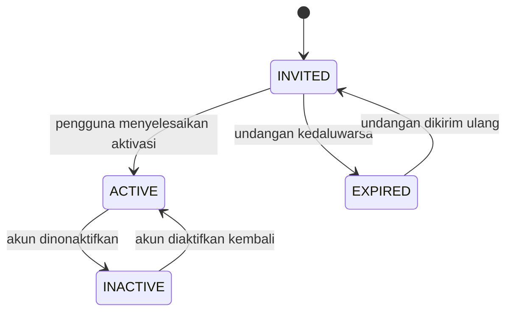
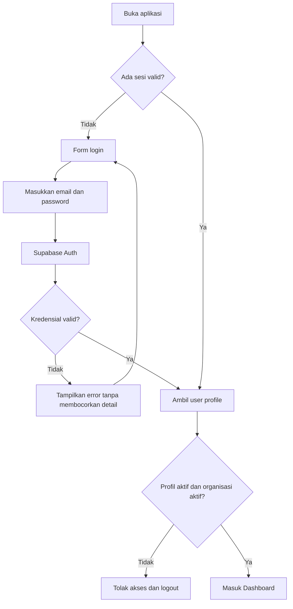
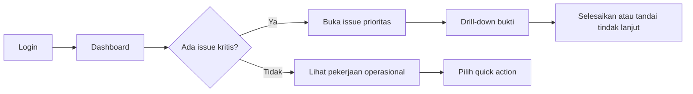
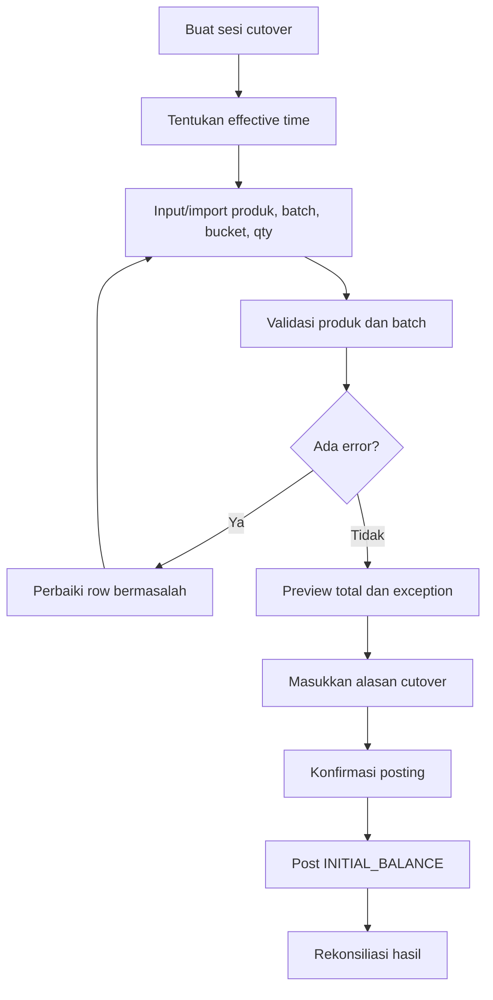
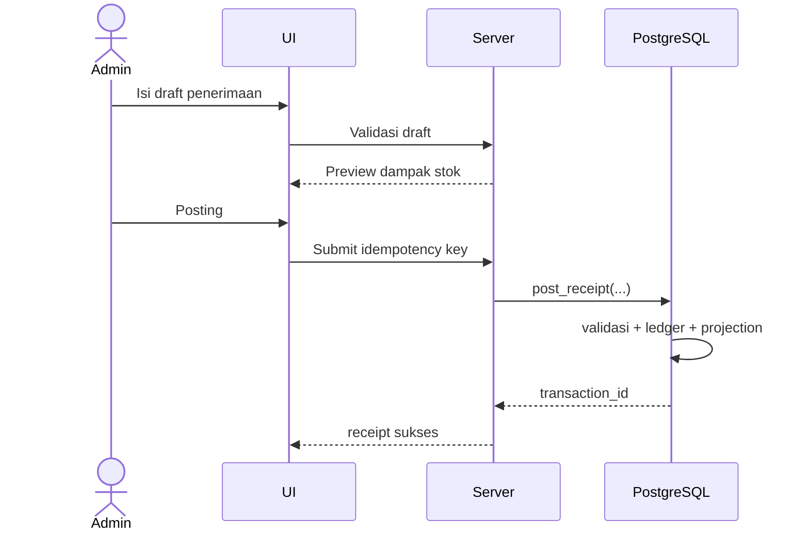
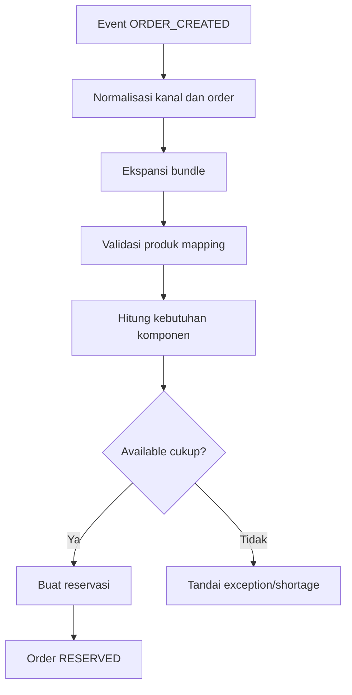
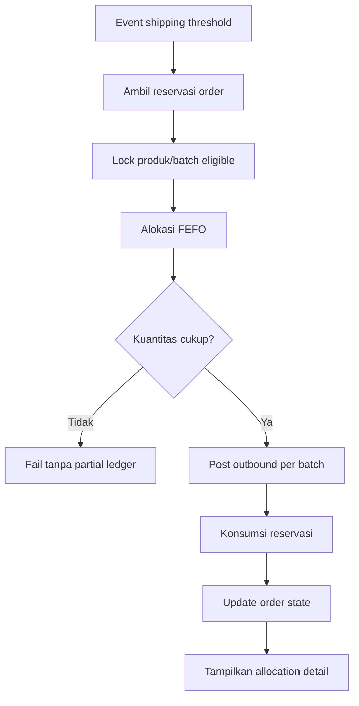
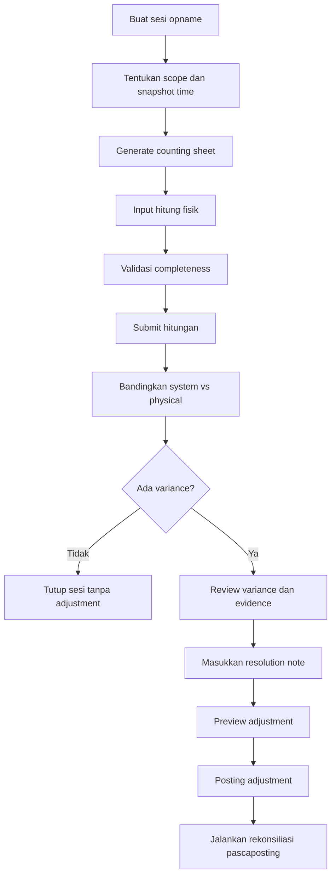
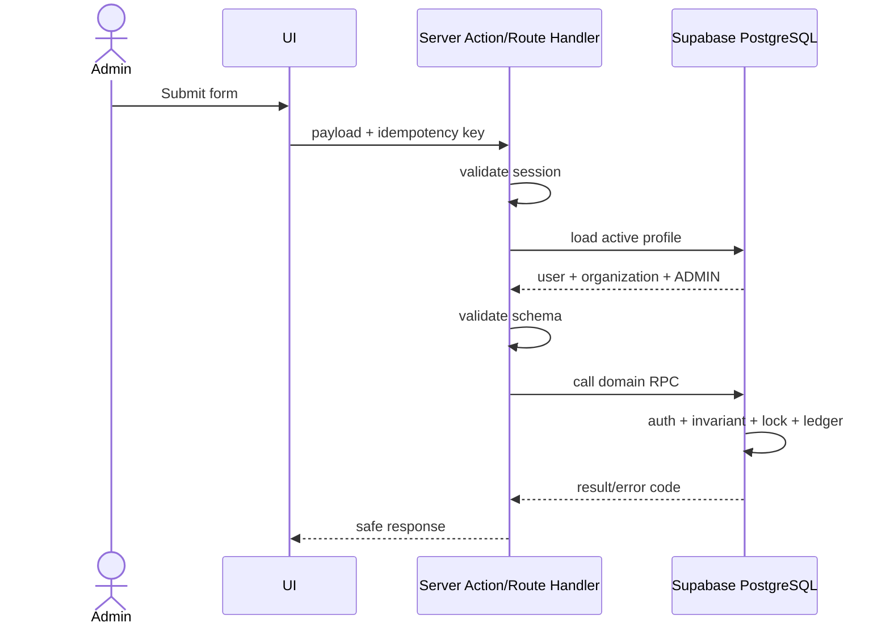

<!--
File: 06-user-roles-and-flows.md
Project: Sistem Rekonsiliasi Stok
Status: Approved design baseline for Phase 1
Version: 1.0.0
Last updated: 2026-07-12
Decision update: The application has exactly one user role: ADMIN.
-->

# User Roles and Flows: Sistem Rekonsiliasi Stok

## 1. Tujuan Dokumen

Dokumen ini mendefinisikan:

1. model pengguna dan otorisasi aplikasi;
2. keputusan bahwa fase 1 hanya memiliki satu user role, yaitu `ADMIN`;
3. struktur navigasi dan pola interaksi utama;
4. alur end-to-end untuk setiap proses stok;
5. guardrail keamanan, audit, validasi, dan pemulihan kesalahan;
6. acceptance criteria untuk implementasi UI, server, dan database;
7. dampak keputusan satu role terhadap dokumen `01` sampai `05`.

Dokumen ini adalah sumber kebenaran utama untuk **siapa yang memakai aplikasi dan bagaimana pengguna menyelesaikan pekerjaan**. Aturan kuantitas stok tetap mengacu pada:

- `03-business-rules.md`;
- `04-stock-ledger-design.md`;
- `05-database-schema.md`.

Bila terdapat konflik mengenai user role, approval, atau hak akses antara dokumen ini dan dokumen sebelumnya, **dokumen ini menang**.

---

## 2. Keputusan Produk Terbaru

### 2.1 Keputusan

Fase 1 hanya memiliki satu role aplikasi:

```text
ADMIN
```

Tidak ada role aplikasi berikut pada fase 1:

```text
WAREHOUSE_OPERATOR
OWNER_VIEWER
STAFF
APPROVER
SUPER_ADMIN
```

### 2.2 Interpretasi Keputusan

“Hanya satu user role” berarti:

- seluruh akun aplikasi yang aktif memiliki kemampuan fungsional `ADMIN`;
- tidak ada pilihan role ketika akun dibuat atau diedit;
- menu dan kemampuan tidak dibedakan menurut jabatan operasional;
- seluruh aksi tetap memerlukan autentikasi;
- seluruh aksi tetap dicatat atas nama akun individu;
- status akun tetap dapat `ACTIVE` atau `INACTIVE`;
- pembatasan organisasi tetap berlaku;
- aturan bisnis dan validasi stok tetap berlaku penuh.

### 2.3 Satu Role Bukan Satu Akun

Sistem boleh memiliki beberapa akun Admin agar setiap tindakan dapat dikaitkan dengan orang yang benar.

Dilarang mengandalkan satu akun bersama seperti:

```text
admin@gudang.local
password: admin123
```

Akun bersama merusak audit trail karena sistem tidak dapat membedakan siapa yang melakukan posting, reversal, atau koreksi. Manusia memang menyukai jalan pintas sampai waktunya mencari siapa yang menekan tombol salah.

### 2.4 Role Aplikasi dan Role Infrastruktur Berbeda

Istilah `ADMIN` dalam dokumen ini adalah **role pengguna aplikasi**.

Role berikut adalah identitas teknis dan bukan pilihan user role:

- Supabase `anon`;
- Supabase `authenticated`;
- Supabase `service_role`;
- PostgreSQL migration owner;
- CI/CD deployment identity;
- scheduled reconciliation worker.

Identitas teknis tersebut tidak boleh ditampilkan sebagai role yang dapat dipilih di halaman pengguna.

---

## 3. Latar Operasional dari Source Proyek

Source proyek menggambarkan brand skincare dengan sekitar 70 produk, ratusan paket keluar setiap hari, retur yang signifikan, serta pencatatan stok manual melalui spreadsheet.

Screenshot proses lama menunjukkan pola kerja berupa:

- daftar produk pada baris;
- satu kolom `SISA STOK`;
- kelompok kolom per tanggal;
- subkolom seperti `RETUR`, `SHOPEE`, `MANUAL`, dan `TIKTOK`;
- angka harian dimasukkan langsung ke sel.

Pola tersebut berguna sebagai tampilan rekap, tetapi tidak cukup sebagai sistem transaksi karena:

1. perubahan angka tidak selalu memiliki identitas kejadian;
2. tidak ada lifecycle pesanan;
3. batch dan tanggal kedaluwarsa tidak terlihat;
4. alasan dan kanal mudah tercampur;
5. koreksi dapat menimpa angka lama;
6. retur tidak menjelaskan kondisi barang;
7. pengguna harus memahami struktur spreadsheet yang lebar;
8. penelusuran selisih bergantung pada ingatan manusia.

Sistem baru tidak meniru spreadsheet secara harfiah. Sistem mempertahankan kebutuhan rekap per produk, tanggal, dan kanal, tetapi semua angka dibentuk dari transaksi yang dapat ditelusuri.

---

## 4. Persona Tunggal

## 4.1 Persona: Admin Operasional Stok

**Kode role:** `ADMIN`

**Tujuan utama:**

Menjaga agar seluruh pergerakan barang tercatat secara benar, dapat ditelusuri, dan konsisten dengan kondisi fisik gudang.

**Tanggung jawab:**

- mengelola master produk, batch, bundle, kanal, dan alasan;
- memasukkan saldo awal;
- mencatat barang masuk;
- memproses pesanan marketplace;
- mencatat barang keluar manual;
- menerima dan menginspeksi retur;
- menjalankan stok opname;
- meninjau dan memposting koreksi;
- menjalankan rekonsiliasi;
- membuat reversal yang sah;
- meninjau ledger dan audit trail;
- mengelola akun Admin lain;
- mengelola konfigurasi dan notifikasi.

**Karakteristik penggunaan:**

- tidak harus memahami database;
- mungkin bekerja dari laptop maupun ponsel;
- membutuhkan alur cepat untuk transaksi rutin;
- membutuhkan bukti dan preview untuk tindakan berisiko;
- membutuhkan istilah operasional, bukan istilah teknis internal;
- sering bekerja dengan banyak SKU dan transaksi berulang.

**Masalah yang harus dicegah:**

- salah memilih kanal atau alasan;
- memasukkan kuantitas pada produk yang salah;
- memposting transaksi dua kali;
- menganggap reservasi sebagai stok fisik keluar;
- mengembalikan retur ke stok layak jual sebelum inspeksi;
- mengubah saldo secara langsung;
- menyelesaikan issue rekonsiliasi tanpa bukti;
- melakukan reversal hanya untuk “membuat angka cocok”.

---

## 5. Model Akun

### 5.1 Atribut Akun Minimum

Setiap akun memiliki:

| Atribut | Wajib | Keterangan |
|---|:---:|---|
| `user_id` | Ya | Mengacu ke `auth.users.id`. |
| `organization_id` | Ya | Organisasi pemilik data. |
| `display_name` | Ya | Nama yang tampil di audit dan UI. |
| `email` | Ya | Identitas login. |
| `role_code` | Konstan | Selalu `ADMIN`; tidak diedit melalui UI. |
| `is_active` | Ya | Menentukan boleh login dan memakai aplikasi. |
| `last_login_at` | Tidak | Informasi audit. |
| `created_at` | Ya | Waktu pembuatan. |
| `updated_at` | Ya | Waktu perubahan profil. |

### 5.2 Status Akun

State akun:



### 5.3 Aturan Akun

- `USR-001`: Hanya akun `ACTIVE` yang dapat memakai aplikasi.
- `USR-002`: Semua akun aktif memiliki role aplikasi `ADMIN`.
- `USR-003`: UI tidak menyediakan dropdown role.
- `USR-004`: Menonaktifkan akun tidak menghapus histori tindakan pengguna.
- `USR-005`: Email harus unik menurut aturan Supabase Auth.
- `USR-006`: Akun tidak boleh menghapus dirinya sendiri.
- `USR-007`: Sistem harus mencegah penonaktifan akun aktif terakhir apabila tidak ada mekanisme pemulihan administratif.
- `USR-008`: Pengguna yang sudah dinonaktifkan harus ditolak pada request berikutnya meskipun token lama belum kedaluwarsa, melalui validasi profil aktif pada server atau database.
- `USR-009`: Semua transaksi posted menyimpan `created_by` dan snapshot nama/role bila diperlukan untuk audit jangka panjang.
- `USR-010`: `service_role` tidak boleh digunakan di browser.

---

## 6. Matriks Hak Akses Fase 1

Karena hanya ada satu role, matriks hak akses tidak membandingkan beberapa role. Matriks ini menjelaskan kemampuan Admin dan guardrail yang tetap berlaku.

| Domain | Lihat | Buat Draft | Posting/Proses | Ubah Posted | Reversal | Konfigurasi |
|---|:---:|:---:|:---:|:---:|:---:|:---:|
| Dashboard | Ya | - | - | - | - | - |
| Produk | Ya | Ya | Ya | Terbatas atribut nonhistoris | - | Ya |
| Batch | Ya | Ya | Ya | Terbatas | - | Ya |
| Bundle | Ya | Ya | Ya | Versioning | - | Ya |
| Saldo awal | Ya | Ya | Ya | Tidak | Ya, terkontrol | Ya |
| Penerimaan | Ya | Ya | Ya | Tidak | Ya | - |
| Pesanan marketplace | Ya | Ya via simulasi/impor | Ya | Tidak menimpa event | Sesuai lifecycle | Ya |
| Outbound manual | Ya | Ya | Ya | Tidak | Ya | - |
| Retur | Ya | Ya | Ya | Tidak menimpa inspeksi posted | Ya, terkontrol | Ya |
| Disposal | Ya | Ya | Ya | Tidak | Ya | Ya |
| Stok opname | Ya | Ya | Ya | Tidak | Ya, terkontrol | Ya |
| Rekonsiliasi | Ya | - | Jalankan/Selesaikan | Bukti dapat ditambah | - | Ya |
| Ledger | Ya | Tidak langsung | Melalui fungsi domain | Tidak | Melalui reversal | - |
| Audit trail | Ya | Tidak | Otomatis | Tidak | Tidak | - |
| Notifikasi | Ya | - | Tandai dibaca/ditangani | - | - | Ya |
| Impor | Ya | Ya | Ya | Tidak pada hasil posted | Sesuai transaksi | Ya |
| Simulator | Ya | Ya | Ya | Tidak | Sesuai transaksi | Ya |
| Pengguna | Ya | Undang | Aktif/nonaktif | Profil saja | - | Ya |

### 6.1 Tindakan yang Tetap Dilarang untuk Admin

Role `ADMIN` tidak berarti bebas mengubah sejarah. Admin tetap tidak boleh:

- mengedit atau menghapus ledger entry posted;
- mengedit saldo stok secara langsung;
- memilih batch secara manual pada outbound normal yang wajib FEFO;
- memproses event yang sama dua kali;
- membuat stok bucket negatif;
- mengembalikan retur ke `SELLABLE` tanpa inspeksi;
- menghapus transaksi posted;
- mengubah snapshot resep bundle pada transaksi lama;
- mengubah payload sumber event yang sudah diterima;
- menutup issue rekonsiliasi tanpa resolution note;
- melewati validasi hanya karena memiliki role Admin.

---

## 7. Prinsip Otorisasi

### 7.1 Authentication First

Setiap halaman aplikasi selain login dan pemulihan akun memerlukan sesi autentik.

### 7.2 Active Profile Check

Setelah autentikasi, server memeriksa:

1. user terdapat pada `app.user_profiles`;
2. profil `is_active = true`;
3. user memiliki organisasi aktif;
4. role aplikasi efektif adalah `ADMIN`.

### 7.3 Same-Organization Boundary

Semua query dan mutation dibatasi ke `organization_id` milik user.

Walaupun fase 1 hanya satu organisasi, constraint ini tetap dipertahankan agar ownership data eksplisit dan tidak perlu dibongkar ketika sistem berkembang.

### 7.4 Deny by Default

Akses ditolak bila kondisi izin tidak dapat dibuktikan.

Pola yang benar:

```text
authenticated
AND profile active
AND organization matches
AND domain validation passes
```

Bukan:

```text
button terlihat, berarti boleh
```

### 7.5 Server and Database Enforcement

- UI menyembunyikan aksi yang tidak relevan untuk state saat ini.
- Server Action atau Route Handler memvalidasi sesi dan profil aktif.
- Database function memvalidasi organisasi, status actor, dan invariant domain.
- RLS membatasi baris menurut organisasi.
- Grants mencegah mutasi langsung pada ledger dan tabel internal.

Next.js menegaskan bahwa Server Functions dapat dijangkau melalui request POST langsung, sehingga autentikasi dan otorisasi harus diperiksa di dalam setiap Server Function, bukan hanya melalui navigasi UI.

### 7.6 Single Role Simplification

Karena hanya ada satu role aplikasi:

- tidak diperlukan custom claim RBAC yang membedakan `ADMIN`, `OPERATOR`, dan `VIEWER`;
- policy dapat berfokus pada `auth.uid()`, profil aktif, dan organisasi;
- role code dapat disimpan sebagai konstanta audit atau dihilangkan dari keputusan runtime;
- permission branching di frontend harus dihapus;
- state transaksi, bukan role, menjadi penentu utama ketersediaan tombol.

---

## 8. Pola Konfirmasi Berdasarkan Risiko

Tidak adanya role Approver tidak berarti semua tindakan diposting tanpa review. Sistem menggunakan **risk-based confirmation**.

| Tingkat | Contoh | Pola Konfirmasi |
|---|---|---|
| Rendah | Menandai notifikasi dibaca | Langsung, dapat dibatalkan bila relevan |
| Sedang | Membuat draft penerimaan | Simpan draft |
| Tinggi | Posting outbound, inspeksi retur | Preview, ringkasan dampak, konfirmasi eksplisit |
| Sangat tinggi | Reversal, posting adjustment opname, saldo awal | Preview detail, alasan wajib, ketik konfirmasi atau dialog tegas |

### 8.1 Maker-Checker Tidak Berlaku pada Fase 1

Karena hanya ada satu role dan belum ada requirement pemisahan tugas:

- orang yang membuat draft boleh memposting draft yang sama;
- orang yang memasukkan hitungan opname boleh meninjau dan memposting adjustment;
- sistem tidak mengklaim memiliki four-eyes approval;
- audit tetap menyimpan actor pada setiap tahap;
- UI harus memberi preview yang cukup sebelum tindakan final.

### 8.2 Bahasa UI

Gunakan istilah:

- `Simpan Draft`;
- `Tinjau dan Posting`;
- `Posting Transaksi`;
- `Batalkan`;
- `Buat Reversal`.

Hindari label `Approve` bila tidak ada reviewer independen. Menyebut klik sendiri sebagai approval adalah kosmetik tata kelola, bukan kontrol.

---

## 9. Information Architecture

## 9.1 Navigasi Utama

```text
Dashboard
Stok
  - Posisi Stok
  - Batch & Kedaluwarsa
  - Buku Besar Stok
Operasional
  - Penerimaan Barang
  - Pesanan Marketplace
  - Barang Keluar Manual
  - Retur & Klaim
  - Barang Rusak/Kedaluwarsa
Kontrol
  - Stok Opname
  - Rekonsiliasi
  - Notifikasi
Integrasi Demo
  - Impor File
  - Simulator Marketplace
Master Data
  - Produk
  - Batch
  - Bundle
  - Alasan Pergerakan
  - Kanal
Pengaturan
  - Pengguna Admin
  - Konfigurasi
  - Audit Trail
```

## 9.2 Navigasi Mobile

Pada layar kecil, tampilkan maksimal lima tujuan utama:

1. Dashboard;
2. Stok;
3. Tambah Transaksi;
4. Kontrol;
5. Lainnya.

Menu `Tambah Transaksi` membuka action sheet:

- Terima Barang;
- Keluar Manual;
- Terima Retur;
- Hitung Stok;
- Simulasikan Event.

Tabel lebar tidak boleh dipaksa menjadi miniatur spreadsheet. Pada mobile:

- satu baris produk berubah menjadi card;
- kolom prioritas tampil pertama;
- detail lain tersedia melalui expand;
- filter kanal/tanggal menggunakan drawer;
- angka dan tombol tetap memiliki target sentuh yang memadai.

## 9.3 Global Header

Header minimum:

- nama halaman;
- organisasi aktif;
- status rekonsiliasi terakhir;
- notifikasi belum dibaca;
- menu profil;
- indikator environment `DEMO` bila simulator aktif.

---

## 10. Pola UI Global

### 10.1 Page States

Setiap halaman data mendukung:

- loading;
- empty;
- success;
- partial data;
- recoverable error;
- authorization/session error;
- offline atau network error bila terdeteksi.

### 10.2 Form Pattern

Urutan standar:

1. judul dan tujuan form;
2. informasi sumber/reference;
3. field utama;
4. daftar line item;
5. validasi inline;
6. ringkasan dampak stok;
7. aksi `Simpan Draft` atau `Tinjau`;
8. confirmation step;
9. receipt/success screen.

### 10.3 Labels and Instructions

Semua input harus memiliki label yang terlihat. Field wajib tidak boleh ditandai hanya dengan warna atau tanda bintang kecil. Format tanggal, SKU, batch, dan kuantitas harus dijelaskan di dekat field.

### 10.4 Error Identification

Pesan error harus menyebut:

- field atau transaksi yang bermasalah;
- alasan;
- tindakan perbaikan;
- apakah data draft tetap tersimpan.

Contoh baik:

> Stok tersedia AURA HYDROGEL MASK hanya 18 unit, sedangkan transaksi membutuhkan 20 unit. Kurangi kuantitas atau terima stok baru terlebih dahulu.

Contoh buruk:

> Error 23514.

### 10.5 Numeric Input

- kuantitas hanya menerima bilangan bulat positif pada form transaksi normal;
- nol ditolak kecuali field memang opsional;
- separator ribuan ditampilkan untuk keterbacaan;
- angka mentah tetap dikirim sebagai integer;
- perubahan kuantitas memicu perhitungan ulang preview.

### 10.6 Unsaved Changes

Bila user meninggalkan draft yang berubah:

- tampilkan peringatan;
- tawarkan `Tetap di Halaman`, `Buang Perubahan`, atau `Simpan Draft` bila memungkinkan.

### 10.7 Destructive and Irreversible Actions

Tombol reversal, posting adjustment, dan disposal:

- tidak ditempatkan berdekatan dengan tombol netral;
- menampilkan konsekuensi kuantitas;
- membutuhkan alasan;
- tidak memakai label ambigu seperti `OK`.

---

## 11. Flow 01: Login

### 11.1 Tujuan

Mengautentikasi Admin dan memastikan profilnya aktif.

### 11.2 Diagram



### 11.3 Happy Path

1. Admin membuka aplikasi.
2. Sistem menampilkan form login bila tidak ada sesi.
3. Admin memasukkan email dan password.
4. Supabase Auth memverifikasi kredensial.
5. Aplikasi memeriksa profil aktif.
6. Aplikasi membuka Dashboard.
7. Audit mencatat login berhasil bila kebijakan audit mengharuskannya.

### 11.4 Alternate Paths

- Password salah: tampilkan pesan generik.
- Akun tidak aktif: hentikan sesi dan tampilkan instruksi menghubungi pengelola.
- Organisasi tidak aktif: hentikan akses.
- Sesi kedaluwarsa saat posting: jangan kirim ulang otomatis tanpa konfirmasi; pertahankan draft lokal/server bila aman.

### 11.5 Acceptance Criteria

- `FLOW-AUTH-001`: Halaman privat tidak dapat dibuka tanpa sesi valid.
- `FLOW-AUTH-002`: Akun inactive ditolak walaupun autentikasi berhasil.
- `FLOW-AUTH-003`: Setelah login, user diarahkan ke target awal bila target masih aman.
- `FLOW-AUTH-004`: Error login tidak mengungkap apakah email terdaftar.
- `FLOW-AUTH-005`: Logout menghapus sesi lokal dan kembali ke halaman login.

---

## 12. Flow 02: Dashboard dan Triage Harian

### 12.1 Tujuan

Memberi Admin gambaran tindakan yang perlu diprioritaskan pada hari itu.

### 12.2 Komponen Dashboard

- total sellable;
- total reserved;
- total quarantine;
- total damaged;
- pesanan menunggu pengiriman;
- retur menunggu penerimaan;
- retur menunggu inspeksi;
- klaim TikTok mendekati batas;
- batch mendekati kedaluwarsa;
- issue rekonsiliasi terbuka;
- status rekonsiliasi harian terakhir;
- aktivitas terbaru.

### 12.3 Flow



### 12.4 Prioritas Visual

Urutan prioritas:

1. integrity issue;
2. klaim mendekati deadline;
3. retur belum diinspeksi;
4. stok hampir habis atau kedaluwarsa;
5. pekerjaan rutin.

### 12.5 Acceptance Criteria

- `FLOW-DASH-001`: Nilai dashboard berasal dari view/projection, bukan hitung manual frontend.
- `FLOW-DASH-002`: Setiap kartu dapat membuka daftar terfilter.
- `FLOW-DASH-003`: Waktu pembaruan terakhir terlihat.
- `FLOW-DASH-004`: Dashboard tidak menampilkan nilai uang.
- `FLOW-DASH-005`: Status kosong dibedakan dari gagal memuat.

---

## 13. Flow 03: Membuat dan Mengelola Produk

### 13.1 Happy Path

1. Admin membuka `Master Data > Produk`.
2. Admin memilih `Tambah Produk`.
3. Admin mengisi SKU, nama, unit, dan atribut wajib.
4. Sistem memvalidasi keunikan SKU.
5. Admin meninjau data.
6. Admin menyimpan produk.
7. Sistem menampilkan detail produk tanpa saldo awal otomatis.

### 13.2 Edit

Atribut nonhistoris yang boleh diubah:

- nama tampilan;
- deskripsi;
- status aktif;
- metadata operasional yang tidak mengubah makna transaksi lama.

SKU yang sudah dipakai pada transaksi tidak boleh diubah sembarangan. Bila perubahan identifier dibutuhkan, gunakan alias/mapping yang terdokumentasi.

### 13.3 Archive

Produk dengan histori tidak dihapus. Produk diarsipkan sehingga:

- tetap muncul pada histori;
- tidak dapat dipilih untuk transaksi baru;
- tetap dapat dipakai untuk penyelesaian transaksi lama yang sah bila aturan mengizinkan.

### 13.4 Acceptance Criteria

- `FLOW-PRD-001`: SKU wajib unik dalam organisasi.
- `FLOW-PRD-002`: Menyimpan produk tidak membuat stok.
- `FLOW-PRD-003`: Produk berhistori tidak dapat dihapus permanen dari UI.
- `FLOW-PRD-004`: Pengarsipan tercatat pada audit.
- `FLOW-PRD-005`: Search mendukung SKU dan nama produk.

---

## 14. Flow 04: Membuat Batch

### 14.1 Tujuan

Mendaftarkan identitas batch dan tanggal kedaluwarsa yang akan digunakan ledger dan FEFO.

### 14.2 Happy Path

1. Admin membuka detail produk.
2. Admin memilih `Tambah Batch`.
3. Admin memasukkan batch code dan expiry date.
4. Sistem memvalidasi kombinasi produk + batch code.
5. Admin menyimpan batch.
6. Batch tersedia untuk penerimaan dan saldo awal.

### 14.3 Guardrail

- batch tidak menghasilkan saldo tanpa transaksi;
- expiry date wajib untuk produk yang dikendalikan kedaluwarsanya;
- batch expired tidak eligible untuk outbound sellable;
- batch dapat diblokir tanpa menghapus histori;
- batch yang sudah dipakai tidak boleh dipindah ke produk lain.

### 14.4 Acceptance Criteria

- `FLOW-BAT-001`: Kombinasi produk dan batch code unik.
- `FLOW-BAT-002`: Sistem menampilkan status expired/near-expiry.
- `FLOW-BAT-003`: Batch blocked tidak ikut FEFO.
- `FLOW-BAT-004`: Perubahan expiry date setelah transaksi membutuhkan alasan dan audit.

---

## 15. Flow 05: Menentukan Resep Bundle

### 15.1 Happy Path

1. Admin membuka `Master Data > Bundle`.
2. Admin memilih kanal marketplace.
3. Admin memasukkan listing code atau marketplace SKU.
4. Admin menambahkan komponen produk dan kuantitas.
5. Sistem menampilkan hasil ekspansi satu bundle.
6. Admin memvalidasi tidak ada komponen nol atau duplikat tidak sengaja.
7. Admin mengaktifkan versi resep.

### 15.2 Versioning

Perubahan resep membuat versi baru. Pesanan yang sudah diterima mempertahankan snapshot resep saat ingestion.

### 15.3 Acceptance Criteria

- `FLOW-BND-001`: Bundle tidak memiliki saldo sendiri.
- `FLOW-BND-002`: Resep aktif hanya satu per listing dan periode efektif.
- `FLOW-BND-003`: Pesanan lama tidak berubah ketika resep baru dibuat.
- `FLOW-BND-004`: Preview menunjukkan total komponen yang akan direservasi.

---

## 16. Flow 06: Saldo Awal dan Cutover

### 16.1 Tujuan

Memindahkan kondisi awal dari spreadsheet ke ledger secara terkendali.

### 16.2 Flow



### 16.3 Aturan Single Role

Karena hanya ada Admin:

- Admin yang membuat sesi juga boleh memposting;
- preview wajib menampilkan total per produk dan batch;
- alasan/catatan cutover wajib;
- posting tidak memakai label `Disetujui oleh` bila actor sama;
- metadata menyimpan `prepared_by` dan `posted_by`, yang boleh bernilai sama.

### 16.4 Acceptance Criteria

- `FLOW-CUT-001`: Satu row saldo awal memerlukan produk, batch, bucket, dan kuantitas.
- `FLOW-CUT-002`: Row invalid tidak ikut terposting diam-diam.
- `FLOW-CUT-003`: Posting bersifat atomik sesuai scope sesi.
- `FLOW-CUT-004`: Sesi posted tidak dapat diedit.
- `FLOW-CUT-005`: Koreksi memakai reversal dan repost, bukan edit ledger.
- `FLOW-CUT-006`: Ringkasan pascaposting dapat dibandingkan dengan sumber spreadsheet.

---

## 17. Flow 07: Penerimaan Barang dari Maklon

### 17.1 Happy Path

1. Admin memilih `Operasional > Penerimaan Barang`.
2. Admin membuat penerimaan baru.
3. Admin mengisi nomor referensi maklon, tanggal diterima, dan catatan.
4. Admin menambahkan line produk.
5. Untuk setiap line, Admin memilih atau membuat batch serta expiry date.
6. Admin memasukkan kuantitas diterima.
7. Sistem memvalidasi duplikasi referensi dan data batch.
8. Admin memilih `Tinjau`.
9. Sistem menampilkan dampak `SELLABLE +qty` per batch.
10. Admin memilih `Posting Penerimaan`.
11. Database memposting ledger secara atomik.
12. UI menampilkan receipt dengan transaction ID.

### 17.2 Diagram



### 17.3 Alternate Paths

- Batch belum ada: buat inline dengan field minimum.
- Referensi sama: tampilkan transaksi terdahulu, jangan langsung membuat duplikat.
- Network timeout setelah submit: cek idempotency status sebelum menawarkan retry.
- Salah setelah posted: buka flow reversal.

### 17.4 Acceptance Criteria

- `FLOW-RCV-001`: Draft tidak memengaruhi stok.
- `FLOW-RCV-002`: Posting membuat ledger dan projection dalam satu transaksi.
- `FLOW-RCV-003`: Submit ulang dengan idempotency key sama tidak menggandakan stok.
- `FLOW-RCV-004`: Receipt menampilkan produk, batch, qty, actor, waktu, dan referensi.
- `FLOW-RCV-005`: User tidak memilih bucket selain bucket yang diizinkan flow.

---

## 18. Flow 08: Pesanan Marketplace Baru

### 18.1 Tujuan

Menerima pesanan dari simulator atau impor dan membuat reservasi tanpa mengurangi stok fisik.

### 18.2 Flow



### 18.3 Tampilan Admin

Admin melihat:

- marketplace order ID;
- kanal;
- waktu event;
- item listing asli;
- hasil ekspansi bundle;
- kuantitas reserved;
- exception mapping atau shortage;
- event timeline.

### 18.4 Acceptance Criteria

- `FLOW-ORD-001`: Pesanan baru tidak menulis outbound ledger.
- `FLOW-ORD-002`: Reservasi mengurangi available, bukan on-hand.
- `FLOW-ORD-003`: Event duplikat tidak membuat reservasi ganda.
- `FLOW-ORD-004`: Item tidak termapping masuk exception queue.
- `FLOW-ORD-005`: Snapshot bundle tersimpan pada order item.

---

## 19. Flow 09: Pesanan Dikirim

### 19.1 Trigger Kanal

- Shopee: stok fisik keluar pada `SHIPPED`.
- TikTok Shop: stok fisik keluar pada `IN_TRANSIT`.

### 19.2 Flow



### 19.3 UX

Admin tidak memilih batch. Detail FEFO ditampilkan setelah atau pada preview pemrosesan:

- batch terpilih;
- expiry date;
- kuantitas per batch;
- jumlah reservasi yang dikonsumsi.

### 19.4 Acceptance Criteria

- `FLOW-SHP-001`: Batch dipilih otomatis menurut FEFO.
- `FLOW-SHP-002`: Split batch terjadi bila satu batch tidak cukup.
- `FLOW-SHP-003`: Stok tidak pernah negatif.
- `FLOW-SHP-004`: Event kanal sebelum threshold tidak mengurangi on-hand.
- `FLOW-SHP-005`: Event threshold yang sama tidak membuat outbound ganda.
- `FLOW-SHP-006`: Allocation dapat ditelusuri dari order ke ledger entry.

---

## 20. Flow 10: Pembatalan Pesanan

### 20.1 Decision Table

| Kondisi | Dampak |
|---|---|
| Batal sebelum threshold pengiriman | Lepaskan reservasi; tidak ada inbound ledger. |
| Batal setelah threshold tetapi barang belum kembali | Tidak menambah stok; buat expected return bila relevan. |
| Barang kembali dan diterima | Masuk `QUARANTINE`. |
| Setelah inspeksi layak jual | Transfer ke `SELLABLE`. |
| Setelah inspeksi rusak | Transfer ke `DAMAGED`. |
| Hilang di ekspedisi | Tidak menambah stok; buka/tandai klaim. |

### 20.2 Acceptance Criteria

- `FLOW-CAN-001`: Pembatalan sebelum shipment tidak membuat reversal outbound karena outbound belum ada.
- `FLOW-CAN-002`: Pembatalan setelah shipment tidak otomatis mengembalikan stok.
- `FLOW-CAN-003`: Timeline menjelaskan reservasi dilepas atau expected return dibuat.
- `FLOW-CAN-004`: Event status yang terlambat diproses idempoten dan mengikuti state machine.

---

## 21. Flow 11: Barang Keluar Manual

### 21.1 Alasan yang Didukung

Contoh:

- `OFFLINE_SALE`;
- `BONUS`;
- `PROMO`;
- `SAMPLE`;
- `INTERNAL_USE` bila disetujui dalam master alasan;
- `OTHER` hanya bila konfigurasi mengizinkan dan catatan wajib.

Kanal tetap dipilih terpisah, misalnya `MANUAL`, `OFFLINE_STORE`, atau kanal operasional lain.

### 21.2 Happy Path

1. Admin membuka `Barang Keluar Manual`.
2. Admin memilih alasan.
3. Admin memilih kanal.
4. Admin memasukkan reference dan catatan sesuai aturan.
5. Admin menambahkan produk dan kuantitas.
6. Sistem menampilkan available stock.
7. Sistem menghitung preview FEFO.
8. Admin meninjau ringkasan.
9. Admin memposting.
10. Sistem menampilkan batch allocation dan ledger reference.

### 21.3 Guardrail

- alasan dan kanal tidak digabung menjadi satu field;
- Admin tidak memilih batch pada flow normal;
- `OTHER` membutuhkan catatan yang jelas;
- bonus/promo/sampel tidak boleh dicatat sebagai penjualan offline hanya karena sama-sama mengurangi stok;
- kuantitas tidak cukup menggagalkan seluruh posting.

### 21.4 Acceptance Criteria

- `FLOW-MAN-001`: Reason dan channel tersimpan sebagai atribut terpisah.
- `FLOW-MAN-002`: FEFO otomatis.
- `FLOW-MAN-003`: Preview menunjukkan dampak per batch.
- `FLOW-MAN-004`: Posted record tidak dapat diedit.
- `FLOW-MAN-005`: Reversal mempertahankan referensi ke transaksi asal.

---

## 22. Flow 12: Retur Diharapkan

### 22.1 Tujuan

Mencatat bahwa barang diperkirakan kembali tanpa menganggap barang sudah berada di gudang.

### 22.2 Happy Path

1. Event retur diterima atau Admin membuat retur dari order.
2. Sistem menghubungkan retur dengan order dan outbound allocation.
3. Sistem menghitung expected quantity.
4. Retur berstatus `EXPECTED` atau `IN_TRANSIT`.
5. Stok fisik tidak berubah.
6. Deadline klaim dihitung bila kanal dan kasus memerlukan.

### 22.3 Acceptance Criteria

- `FLOW-RET-001`: Expected return tidak menambah stok.
- `FLOW-RET-002`: Retur dapat dilacak ke order dan outbound batch.
- `FLOW-RET-003`: Quantity return tidak boleh melebihi quantity eligible tanpa exception terkontrol.
- `FLOW-RET-004`: Klaim TikTok memiliki due date dan reminder.

---

## 23. Flow 13: Menerima Retur

### 23.1 Happy Path

1. Admin membuka retur `EXPECTED` atau membuat retur manual terhubung order.
2. Admin memilih `Terima Barang`.
3. Admin memasukkan kuantitas yang benar-benar tiba.
4. Admin mencatat waktu terima dan bukti opsional.
5. Sistem menampilkan dampak `QUARANTINE +qty`.
6. Admin memposting penerimaan retur.
7. Status item menjadi `RECEIVED_PENDING_INSPECTION`.

### 23.2 Aturan Batch

Sistem menggunakan hubungan outbound allocation untuk mengembalikan barang ke batch asal bila dapat dipastikan. Bila identitas batch fisik tidak dapat dipastikan, ikuti aturan exception yang ditetapkan pada desain ledger/schema dan tandai untuk inspeksi atau investigasi.

### 23.3 Acceptance Criteria

- `FLOW-RRT-001`: Barang masuk ke `QUARANTINE`, bukan langsung `SELLABLE`.
- `FLOW-RRT-002`: Received qty dapat lebih kecil dari expected qty.
- `FLOW-RRT-003`: Selisih expected versus received terlihat.
- `FLOW-RRT-004`: Penerimaan ganda dicegah.
- `FLOW-RRT-005`: Audit menyimpan actor dan waktu fisik penerimaan.

---

## 24. Flow 14: Inspeksi Retur

### 24.1 Kondisi Hasil

- `SELLABLE`;
- `DAMAGED`;
- `LOST` untuk barang yang tidak pernah diterima, bukan untuk unit yang sedang diperiksa secara fisik;
- partial split bila beberapa unit berbeda kondisi.

### 24.2 Happy Path

1. Admin membuka queue `Menunggu Inspeksi`.
2. Admin memilih retur.
3. Sistem menampilkan jumlah pada `QUARANTINE`.
4. Admin memasukkan hasil per kondisi.
5. Sistem memastikan total hasil sama dengan jumlah yang diinspeksi.
6. Admin menambahkan catatan/bukti bila rusak.
7. Sistem menampilkan preview transfer bucket.
8. Admin memposting inspeksi.
9. Ledger memindahkan unit dari `QUARANTINE` ke `SELLABLE` atau `DAMAGED`.

### 24.3 Acceptance Criteria

- `FLOW-INS-001`: Total hasil inspeksi tidak melebihi received qty.
- `FLOW-INS-002`: `SELLABLE` hanya bertambah setelah inspeksi posted.
- `FLOW-INS-003`: DAMAGED tetap on-hand sampai disposal.
- `FLOW-INS-004`: Partial inspection didukung bila requirement domain mengizinkan.
- `FLOW-INS-005`: Hasil posted tidak diedit; koreksi memakai reversal.

---

## 25. Flow 15: Klaim TikTok

### 25.1 Tujuan

Mencegah klaim terlewat sebelum batas operasional 40 hari sebagaimana ditetapkan source proyek.

### 25.2 Flow

1. Sistem membuat claim candidate dari retur/hilang yang eligible.
2. Sistem menghitung tanggal batas.
3. Dashboard menampilkan countdown.
4. Admin membuka detail bukti.
5. Admin memperbarui status klaim:
   - `TO_PREPARE`;
   - `SUBMITTED`;
   - `ACCEPTED`;
   - `REJECTED`;
   - `EXPIRED`.
6. Perubahan status dicatat di audit.

### 25.3 Acceptance Criteria

- `FLOW-CLM-001`: Deadline terlihat sebagai tanggal dan sisa hari.
- `FLOW-CLM-002`: Reminder tidak mengubah stok.
- `FLOW-CLM-003`: Klaim terkait dengan retur/order.
- `FLOW-CLM-004`: Status klaim tidak menghapus bukti lama.

---

## 26. Flow 16: Barang Rusak dan Kedaluwarsa

### 26.1 Queue

Halaman menampilkan:

- batch expired;
- batch near-expiry;
- saldo `DAMAGED`;
- unit yang menunggu disposal;
- histori disposal.

### 26.2 Disposal Flow

1. Admin memilih batch dan bucket eligible.
2. Admin memasukkan jumlah.
3. Admin memilih reason `DAMAGED_DISPOSAL` atau `EXPIRED_DISPOSAL`.
4. Admin memasukkan reference/bukti sesuai kebijakan.
5. Sistem menampilkan dampak on-hand.
6. Admin mengonfirmasi posting.
7. Ledger mencatat external outbound.

### 26.3 Acceptance Criteria

- `FLOW-DSP-001`: Menandai batch expired tidak otomatis mengurangi on-hand.
- `FLOW-DSP-002`: Disposal adalah transaksi fisik tersendiri.
- `FLOW-DSP-003`: Disposal tidak boleh melebihi bucket source.
- `FLOW-DSP-004`: Reason dan bukti tersimpan.

---

## 27. Flow 17: Stok Opname

### 27.1 Tujuan

Membandingkan saldo sistem dengan hitung fisik dan menjelaskan koreksi.

### 27.2 Flow End-to-End



### 27.3 Single-Role Review Pattern

Pada fase 1:

- tidak ada Admin A versus Admin B sebagai requirement;
- pembuat dan pemosting adjustment boleh sama;
- halaman review harus terpisah dari halaman input hitung;
- sistem menampilkan variance sebelum tombol posting aktif;
- alasan wajib untuk setiap variance nonzero atau setidaknya per kelompok yang terdokumentasi;
- metadata menyimpan `counted_by`, `reviewed_by`, dan `posted_by`, walaupun nilainya dapat sama.

### 27.4 Counting UX

Untuk mempercepat input seperti spreadsheet tanpa mengorbankan audit:

- dukung keyboard navigation pada desktop;
- dukung pencarian/scan SKU bila tersedia;
- autosave draft count;
- tampilkan progress count;
- jangan tampilkan system quantity pada blind count mode;
- pada mobile gunakan satu produk/batch per card;
- tampilkan duplicate count warning.

### 27.5 Acceptance Criteria

- `FLOW-STK-001`: Membuat sesi tidak mengubah stok.
- `FLOW-STK-002`: Snapshot sistem tidak berubah karena UI refresh.
- `FLOW-STK-003`: Variance = physical - system pada scope/bucket yang tepat.
- `FLOW-STK-004`: Adjustment posted melalui ledger.
- `FLOW-STK-005`: Sesi posted tidak dapat diedit.
- `FLOW-STK-006`: Audit menyimpan seluruh tahap dan actor.
- `FLOW-STK-007`: Recount tidak menimpa count lama tanpa histori.

---

## 28. Flow 18: Rekonsiliasi Harian

### 28.1 Checks Minimum

- ledger versus batch projection;
- batch projection versus product projection;
- reserved tidak melebihi sellable;
- transaksi posted memiliki entry lengkap;
- transfer internal neto nol;
- order threshold tidak memiliki outbound ganda;
- event idempotency tidak dilanggar;
- retur/inspection quantity konsisten;
- reversal tidak melebihi transaksi asal;
- orphan reference tidak ada.

### 28.2 Flow

1. Rekonsiliasi berjalan terjadwal atau dipicu Admin.
2. Sistem membuat run dan check result.
3. Issue dibuat untuk kegagalan.
4. Admin membuka issue.
5. Admin melihat evidence dan linked records.
6. Admin memilih resolution category.
7. Admin melakukan tindakan domain bila dibutuhkan.
8. Admin menambahkan resolution note.
9. Sistem menjalankan ulang check terkait.
10. Issue ditutup hanya bila check lulus atau accepted exception terdokumentasi.

### 28.3 Acceptance Criteria

- `FLOW-REC-001`: Issue memiliki evidence yang dapat dibuka.
- `FLOW-REC-002`: Menutup issue tidak langsung mengedit saldo.
- `FLOW-REC-003`: Perbaikan menggunakan flow transaksi/reversal yang sah.
- `FLOW-REC-004`: Rerun menyimpan histori run lama.
- `FLOW-REC-005`: Status `RESOLVED` memiliki actor, waktu, dan note.

---

## 29. Flow 19: Ledger Drill-Down

### 29.1 Entry Points

Admin dapat masuk ke ledger dari:

- posisi stok produk;
- detail batch;
- receipt;
- order;
- manual outbound;
- retur;
- stocktake;
- reconciliation issue;
- global ledger search.

### 29.2 Filter

- rentang waktu;
- produk;
- batch;
- transaction type;
- reason;
- channel;
- source type;
- source reference;
- actor;
- bucket;
- quantity direction;
- reversed/not reversed.

### 29.3 Transaction Story

Detail transaksi harus menjawab:

- apa yang terjadi;
- kapan business event terjadi;
- kapan sistem mencatatnya;
- produk dan batch apa;
- berapa kuantitasnya;
- dari bucket mana ke mana;
- melalui kanal apa;
- karena alasan apa;
- berasal dari dokumen/event mana;
- siapa yang memposting;
- apakah pernah direversal.

### 29.4 Acceptance Criteria

- `FLOW-LED-001`: Dari saldo produk, Admin dapat membuka entries pembentuknya.
- `FLOW-LED-002`: Entry menautkan transaksi header dan source reference.
- `FLOW-LED-003`: Original dan reversal saling tertaut.
- `FLOW-LED-004`: Ledger tidak menyediakan edit/delete.
- `FLOW-LED-005`: Export, bila tersedia, menjaga identifier dan sign quantity.

---

## 30. Flow 20: Reversal

### 30.1 Kapan Digunakan

Reversal digunakan untuk membatalkan dampak transaksi posted yang salah, bukan untuk menyembunyikan selisih.

### 30.2 Happy Path

1. Admin membuka transaksi posted.
2. Admin memilih `Buat Reversal`.
3. Sistem memeriksa reversible quantity dan dependency.
4. Sistem menampilkan original entries dan dampak reversal.
5. Admin memilih reason reversal.
6. Admin menulis penjelasan wajib.
7. Admin mengonfirmasi.
8. Sistem memposting transaksi reversal atomik.
9. UI menautkan original dan reversal.

### 30.3 Rejection Cases

- transaksi sudah fully reversed;
- reversal akan membuat bucket negatif;
- stok hasil penerimaan sudah digunakan dan dependency belum dibalik;
- actor/session tidak valid;
- transaction type tidak reversible melalui flow umum;
- request hash/idempotency conflict.

### 30.4 Acceptance Criteria

- `FLOW-REV-001`: Original entry tidak berubah.
- `FLOW-REV-002`: Reversal memiliki transaction ID baru.
- `FLOW-REV-003`: Reason dan note wajib.
- `FLOW-REV-004`: Preview menampilkan kuantitas dan bucket.
- `FLOW-REV-005`: Partial reversal hanya tersedia bila aturan domain mendukung.
- `FLOW-REV-006`: Audit merekam actor.

---

## 31. Flow 21: Impor File

### 31.1 Jenis Impor Fase 1

- saldo awal;
- produk;
- batch;
- pesanan/event marketplace;
- data lain hanya bila kontrak impor terdokumentasi.

### 31.2 Flow

1. Admin memilih tipe impor.
2. Admin mengunduh template atau melihat schema kolom.
3. Admin mengunggah CSV.
4. Sistem membuat import job.
5. Sistem parsing ke staging.
6. Sistem menampilkan row valid, warning, dan error.
7. Admin mengunduh error report bila perlu.
8. Admin memperbaiki file atau mengecualikan row sesuai aturan.
9. Admin memilih `Proses Data Valid` atau `Batalkan`.
10. Sistem memproses melalui domain function yang sama dengan input UI.
11. Import result menampilkan created/duplicate/failed.

### 31.3 Acceptance Criteria

- `FLOW-IMP-001`: Upload tidak langsung mengubah stok.
- `FLOW-IMP-002`: Row error memiliki nomor baris dan alasan.
- `FLOW-IMP-003`: File impor tidak menulis langsung ke ledger.
- `FLOW-IMP-004`: Duplicate key tidak menghasilkan transaksi ganda.
- `FLOW-IMP-005`: Payload asli dan hasil proses dapat diaudit sesuai retention policy.

---

## 32. Flow 22: Simulator Marketplace

### 32.1 Tujuan

Mendemonstrasikan lifecycle marketplace tanpa API sungguhan, sambil menggunakan adapter dan domain logic yang kelak dapat dipakai integrasi nyata.

### 32.2 Event yang Disediakan

- order baru;
- order diproses;
- order shipped/in-transit;
- pembatalan sebelum keluar;
- pembatalan setelah keluar;
- retur dimulai;
- retur diterima;
- klaim/hilang;
- duplicate event;
- out-of-order event;
- bundle order.

### 32.3 UX

Simulator harus:

- diberi label jelas sebagai `DEMO`;
- menampilkan payload yang akan disuntikkan;
- menawarkan preset scenario;
- menggunakan idempotency key;
- menampilkan hasil processing;
- menautkan event ke order, reservation, dan ledger.

### 32.4 Acceptance Criteria

- `FLOW-SIM-001`: Simulator tidak memiliki jalur mutasi khusus yang melewati domain rules.
- `FLOW-SIM-002`: Duplicate scenario membuktikan idempotensi.
- `FLOW-SIM-003`: Out-of-order event ditangani sesuai state machine.
- `FLOW-SIM-004`: Environment produksi dapat menonaktifkan simulator.

---

## 33. Flow 23: Notifikasi

### 33.1 Tipe

- batch mendekati kedaluwarsa;
- klaim mendekati deadline;
- retur menunggu inspeksi;
- issue rekonsiliasi;
- import gagal;
- transaksi async gagal bila ada;
- akun/keamanan relevan.

### 33.2 Tindakan

Admin dapat:

- membuka objek terkait;
- menandai dibaca;
- menandai ditangani bila tipe mendukung;
- menyaring severity dan status.

### 33.3 Acceptance Criteria

- `FLOW-NTF-001`: Notifikasi selalu menautkan objek sumber bila tersedia.
- `FLOW-NTF-002`: Menandai dibaca tidak menyelesaikan issue bisnis.
- `FLOW-NTF-003`: Due date dan severity terlihat.
- `FLOW-NTF-004`: Notifikasi duplikat dikendalikan oleh deduplication key.

---

## 34. Flow 24: Mengelola Pengguna Admin

### 34.1 Invite

1. Admin membuka `Pengaturan > Pengguna Admin`.
2. Admin memilih `Undang Admin`.
3. Admin memasukkan nama dan email.
4. Role tidak ditanyakan; sistem menetapkan `ADMIN`.
5. Sistem mengirim undangan melalui Supabase Auth atau mekanisme yang dipilih.
6. Status tampil `INVITED`.

### 34.2 Deactivate

1. Admin membuka akun target.
2. Admin memilih `Nonaktifkan Akun`.
3. Sistem menampilkan dampak: user tidak dapat memakai aplikasi, histori tetap ada.
4. Admin mengonfirmasi.
5. Profil menjadi inactive.
6. Request berikutnya dari user ditolak.

### 34.3 Guardrail

- tidak ada edit role;
- tidak ada custom permission toggle;
- tidak boleh menonaktifkan akun terakhir tanpa recovery path;
- tidak boleh menghapus actor dari histori;
- perubahan akun dicatat pada audit.

### 34.4 Acceptance Criteria

- `FLOW-USR-001`: Semua user baru otomatis `ADMIN`.
- `FLOW-USR-002`: UI tidak menampilkan pilihan role.
- `FLOW-USR-003`: Inactive user tidak dapat mutation maupun read data privat.
- `FLOW-USR-004`: Histori transaksi tetap menampilkan nama actor lama.
- `FLOW-USR-005`: Admin tidak dapat menonaktifkan dirinya sendiri melalui flow biasa.

---

## 35. Flow 25: Audit Trail

### 35.1 Events

Audit minimal mencakup:

- login/security event penting;
- invite/activate/deactivate user;
- perubahan master data;
- posting transaksi;
- reversal;
- perubahan konfigurasi;
- pemrosesan import;
- simulator action;
- rekonsiliasi dan resolution;
- stocktake stage transitions.

### 35.2 Tampilan

Setiap event menampilkan:

- actor;
- action;
- object type dan ID;
- waktu;
- organization;
- before/after untuk perubahan metadata yang aman;
- correlation/request ID;
- source channel;
- link ke objek.

### 35.3 Acceptance Criteria

- `FLOW-AUD-001`: Audit tidak dapat diedit dari aplikasi.
- `FLOW-AUD-002`: Nilai sensitif tidak dicatat mentah.
- `FLOW-AUD-003`: Actor individu terlihat walaupun semua ber-role Admin.
- `FLOW-AUD-004`: Audit event dan ledger transaction dapat dikorelasikan.

---

## 36. State-Based Action Availability

Karena role hanya satu, tombol terutama dikendalikan oleh state objek.

### 36.1 Receipt

| State | Aksi |
|---|---|
| `DRAFT` | Edit, Hapus Draft, Tinjau, Posting |
| `POSTED` | Lihat, Export, Buat Reversal bila eligible |
| `REVERSED` | Lihat original dan reversal |

### 36.2 Order

| State | Aksi |
|---|---|
| `RECEIVED` | Lihat, Proses/Simulasikan event berikutnya |
| `RESERVED` | Lihat reservasi, Batalkan bila event sah |
| `OUTBOUND_POSTED` | Lihat allocation, Buat/lihat retur |
| `CANCELLED_PRE_SHIP` | Lihat pelepasan reservasi |
| `RETURN_EXPECTED` | Terima retur, kelola klaim |
| `CLOSED` | Lihat histori |

### 36.3 Return

| State | Aksi |
|---|---|
| `EXPECTED` | Terima, update klaim |
| `RECEIVED_PENDING_INSPECTION` | Inspeksi |
| `PARTIALLY_INSPECTED` | Lanjut inspeksi |
| `INSPECTED` | Lihat hasil, reversal bila eligible |
| `LOST` | Kelola klaim |
| `CLOSED` | Lihat histori |

### 36.4 Stocktake

| State | Aksi |
|---|---|
| `DRAFT` | Edit scope, mulai hitung |
| `COUNTING` | Input count, simpan draft, submit |
| `SUBMITTED` | Review variance |
| `REVIEWED` | Posting adjustment atau kembali ke recount sesuai aturan |
| `POSTED` | Lihat adjustment dan hasil recon |
| `CANCELLED` | Lihat alasan |

---

## 37. Empty States dan Recovery

### 37.1 Produk Belum Ada

Tampilkan:

- penjelasan bahwa transaksi memerlukan produk;
- tombol `Tambah Produk`;
- opsi impor produk.

### 37.2 Stok Masih Nol

Tampilkan:

- saldo awal belum diposting atau belum ada penerimaan;
- tombol ke saldo awal/penerimaan;
- jangan menampilkan grafik kosong seolah aplikasi sedang merenungkan hidup.

### 37.3 Event Gagal Diproses

Tampilkan:

- status `FAILED`;
- error bisnis yang dapat dipahami;
- payload/reference;
- tombol retry hanya bila aman dan idempoten;
- link ke konfigurasi mapping bila penyebabnya mapping.

### 37.4 Timeout Setelah Posting

UI harus:

1. tidak langsung menyimpulkan gagal;
2. memeriksa idempotency command;
3. menampilkan hasil posted bila transaksi sebenarnya sukses;
4. baru menawarkan retry bila status benar-benar belum diproses.

---

## 38. Responsive Design Requirements

### 38.1 Desktop

Dioptimalkan untuk:

- tabel ledger;
- input stok opname massal;
- reconciliation evidence;
- import preview;
- batch monitoring.

### 38.2 Mobile

Dioptimalkan untuk:

- menerima barang;
- mencatat outbound manual;
- menerima dan menginspeksi retur;
- melihat notifikasi;
- melihat stok produk;
- menghitung fisik satu per satu.

### 38.3 Minimum Mobile Rules

- action utama selalu terlihat tanpa horizontal scroll;
- tabel berubah menjadi cards atau column-priority view;
- modal panjang berubah menjadi full-screen sheet;
- input numeric memakai keyboard numerik;
- filter aktif terlihat;
- status dan quantity tidak bergantung pada warna saja;
- confirmation summary tetap dapat dibaca tanpa zoom.

---

## 39. Accessibility Requirements

Target fase 1: mengikuti WCAG 2.2 Level AA sejauh relevan untuk web application.

Requirement minimum:

- `A11Y-001`: Semua input memiliki label programatik dan visible label.
- `A11Y-002`: Required field dijelaskan dengan teks, bukan warna saja.
- `A11Y-003`: Error diidentifikasi dan dihubungkan dengan field.
- `A11Y-004`: Fokus keyboard terlihat.
- `A11Y-005`: Dialog mengelola focus trap dan mengembalikan fokus.
- `A11Y-006`: Tabel memiliki header yang benar.
- `A11Y-007`: Status success/error diumumkan melalui live region bila sesuai.
- `A11Y-008`: Target sentuh cukup besar untuk mobile.
- `A11Y-009`: Label tombol menjelaskan aksi, misalnya `Posting Penerimaan`, bukan `Submit`.
- `A11Y-010`: Informasi stok tidak disampaikan hanya melalui merah/hijau.

---

## 40. Security Requirements

### 40.1 Authentication

- gunakan Supabase Auth;
- jangan menyimpan password pada tabel aplikasi;
- pertimbangkan MFA untuk production sesuai risiko;
- gunakan secure session handling;
- logout dan session expiry harus jelas.

### 40.2 Authorization

- semua mutation memeriksa user aktif dan organisasi;
- RLS aktif pada tabel yang terekspos;
- fungsi privileged mendapatkan grant minimum;
- `SECURITY DEFINER` memakai fixed `search_path` dan validasi actor;
- service-role key hanya berada di server yang terpercaya.

### 40.3 Least Privilege dengan Satu Role

Walaupun semua user adalah Admin, least privilege tetap diterapkan pada komponen teknis:

- browser tidak boleh memegang service role;
- client tidak mendapat direct update/delete ledger;
- fungsi hanya diberi `EXECUTE` bila dibutuhkan;
- import worker tidak mendapat hak mengelola user;
- reconciliation worker tidak mendapat hak mengubah Auth;
- migration identity terpisah dari runtime identity.

### 40.4 Sensitive Confirmation

Reversal, saldo awal, disposal, dan adjustment opname harus memerlukan:

- reason;
- summary dampak;
- konfirmasi eksplisit;
- idempotency key;
- audit event.

---

## 41. Data Model Simplification Akibat Satu Role

Bagian ini memperbarui arah `05-database-schema.md`.

### 41.1 Opsi Rekomendasi Fase 1

Gunakan `app.user_profiles` tanpa role assignment dinamis.

```sql
create table app.user_profiles (
  user_id uuid primary key references auth.users(id) on delete cascade,
  organization_id uuid not null references app.organizations(id),
  display_name text not null,
  employee_code text,
  role_code text not null default 'ADMIN',
  is_active boolean not null default true,
  created_at timestamptz not null default now(),
  updated_at timestamptz not null default now(),
  constraint ck_user_profiles_role_admin_only
    check (role_code = 'ADMIN')
);
```

`role_code` dapat dipertahankan sebagai snapshot eksplisit dan extension point, tetapi nilainya hanya `ADMIN`.

### 41.2 Alternatif Lebih Minimal

Kolom `role_code` dapat dihilangkan sepenuhnya dan role efektif ditentukan oleh keberadaan profil aktif. Namun, karena dokumen ledger dan audit sebelumnya memakai snapshot role, rekomendasi fase 1 adalah mempertahankan `role_code = 'ADMIN'` agar kontrak audit tidak perlu diubah luas.

### 41.3 Tabel yang Tidak Diperlukan untuk Fase 1

Tabel berikut tidak diperlukan untuk authorization runtime satu role:

- `app.roles`;
- `app.user_role_assignments`.

Tabel dapat:

1. tidak dibuat pada migration awal; atau
2. dipertahankan hanya bila implementasi sudah terlanjur dibuat, dengan satu seed role `ADMIN`.

Pilihan pertama lebih sederhana. Jangan membangun museum RBAC untuk satu role kecuali ada kebutuhan roadmap yang nyata.

### 41.4 Helper Authorization Baru

```sql
create or replace function app.current_active_profile()
returns app.user_profiles
language sql
stable
security definer
set search_path = app, auth, pg_temp
as $$
  select p.*
  from app.user_profiles p
  where p.user_id = auth.uid()
    and p.is_active = true
    and p.role_code = 'ADMIN'
$$;
```

Atau gunakan helper scalar:

```sql
app.current_organization_id()
app.is_active_admin()
app.require_active_admin()
```

### 41.5 RLS Pattern

```sql
create policy products_select_active_admin_same_org
on catalog.products
for select
using (
  organization_id = app.current_organization_id()
  and app.is_active_admin()
);
```

Mutation kritis tetap melalui database function, bukan direct table write.

---

## 42. API dan Server Flow

### 42.1 Request Context

Setiap request domain membawa konteks:

```ts
type RequestContext = {
  requestId: string;
  idempotencyKey?: string;
  actorUserId: string;
  organizationId: string;
  actorRole: 'ADMIN';
};
```

`actorUserId`, `organizationId`, dan `actorRole` tidak dipercaya dari body client. Nilai tersebut diturunkan dari session/JWT dan profile lookup.

### 42.2 Mutation Pipeline



### 42.3 Error Mapping

Server memetakan error teknis menjadi error kontrak:

| Error | UI Message |
|---|---|
| `AUTH_REQUIRED` | Sesi Anda telah berakhir. Masuk kembali untuk melanjutkan. |
| `ACCOUNT_INACTIVE` | Akun ini tidak aktif. |
| `ORG_MISMATCH` | Data tidak tersedia untuk organisasi Anda. |
| `INSUFFICIENT_STOCK` | Stok tersedia tidak mencukupi. |
| `IDEMPOTENCY_CONFLICT` | Permintaan dengan identitas yang sama memiliki isi berbeda. |
| `INVALID_STATE_TRANSITION` | Status transaksi tidak memungkinkan tindakan ini. |
| `REVERSAL_NOT_ALLOWED` | Transaksi tidak dapat direversal dalam kondisi saat ini. |

---

## 43. User Stories

### Authentication and Account

- `US-001`: Sebagai Admin, saya ingin login agar hanya pengguna terautentikasi yang mengakses data stok.
- `US-002`: Sebagai Admin, saya ingin mengundang Admin lain agar audit tidak memakai akun bersama.
- `US-003`: Sebagai Admin, saya ingin menonaktifkan akun tanpa menghapus histori tindakannya.

### Stock Visibility

- `US-010`: Sebagai Admin, saya ingin melihat on-hand, reserved, available, quarantine, dan damaged agar tidak menganggap semua unit dapat dijual.
- `US-011`: Sebagai Admin, saya ingin membuka detail batch agar dapat memantau kedaluwarsa.
- `US-012`: Sebagai Admin, saya ingin menelusuri setiap perubahan saldo ke transaksi sumber.

### Inbound and Outbound

- `US-020`: Sebagai Admin, saya ingin mencatat barang masuk dari maklon per batch.
- `US-021`: Sebagai Admin, saya ingin mencatat bonus, promo, sampel, dan penjualan offline dengan alasan terpisah dari kanal.
- `US-022`: Sebagai Admin, saya ingin sistem memilih batch FEFO agar pengeluaran konsisten.

### Marketplace

- `US-030`: Sebagai Admin, saya ingin pesanan baru hanya mereservasi stok.
- `US-031`: Sebagai Admin, saya ingin stok berkurang ketika status kanal mencapai threshold fisik keluar.
- `US-032`: Sebagai Admin, saya ingin bundle otomatis dipecah menjadi SKU komponen.
- `US-033`: Sebagai Admin, saya ingin event duplikat tidak menggandakan transaksi.

### Return

- `US-040`: Sebagai Admin, saya ingin mencatat retur yang diharapkan tanpa menambah stok.
- `US-041`: Sebagai Admin, saya ingin barang retur masuk quarantine ketika diterima.
- `US-042`: Sebagai Admin, saya ingin menentukan kondisi retur setelah inspeksi.
- `US-043`: Sebagai Admin, saya ingin pengingat klaim TikTok sebelum deadline.

### Stocktake and Reconciliation

- `US-050`: Sebagai Admin, saya ingin memasukkan hasil hitung fisik secara efisien.
- `US-051`: Sebagai Admin, saya ingin melihat variance sebelum memposting adjustment.
- `US-052`: Sebagai Admin, saya ingin rekonsiliasi menunjukkan sumber kejanggalan.
- `US-053`: Sebagai Admin, saya ingin memperbaiki transaksi melalui reversal agar histori tidak hilang.

---

## 44. Acceptance Test End-to-End

### E2E-001: Admin Login

**Given** akun Admin aktif  
**When** kredensial benar dimasukkan  
**Then** Dashboard terbuka dan organisasi user digunakan sebagai scope data.

### E2E-002: Inactive Admin

**Given** akun autentik tetapi profil inactive  
**When** user membuka aplikasi  
**Then** akses ditolak dan tidak ada data privat ditampilkan.

### E2E-003: Penerimaan Maklon

**Given** produk dan batch valid  
**When** Admin memposting penerimaan 100 unit  
**Then** sellable bertambah 100, ledger terbentuk, dan receipt menampilkan actor.

### E2E-004: Order Baru

**Given** sellable 100  
**When** order 10 unit dibuat  
**Then** reserved menjadi 10, available menjadi 90, dan on-hand tetap 100.

### E2E-005: Shipping FEFO

**Given** dua batch eligible  
**When** order mencapai threshold shipping  
**Then** sistem mengalokasikan FEFO, on-hand berkurang, dan Admin tidak memilih batch.

### E2E-006: Cancel Before Shipping

**Given** order hanya reserved  
**When** order dibatalkan  
**Then** reservasi dilepas dan ledger fisik tidak berubah.

### E2E-007: Return Inspection

**Given** retur 5 unit diterima  
**When** Admin menetapkan 4 sellable dan 1 damaged  
**Then** quarantine berkurang 5, sellable bertambah 4, damaged bertambah 1.

### E2E-008: Manual Bonus

**Given** stok cukup  
**When** Admin memposting 3 unit dengan reason BONUS dan channel MANUAL  
**Then** ledger menyimpan reason dan channel terpisah.

### E2E-009: Stocktake Same Actor

**Given** hanya role Admin  
**When** Admin membuat, menghitung, meninjau, dan memposting opname  
**Then** flow diizinkan, setiap tahap diaudit, dan UI tidak mengklaim dual approval.

### E2E-010: Reversal

**Given** transaksi eligible  
**When** Admin memasukkan reason dan mengonfirmasi reversal  
**Then** original tidak berubah dan reversal baru terbentuk.

### E2E-011: Duplicate Submit

**Given** request berhasil tetapi response timeout  
**When** UI mengirim ulang idempotency key yang sama  
**Then** stok tidak berubah dua kali dan hasil transaksi lama dikembalikan.

### E2E-012: Mobile Quick Entry

**Given** layar ponsel  
**When** Admin mencatat retur  
**Then** aksi utama dapat diselesaikan tanpa horizontal scroll atau zoom.

---

## 45. Nonfunctional Flow Requirements

### 45.1 Performance

- daftar utama memberi feedback loading segera;
- pencarian produk menggunakan debounce atau submit yang terkendali;
- tabel besar memakai pagination/cursor;
- preview transaksi tidak menghitung seluruh ledger di browser;
- action posting menampilkan state pending dan mencegah double click.

### 45.2 Reliability

- draft penting dapat disimpan;
- idempotensi digunakan untuk mutation;
- timeout dibedakan dari domain failure;
- event import/simulator memiliki processing status;
- audit dan ledger ditulis atomik bila berada pada transaksi yang sama.

### 45.3 Observability

Setiap mutation penting memiliki:

- request/correlation ID;
- actor user ID;
- organization ID;
- idempotency key bila ada;
- domain transaction ID;
- safe error code;
- duration dan status.

---

## 46. Dampak terhadap Dokumen Sebelumnya

## 46.1 `01-project-brief.md`

Perbarui:

- Bagian `6. Pengguna dan Peran` menjadi hanya `Admin`;
- hapus `Operator Gudang` dan `Owner atau Viewer` sebagai role aplikasi;
- ubah kalimat “koreksi opname memerlukan persetujuan Admin” menjadi “koreksi opname memerlukan review dan konfirmasi Admin”;
- ubah indikator “operator dapat...” menjadi “Admin dapat...”.

## 46.2 `02-product-requirements.md`

Perbarui:

- Bagian `6. Pengguna dan Hak Utama`;
- Bagian `8. Matriks Hak Akses`;
- `AUTH-002` menjadi role konstan `ADMIN`;
- hapus requirement perubahan role;
- ubah semua aktor `Operator` dan `Viewer` menjadi `Admin`;
- requirement self-approval opname diganti preview/review single-role;
- user management hanya invite, profile, active/inactive.

## 46.3 `03-business-rules.md`

Perbarui:

- aturan role-specific menjadi `active Admin`;
- hapus larangan yang hanya membedakan Operator versus Admin;
- pertahankan semua invariant ledger;
- pertahankan audit actor;
- aturan approval opname menjadi review-confirm-post oleh Admin.

## 46.4 `04-stock-ledger-design.md`

Perbarui:

- authorization function menerima satu application role;
- `created_by_role` selalu `ADMIN` untuk aksi user;
- hapus test matrix Viewer/Operator;
- pertahankan pemisahan user actor versus service actor;
- reversal tetap hanya melalui flow sensitif, walaupun role sama.

## 46.5 `05-database-schema.md`

Perbarui:

- sederhanakan `app.roles` dan `app.user_role_assignments`;
- rekomendasi: pindahkan role konstan ke `app.user_profiles.role_code` dengan check `ADMIN`;
- matriks RLS menjadi active Admin same organization;
- `employee_code` boleh dipertahankan sebagai kode pengguna, tetapi namanya dapat digeneralisasi bila bukan khusus operator;
- function list tidak lagi membedakan Admin versus Operator;
- audit snapshot role tetap `ADMIN`.

---

## 47. Migration Checklist dari Multi-Role ke Single-Role

- [ ] Hapus role selector dari create/edit user UI.
- [ ] Migrasikan semua akun aktif menjadi `ADMIN`.
- [ ] Hapus conditional rendering berdasarkan `OPERATOR`/`VIEWER`.
- [ ] Ganti middleware/guard menjadi active-profile check.
- [ ] Perbarui RLS helper.
- [ ] Perbarui grants dan RPC authorization.
- [ ] Perbarui seed data.
- [ ] Perbarui test fixtures.
- [ ] Perbarui audit snapshot expectation.
- [ ] Perbarui acceptance test stocktake.
- [ ] Perbarui copy UI dari `Approve` menjadi `Tinjau dan Posting` bila tidak ada reviewer independen.
- [ ] Pastikan service role tetap tidak dianggap user role.
- [ ] Pastikan ledger immutability tidak berubah.
- [ ] Pastikan satu role tidak membuka direct table mutation.
- [ ] Perbarui dokumen `01` sampai `05` pada commit yang sama atau buat issue terikat.

---

## 48. Definition of Done

Dokumen ini dianggap terimplementasi apabila:

- hanya role `ADMIN` yang muncul di kode aplikasi dan UI;
- beberapa akun Admin dapat dibuat tanpa akun bersama;
- akun inactive ditolak;
- setiap action memiliki actor individu;
- semua menu utama dapat diakses Admin;
- tidak ada permission branch untuk Operator/Viewer;
- state object mengendalikan action availability;
- posting sensitif memakai preview dan konfirmasi;
- ledger tidak dapat diedit langsung;
- RLS membatasi organisasi;
- mobile flow utama dapat digunakan;
- labels dan errors memenuhi requirement aksesibilitas minimum;
- seluruh E2E test pada Bagian 44 lulus;
- dokumen lama tidak lagi menjadi sumber konflik role.

---

## 49. Keputusan yang Masih Terbuka

Keputusan berikut belum mengubah model satu role, tetapi perlu ditetapkan saat implementasi:

1. Apakah produksi mewajibkan MFA untuk semua Admin?
2. Apakah user dapat mengubah display name sendiri?
3. Siapa yang memulihkan akun bila seluruh Admin inactive?
4. Apakah stocktake menggunakan blind count secara default?
5. Apakah bukti foto wajib untuk retur rusak dan disposal?
6. Apakah simulator tersedia pada production deployment atau hanya demo environment?
7. Apakah akun Admin baru dibuat melalui invite email atau seed manual fase demo?
8. Apakah mobile mendukung barcode scan pada fase 1?
9. Berapa lama payload impor dan audit metadata disimpan?
10. Apakah transaksi reversal tertentu membutuhkan konfirmasi tambahan berbasis password/MFA?

Sampai diputuskan, implementasi tidak boleh menciptakan role baru sebagai solusi spontan.

---

## 50. Traceability ke Source Proyek

| Arah Source | Implementasi Flow |
|---|---|
| Tidak ada angka stok berubah tanpa jejak | Semua mutation kuantitas melalui ledger dan audit actor. |
| Barang keluar saat SHIPPED/IN_TRANSIT | Flow 09 memakai threshold per kanal. |
| Sebelum itu hanya reservasi | Flow 08 tidak mengurangi on-hand. |
| Alasan dan kanal terpisah | Flow 11 memiliki dua field dan guardrail terpisah. |
| FEFO otomatis | Flow 09 dan 11 tidak memberi pemilihan batch normal. |
| Bundle dihitung satuan | Flow 05 dan 08 melakukan recipe expansion. |
| Retur ditentukan gudang | Flow 13 dan 14 memisahkan receipt dari inspection. |
| Pengingat klaim TikTok | Flow 15 menampilkan due date dan reminder. |
| Opname membandingkan fisik dan catatan | Flow 17 memakai snapshot, variance, dan ledger adjustment. |
| Rekonsiliasi dapat di-drill | Flow 18 dan 19 menautkan issue, evidence, dan ledger. |
| Tanpa API marketplace fase 1 | Flow 21 dan 22 menyediakan impor dan simulator. |
| Tanpa harga | Semua dashboard dan transaksi hanya menampilkan kuantitas. |
| Satu user role: Admin | Seluruh dokumen ini memakai active Admin sebagai actor aplikasi. |

---

## 51. Rujukan Teknis Resmi

1. Supabase, **Row Level Security**  
   https://supabase.com/docs/guides/database/postgres/row-level-security

2. Supabase, **Securing your API**  
   https://supabase.com/docs/guides/api/securing-your-api

3. Supabase, **User Management**  
   https://supabase.com/docs/guides/auth/managing-user-data

4. Next.js, **How to create forms with Server Actions**  
   https://nextjs.org/docs/app/guides/forms

5. Next.js, **Mutating Data**  
   https://nextjs.org/docs/app/getting-started/mutating-data

6. W3C, **Web Content Accessibility Guidelines (WCAG) 2.2**  
   https://www.w3.org/TR/WCAG22/

7. W3C WAI, **Forms Tutorial**  
   https://www.w3.org/WAI/tutorials/forms/

8. W3C WAI, **Understanding Error Identification**  
   https://www.w3.org/WAI/WCAG22/Understanding/error-identification.html

9. OWASP, **Authorization Cheat Sheet**  
   https://cheatsheetseries.owasp.org/cheatsheets/Authorization_Cheat_Sheet.html

10. OWASP, **Least Privilege Principle**  
    https://owasp.org/www-community/controls/Least_Privilege_Principle

---

## 52. Sumber Proyek

- `stok-management-system.pdf` — brief bounty Sistem Rekonsiliasi Stok.
- `image.png` — screenshot spreadsheet operasional stok lama dengan rekap produk, sisa stok, retur, dan sales per kanal/tanggal.
- `01-project-brief.md`.
- `02-product-requirements.md`.
- `03-business-rules.md`.
- `04-stock-ledger-design.md`.
- `05-database-schema.md`.

---

## 53. Ringkasan Keputusan Final

```yaml
application_roles:
  - ADMIN

multiple_admin_accounts: true
shared_account_recommended: false
role_selector_in_ui: false
operator_role: false
viewer_role: false
maker_checker_required: false
sensitive_action_preview: true
individual_actor_audit: true
ledger_direct_edit: false
same_organization_scope: true
active_profile_required: true
service_role_is_user_role: false
```

Sistem fase 1 memiliki satu role aplikasi yang sederhana, tetapi bukan sistem tanpa kontrol. Admin memperoleh seluruh kemampuan operasional, sementara integritas dijaga oleh state machine, invariant ledger, idempotensi, database function, RLS, audit actor, dan confirmation flow. Kesederhanaan role dipakai untuk mengurangi kompleksitas produk, bukan untuk menghapus disiplin data.
