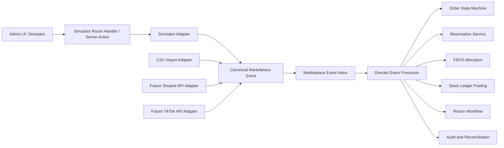
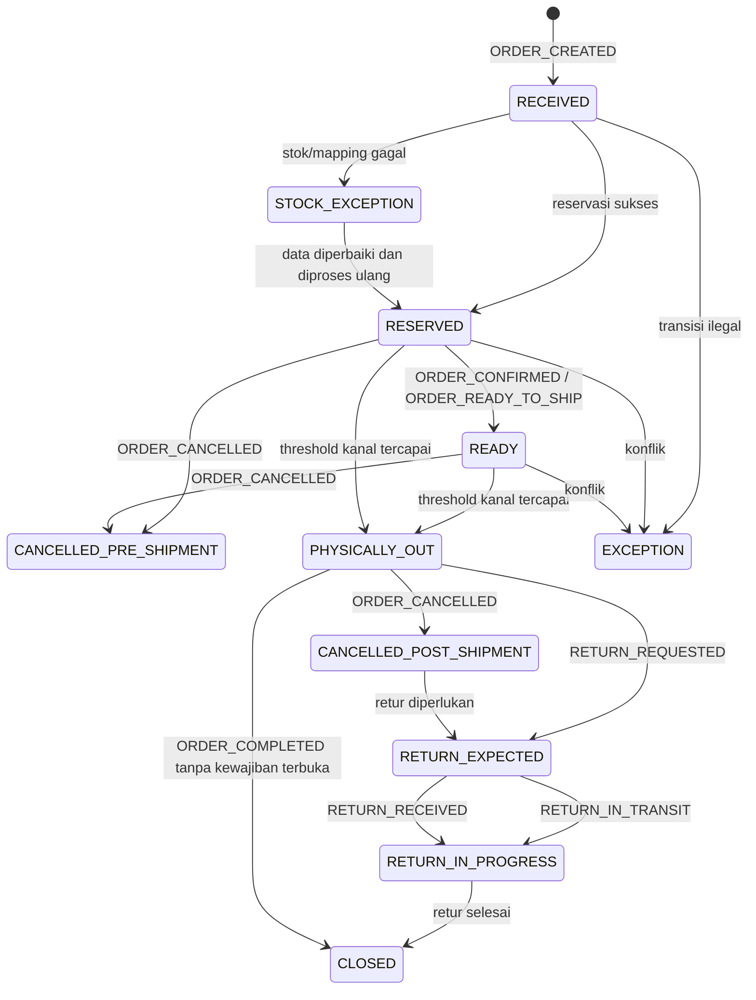
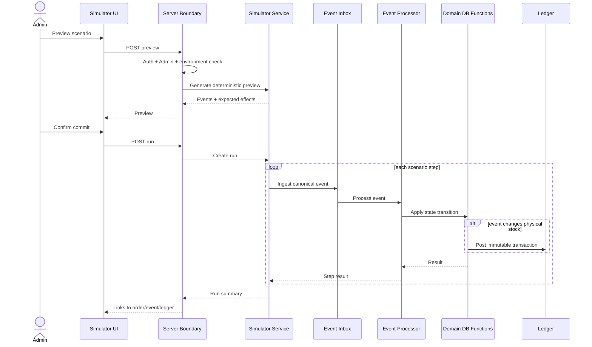
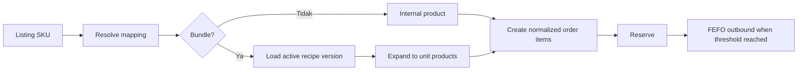

<!--
File: 07-marketplace-simulator.md
Project: Sistem Rekonsiliasi Stok
Status: Approved design baseline for Phase 1
Version: 1.0.0
Last updated: 2026-07-12
Language: id-ID
Timezone: Asia/Jakarta
Role model: ADMIN only
Primary source: stok-management-system.pdf
Depends on:
  - 01-project-brief.md
  - 02-product-requirements.md
  - 03-business-rules.md
  - 04-stock-ledger-design.md
  - 05-database-schema.md
  - 06-user-roles-and-flows.md
-->

# Marketplace Simulator: Sistem Rekonsiliasi Stok

## 1. Tujuan Dokumen

Dokumen ini mendefinisikan desain fungsional dan teknis **Marketplace Simulator** untuk fase 1 Sistem Rekonsiliasi Stok.

Simulator menggantikan integrasi API Shopee dan TikTok Shop selama fase 1. Simulator harus memungkinkan Admin mendemonstrasikan lifecycle pesanan marketplace secara hidup, termasuk:

- pesanan baru;
- reservasi stok;
- pesanan siap diproses;
- barang keluar fisik;
- pembatalan sebelum dan sesudah barang keluar;
- retur dimulai;
- retur diterima;
- hasil inspeksi retur;
- kehilangan dalam pengiriman;
- event duplikat;
- event terlambat atau out-of-order;
- pesanan bundle;
- kegagalan mapping atau stok tidak cukup.

Tujuan simulator bukan menciptakan “jalan pintas demo”. Simulator adalah **input adapter** yang menghasilkan event dengan kontrak yang sama seperti impor CSV dan integrasi API marketplace di masa depan.

> **Prinsip utama:** simulator hanya membuat kejadian. Simulator tidak menentukan hasil stok.

Hasil stok tetap ditentukan oleh:

- state machine pesanan;
- aturan reservasi;
- aturan keluar fisik per kanal;
- FEFO;
- idempotensi;
- aturan retur;
- posting ledger;
- rekonsiliasi;
- constraint dan database function.

---

## 2. Kedudukan Dokumen

Dokumen ini menjadi sumber kebenaran utama untuk:

1. event yang tersedia pada simulator;
2. struktur payload simulator;
3. skenario demo;
4. alur UI simulator;
5. endpoint atau Server Action simulator;
6. pemisahan simulator dari logika domain;
7. pengamanan environment;
8. kebutuhan audit dan observability simulator;
9. acceptance test simulator.

Untuk konflik lintas dokumen:

| Topik | Sumber kebenaran |
|---|---|
| User role | `06-user-roles-and-flows.md` |
| Requirement produk | `02-product-requirements.md` |
| Aturan bisnis | `03-business-rules.md` |
| Ledger dan posting | `04-stock-ledger-design.md` |
| Tabel, view, function, RLS | `05-database-schema.md` |
| Kontrak simulator | Dokumen ini |

Keputusan terbaru yang mengikat:

```text
Aplikasi hanya memiliki satu user role: ADMIN.
```

Karena itu, istilah Operator, Viewer, Approver, atau role aplikasi lain tidak digunakan dalam simulator fase 1.

---

## 3. Latar Belakang Operasional

Source proyek menggambarkan brand skincare Indonesia dengan:

- sekitar 70 produk;
- produksi melalui maklon;
- penjualan melalui Shopee dan TikTok Shop;
- ratusan paket keluar per hari;
- retur yang signifikan;
- pencatatan stok lama berbasis spreadsheet;
- selisih antara catatan dan barang fisik;
- kesulitan menemukan asal selisih.

Screenshot spreadsheet lama menunjukkan rekap harian dengan subkolom seperti:

- `RETUR`;
- `SHOPEE`;
- `MANUAL`;
- `TIKTOK`.

Kebutuhan rekap tersebut tetap relevan. Namun sistem baru tidak boleh mengandalkan pengetikan angka langsung ke sel saldo. Setiap angka harus berasal dari event dan transaksi yang dapat ditelusuri.

Simulator membantu membuktikan alur tersebut tanpa menunggu akses API marketplace yang nyata.

---

## 4. Sasaran Produk

### 4.1 Sasaran Utama

| ID | Sasaran |
|---|---|
| `SIM-GOAL-001` | Menunjukkan lifecycle pesanan Shopee dan TikTok Shop tanpa API eksternal. |
| `SIM-GOAL-002` | Membuktikan reservasi tidak sama dengan stok keluar fisik. |
| `SIM-GOAL-003` | Membuktikan Shopee memicu outbound pada `SHIPPED`. |
| `SIM-GOAL-004` | Membuktikan TikTok Shop memicu outbound pada `IN_TRANSIT`. |
| `SIM-GOAL-005` | Membuktikan pembatalan sebelum outbound hanya melepas reservasi. |
| `SIM-GOAL-006` | Membuktikan pembatalan setelah outbound tidak menambah stok otomatis. |
| `SIM-GOAL-007` | Membuktikan retur baru menambah stok setelah barang diterima dan diproses sesuai kondisi. |
| `SIM-GOAL-008` | Membuktikan event duplikat tidak menghasilkan efek ganda. |
| `SIM-GOAL-009` | Membuktikan event out-of-order ditolak, diabaikan, atau dibuat exception sesuai state machine. |
| `SIM-GOAL-010` | Membuktikan bundle dipecah menjadi produk satuan sebelum reservasi dan outbound. |
| `SIM-GOAL-011` | Menyediakan skenario deterministik untuk demo dan automated test. |
| `SIM-GOAL-012` | Menyediakan jalur yang kelak dapat diganti API sungguhan tanpa mengubah logika stok. |

### 4.2 Indikator Keberhasilan

Simulator dinyatakan berhasil bila:

- seluruh aksi menghasilkan event pada `commerce.marketplace_order_events`;
- simulator tidak menulis langsung ke tabel saldo atau ledger;
- event simulator dan event impor diproses oleh function domain yang sama;
- event duplikat dengan identitas dan payload sama tidak membuat transaksi kedua;
- event dengan identitas sama tetapi payload berbeda ditolak sebagai konflik;
- event yang memicu outbound menghasilkan alokasi FEFO yang dapat ditelusuri;
- hasil skenario yang sama dengan seed yang sama selalu konsisten;
- setiap run menyimpan actor, waktu, scenario code, seed, input, dan ringkasan hasil;
- data simulator dapat dibedakan dari data non-simulator;
- simulator dapat dinonaktifkan melalui konfigurasi environment;
- hanya akun Admin aktif dalam organisasi yang benar yang dapat menjalankannya.

---

## 5. Bukan Tujuan Simulator

Simulator fase 1 tidak bertujuan untuk:

- meniru seluruh UI Seller Center;
- menjamin kesamaan 100% dengan payload API marketplace terkini;
- melakukan autentikasi OAuth ke Shopee atau TikTok Shop;
- memanggil endpoint marketplace nyata;
- melakukan polling atau webhook eksternal;
- menghitung harga, diskon, ongkir, komisi, pendapatan, atau refund uang;
- mengirim label pengiriman;
- mencetak airway bill dari marketplace;
- mengelola chat pembeli;
- meniru SLA logistik;
- menggantikan sistem order management marketplace;
- mengedit ledger;
- mengedit saldo langsung;
- memilih batch secara manual;
- mengembalikan stok otomatis hanya karena status retur dibuat;
- memperbaiki data demo dengan operasi SQL manual.

Nama status eksternal yang digunakan di simulator adalah **kontrak simulasi proyek**. Adapter API masa depan wajib memetakan status aktual marketplace ke event kanonis proyek.

---

## 6. Prinsip Arsitektur

### 6.1 Simulator Adalah Adapter

Arsitektur wajib:



Ketentuan:

- simulator berhenti setelah membuat event kanonis dan menyerahkannya ke inbox/pipeline;
- simulator tidak boleh memanggil fungsi khusus untuk mengubah saldo;
- simulator tidak boleh membuat ledger entry sendiri;
- simulator tidak boleh mengubah order ke status final secara langsung;
- domain processor menentukan apakah event diterima, ditolak, dianggap duplikat, atau menghasilkan efek stok.

### 6.2 Satu Pipeline untuk Semua Sumber

Sumber input:

```text
SIMULATOR
CSV_IMPORT
SHOPEE_API_FUTURE
TIKTOK_API_FUTURE
MANUAL_REPROCESS
```

Semua sumber harus berakhir pada struktur event kanonis yang sama.

Perbedaan sumber hanya berada pada:

- autentikasi input;
- parsing payload;
- normalisasi status;
- cara membentuk `external_event_id`;
- metadata asal;
- waktu penerimaan.

Logika berikut tidak boleh digandakan pada adapter:

- reservasi;
- FEFO;
- stok tersedia;
- posting outbound;
- cancellation;
- retur;
- reversal;
- ledger;
- rekonsiliasi.

---

## 7. Terminologi

| Istilah | Definisi |
|---|---|
| Simulator | Fitur Admin untuk membuat kejadian marketplace buatan. |
| Scenario | Rangkaian satu atau lebih event yang membentuk cerita demo. |
| Step | Satu aksi dalam scenario. |
| Event kanonis | Bentuk event internal yang independen dari format sumber. |
| Source status | Status mentah yang disimulasikan seolah berasal dari marketplace. |
| Canonical status | Status domain internal setelah normalisasi. |
| Event inbox | Penyimpanan immutable event yang diterima sistem. |
| Idempotency key | Identitas command untuk mencegah efek ganda. |
| External event ID | Identitas kejadian dari perspektif sumber. |
| External order ID | Identitas pesanan dari perspektif marketplace. |
| Seed | Nilai yang membuat data scenario deterministik. |
| Dry run | Validasi dan preview tanpa menyuntikkan event. |
| Commit run | Penyuntikan event ke pipeline nyata aplikasi. |
| Reset demo | Penghapusan atau pembentukan ulang tenant demo dengan prosedur terkendali. |
| Out-of-order | Event datang tidak sesuai urutan waktu atau state yang diharapkan. |
| Duplicate event | Event yang dikirim ulang dengan identitas dan payload yang sama. |
| Payload conflict | Identitas event sama, tetapi isi payload berbeda. |
| Physical outbound | Barang benar-benar meninggalkan gudang dan diposting ke ledger. |

---

## 8. User dan Akses

### 8.1 Role

Simulator hanya dapat digunakan oleh:

```text
ADMIN
```

### 8.2 Syarat Akses

Request simulator harus memenuhi semua kondisi berikut:

1. pengguna terautentikasi;
2. profil pengguna berstatus `ACTIVE`;
3. `role_code = 'ADMIN'`;
4. pengguna berada dalam `organization_id` yang sama dengan data target;
5. simulator diaktifkan pada environment;
6. scenario diperbolehkan oleh konfigurasi;
7. request lolos validasi input;
8. action sensitif telah dikonfirmasi.

### 8.3 Environment Policy

Rekomendasi environment:

| Environment | Simulator | Catatan |
|---|:---:|---|
| Local development | Aktif | Default untuk pengembangan. |
| Automated test | Aktif | Melalui fixture atau test helper. |
| Preview deployment | Aktif | Diberi label `DEMO`. |
| Demo/UAT | Aktif | Tenant demo terpisah. |
| Production live | Nonaktif secara default | Hanya dapat diaktifkan eksplisit untuk tenant demo terisolasi. |

Environment variable yang disarankan:

```env
MARKETPLACE_SIMULATOR_ENABLED=true
MARKETPLACE_SIMULATOR_ALLOW_COMMIT=true
MARKETPLACE_SIMULATOR_MAX_EVENTS_PER_RUN=50
MARKETPLACE_SIMULATOR_DEMO_ORG_ID=<uuid>
```

Catatan:

- nilai environment tidak boleh menjadi satu-satunya kontrol;
- server tetap memvalidasi akun dan organisasi;
- service role tidak boleh dikirim ke browser;
- halaman yang disembunyikan bukan bukti endpoint aman. Manusia sudah terlalu sering mengandalkan CSS sebagai sistem keamanan.

---

## 9. Mode Operasi

Simulator memiliki dua mode.

### 9.1 Dry Run

Dry run:

- memvalidasi input;
- menghasilkan event preview;
- menghitung urutan step;
- memeriksa mapping SKU/listing;
- memeriksa keberadaan produk dan bundle recipe;
- menampilkan expected effect;
- tidak menulis event inbox;
- tidak mengubah order;
- tidak membuat reservasi;
- tidak membuat ledger.

Status run:

```text
PREVIEWED
```

### 9.2 Commit Run

Commit run:

- memerlukan konfirmasi Admin;
- membuat record `integration.simulation_runs`;
- menghasilkan event deterministik;
- menulis event ke inbox;
- memproses event melalui domain pipeline;
- menyimpan hasil per step;
- menampilkan link ke event, order, reservation, return, dan ledger;
- mempertahankan idempotensi.

Status run minimum:

```text
PENDING
RUNNING
SUCCEEDED
PARTIALLY_FAILED
FAILED
CANCELLED
```

---

## 10. Event Kanonis

### 10.1 Bentuk Minimum

```ts
type CanonicalMarketplaceEvent = {
  schemaVersion: 1
  source: 'SIMULATOR'
  channel: 'SHOPEE' | 'TIKTOK_SHOP'
  externalEventId: string
  externalOrderId: string
  eventType: MarketplaceEventType
  sourceStatus: string
  occurredAt: string
  receivedAt: string
  organizationId: string
  correlationId: string
  simulationRunId: string
  simulationStepId: string
  idempotencyKey: string
  payloadHash: string
  payload: MarketplaceEventPayload
  metadata: {
    scenarioCode: string
    seed: number
    generatedBy: 'MARKETPLACE_SIMULATOR'
    isDemoData: true
    actorUserId: string
  }
}
```

### 10.2 Event Type

```ts
type MarketplaceEventType =
  | 'ORDER_CREATED'
  | 'ORDER_CONFIRMED'
  | 'ORDER_READY_TO_SHIP'
  | 'ORDER_SHIPPED'
  | 'ORDER_IN_TRANSIT'
  | 'ORDER_COMPLETED'
  | 'ORDER_CANCELLED'
  | 'RETURN_REQUESTED'
  | 'RETURN_IN_TRANSIT'
  | 'RETURN_RECEIVED'
  | 'RETURN_INSPECTED_SELLABLE'
  | 'RETURN_INSPECTED_DAMAGED'
  | 'RETURN_LOST'
  | 'CLAIM_REQUIRED'
  | 'CLAIM_SUBMITTED'
  | 'CLAIM_RESOLVED'
```

Tidak semua event mengubah stok.

### 10.3 Payload Dasar

```ts
type MarketplaceEventPayload = {
  order: {
    externalOrderNo: string
    orderedAt: string
    recipientNameMasked?: string
  }
  items?: Array<{
    externalItemId: string
    listingSku: string
    quantity: number
  }>
  return?: {
    externalReturnId: string
    quantityByItem: Array<{
      externalItemId: string
      quantity: number
    }>
    trackingNoMasked?: string
    claimDeadlineAt?: string
  }
  simulation: {
    scenarioCode: string
    stepCode: string
    seed: number
  }
}
```

### 10.4 Field Wajib

| Field | Wajib | Aturan |
|---|:---:|---|
| `schemaVersion` | Ya | Integer positif. |
| `source` | Ya | Selalu `SIMULATOR`. |
| `channel` | Ya | `SHOPEE` atau `TIKTOK_SHOP`. |
| `externalEventId` | Ya | Unik per organisasi dan kanal. |
| `externalOrderId` | Ya | Stabil sepanjang lifecycle pesanan. |
| `eventType` | Ya | Salah satu tipe yang didukung. |
| `sourceStatus` | Ya | Status mentah simulasi. |
| `occurredAt` | Ya | Waktu kejadian bisnis. |
| `receivedAt` | Ya | Waktu diterima sistem. |
| `organizationId` | Ya | Diambil dari session/server context. |
| `correlationId` | Ya | Sama untuk satu scenario run. |
| `simulationRunId` | Ya | FK run. |
| `simulationStepId` | Ya | Identitas step. |
| `idempotencyKey` | Ya | Deterministik. |
| `payloadHash` | Ya | SHA-256 canonical payload. |
| `payload` | Ya | Data sumber simulasi. |
| `metadata.isDemoData` | Ya | Selalu `true`. |

### 10.5 Canonical JSON

Sebelum hashing:

- key object diurutkan secara deterministik;
- field sementara tidak dimasukkan;
- timestamp dinormalisasi ke ISO 8601 UTC;
- integer tidak dikonversi menjadi string;
- array item diurutkan berdasarkan urutan sumber yang stabil;
- nilai `undefined` tidak diserialisasi;
- `null` hanya dipakai bila secara kontrak bermakna.

Pseudo-code:

```ts
const canonicalPayload = canonicalize(payload)
const payloadHash = sha256(canonicalPayload)
```

---

## 11. Identitas Deterministik

### 11.1 Tujuan

Seed yang sama harus menghasilkan:

- nomor pesanan demo yang sama dalam run identik;
- daftar item yang sama;
- quantity yang sama;
- event IDs yang sama;
- step order yang sama;
- expected outcome yang sama, selama baseline data sama.

### 11.2 Format ID

Format yang direkomendasikan:

```text
external_order_id:
SIM-{CHANNEL}-{SCENARIO_CODE}-{SEED}

external_event_id:
SIM-{CHANNEL}-{SCENARIO_CODE}-{SEED}-{STEP_NO}-{EVENT_TYPE}

idempotency_key:
sim:{organization_id}:{channel}:{scenario_code}:{seed}:{step_no}:{event_type}
```

Contoh:

```text
SIM-SHOPEE-HAPPY_PATH-260712
SIM-SHOPEE-HAPPY_PATH-260712-03-ORDER_SHIPPED
sim:4f...:SHOPEE:HAPPY_PATH:260712:03:ORDER_SHIPPED
```

### 11.3 Payload Conflict

Jika `external_event_id` atau `idempotency_key` sama:

| Kondisi | Hasil |
|---|---|
| Hash payload sama | `DUPLICATE`; kembalikan hasil lama; tidak ada efek baru. |
| Hash payload berbeda | `REJECTED`; kode `IDEMPOTENCY_PAYLOAD_MISMATCH`. |

---

## 12. Status Kanonis Pesanan

Status domain tingkat tinggi:

```text
RECEIVED
RESERVED
STOCK_EXCEPTION
READY
PHYSICALLY_OUT
CANCELLED_PRE_SHIPMENT
CANCELLED_POST_SHIPMENT
RETURN_EXPECTED
RETURN_IN_PROGRESS
CLOSED
EXCEPTION
```

State machine:



Catatan:

- status pada `05-database-schema.md` dapat disimpan lebih ringkas;
- mapping ke status konseptual wajib dipertahankan;
- status sumber asli tetap disimpan untuk audit.

---

## 13. Threshold Keluar Fisik per Kanal

Keputusan klien yang mengikat:

| Kanal | Source status/event pemicu | Efek |
|---|---|---|
| Shopee | `SHIPPED` / `ORDER_SHIPPED` | Posting outbound FEFO, konsumsi reservasi, status domain `PHYSICALLY_OUT`. |
| TikTok Shop | `IN_TRANSIT` / `ORDER_IN_TRANSIT` | Posting outbound FEFO, konsumsi reservasi, status domain `PHYSICALLY_OUT`. |

Sebelum threshold:

- pesanan hanya mengikat reservasi;
- `ON_HAND` tidak berubah;
- `AVAILABLE` berkurang;
- tidak ada `MARKETPLACE_OUTBOUND` pada ledger.

Saat threshold tercapai:

- batch dipilih otomatis dengan FEFO;
- reservasi dikonsumsi;
- ledger outbound diposting;
- `ON_HAND` dan `SELLABLE` berkurang;
- order menjadi `PHYSICALLY_OUT`;
- hasil dapat di-drill down ke batch.

---

## 14. Mapping Event Shopee

Mapping simulator fase 1:

| Step | `eventType` | `sourceStatus` | Efek domain |
|---|---|---|---|
| Pesanan baru | `ORDER_CREATED` | `READY_TO_SHIP` atau status preset awal | Buat order, ekspansi bundle, coba reservasi. |
| Dikonfirmasi | `ORDER_CONFIRMED` | `READY_TO_SHIP` | Perbarui histori; tidak mengurangi stok fisik. |
| Siap dikirim | `ORDER_READY_TO_SHIP` | `READY_TO_SHIP` | Status `READY`; reservasi tetap aktif. |
| Dikirim | `ORDER_SHIPPED` | `SHIPPED` | Posting outbound FEFO. |
| Selesai | `ORDER_COMPLETED` | `COMPLETED` | Tutup bila tidak ada obligation. |
| Batal | `ORDER_CANCELLED` | `CANCELLED` | Pra-shipment: lepas reservasi. Pasca-shipment: jangan tambah stok. |
| Retur diminta | `RETURN_REQUESTED` | `TO_RETURN` | Buat retur expected; tidak menambah stok. |
| Retur dikirim | `RETURN_IN_TRANSIT` | `RETURN_IN_TRANSIT` | Update retur; tidak menambah stok. |
| Retur diterima | `RETURN_RECEIVED` | `RETURN_RECEIVED` | Penerimaan fisik ke `QUARANTINE`. |
| Retur layak jual | `RETURN_INSPECTED_SELLABLE` | `INSPECTED_SELLABLE` | Transfer `QUARANTINE` ke `SELLABLE`. |
| Retur rusak | `RETURN_INSPECTED_DAMAGED` | `INSPECTED_DAMAGED` | Transfer `QUARANTINE` ke `DAMAGED`. |
| Retur hilang | `RETURN_LOST` | `LOST` | Tidak menambah stok; buat exception/claim bila relevan. |

Catatan implementasi:

- simulator tidak wajib meniru seluruh daftar status Shopee;
- raw status yang dipakai harus tetap tersimpan;
- adapter API masa depan harus memetakan status resmi yang diterima ke event kanonis di atas;
- pembatalan yang datang setelah `SHIPPED` tidak boleh menjadi “undo shipment”.

---

## 15. Mapping Event TikTok Shop

Mapping simulator fase 1:

| Step | `eventType` | `sourceStatus` | Efek domain |
|---|---|---|---|
| Pesanan baru | `ORDER_CREATED` | `UNPAID`/`AWAITING_SHIPMENT` sesuai preset | Buat order, ekspansi bundle, coba reservasi. |
| Dikonfirmasi | `ORDER_CONFIRMED` | `AWAITING_SHIPMENT` | Histori; tidak mengurangi stok fisik. |
| Siap dikirim | `ORDER_READY_TO_SHIP` | `AWAITING_COLLECTION` | Status `READY`; reservasi tetap. |
| Dalam perjalanan | `ORDER_IN_TRANSIT` | `IN_TRANSIT` | Posting outbound FEFO. |
| Selesai | `ORDER_COMPLETED` | `COMPLETED` | Tutup bila obligation selesai. |
| Batal | `ORDER_CANCELLED` | `CANCELLED` | Pra-outbound: lepas reservasi. Pasca-outbound: jangan tambah stok. |
| Retur diminta | `RETURN_REQUESTED` | `RETURN_REQUESTED` | Buat retur expected. |
| Retur berjalan | `RETURN_IN_TRANSIT` | `RETURN_IN_TRANSIT` | Update proses retur. |
| Retur diterima | `RETURN_RECEIVED` | `RETURN_RECEIVED` | Penerimaan ke `QUARANTINE`. |
| Retur layak jual | `RETURN_INSPECTED_SELLABLE` | `INSPECTED_SELLABLE` | Transfer ke `SELLABLE`. |
| Retur rusak | `RETURN_INSPECTED_DAMAGED` | `INSPECTED_DAMAGED` | Transfer ke `DAMAGED`. |
| Hilang | `RETURN_LOST` | `LOST` | Tidak menambah stok; claim workflow. |
| Klaim diperlukan | `CLAIM_REQUIRED` | `CLAIM_REQUIRED` | Buat reminder deadline. |
| Klaim diajukan | `CLAIM_SUBMITTED` | `CLAIM_SUBMITTED` | Update claim; tidak mengubah stok. |
| Klaim selesai | `CLAIM_RESOLVED` | `CLAIM_RESOLVED` | Tutup claim sesuai hasil; tidak menambah stok tanpa movement fisik sah. |

Batas 40 hari yang disebut source proyek harus dikelola sebagai aturan konfigurasi klaim TikTok Shop, bukan hard-code tersembunyi pada tombol UI.

Contoh:

```text
claim_deadline_at = return_or_loss_reference_at + configured_claim_window_days
```

Default proyek:

```text
configured_claim_window_days = 40
```

---

## 16. Katalog Aksi Simulator

### 16.1 Aksi Tunggal

| Kode | Label UI | Kanal | Event |
|---|---|---|---|
| `SIM-ACT-001` | Buat pesanan Shopee | Shopee | `ORDER_CREATED` |
| `SIM-ACT-002` | Konfirmasi pesanan Shopee | Shopee | `ORDER_CONFIRMED` |
| `SIM-ACT-003` | Tandai Shopee siap dikirim | Shopee | `ORDER_READY_TO_SHIP` |
| `SIM-ACT-004` | Tandai Shopee SHIPPED | Shopee | `ORDER_SHIPPED` |
| `SIM-ACT-005` | Batalkan pesanan Shopee | Shopee | `ORDER_CANCELLED` |
| `SIM-ACT-006` | Mulai retur Shopee | Shopee | `RETURN_REQUESTED` |
| `SIM-ACT-007` | Tandai retur Shopee dikirim | Shopee | `RETURN_IN_TRANSIT` |
| `SIM-ACT-008` | Terima retur Shopee | Shopee | `RETURN_RECEIVED` |
| `SIM-ACT-009` | Nilai retur Shopee layak jual | Shopee | `RETURN_INSPECTED_SELLABLE` |
| `SIM-ACT-010` | Nilai retur Shopee rusak | Shopee | `RETURN_INSPECTED_DAMAGED` |
| `SIM-ACT-011` | Tandai retur Shopee hilang | Shopee | `RETURN_LOST` |
| `SIM-ACT-012` | Buat pesanan TikTok | TikTok Shop | `ORDER_CREATED` |
| `SIM-ACT-013` | Konfirmasi pesanan TikTok | TikTok Shop | `ORDER_CONFIRMED` |
| `SIM-ACT-014` | Tandai TikTok siap dikirim | TikTok Shop | `ORDER_READY_TO_SHIP` |
| `SIM-ACT-015` | Tandai TikTok IN_TRANSIT | TikTok Shop | `ORDER_IN_TRANSIT` |
| `SIM-ACT-016` | Batalkan pesanan TikTok | TikTok Shop | `ORDER_CANCELLED` |
| `SIM-ACT-017` | Mulai retur TikTok | TikTok Shop | `RETURN_REQUESTED` |
| `SIM-ACT-018` | Tandai retur TikTok dikirim | TikTok Shop | `RETURN_IN_TRANSIT` |
| `SIM-ACT-019` | Terima retur TikTok | TikTok Shop | `RETURN_RECEIVED` |
| `SIM-ACT-020` | Nilai retur TikTok layak jual | TikTok Shop | `RETURN_INSPECTED_SELLABLE` |
| `SIM-ACT-021` | Nilai retur TikTok rusak | TikTok Shop | `RETURN_INSPECTED_DAMAGED` |
| `SIM-ACT-022` | Tandai retur TikTok hilang | TikTok Shop | `RETURN_LOST` |
| `SIM-ACT-023` | Tandai klaim TikTok diperlukan | TikTok Shop | `CLAIM_REQUIRED` |
| `SIM-ACT-024` | Ajukan klaim TikTok | TikTok Shop | `CLAIM_SUBMITTED` |
| `SIM-ACT-025` | Selesaikan klaim TikTok | TikTok Shop | `CLAIM_RESOLVED` |
| `SIM-ACT-026` | Kirim ulang event yang sama | Keduanya | Duplicate existing event |
| `SIM-ACT-027` | Kirim event out-of-order | Keduanya | Selected event |
| `SIM-ACT-028` | Kirim event dengan payload konflik | Keduanya | Same ID, different hash |

### 16.2 Guardrail Aksi Tunggal

- Admin memilih order yang sudah ada atau membuat order demo baru.
- Aksi yang tidak valid tetap boleh dikirim hanya melalui mode “uji transisi ilegal”.
- UI harus menjelaskan bahwa event dapat ditolak.
- Tombol tidak boleh mengubah state lokal seolah sukses sebelum server memberi hasil.
- Double-click harus dinonaktifkan saat request berjalan.
- Retry memakai idempotency key yang sama.
- Aksi event konflik harus diberi label bahaya dan tidak tersedia sebagai default happy path.

---

## 17. Preset Scenario

## 17.1 `SHOPEE_HAPPY_PATH`

Tujuan:

Membuktikan bahwa order baru membuat reservasi dan `SHIPPED` memicu outbound FEFO.

Step:

1. `ORDER_CREATED`;
2. `ORDER_CONFIRMED`;
3. `ORDER_READY_TO_SHIP`;
4. `ORDER_SHIPPED`;
5. `ORDER_COMPLETED`.

Expected effect:

- reservasi dibuat pada step 1;
- physical stock tidak berubah pada step 1–3;
- outbound ledger dibuat pada step 4;
- reservasi dikonsumsi pada step 4;
- FEFO allocation dapat dilihat;
- order dapat ditutup pada step 5.

## 17.2 `TIKTOK_HAPPY_PATH`

Step:

1. `ORDER_CREATED`;
2. `ORDER_CONFIRMED`;
3. `ORDER_READY_TO_SHIP`;
4. `ORDER_IN_TRANSIT`;
5. `ORDER_COMPLETED`.

Expected effect:

- physical outbound terjadi pada `IN_TRANSIT`, bukan menunggu status lain;
- tidak ada outbound kedua saat `ORDER_COMPLETED`.

## 17.3 `CANCEL_BEFORE_SHIPMENT`

Parameter:

```text
channel = SHOPEE | TIKTOK_SHOP
```

Step:

1. `ORDER_CREATED`;
2. `ORDER_READY_TO_SHIP`;
3. `ORDER_CANCELLED`.

Expected effect:

- reservasi dibuat;
- reservasi dilepas;
- tidak ada ledger outbound;
- physical stock tetap;
- order menjadi `CANCELLED_PRE_SHIPMENT`.

## 17.4 `CANCEL_AFTER_SHIPMENT`

Shopee:

1. `ORDER_CREATED`;
2. `ORDER_SHIPPED`;
3. `ORDER_CANCELLED`.

TikTok:

1. `ORDER_CREATED`;
2. `ORDER_IN_TRANSIT`;
3. `ORDER_CANCELLED`.

Expected effect:

- outbound tetap ada;
- sistem tidak menambah stok;
- order menjadi `CANCELLED_POST_SHIPMENT`;
- return/exception dibuat sesuai aturan;
- Admin dapat melanjutkan retur.

## 17.5 `RETURN_SELLABLE`

Step:

1. order happy path sampai physical outbound;
2. `RETURN_REQUESTED`;
3. `RETURN_IN_TRANSIT`;
4. `RETURN_RECEIVED`;
5. `RETURN_INSPECTED_SELLABLE`.

Expected effect:

- step 2–3 tidak menambah stok;
- step 4 menambah `QUARANTINE`;
- step 5 memindahkan quantity dari `QUARANTINE` ke `SELLABLE`;
- histori movement lengkap.

## 17.6 `RETURN_DAMAGED`

Expected effect:

- barang diterima ke `QUARANTINE`;
- hasil inspeksi memindahkan ke `DAMAGED`;
- barang tidak kembali menjadi available.

## 17.7 `RETURN_LOST`

Expected effect:

- tidak ada physical inbound;
- tidak ada tambahan `SELLABLE`;
- return/claim issue terbentuk;
- untuk TikTok, deadline klaim dapat dibuat.

## 17.8 `DUPLICATE_EVENT`

Step:

1. buat event valid;
2. kirim event identik kembali.

Expected effect:

- event kedua ditandai `DUPLICATE` atau hasil idempoten setara;
- tidak ada reservasi kedua;
- tidak ada ledger kedua;
- response mengacu pada hasil pertama.

## 17.9 `IDEMPOTENCY_PAYLOAD_CONFLICT`

Step:

1. kirim event valid;
2. kirim event dengan `external_event_id` dan idempotency key sama tetapi quantity berbeda.

Expected effect:

- event kedua ditolak;
- error `IDEMPOTENCY_PAYLOAD_MISMATCH`;
- tidak ada perubahan domain kedua;
- konflik tercatat untuk audit.

## 17.10 `OUT_OF_ORDER_SHIPMENT`

Step:

1. kirim `ORDER_SHIPPED` atau `ORDER_IN_TRANSIT` sebelum `ORDER_CREATED`;
2. kirim `ORDER_CREATED`.

Expected effect default:

- event awal disimpan;
- event awal berstatus `REJECTED`, `FAILED`, atau `IGNORED` sesuai implementation policy;
- issue `ILLEGAL_OUT_OF_ORDER_EVENT` dibuat;
- event kedua dapat membuat order;
- sistem tidak boleh diam-diam mengarang reservasi hanya agar demo tampak mulus.

## 17.11 `OUT_OF_ORDER_CANCEL`

Step:

1. order mencapai `PHYSICALLY_OUT`;
2. event status pra-pengiriman datang terlambat;
3. event cancel datang.

Expected effect:

- status tidak mundur ke pra-shipment;
- outbound tidak dibalik;
- cancel diproses sebagai post-shipment;
- exception/return workflow dibuat.

## 17.12 `INSUFFICIENT_STOCK`

Step:

1. buat order dengan quantity lebih besar dari available.

Expected effect:

- order tersimpan;
- reservasi gagal utuh;
- status `STOCK_EXCEPTION`;
- tidak ada reservasi parsial;
- tidak ada ledger;
- error menjelaskan SKU dan kekurangan quantity.

## 17.13 `MULTI_BATCH_FEFO`

Prasyarat:

- satu produk memiliki minimal dua batch sellable;
- batch A kedaluwarsa lebih cepat daripada batch B;
- quantity order melebihi saldo batch A tetapi tidak melebihi total.

Expected effect:

- alokasi menghabiskan batch A terlebih dahulu;
- sisa dialokasikan ke batch B;
- operator tidak memilih batch;
- ledger memiliki entry per batch.

## 17.14 `EXPIRED_BATCH_SKIPPED`

Expected effect:

- batch kedaluwarsa tidak dialokasikan;
- FEFO memakai batch eligible berikutnya;
- bila stok eligible tidak cukup, order menjadi `STOCK_EXCEPTION`.

## 17.15 `BUNDLE_ORDER`

Prasyarat:

Listing bundle:

```text
BUNDLE-GLOW-01
```

Recipe:

```text
2 x PRODUCT-A
1 x PRODUCT-B
```

Order:

```text
2 x BUNDLE-GLOW-01
```

Expected normalized requirement:

```text
4 x PRODUCT-A
2 x PRODUCT-B
```

Expected effect:

- tidak ada entitas stok bundle;
- reservasi dibuat pada produk satuan;
- snapshot recipe disimpan;
- outbound FEFO terjadi per produk/batch.

## 17.16 `BUNDLE_MAPPING_MISSING`

Expected effect:

- order masuk `STOCK_EXCEPTION` atau `EXCEPTION`;
- tidak ada reservasi;
- tidak ada ledger;
- event tetap tersimpan;
- Admin mendapat link ke konfigurasi mapping.

## 17.17 `TIKTOK_CLAIM_DEADLINE`

Step:

1. order physical outbound;
2. return/loss dibuat;
3. `CLAIM_REQUIRED`;
4. clock scenario diletakkan mendekati deadline.

Expected effect:

- claim record dibuat;
- reminder menampilkan sisa waktu;
- deadline dihitung dari konfigurasi;
- notifikasi tidak mengubah stok.

## 17.18 `RETURN_QUANTITY_EXCEEDS_OUTBOUND`

Expected effect:

- event ditolak;
- error `RETURN_QTY_EXCEEDS_OUTBOUND`;
- tidak ada inbound;
- issue dibuat.

## 17.19 `PARTIAL_SCENARIO_FAILURE`

Step:

1. event pertama valid;
2. event kedua invalid;
3. event ketiga bergantung pada event kedua.

Expected effect:

- setiap event memiliki hasil sendiri;
- run berstatus `PARTIALLY_FAILED`;
- event yang sudah diproses tidak dihapus;
- step bergantung dapat ditandai `SKIPPED_DEPENDENCY_FAILED`;
- tidak ada rollback lintas event yang sudah menjadi kejadian bisnis terpisah.

## 17.20 `DAILY_RECONCILIATION_AFTER_SIMULATION`

Step:

1. jalankan scenario kompleks;
2. jalankan rekonsiliasi harian.

Expected effect:

- ledger balance sama dengan projection;
- tidak ada reservasi yatim;
- tidak ada order physical outbound tanpa ledger;
- tidak ada duplicate effect;
- issue yang disengaja tetap muncul.

---

## 18. Scenario Definition Format

Scenario disimpan sebagai konfigurasi versioned.

```ts
type SimulatorScenarioDefinition = {
  code: string
  version: number
  name: string
  description: string
  channel: 'SHOPEE' | 'TIKTOK_SHOP' | 'PARAMETERIZED'
  category:
    | 'HAPPY_PATH'
    | 'CANCELLATION'
    | 'RETURN'
    | 'IDEMPOTENCY'
    | 'STATE_MACHINE'
    | 'FEFO'
    | 'BUNDLE'
    | 'CLAIM'
    | 'RECONCILIATION'
  requiresConfirmation: boolean
  allowedEnvironments: Array<'development' | 'test' | 'preview' | 'demo'>
  prerequisites: ScenarioPrerequisite[]
  steps: SimulatorScenarioStep[]
  expectedAssertions: ScenarioAssertion[]
}
```

Step:

```ts
type SimulatorScenarioStep = {
  stepNo: number
  stepCode: string
  label: string
  eventType: MarketplaceEventType
  sourceStatus: string
  occurredAtOffsetSeconds: number
  dependsOnStepCodes?: string[]
  payloadTemplate: Record<string, unknown>
  duplicateOfStepCode?: string
  reuseEventIdFromStepCode?: string
  mutateFields?: Record<string, unknown>
  expectedProcessingStatus:
    | 'PROCESSED'
    | 'DUPLICATE'
    | 'REJECTED'
    | 'FAILED'
    | 'IGNORED'
}
```

Scenario definition harus berada di source control, bukan hanya row yang diedit diam-diam di dashboard.

---

## 19. Parameter Scenario

Parameter minimum:

| Parameter | Tipe | Wajib | Aturan |
|---|---|:---:|---|
| `scenarioCode` | string | Ya | Preset aktif. |
| `seed` | integer | Ya | Positif dan dalam range aman. |
| `channel` | enum | Tergantung scenario | Shopee/TikTok. |
| `productSelectionMode` | enum | Ya | `FIXED`, `RANDOM_FROM_ELIGIBLE`, `MANUAL`. |
| `productIds` | uuid[] | Tergantung mode | Organisasi sama. |
| `listingSku` | string | Bila bundle | Harus dapat di-resolve. |
| `quantity` | integer | Ya | Lebih dari nol. |
| `occurredAtBase` | timestamp | Ya | Default waktu saat ini atau waktu demo. |
| `autoProcess` | boolean | Ya | Default true. |
| `stepDelayMs` | integer | Tidak | Hanya UX/demo, tidak menentukan waktu bisnis. |
| `note` | string | Tidak | Audit. |

Batas:

```text
1 <= quantity <= configured_max_quantity
1 <= number_of_items <= configured_max_items
1 <= event_count <= MARKETPLACE_SIMULATOR_MAX_EVENTS_PER_RUN
```

---

## 20. Pemilihan Produk dan Data Demo

### 20.1 Mode Fixed

Scenario menyebut SKU/listing tertentu.

Kelebihan:

- hasil paling deterministik;
- cocok untuk golden demo;
- mudah dibandingkan.

Kekurangan:

- gagal bila fixture belum disiapkan.

### 20.2 Random from Eligible

Random wajib memakai seeded PRNG.

Eligible product:

- aktif;
- memiliki listing mapping aktif;
- memiliki stok sellable bila scenario membutuhkan sukses;
- memiliki batch eligible;
- tidak kedaluwarsa;
- tidak diblokir.

### 20.3 Manual

Admin memilih produk/listing dari UI.

UI menampilkan:

- SKU;
- nama produk;
- available;
- reserved;
- sellable;
- batch eligible;
- expiry terdekat;
- status bundle mapping.

### 20.4 Data Privacy

Data simulator tidak boleh memakai identitas pembeli nyata.

Gunakan data sintetis:

```text
recipient_name_masked = "Demo User **"
tracking_no_masked = "SIM-TRACK-****"
```

Jangan memasukkan:

- nomor telepon nyata;
- alamat nyata;
- email pelanggan;
- nama lengkap pembeli;
- token API;
- credential marketplace.

---

## 21. UI Simulator

## 21.1 Route

Rekomendasi:

```text
/admin/simulator
```

Karena hanya ada role Admin, tidak perlu route per role.

### 21.2 Struktur Halaman

```text
Marketplace Simulator
├── Environment Banner
├── Mode Selector
│   ├── Preset Scenario
│   └── Single Event
├── Scenario/Action Form
├── Product and Order Inputs
├── Generated Payload Preview
├── Expected Effect Preview
├── Confirmation
├── Run Progress
├── Result Summary
└── Drill-down Links
```

### 21.3 Environment Banner

Wajib terlihat tanpa scroll:

```text
DEMO MODE
Event yang dibuat akan diproses oleh pipeline stok yang sama seperti integrasi marketplace.
```

Pada production bila nonaktif:

```text
Simulator dinonaktifkan pada environment ini.
```

### 21.4 Preset Scenario Card

Setiap card menampilkan:

- nama scenario;
- kanal;
- tujuan;
- jumlah step;
- perubahan stok yang diharapkan;
- apakah sengaja menghasilkan error;
- prerequisite;
- tingkat risiko;
- tombol `Preview`.

Kategori visual:

```text
Normal
Edge Case
Failure Test
Reconciliation Test
```

Jangan memakai warna sukses untuk scenario yang sengaja merusak urutan event. Estetika bukan alasan untuk berbohong.

### 21.5 Single Event Form

Field:

- channel;
- event type;
- existing/new order;
- external order ID;
- source status;
- occurred at;
- item list;
- quantity;
- return data bila relevan;
- seed;
- event ID mode;
- idempotency key preview.

### 21.6 Preview Panel

Menampilkan:

1. event JSON;
2. payload hash;
3. idempotency key;
4. source status;
5. canonical event;
6. expected state transition;
7. expected stock effect;
8. expected ledger transaction type;
9. warning;
10. prerequisite result.

### 21.7 Confirmation Dialog

Teks minimum:

```text
Jalankan scenario "{scenarioName}"?

Scenario ini akan membuat {eventCount} event demo dan memprosesnya melalui pipeline marketplace yang sama dengan data impor.

Dampak yang diperkirakan:
- Reservasi: {reservationEffect}
- Stok fisik: {physicalEffect}
- Ledger: {ledgerEffect}
- Retur/klaim: {returnEffect}

Data diberi label DEMO dan tindakan dicatat atas akun Anda.
```

Untuk scenario destructive/error:

```text
Scenario ini sengaja menghasilkan event ilegal atau konflik idempotensi.
```

### 21.8 Progress

Setiap step menampilkan:

```text
PENDING
GENERATING
RECEIVED
PROCESSING
PROCESSED
DUPLICATE
REJECTED
FAILED
SKIPPED
```

### 21.9 Result Summary

Ringkasan minimum:

- run ID;
- scenario;
- seed;
- actor;
- waktu mulai/selesai;
- total event;
- processed;
- duplicate;
- rejected;
- failed;
- order ID;
- reservation effect;
- stock transaction ID;
- ledger sequence range;
- return/claim ID;
- reconciliation issues.

### 21.10 Drill-down

Link:

- `Lihat Event`;
- `Lihat Pesanan`;
- `Lihat Reservasi`;
- `Lihat Alokasi FEFO`;
- `Lihat Ledger`;
- `Lihat Retur`;
- `Lihat Klaim`;
- `Lihat Audit`;
- `Jalankan Rekonsiliasi`.

---

## 22. Mobile UX

Source screenshot menunjukkan operasional mungkin dilakukan dari ponsel. Simulator harus tetap dapat dipakai pada viewport kecil.

Ketentuan:

- form satu kolom;
- table event berubah menjadi card list;
- JSON preview dapat di-collapse;
- tombol commit sticky di bawah hanya setelah preview valid;
- warning tidak hanya dibedakan melalui warna;
- touch target memadai;
- tidak ada horizontal scrolling untuk flow utama;
- detail payload boleh memakai code block horizontal;
- status step menggunakan label teks;
- tombol destructive dipisahkan dari tombol happy path;
- dialog konfirmasi dapat discroll;
- hasil menyediakan shortcut ke order dan ledger.

---

## 23. API dan Server Boundary

### 23.1 Rekomendasi Route Handler

```text
POST /api/admin/simulator/preview
POST /api/admin/simulator/runs
GET  /api/admin/simulator/runs/:runId
POST /api/admin/simulator/runs/:runId/execute-next
POST /api/admin/simulator/events/:eventId/retry
```

Alternatif Server Actions diperbolehkan selama:

- auth dan authorization diverifikasi di dalam action;
- input divalidasi;
- logic domain berada pada server-only layer;
- browser tidak memegang service role;
- response hanya mengandung DTO aman.

### 23.2 Preview Request

```json
{
  "scenarioCode": "SHOPEE_HAPPY_PATH",
  "scenarioVersion": 1,
  "seed": 260712,
  "parameters": {
    "productSelectionMode": "MANUAL",
    "productIds": ["00000000-0000-0000-0000-000000000001"],
    "quantity": 3,
    "occurredAtBase": "2026-07-12T10:00:00+07:00"
  }
}
```

### 23.3 Preview Response

```json
{
  "success": true,
  "previewId": "uuid",
  "expiresAt": "2026-07-12T10:15:00+07:00",
  "scenario": {
    "code": "SHOPEE_HAPPY_PATH",
    "version": 1,
    "seed": 260712
  },
  "prerequisites": [
    {
      "code": "PRODUCT_ACTIVE",
      "passed": true
    },
    {
      "code": "SUFFICIENT_AVAILABLE_STOCK",
      "passed": true
    }
  ],
  "events": [],
  "expectedEffects": {
    "reservationDelta": 3,
    "sellableDeltaAtFinalStep": -3,
    "ledgerTransactionTypes": ["MARKETPLACE_OUTBOUND"]
  },
  "confirmationToken": "short-lived-signed-token"
}
```

### 23.4 Commit Request

```json
{
  "previewId": "uuid",
  "confirmationToken": "short-lived-signed-token"
}
```

Server tidak menerima `organizationId`, `actorUserId`, atau role dari body sebagai sumber kebenaran. Nilai tersebut berasal dari session dan profil server.

### 23.5 Commit Response

```json
{
  "success": true,
  "runId": "uuid",
  "status": "RUNNING",
  "correlationId": "uuid",
  "scenarioCode": "SHOPEE_HAPPY_PATH",
  "seed": 260712
}
```

### 23.6 Run Detail Response

```json
{
  "runId": "uuid",
  "status": "SUCCEEDED",
  "scenarioCode": "SHOPEE_HAPPY_PATH",
  "scenarioVersion": 1,
  "seed": 260712,
  "createdAt": "2026-07-12T03:00:00Z",
  "completedAt": "2026-07-12T03:00:03Z",
  "steps": [
    {
      "stepNo": 1,
      "eventId": "uuid",
      "externalEventId": "SIM-SHOPEE-HAPPY_PATH-260712-01-ORDER_CREATED",
      "processingStatus": "PROCESSED",
      "resultEntityType": "ORDER",
      "resultEntityId": "uuid"
    }
  ],
  "effects": {
    "orderId": "uuid",
    "reservationIds": ["uuid"],
    "stockTransactionIds": ["uuid"],
    "returnIds": [],
    "claimIds": []
  }
}
```

---

## 24. Service Layer

Rekomendasi pembagian:

```text
src/
├── app/
│   └── api/
│       └── admin/
│           └── simulator/
├── features/
│   └── marketplace-simulator/
│       ├── actions/
│       ├── components/
│       ├── schemas/
│       └── types/
├── server/
│   ├── auth/
│   ├── simulator/
│   │   ├── scenario-catalog.ts
│   │   ├── scenario-generator.ts
│   │   ├── canonical-event-builder.ts
│   │   ├── simulator-repository.ts
│   │   └── simulator-service.ts
│   ├── marketplace-events/
│   │   ├── event-ingestion-service.ts
│   │   ├── event-normalizer.ts
│   │   └── event-processor.ts
│   └── inventory/
│       └── domain-client.ts
└── lib/
    └── validation/
```

Batas tanggung jawab:

| Komponen | Tanggung jawab |
|---|---|
| UI | Mengumpulkan parameter, preview, konfirmasi, menampilkan hasil. |
| Route Handler/Action | Auth, authorization, validation, rate limit, DTO. |
| Simulator Service | Memuat scenario, membuat seed context, membuat event. |
| Event Ingestion | Menulis event inbox secara idempoten. |
| Event Processor | Menjalankan mapping dan state transition. |
| Database Function | Locking, idempotency, reservasi, FEFO, ledger, audit. |

---

## 25. Integrasi dengan Database Schema

### 25.1 `integration.simulation_runs`

Kolom baseline dari `05-database-schema.md`:

- `id`;
- `organization_id`;
- `scenario_code`;
- `seed_value`;
- `requested_payload`;
- `status_code`;
- `created_by`;
- `created_at`;
- `result_summary`.

Penambahan yang direkomendasikan:

```sql
alter table integration.simulation_runs
  add column if not exists scenario_version integer not null default 1,
  add column if not exists correlation_id uuid not null default gen_random_uuid(),
  add column if not exists mode_code text not null default 'COMMIT',
  add column if not exists started_at timestamptz,
  add column if not exists completed_at timestamptz,
  add column if not exists event_count integer not null default 0,
  add column if not exists error_code text,
  add column if not exists error_detail jsonb not null default '{}'::jsonb;
```

Check:

```sql
check (scenario_version > 0),
check (seed_value >= 0),
check (event_count >= 0),
check (mode_code in ('PREVIEW','COMMIT')),
check (status_code in (
  'PREVIEWED',
  'PENDING',
  'RUNNING',
  'SUCCEEDED',
  'PARTIALLY_FAILED',
  'FAILED',
  'CANCELLED'
))
```

### 25.2 `integration.simulation_run_steps`

Tabel tambahan yang direkomendasikan:

```sql
create table integration.simulation_run_steps (
  id uuid primary key default gen_random_uuid(),
  organization_id uuid not null,
  simulation_run_id uuid not null
    references integration.simulation_runs(id),
  step_no integer not null,
  step_code text not null,
  event_type_code text not null,
  external_event_id text not null,
  event_id uuid,
  processing_status_code text not null,
  expected_status_code text,
  result_entity_type text,
  result_entity_id uuid,
  error_code text,
  error_detail jsonb not null default '{}'::jsonb,
  started_at timestamptz,
  completed_at timestamptz,
  created_at timestamptz not null default now(),
  unique (simulation_run_id, step_no),
  unique (organization_id, external_event_id),
  check (step_no > 0)
);
```

### 25.3 Event Inbox

Simulator menulis ke:

```text
commerce.marketplace_order_events
```

Mapping:

| Simulator field | Database column |
|---|---|
| `organizationId` | `organization_id` |
| resolved order | `order_id` |
| channel | `channel_id` |
| `externalEventId` | `external_event_id` |
| `eventType` | `event_type_code` |
| `sourceStatus` | `source_status_code` |
| `occurredAt` | `occurred_at` |
| `receivedAt` | `received_at` |
| `payload` | `payload` |
| `payloadHash` | `payload_hash` |
| processing state | `processing_status_code` |
| error | `error_code`, `error_detail` |

### 25.4 Idempotency

Command ingestion memakai:

```text
inventory.idempotency_commands
```

Scope:

```text
MARKETPLACE_EVENT_INGESTION
MARKETPLACE_EVENT_PROCESSING
SIMULATOR_RUN_COMMIT
```

### 25.5 Audit

Aksi minimum:

```text
SIMULATOR_PREVIEWED
SIMULATOR_RUN_CREATED
SIMULATOR_RUN_STARTED
SIMULATOR_EVENT_GENERATED
SIMULATOR_EVENT_PROCESSED
SIMULATOR_EVENT_DUPLICATE
SIMULATOR_EVENT_REJECTED
SIMULATOR_RUN_COMPLETED
SIMULATOR_RUN_FAILED
SIMULATOR_EVENT_REPROCESSED
```

---

## 26. Database Functions

Function publik yang direkomendasikan:

```text
api.create_simulation_run
api.ingest_marketplace_event
api.process_marketplace_event
api.get_simulation_run_result
api.retry_marketplace_event
```

### 26.1 `api.create_simulation_run`

Tanggung jawab:

- verifikasi Admin aktif;
- verifikasi simulator enabled;
- verifikasi organisasi;
- validasi scenario code/version;
- validasi parameter;
- insert run;
- audit;
- tidak mem-posting stok.

### 26.2 `api.ingest_marketplace_event`

Tanggung jawab:

- verifikasi event source;
- canonical hash;
- insert idempotency command;
- insert event inbox;
- kembalikan duplicate bila sesuai;
- tolak payload conflict;
- tidak langsung mengubah ledger bila processing dipisah.

### 26.3 `api.process_marketplace_event`

Sudah didefinisikan pada dokumen schema sebagai boundary state transition.

Tanggung jawab:

- lock event;
- cek status;
- resolve channel/order/listing;
- normalisasi item;
- state transition;
- reservasi;
- FEFO outbound;
- retur/claim;
- ledger;
- audit;
- update event processing status;
- commit atomik untuk efek satu event.

---

## 27. Urutan Pemrosesan Event



---

## 28. Atomicity

### 28.1 Per Event

Efek satu event harus atomik.

Contoh event `ORDER_SHIPPED`:

- validasi event;
- lock order;
- cek state;
- lock reservation;
- lock posisi produk;
- lock batch FEFO;
- validasi available;
- buat transaction header;
- buat ledger entries;
- update projection;
- konsumsi reservation;
- update order;
- append status history;
- audit;
- tandai event processed.

Semua berhasil atau semua rollback.

### 28.2 Per Scenario

Satu scenario tidak otomatis satu transaksi database besar.

Alasan:

- setiap event mewakili kejadian bisnis terpisah;
- hasil step sebelumnya harus tetap dapat diaudit;
- scenario edge case mungkin sengaja gagal di tengah;
- transaksi panjang meningkatkan risiko lock dan timeout.

Karena itu:

- atomicity berlaku per event;
- run merangkum hasil seluruh step;
- failure satu step tidak menghapus event sukses sebelumnya;
- dependency step dapat di-skip.

---

## 29. Concurrency

Simulator harus tetap mengikuti concurrency nyata.

Contoh dua run bersamaan:

- kedua order memesan SKU yang sama;
- available hanya cukup untuk satu;
- lock dan recheck menentukan satu sukses;
- run lain masuk `STOCK_EXCEPTION`;
- tidak boleh ada stok negatif;
- tidak boleh ada over-reservation.

Ketentuan:

- jangan menonaktifkan lock hanya karena data demo;
- lock order produk dalam urutan deterministik;
- retry konflik hanya untuk error transient;
- retry mempertahankan idempotency key;
- hasil concurrency test harus dapat direproduksi melalui test harness.

---

## 30. FEFO

Simulator tidak menerima `batchId` dari Admin untuk outbound normal.

Input hanya menyebut:

- listing/SKU;
- quantity;
- order.

Domain memilih batch:

1. `SELLABLE`;
2. aktif;
3. tidak diblokir;
4. belum kedaluwarsa;
5. expiry paling dekat;
6. tie-breaker deterministik.

UI boleh menampilkan expected candidate batch saat preview, tetapi hasil final tetap berasal dari transaction setelah lock.

Preview harus diberi disclaimer:

```text
Alokasi batch final ditentukan saat event diproses dan dapat berubah bila stok berubah sebelum commit.
```

---

## 31. Bundle

Simulator menerima listing marketplace.

Pipeline:



Aturan:

- tidak ada stok bundle;
- recipe snapshot disimpan;
- perubahan recipe setelah order tidak mengubah histori;
- missing mapping menghasilkan exception;
- duplicate component dinormalisasi;
- quantity harus integer positif.

---

## 32. Retur

### 32.1 Event Marketplace dan Keputusan Gudang

Marketplace event dapat menyatakan:

- retur diminta;
- retur sedang dikirim;
- retur diterima secara administratif;
- retur hilang.

Namun kondisi fisik tetap ditentukan Admin setelah inspeksi:

```text
SELLABLE
DAMAGED
LOST
```

Simulator harus memisahkan:

1. event retur dari marketplace;
2. penerimaan fisik;
3. keputusan inspeksi.

### 32.2 Dampak Stok

| Tahap | Dampak |
|---|---|
| `RETURN_REQUESTED` | Tidak ada perubahan stok. |
| `RETURN_IN_TRANSIT` | Tidak ada perubahan stok. |
| `RETURN_RECEIVED` | Physical inbound ke `QUARANTINE`. |
| `RETURN_INSPECTED_SELLABLE` | Transfer `QUARANTINE` ke `SELLABLE`. |
| `RETURN_INSPECTED_DAMAGED` | Transfer `QUARANTINE` ke `DAMAGED`. |
| `RETURN_LOST` | Tidak ada inbound; exception/claim. |

### 32.3 Partial Return

Payload harus dapat menyebut quantity per item.

Validasi:

- quantity retur > 0;
- tidak melebihi quantity outbound yang belum diretur;
- item berasal dari order;
- mapping batch menggunakan referensi outbound bila tersedia;
- bila batch asal tidak dapat dipastikan, gunakan aturan quarantine/traceability yang disetujui pada domain.

---

## 33. Klaim TikTok Shop

Simulator menyediakan klaim agar deadline 40 hari dapat didemonstrasikan.

Data minimum:

```ts
type SimulatedClaim = {
  claimReferenceId: string
  returnId: string
  requiredAt: string
  deadlineAt: string
  status:
    | 'REQUIRED'
    | 'SUBMITTED'
    | 'RESOLVED_APPROVED'
    | 'RESOLVED_REJECTED'
    | 'EXPIRED'
}
```

Aturan:

- deadline berasal dari konfigurasi;
- reminder tidak mengubah stok;
- claim approved tidak otomatis menambah stok fisik;
- bila ada kompensasi uang, tetap di luar scope;
- claim result disimpan sebagai evidence operasional;
- expired claim menghasilkan issue/notifikasi.

---

## 34. Event Duplikat

### 34.1 Duplicate Identik

Input:

- `external_event_id` sama;
- idempotency key sama;
- payload hash sama.

Hasil:

```text
processing_status = DUPLICATE
domain_effect_count = 0
```

Response harus mengandung referensi hasil awal.

### 34.2 Duplicate dengan Payload Berbeda

Input:

- event ID/key sama;
- hash berbeda.

Hasil:

```text
processing_status = REJECTED
error_code = IDEMPOTENCY_PAYLOAD_MISMATCH
```

### 34.3 Double Submit UI

UI:

- disable tombol saat pending;
- memakai key yang sama bila request timeout;
- memeriksa status run;
- tidak membuat key baru hanya karena browser tidak menerima response.

---

## 35. Out-of-Order Event

Policy:

1. simpan event;
2. jangan membuang diam-diam;
3. evaluasi state machine;
4. proses bila transisi tetap legal;
5. abaikan secara tercatat bila event stale dan tidak relevan;
6. tolak bila ilegal;
7. buat issue bila perlu;
8. jangan membalik stok secara implisit.

Status pemrosesan:

```text
PROCESSED
IGNORED_STALE
REJECTED_ILLEGAL_TRANSITION
FAILED_TRANSIENT
```

Contoh:

| Event | Current state | Hasil |
|---|---|---|
| `ORDER_CREATED` | Order belum ada | Proses. |
| `ORDER_CREATED` | Order sudah physical out | Ignore/duplicate sesuai ID. |
| `ORDER_READY_TO_SHIP` | `PHYSICALLY_OUT` | Ignore stale; jangan mundur. |
| `ORDER_CANCELLED` | `READY` | Cancel pre-shipment. |
| `ORDER_CANCELLED` | `PHYSICALLY_OUT` | Cancel post-shipment; jangan restock. |
| `RETURN_RECEIVED` | Order belum outbound | Reject dan issue. |
| `ORDER_SHIPPED` | Order belum ada | Reject/hold sesuai policy; default reject + issue. |

---

## 36. Error Codes

| Kode | Makna | Retry |
|---|---|:---:|
| `SIMULATOR_DISABLED` | Simulator nonaktif. | Tidak |
| `SIMULATOR_ACCESS_FORBIDDEN` | User bukan Admin aktif/organisasi salah. | Tidak |
| `SIMULATOR_SCENARIO_NOT_FOUND` | Scenario code/version tidak ada. | Tidak |
| `SIMULATOR_INVALID_SEED` | Seed invalid. | Tidak |
| `SIMULATOR_INVALID_PARAMETER` | Parameter invalid. | Setelah diperbaiki |
| `SIMULATOR_PREREQUISITE_FAILED` | Fixture/master tidak memenuhi syarat. | Setelah diperbaiki |
| `SIMULATOR_EVENT_LIMIT_EXCEEDED` | Event terlalu banyak. | Dengan scope lebih kecil |
| `SIMULATOR_PREVIEW_EXPIRED` | Token preview habis. | Preview ulang |
| `SIMULATOR_CONFIRMATION_INVALID` | Konfirmasi invalid. | Tidak |
| `SIMULATOR_EVENT_NOT_CANONICAL` | Builder menghasilkan event invalid. | Setelah bug diperbaiki |
| `DUPLICATE_EVENT` | Event sudah diterima. | Idempoten |
| `IDEMPOTENCY_PAYLOAD_MISMATCH` | Key sama, payload beda. | Tidak |
| `ILLEGAL_OUT_OF_ORDER_EVENT` | Transisi ilegal. | Setelah investigasi |
| `ORDER_NOT_FOUND` | Order tidak ditemukan. | Tergantung event |
| `LISTING_MAPPING_MISSING` | Listing belum dipetakan. | Setelah mapping |
| `BUNDLE_MAPPING_MISSING` | Recipe tidak tersedia. | Setelah mapping |
| `INSUFFICIENT_AVAILABLE_STOCK` | Stok tersedia kurang. | Setelah stok berubah |
| `NO_ELIGIBLE_FEFO_BATCH` | Tidak ada batch eligible. | Setelah data/stok berubah |
| `RETURN_QTY_EXCEEDS_OUTBOUND` | Quantity retur berlebihan. | Setelah input diperbaiki |
| `RETURN_BEFORE_OUTBOUND` | Retur tidak punya outbound valid. | Tidak |
| `EVENT_PROCESSING_LOCK_TIMEOUT` | Konflik lock sementara. | Ya, idempoten |
| `EVENT_PROCESSING_FAILED` | Error domain/teknis. | Berdasarkan klasifikasi |
| `SIMULATOR_RUN_PARTIAL_FAILURE` | Sebagian step gagal. | Per step |
| `SIMULATOR_NONDETERMINISTIC_RESULT` | Hasil seed menyimpang dari fixture. | Investigasi |

Pesan UI harus menjelaskan tindakan perbaikan, bukan menampilkan stack trace.

---

## 37. Audit Trail

Setiap run menyimpan:

- actor user ID;
- snapshot display name;
- role snapshot `ADMIN`;
- organization;
- environment;
- scenario code/version;
- seed;
- mode;
- parameter;
- preview hash;
- confirmation timestamp;
- correlation ID;
- waktu mulai/selesai;
- event IDs;
- processing results;
- entity IDs hasil;
- error;
- IP/request metadata yang aman sesuai policy;
- user agent bila diperlukan;
- catatan Admin.

Setiap event menyimpan:

- payload asli simulasi;
- hash;
- source status;
- canonical type;
- occurred/received time;
- processing status;
- result reference.

Audit tidak boleh dapat diedit dari UI.

---

## 38. Data Demo Isolation

Data simulator harus diberi penanda:

```json
{
  "generatedBy": "MARKETPLACE_SIMULATOR",
  "isDemoData": true,
  "simulationRunId": "uuid"
}
```

Strategi yang direkomendasikan:

1. tenant/organization demo terpisah;
2. environment preview/demo;
3. badge `DEMO`;
4. filter default untuk menyembunyikan data demo dari view produksi;
5. audit tetap dipertahankan;
6. reset hanya melalui prosedur resmi.

Dilarang:

- menjalankan reset berdasarkan prefix string saja;
- menghapus ledger production;
- membuat script `delete where note like '%demo%'`;
- memakai satu database production tanpa isolasi organisasi dan berharap semua orang berhati-hati.

---

## 39. Reset Demo

Reset demo bukan pengeditan ledger.

Pilihan aman:

### 39.1 Recreate Demo Organization

- hapus tenant demo secara terkontrol pada environment non-production;
- buat ulang fixture;
- jalankan migration/seed;
- paling bersih untuk automated demo.

### 39.2 Database Snapshot Restore

- restore environment demo ke snapshot baseline;
- tidak tersedia dari browser umum;
- dicatat pada operational log.

### 39.3 Reversal

Untuk demo yang harus mempertahankan histori:

- post reversal melalui domain;
- jangan delete ledger;
- lebih lambat, tetapi audit tetap lengkap.

Default fase 1:

```text
Preview/UAT: recreate or restore demo tenant.
Production: simulator disabled.
```

---

## 40. Rate Limit dan Abuse Prevention

Batas server:

- maksimum run per Admin per menit;
- maksimum event per run;
- maksimum quantity;
- maksimum item;
- maksimum concurrent run per organization;
- maksimum payload size;
- timeout per step;
- cancellation untuk run yang belum menulis event berikutnya.

Contoh baseline:

```text
5 run/minute/user
2 concurrent run/organization
50 event/run
1000 unit/item for demo
256 KB payload/event
```

Nilai final dikonfigurasi dan dapat diturunkan.

Rate limit tidak menggantikan idempotensi.

---

## 41. Observability

Metric minimum:

```text
simulator_runs_total
simulator_runs_succeeded_total
simulator_runs_failed_total
simulator_events_generated_total
simulator_events_processed_total
simulator_events_duplicate_total
simulator_events_rejected_total
simulator_event_processing_duration_ms
simulator_run_duration_ms
simulator_idempotency_conflicts_total
simulator_out_of_order_total
simulator_stock_exception_total
```

Log structured:

```json
{
  "level": "info",
  "event": "simulator_step_processed",
  "runId": "uuid",
  "stepNo": 4,
  "externalEventId": "SIM-...",
  "processingStatus": "PROCESSED",
  "correlationId": "uuid",
  "organizationId": "uuid"
}
```

Jangan log:

- token;
- service role key;
- session cookie;
- PII pembeli;
- full address;
- raw secrets.

---

## 42. Rekonsiliasi Setelah Simulator

Setiap scenario dapat menawarkan tombol:

```text
Jalankan Pemeriksaan Konsistensi
```

Rule minimum:

- event processed memiliki order/status result;
- physical outbound memiliki ledger;
- order pre-shipment tidak memiliki outbound;
- reservations tidak yatim;
- consumed reservation sesuai outbound;
- ledger dan projection cocok;
- no negative available;
- duplicate event tidak memiliki duplicate movement;
- return received memiliki inbound quarantine;
- inspection transfer seimbang;
- closed order tidak memiliki obligation aktif.

Hasil issue harus menautkan `simulation_run_id` atau `correlation_id`.

---

## 43. Security

### 43.1 Server Validation

Setiap request:

- verifikasi session;
- verifikasi profil aktif;
- verifikasi role Admin;
- verifikasi organization;
- verifikasi simulator enabled;
- validasi body;
- verifikasi ownership semua ID;
- abaikan `actorUserId` dari client;
- abaikan role dari client;
- gunakan DTO aman.

### 43.2 Database Security

- tabel internal tidak diekspos langsung;
- RLS aktif pada schema yang diekspos;
- function `security definer` memiliki `search_path` aman;
- execute dicabut dari `public`;
- grant hanya kepada role yang diperlukan;
- function memvalidasi organisasi;
- service role hanya di server;
- event payload tidak boleh mengeksekusi SQL/dynamic code.

### 43.3 CSRF dan Origin

Bila memakai cookie session dan Route Handler:

- gunakan proteksi framework/session yang benar;
- validasi origin untuk mutation sensitif;
- jangan menerima commit melalui GET;
- confirmation token short-lived;
- token terikat pada preview, user, dan organization.

### 43.4 Input Validation

Gunakan schema validation server-side.

Contoh:

```ts
const runSchema = z.object({
  previewId: z.string().uuid(),
  confirmationToken: z.string().min(20).max(4096),
})
```

Validasi client hanya membantu UX, bukan kontrol keamanan.

---

## 44. Testing Strategy

### 44.1 Unit Test

Unit:

- seeded PRNG;
- canonical JSON;
- payload hash;
- ID generator;
- scenario parameter validation;
- source-to-canonical mapping;
- step dependency;
- expected effect formatter.

### 44.2 Database Test

Dengan pgTAP atau test setara:

- Admin dari organisasi A tidak dapat menjalankan data organisasi B;
- event unique constraint;
- payload fallback unique index;
- idempotency command;
- duplicate event;
- payload conflict;
- function grants;
- RLS;
- event processing status;
- simulator run constraints;
- ledger append-only;
- no direct balance mutation.

### 44.3 Integration Test

- Route Handler ke database function;
- preview tidak menulis data;
- commit menulis run dan event;
- event memicu reservation;
- shipment threshold memicu ledger;
- retry timeout idempoten;
- failure menghasilkan safe error DTO.

### 44.4 End-to-End Test

Gunakan preset scenario sebagai test case.

| ID | Scenario | Assertion utama |
|---|---|---|
| `SIM-E2E-001` | Shopee happy path | Outbound hanya pada `SHIPPED`. |
| `SIM-E2E-002` | TikTok happy path | Outbound pada `IN_TRANSIT`. |
| `SIM-E2E-003` | Cancel sebelum shipment | Reservasi dilepas, ledger nol. |
| `SIM-E2E-004` | Cancel setelah shipment | Tidak ada auto-restock. |
| `SIM-E2E-005` | Return sellable | Quarantine lalu sellable. |
| `SIM-E2E-006` | Return damaged | Quarantine lalu damaged. |
| `SIM-E2E-007` | Return lost | Tidak ada inbound. |
| `SIM-E2E-008` | Duplicate event | Satu domain effect. |
| `SIM-E2E-009` | Payload conflict | Ditolak. |
| `SIM-E2E-010` | Out-of-order | Sesuai state machine. |
| `SIM-E2E-011` | Insufficient stock | Stock exception, no ledger. |
| `SIM-E2E-012` | Multi-batch FEFO | Batch expiry tercepat dahulu. |
| `SIM-E2E-013` | Expired batch | Tidak dialokasikan. |
| `SIM-E2E-014` | Bundle order | Ekspansi satuan benar. |
| `SIM-E2E-015` | Missing bundle mapping | Exception tanpa reservasi. |
| `SIM-E2E-016` | TikTok claim deadline | Reminder terbentuk. |
| `SIM-E2E-017` | Return qty excessive | Ditolak. |
| `SIM-E2E-018` | Concurrent runs | Tidak over-reserve. |
| `SIM-E2E-019` | Reconciliation after run | Projection dan ledger konsisten. |
| `SIM-E2E-020` | Production disabled | Endpoint menolak. |

---

## 45. Golden Fixture

Fixture minimum:

### Products

```text
SKU-A: stok cukup pada 2 batch
SKU-B: stok cukup pada 1 batch
SKU-C: stok nol
SKU-D: hanya batch kedaluwarsa
SKU-E: batch blocked
```

### Batches

```text
SKU-A / BATCH-A1 / expiry +30 days / sellable 5
SKU-A / BATCH-A2 / expiry +90 days / sellable 20
SKU-B / BATCH-B1 / expiry +60 days / sellable 10
SKU-D / BATCH-D1 / expired / sellable 10
SKU-E / BATCH-E1 / blocked / sellable 10
```

### Listings

```text
SHOPEE-SKU-A -> SKU-A
TIKTOK-SKU-A -> SKU-A
SHOPEE-BUNDLE-AB -> 2 x SKU-A + 1 x SKU-B
TIKTOK-BUNDLE-AB -> 2 x SKU-A + 1 x SKU-B
MISSING-MAPPING -> none
```

Golden fixture harus dibuat melalui seed/migration fixture yang versioned.

---

## 46. Acceptance Criteria

### 46.1 Arsitektur

- `SIM-AC-001`: Simulator hanya menghasilkan event kanonis.
- `SIM-AC-002`: Tidak ada direct insert/update ke stock projection dari simulator.
- `SIM-AC-003`: Tidak ada direct insert ke ledger dari simulator service.
- `SIM-AC-004`: Simulator dan impor memakai event processor yang sama.
- `SIM-AC-005`: API masa depan dapat mengganti adapter tanpa mengubah ledger logic.

### 46.2 Access

- `SIM-AC-006`: Hanya Admin aktif dapat membuka halaman.
- `SIM-AC-007`: Endpoint memvalidasi Admin walau dipanggil langsung.
- `SIM-AC-008`: Data lintas organisasi ditolak.
- `SIM-AC-009`: Simulator dapat dinonaktifkan per environment.
- `SIM-AC-010`: Service role tidak muncul pada client bundle.

### 46.3 Event

- `SIM-AC-011`: Setiap event memiliki external event ID.
- `SIM-AC-012`: Setiap event memiliki idempotency key.
- `SIM-AC-013`: Payload hash deterministik.
- `SIM-AC-014`: Payload asli tersimpan.
- `SIM-AC-015`: Source status dan canonical type tersimpan.
- `SIM-AC-016`: Event invalid tidak dibuang diam-diam.

### 46.4 Stok

- `SIM-AC-017`: Order baru hanya mengubah reservation/available.
- `SIM-AC-018`: Shopee outbound hanya pada `SHIPPED`.
- `SIM-AC-019`: TikTok outbound pada `IN_TRANSIT`.
- `SIM-AC-020`: FEFO memilih batch otomatis.
- `SIM-AC-021`: Stok negatif tidak dapat terjadi.
- `SIM-AC-022`: Bundle tidak memiliki stock sendiri.
- `SIM-AC-023`: Cancel pre-shipment melepas reservation.
- `SIM-AC-024`: Cancel post-shipment tidak auto-restock.
- `SIM-AC-025`: Return received masuk quarantine.
- `SIM-AC-026`: Inspection sellable/damaged membuat transfer yang seimbang.

### 46.5 Idempotency

- `SIM-AC-027`: Duplicate identik tidak membuat effect kedua.
- `SIM-AC-028`: Key sama/hash berbeda ditolak.
- `SIM-AC-029`: Retry timeout memakai key sama.
- `SIM-AC-030`: Run result menautkan hasil awal untuk duplicate.

### 46.6 UX

- `SIM-AC-031`: Badge DEMO selalu terlihat ketika aktif.
- `SIM-AC-032`: Preview dilakukan sebelum commit.
- `SIM-AC-033`: Expected stock effect ditampilkan.
- `SIM-AC-034`: Error scenario diberi warning.
- `SIM-AC-035`: Result memiliki drill-down.
- `SIM-AC-036`: Mobile flow dapat diselesaikan tanpa horizontal scroll utama.
- `SIM-AC-037`: Loading, empty, success, duplicate, rejected, dan failed state tersedia.

### 46.7 Audit

- `SIM-AC-038`: Run menyimpan actor dan seed.
- `SIM-AC-039`: Setiap step dapat ditelusuri ke event.
- `SIM-AC-040`: Event physical outbound dapat ditelusuri ke ledger.
- `SIM-AC-041`: Data simulator ditandai demo.
- `SIM-AC-042`: Audit immutable.

---

## 47. Definition of Done

Marketplace Simulator selesai bila:

1. route Admin tersedia;
2. environment guard aktif;
3. scenario catalog versioned;
4. preview menghasilkan event deterministik;
5. commit memerlukan konfirmasi;
6. run disimpan;
7. event ditulis ke inbox yang sama;
8. event processor dipakai;
9. happy path Shopee lulus;
10. happy path TikTok lulus;
11. cancellation pre/post shipment lulus;
12. return sellable/damaged/lost lulus;
13. duplicate dan payload conflict lulus;
14. out-of-order lulus;
15. FEFO dan bundle lulus;
16. claim deadline lulus;
17. concurrency test lulus;
18. RLS/function test lulus;
19. audit dan drill-down tersedia;
20. production disabled secara default;
21. dokumentasi dan fixture masuk repo;
22. tidak ada perubahan saldo tanpa ledger;
23. seluruh test kritis berjalan pada CI;
24. deployment demo dapat dicoba langsung.

---

## 48. Anti-Pattern yang Dilarang

Dilarang:

- tombol simulator memanggil `update stock = stock - qty`;
- tombol simulator menulis ledger secara langsung;
- logic Shopee dan TikTok disalin ke komponen React;
- quantity hanya dicek di client;
- external event ID dibuat random saat retry;
- duplicate event dianggap error 500;
- payload conflict diperlakukan sebagai duplicate aman;
- order status ditimpa tanpa history;
- cancellation setelah shipment menambah stok;
- retur diminta langsung menambah stok;
- Admin memilih batch outbound;
- event gagal dihapus agar dashboard tampak bersih;
- test memakai sleep panjang tanpa kontrol waktu;
- seed sama menghasilkan data berbeda;
- simulator aktif diam-diam di production;
- satu akun bersama dipakai untuk semua demo;
- reset demo menghapus ledger production;
- response mengandung secret atau stack trace.

---

## 49. Urutan Implementasi

1. finalkan canonical event type;
2. finalkan source status mapping;
3. buat scenario catalog;
4. buat seeded generator;
5. buat canonical JSON dan hash;
6. buat/upgrade `simulation_runs`;
7. buat `simulation_run_steps`;
8. buat preview service;
9. buat commit service;
10. hubungkan event inbox;
11. hubungkan event processor;
12. buat Admin page;
13. buat run result/drill-down;
14. implement environment guard;
15. implement rate limit;
16. implement audit;
17. buat golden fixture;
18. buat pgTAP tests;
19. buat integration tests;
20. buat E2E scenario tests;
21. deploy preview/demo;
22. jalankan reconciliation validation;
23. review keamanan;
24. tandai fase 1 siap demo.

---

## 50. Traceability

| Source decision | Implementasi simulator |
|---|---|
| Tanpa integrasi API marketplace fase 1 | Simulator dan impor menjadi jalur input. |
| Tombol harus mensimulasikan kejadian nyata | Katalog aksi dan preset scenario. |
| Kelak API menggantikan tombol tanpa mengubah logika inti | Canonical event + shared processor. |
| Shopee keluar pada `SHIPPED` | Mapping dan happy path Shopee. |
| TikTok keluar pada `IN_TRANSIT` | Mapping dan happy path TikTok. |
| Sebelum threshold hanya reservasi | State machine dan stock effect. |
| FEFO otomatis | Simulator tidak menerima batch outbound. |
| Bundle dihitung satuan | Bundle scenario dan recipe expansion. |
| Retur diputuskan gudang | Separate return receipt and inspection. |
| Reminder klaim TikTok sebelum 40 hari | Claim deadline scenario. |
| Rekonsiliasi harian | Scenario reconciliation after run. |
| Tidak ada harga | Payload dan UI tidak memiliki monetary field. |
| Hanya satu role Admin | Seluruh akses simulator menggunakan Admin. |
| Tidak ada perubahan stok tanpa jejak | Event inbox, ledger, audit, drill-down. |

---

## 51. Referensi Teknis

Referensi berikut dipakai sebagai guardrail implementasi, bukan pengganti keputusan bisnis proyek.

1. **Shopee Open Platform**
   - Order Management dan status order.
   - Push mechanism untuk pola event masa depan.
   - Return flow dan return list API.
   - Dokumentasi resmi: `https://open.shopee.com/`

2. **TikTok Shop Partner Center**
   - Orders API dan Order Status Webhook.
   - Fulfillment API.
   - Return, refund, dan cancellation API.
   - Dokumentasi resmi: `https://partner.tiktokshop.com/docv2/`

3. **Next.js**
   - Route Handlers.
   - Data Security.
   - Authentication and authorization pada mutation.
   - Dokumentasi resmi:
     - `https://nextjs.org/docs/app/getting-started/route-handlers`
     - `https://nextjs.org/docs/app/guides/data-security`

4. **Supabase**
   - Row Level Security.
   - Database Functions.
   - Database testing dengan pgTAP.
   - Dokumentasi resmi:
     - `https://supabase.com/docs/guides/database/postgres/row-level-security`
     - `https://supabase.com/docs/guides/database/functions`
     - `https://supabase.com/docs/guides/local-development/testing/overview`

5. **PostgreSQL**
   - Transaction isolation.
   - Explicit locking.
   - Constraints dan transaction behavior.
   - Dokumentasi resmi:
     - `https://www.postgresql.org/docs/current/transaction-iso.html`
     - `https://www.postgresql.org/docs/current/explicit-locking.html`

---

## 52. Keputusan Terbuka

Keputusan berikut belum boleh ditebak diam-diam oleh developer:

1. Apakah production deployment sama sekali menonaktifkan simulator, atau menyediakan tenant demo terisolasi?
2. Apakah event processing synchronous pada request atau memakai worker/queue?
3. Apakah event out-of-order tertentu disimpan untuk retry otomatis atau langsung ditolak?
4. Apakah `RETURN_RECEIVED` berasal dari event marketplace atau selalu membutuhkan konfirmasi fisik Admin?
5. Bagaimana batch asal retur dipetakan bila satu order keluar dari beberapa batch?
6. Apakah claim TikTok memakai tepat 40 hari kalender atau aturan operasional lain berdasarkan jenis kasus?
7. Apakah reset demo memakai recreate tenant, snapshot restore, atau reversal?
8. Berapa batas quantity dan event per run?
9. Apakah fixture memakai SKU nyata yang dianonimkan atau SKU demo khusus?
10. Apakah run scenario dapat dijadwalkan otomatis untuk smoke test?
11. Apakah payload mentah disimpan tanpa batas atau mengikuti retention policy?
12. Apakah event `ORDER_COMPLETED` diperlukan untuk demo utama atau cukup sampai physical outbound?

Sebelum keputusan final, default aman pada dokumen ini berlaku.

---

## 53. Ringkasan Keputusan Final

Marketplace Simulator fase 1 adalah alat Admin untuk menyuntikkan event Shopee dan TikTok Shop buatan ke pipeline event yang sama dengan impor dan integrasi masa depan.

Simulator:

- tidak memiliki logika stok sendiri;
- tidak menulis langsung ke saldo;
- tidak menulis langsung ke ledger;
- memakai event kanonis;
- memakai idempotency key;
- mendukung scenario deterministik;
- membuktikan state transition;
- membuktikan threshold keluar per kanal;
- membuktikan FEFO;
- membuktikan bundle expansion;
- membuktikan retur;
- membuktikan duplicate dan out-of-order;
- menyediakan audit dan drill-down;
- diberi label demo;
- dinonaktifkan pada production secara default.

Dengan desain ini, tombol simulator dapat dibuang ketika API marketplace asli tersedia tanpa membongkar reservasi, FEFO, ledger, retur, dan rekonsiliasi. Sebuah pergantian adapter yang membosankan, sebagaimana mestinya. Sistem stok tidak membutuhkan plot twist.
