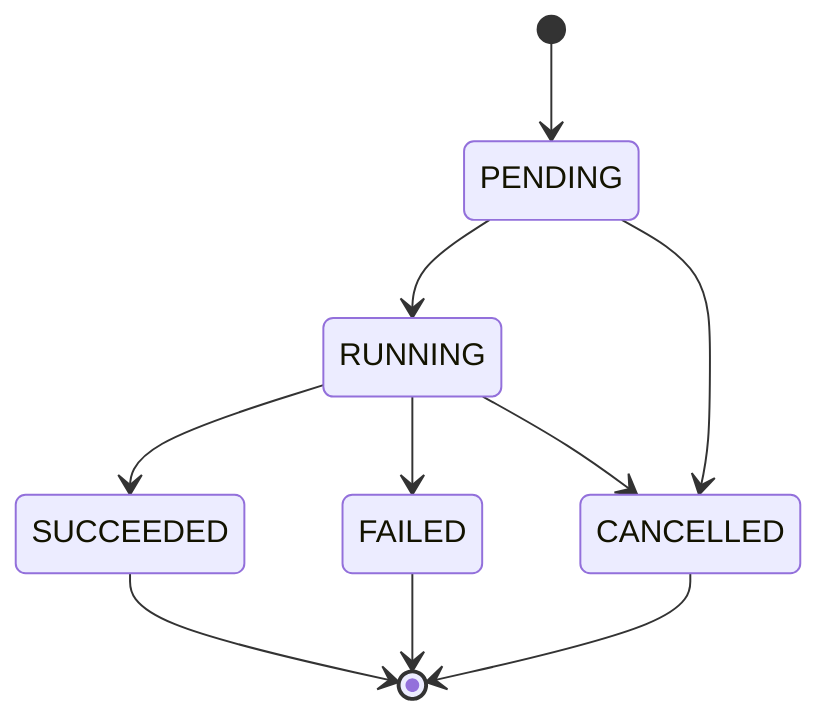
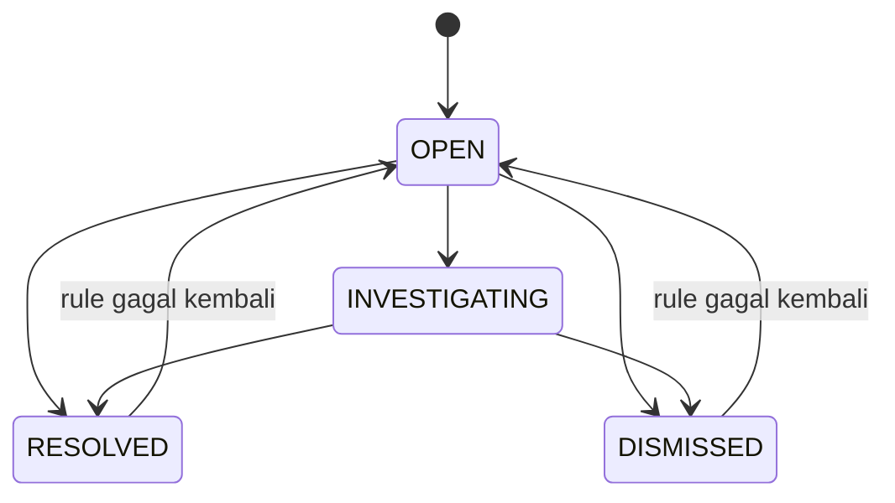
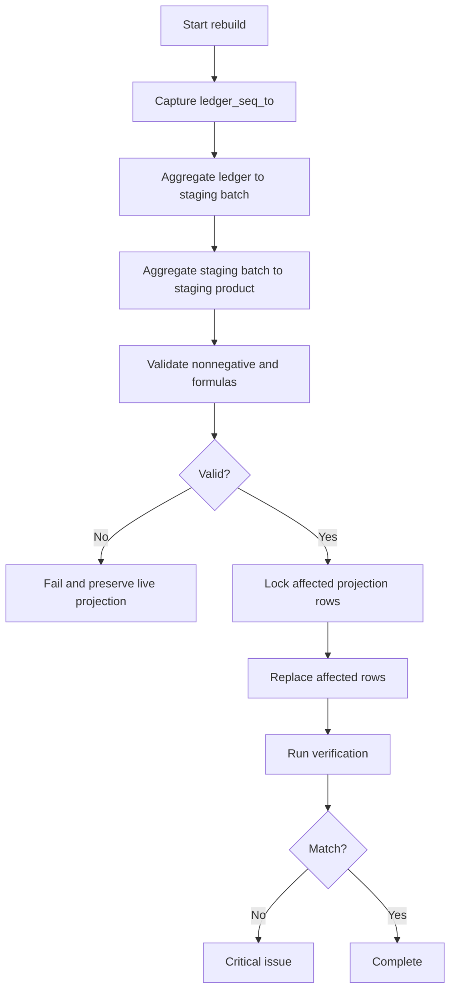
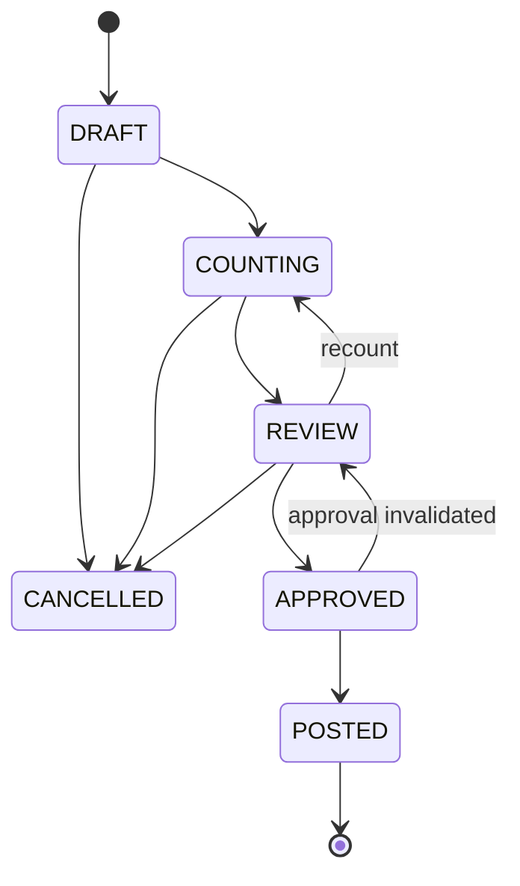

<!--
File: 08-reconciliation-logic.md
Project: Sistem Rekonsiliasi Stok
Status: Approved design baseline for Phase 1
Version: 1.0.0
Last updated: 2026-07-12
Language: id-ID
Timezone: Asia/Jakarta
Role model: ADMIN only
Primary source: stok-management-system.pdf
Depends on:
  - 01-project-brief.md
  - 02-product-requirements.md
  - 03-business-rules.md
  - 04-stock-ledger-design.md
  - 05-database-schema.md
  - 06-user-roles-and-flows.md
  - 07-marketplace-simulator.md
-->

# Reconciliation Logic: Sistem Rekonsiliasi Stok

## 1. Tujuan Dokumen

Dokumen ini mendefinisikan logika rekonsiliasi untuk Sistem Rekonsiliasi Stok.

Rekonsiliasi dalam proyek ini memiliki dua ritme yang berbeda:

1. **rekonsiliasi internal harian**, yaitu pemeriksaan konsistensi antara ledger, projection, reservasi, alokasi batch, pesanan, event marketplace, retur, reversal, dan referensi sumber; dan
2. **rekonsiliasi fisik melalui stok opname**, yaitu perbandingan antara saldo yang seharusnya ada menurut ledger dengan hasil hitung fisik di gudang.

Tujuan akhirnya bukan sekadar menampilkan angka selisih. Sistem harus:

- menemukan aturan yang dilanggar;
- menunjukkan entitas yang terdampak;
- menyediakan bukti yang dapat ditelusuri;
- membedakan error pencatatan dari selisih fisik;
- membantu Admin menyelidiki kemungkinan penyebab;
- mengarahkan tindakan koreksi yang sah;
- mempertahankan jejak sebelum dan sesudah koreksi;
- mencegah koreksi dilakukan dengan mengedit saldo secara langsung.

> **Prinsip inti:** rekonsiliasi menjelaskan perbedaan, bukan menyembunyikannya.

---

## 2. Kedudukan Dokumen

Dokumen ini menjadi sumber kebenaran utama untuk:

- rumus saldo rekonsiliasi;
- batas waktu dan batas urutan ledger;
- katalog reconciliation check;
- severity;
- lifecycle reconciliation run;
- lifecycle issue;
- issue fingerprint dan deduplikasi;
- evidence;
- logic drill-down;
- rekonsiliasi harian;
- stok opname;
- root-cause hints;
- tindakan koreksi;
- scheduler;
- API;
- UI;
- monitoring;
- pengujian.

Urutan sumber kebenaran:

| Topik | Dokumen |
|---|---|
| Tujuan dan batas proyek | `01-project-brief.md` |
| Requirement produk | `02-product-requirements.md` |
| Aturan bisnis | `03-business-rules.md` |
| Ledger dan projection | `04-stock-ledger-design.md` |
| Tabel database | `05-database-schema.md` |
| Role dan user flow | `06-user-roles-and-flows.md` |
| Event simulator | `07-marketplace-simulator.md` |
| Logika rekonsiliasi | Dokumen ini |

Keputusan terbaru yang mengikat:

```text
Aplikasi hanya memiliki satu user role: ADMIN.
```

Karena itu:

- hanya Admin yang dapat menjalankan rekonsiliasi manual;
- hanya Admin yang dapat membuat dan memproses stok opname;
- hanya Admin yang dapat menyelesaikan atau menolak issue;
- tindakan otomatis dijalankan oleh proses sistem, bukan role aplikasi lain;
- istilah Operator, Viewer, dan Approver dari dokumen lama harus dianggap tidak berlaku untuk implementasi baru.

---

## 3. Latar Belakang

Masalah proyek bukan hanya ketidakcocokan angka stok.

Masalah yang lebih penting adalah ketidakmampuan menjawab:

- kapan selisih mulai terbentuk;
- transaksi mana yang membentuk saldo;
- apakah pesanan batal sudah melepas reservasi;
- apakah barang sudah keluar fisik;
- apakah retur benar-benar kembali;
- apakah retur kembali sebagai layak jual atau rusak;
- apakah bonus, promo, dan sampel tercatat;
- apakah batch yang dipakai sudah benar;
- apakah event marketplace diproses dua kali;
- apakah projection menyimpang dari ledger;
- apakah koreksi opname sebelumnya menutupi masalah lama;
- apakah saldo awal memang benar.

Spreadsheet lama merekap kategori seperti:

- Shopee;
- TikTok;
- manual;
- retur;
- sisa stok.

Sistem baru tetap harus mampu menyajikan ringkasan semacam itu, tetapi setiap angka harus dapat dibuka sampai ke:

```text
Reconciliation Run
  -> Check
    -> Issue
      -> Evidence
        -> Product / Batch
          -> Transaction
            -> Ledger Entry
              -> Source Document / Event
```

---

## 4. Sasaran

| ID | Sasaran |
|---|---|
| `REC-GOAL-001` | Ledger dan projection selalu dapat dibandingkan secara deterministik. |
| `REC-GOAL-002` | Setiap mismatch menghasilkan issue dengan bukti. |
| `REC-GOAL-003` | Issue berulang tidak membanjiri sistem dengan duplikat tanpa konteks. |
| `REC-GOAL-004` | Stok fisik dibandingkan dengan saldo pada cut-off yang eksplisit. |
| `REC-GOAL-005` | Koreksi opname selalu diposting sebagai ledger transaction. |
| `REC-GOAL-006` | Rekonsiliasi tidak mengubah ledger lama. |
| `REC-GOAL-007` | Admin dapat menelusuri selisih berdasarkan kanal, alasan, produk, batch, dan waktu. |
| `REC-GOAL-008` | Sistem membedakan konsistensi data dan selisih fisik. |
| `REC-GOAL-009` | Pemeriksaan otomatis dapat dijadwalkan dan dipantau. |
| `REC-GOAL-010` | Hasil dapat direproduksi dengan rule version dan ledger boundary yang sama. |
| `REC-GOAL-011` | Entitas kritis dapat ditahan dari mutasi lanjutan bila integritasnya diragukan. |
| `REC-GOAL-012` | Perbaikan projection selalu dibangun ulang dari ledger. |

---

## 5. Bukan Tujuan

Rekonsiliasi fase 1 tidak:

- menghitung nilai rupiah persediaan;
- mencatat harga pokok;
- menghitung keuntungan atau kerugian uang;
- menggantikan audit keuangan;
- menebak pelaku kehilangan;
- menyatakan root cause sebagai fakta tanpa bukti;
- menghapus transaksi yang salah;
- mengedit ledger entry;
- mengubah quantity projection agar “terlihat cocok”;
- mengembalikan stok hanya karena order dibatalkan setelah barang keluar;
- memasukkan retur sebagai sellable sebelum inspeksi;
- membuat produk atau batch otomatis dari hasil hitung tidak dikenal;
- menyelesaikan issue secara otomatis tanpa aturan eksplisit;
- menyembunyikan issue agar dashboard tampak hijau.

---

## 6. Prinsip Rekonsiliasi

### 6.1 Ledger Adalah Sumber Kebenaran Kuantitas Fisik

Untuk perubahan quantity fisik:

```text
inventory.stock_ledger_entries
```

adalah sumber kebenaran.

Tabel berikut adalah projection atau state operasional:

```text
inventory.stock_batch_balances
inventory.stock_product_positions
inventory.stock_reservations
inventory.stock_allocations
```

Jika ledger dan projection berbeda:

1. issue dibuat;
2. entitas terdampak dapat ditahan;
3. projection dibangun ulang dari ledger;
4. ledger tidak diubah agar cocok dengan projection.

### 6.2 Reservasi Bukan Ledger Fisik

Reservasi:

- mengurangi available;
- tidak mengurangi on-hand;
- tidak membuat physical outbound;
- tidak boleh direkonsiliasi sebagai ledger quantity.

Rumus:

```text
available = sellable_on_hand - active_reserved
```

### 6.3 Rekonsiliasi Tidak Memperbaiki Secara Diam-Diam

Check hanya:

- membaca;
- membandingkan;
- membuat hasil;
- membuat atau memperbarui issue;
- menyimpan evidence;
- memberi rekomendasi tindakan.

Perbaikan dilakukan melalui command terpisah dan terotorisasi.

### 6.4 Semua Hasil Memiliki Boundary

Setiap run menyimpan:

- ledger sequence awal;
- ledger sequence akhir;
- waktu snapshot;
- rule-set version;
- scope;
- organization;
- trigger;
- proses;
- durasi.

Tanpa boundary, hasil “saldo saat diperiksa” berubah menjadi konsep metafisik yang tidak membantu siapa pun.

### 6.5 Hasil Harus Dapat Direproduksi

Dengan kondisi:

- rule version sama;
- ledger boundary sama;
- data master snapshot sama;
- source state snapshot sama;

hasil check harus sama.

---

## 7. Dua Jenis Rekonsiliasi

## 7.1 Rekonsiliasi Internal Harian

Tujuan:

- menemukan inkonsistensi sistem;
- menemukan pipeline yang gagal;
- menemukan duplicate effect;
- menemukan state yang mustahil;
- menemukan drift projection;
- menemukan entitas tanpa referensi;
- menemukan proses retur yang tidak lengkap.

Sumber:

- ledger;
- projection;
- reservasi;
- alokasi;
- order;
- event marketplace;
- return;
- claim;
- reversal;
- idempotency command;
- master batch;
- audit.

Tidak membutuhkan hitung fisik.

## 7.2 Rekonsiliasi Stok Opname

Tujuan:

- membandingkan expected quantity dengan physical quantity;
- menemukan selisih fisik;
- memecah variance berdasarkan produk, batch, dan bucket;
- merekam review;
- memposting adjustment yang sah;
- mempertahankan histori sebelum koreksi.

Membutuhkan:

- scope;
- snapshot;
- ledger cut-off;
- physical count;
- review;
- reason;
- konfirmasi Admin;
- adjustment transaction.

## 7.3 Perbedaan

| Dimensi | Harian Internal | Stok Opname |
|---|---|---|
| Input fisik | Tidak | Ya |
| Fokus | Konsistensi sistem | Catatan vs barang nyata |
| Frekuensi | Harian/Manual | Setiap 1–3 bulan atau sesuai kebutuhan |
| Perubahan ledger | Tidak | Ya, saat adjustment diposting |
| Hasil utama | Check dan issue | Variance dan adjustment |
| Boundary | Ledger run boundary | Snapshot + count cutoff |
| Bisa otomatis | Ya | Tidak untuk physical count |
| Root cause | Pelanggaran invariant | Kemungkinan penyebab selisih fisik |

---

## 8. Model Kuantitas

### 8.1 Dimensi Saldo

Saldo fisik minimal dihitung berdasarkan:

```text
organization_id
product_id
batch_id
bucket_code
```

Bucket fase 1:

```text
SELLABLE
QUARANTINE
DAMAGED
```

### 8.2 Ledger Balance

Untuk boundary sequence `S`:

```text
ledger_balance(org, product, batch, bucket, S)
=
SUM(quantity_delta)
WHERE ledger_seq <= S
```

SQL konseptual:

```sql
select
  organization_id,
  product_id,
  batch_id,
  bucket_code,
  coalesce(sum(quantity_delta), 0)::bigint as ledger_qty
from inventory.stock_ledger_entries
where organization_id = p_organization_id
  and ledger_seq <= p_ledger_seq_to
group by
  organization_id,
  product_id,
  batch_id,
  bucket_code;
```

### 8.3 Batch Projection

```text
batch_projection_qty
=
inventory.stock_batch_balances.quantity
```

Perbandingan:

```text
projection_variance = projection_qty - ledger_qty
```

Expected:

```text
projection_variance = 0
```

### 8.4 Product Projection

```text
product_bucket_qty
=
SUM(batch_projection_qty)
```

Per product:

```text
sellable_on_hand = SUM(batch SELLABLE)
quarantine_on_hand = SUM(batch QUARANTINE)
damaged_on_hand = SUM(batch DAMAGED)
active_reserved = SUM(active reservation remaining)
available = sellable_on_hand - active_reserved
```

### 8.5 Reservation Remaining

```text
reservation_remaining
=
reserved_qty
- released_qty
- consumed_qty
```

Invariant:

```text
reservation_remaining >= 0
```

Untuk active reservation:

```text
reservation_remaining > 0
```

### 8.6 Allocation Total

```text
allocation_total(order_item)
=
SUM(stock_allocations.allocated_qty)
```

Expected saat physical outbound:

```text
allocation_total = outbound_qty
```

### 8.7 Transfer Balance

Untuk internal bucket transfer:

```text
SUM(quantity_delta untuk transaction) = 0
```

Contoh:

```text
QUARANTINE -5
SELLABLE   +5
net         0
```

### 8.8 Reversal Balance

```text
reversed_qty(original_entry)
<= abs(original_quantity_delta)
```

Dampak reversal:

```text
reversal_delta = - applied_original_delta
```

---

## 9. Boundary dan Snapshot Konsisten

### 9.1 Ledger Sequence Boundary

Setiap ledger entry memiliki urutan monoton:

```text
ledger_seq
```

Run menyimpan:

```text
ledger_seq_from
ledger_seq_to
```

Definisi:

```text
ledger_seq_to = sequence maksimum yang masuk ke scope run
```

Check ledger wajib memakai:

```sql
ledger_seq <= ledger_seq_to
```

### 9.2 Snapshot Database

Rekonsiliasi melibatkan banyak tabel. Semua check dalam satu run harus membaca snapshot database yang konsisten.

Rekomendasi:

```sql
begin transaction isolation level repeatable read;
-- acquire reconciliation advisory lock
-- create run
-- capture ledger_seq_to
-- execute checks
-- finalize run
commit;
```

Untuk run besar yang dipecah menjadi beberapa transaction:

- ledger boundary tetap sama;
- setiap check menyimpan observed timestamp;
- entity snapshot penting disimpan sebagai evidence;
- hasil transien harus direcheck sebelum menjadi critical hold;
- rule harus mendokumentasikan apakah membutuhkan global snapshot.

### 9.3 Advisory Lock

Hanya satu run internal aktif per organisasi dan run type.

Key konseptual:

```text
hash(organization_id + ':' + run_type_code)
```

Gunakan transaction-level advisory lock.

Hasil bila lock gagal:

```text
RECONCILIATION_ALREADY_RUNNING
```

Jangan menunggu tanpa batas.

### 9.4 Sequence Gap

Gap pada sequence tidak otomatis merupakan error.

Yang wajib:

- sequence unik;
- urutan meningkat;
- boundary jelas;
- setiap entry dapat dibaca.

### 9.5 Backdated Business Time

Ledger memiliki:

- `occurred_at`;
- `posted_at`;
- `ledger_seq`.

Rekonsiliasi operasional memakai `ledger_seq` sebagai boundary utama.

`occurred_at` dipakai untuk:

- laporan bisnis;
- timeline;
- analisis kejadian terlambat;
- root-cause hints.

Backdated event yang diposting setelah boundary tidak masuk run lama.

---

## 10. Lifecycle Reconciliation Run

Status kanonis:

```text
PENDING
RUNNING
SUCCEEDED
SUCCEEDED_WITH_ISSUES
FAILED
CANCELLED
```

Amendment terhadap `05-database-schema.md`:

- tambahkan `PENDING`;
- tambahkan `SUCCEEDED_WITH_ISSUES`;
- tambahkan `CANCELLED`;
- atau simpan status teknis `SUCCEEDED` dan gunakan summary untuk issue count.

Rekomendasi final:

```text
PENDING
RUNNING
SUCCEEDED
FAILED
CANCELLED
```

dan:

```text
has_issues boolean
critical_issue_count integer
```

### 10.1 Transisi



### 10.2 Jenis Run

```text
DAILY_INTERNAL
STOCKTAKE
MANUAL
POST_REVERSAL
POST_IMPORT
POST_SIMULATION
PROJECTION_REBUILD_VERIFY
```

### 10.3 Run Summary

Contoh:

```json
{
  "ruleSetVersion": "2026.07.12.1",
  "ledgerSeqFrom": 120001,
  "ledgerSeqTo": 123456,
  "checksTotal": 24,
  "checksPassed": 20,
  "checksWarned": 2,
  "checksFailed": 2,
  "issuesCreated": 3,
  "issuesReopened": 1,
  "issuesSeenAgain": 2,
  "criticalIssues": 1,
  "durationMs": 8420,
  "scope": {
    "mode": "CHANGED_ENTITIES"
  }
}
```

---

## 11. Lifecycle Check

Status:

```text
PASS
WARN
FAIL
ERROR
SKIPPED
```

Arti:

| Status | Arti |
|---|---|
| `PASS` | Tidak ada pelanggaran. |
| `WARN` | Ada kondisi yang perlu perhatian tetapi tidak membuktikan invariant rusak. |
| `FAIL` | Rule dilanggar. |
| `ERROR` | Check tidak berhasil dieksekusi secara teknis. |
| `SKIPPED` | Prasyarat check tidak terpenuhi atau sengaja tidak masuk scope. |

`ERROR` tidak boleh diperlakukan sebagai `PASS`.

---

## 12. Severity

Severity kanonis:

```text
INFO
WARNING
HIGH
CRITICAL
```

Amendment:

`05-database-schema.md` sebelumnya menyebut `INFO`, `WARNING`, dan `CRITICAL`. Dokumen ini menambahkan `HIGH` agar konsisten dengan `03-business-rules.md`.

### 12.1 Definisi

| Severity | Makna | Contoh |
|---|---|---|
| `INFO` | Fakta operasional atau observasi. | Retur belum diinspeksi tetapi masih dalam SLA. |
| `WARNING` | Perlu perhatian; belum tentu merusak saldo. | Event belum diproses dalam batas normal. |
| `HIGH` | Integritas proses terganggu atau berpotensi mengubah hasil. | Event duplicate conflict, source reference tidak lengkap. |
| `CRITICAL` | Saldo atau invariant utama tidak dapat dipercaya. | Ledger vs projection mismatch, saldo negatif, outbound tanpa ledger. |

### 12.2 Escalation

Severity dapat dinaikkan berdasarkan:

- quantity terdampak;
- umur issue;
- jumlah recurrence;
- jumlah produk/batch;
- proses kritis;
- keberadaan stok negatif;
- dampak pada physical outbound;
- ketidakmampuan rebuild projection.

Severity tidak boleh diturunkan otomatis hanya karena issue lama.

---

## 13. Lifecycle Issue

Status:

```text
OPEN
INVESTIGATING
RESOLVED
DISMISSED
```

Resolution code:

```text
CORRECTED_BY_REVERSAL
CORRECTED_BY_SOURCE_EVENT
CORRECTED_BY_PROJECTION_REBUILD
CORRECTED_BY_STOCKTAKE
MASTER_DATA_FIXED
PROCESS_RETRIED
FALSE_POSITIVE
ACCEPTED_RISK
NO_LONGER_REPRODUCIBLE
OTHER
```

### 13.1 Transisi



### 13.2 Menutup Issue

Admin wajib mengisi:

- resolution code;
- resolution note;
- tindakan koreksi;
- referensi transaksi/perbaikan;
- waktu;
- konfirmasi.

Untuk:

```text
FALSE_POSITIVE
ACCEPTED_RISK
```

wajib ada alasan rinci.

Karena hanya ada satu role Admin, aplikasi tidak dapat mengandalkan separation of duties berbasis role. Untuk tindakan kritis, gunakan:

- re-authentication;
- confirmation phrase;
- audit;
- optional second-admin review bila organisasi memiliki lebih dari satu akun Admin.

---

## 14. Issue Fingerprint dan Deduplikasi

### 14.1 Tujuan

Rule yang gagal setiap hari tidak boleh menghasilkan puluhan issue identik.

### 14.2 Fingerprint

```text
fingerprint =
SHA256(
  organization_id
  + check_code
  + rule_version
  + normalized_entity_key
  + normalized_dimension
)
```

Contoh normalized entity key:

```text
product:{product_id}:batch:{batch_id}:bucket:{bucket_code}
order:{order_id}
transaction:{transaction_id}
event:{event_id}
return:{return_id}
```

### 14.3 Perilaku

| Kondisi | Hasil |
|---|---|
| Fingerprint belum ada | Buat issue baru. |
| Issue masih open | Update `last_seen_at`, occurrence count, actual/expected terbaru. |
| Issue resolved tetapi gagal lagi | Reopen atau buat recurrence linked issue. |
| Rule version berubah signifikan | Buat fingerprint baru dan tautkan predecessor. |
| Entity tidak lagi gagal | Issue tidak otomatis resolved kecuali policy mengizinkan verifikasi otomatis. |

### 14.4 Kolom Tambahan yang Direkomendasikan

```sql
alter table reconciliation.issues
  add column if not exists fingerprint text,
  add column if not exists rule_version text,
  add column if not exists first_seen_at timestamptz,
  add column if not exists last_seen_at timestamptz,
  add column if not exists occurrence_count integer not null default 1,
  add column if not exists resolution_code text,
  add column if not exists previous_issue_id uuid,
  add column if not exists last_run_id uuid;
```

Index:

```sql
create unique index if not exists uq_reconciliation_open_fingerprint
on reconciliation.issues (organization_id, fingerprint)
where status_code in ('OPEN', 'INVESTIGATING');
```

---

## 15. Evidence

### 15.1 Tujuan

Evidence menjawab:

- apa yang diharapkan;
- apa yang ditemukan;
- dari mana angka berasal;
- transaksi mana yang terlibat;
- rentang ledger mana yang diperiksa;
- source event mana yang berhubungan;
- tindakan apa yang pernah dilakukan.

### 15.2 Evidence Type

```text
LEDGER_ENTRY
LEDGER_AGGREGATE
BATCH_PROJECTION
PRODUCT_PROJECTION
RESERVATION
ALLOCATION
ORDER
ORDER_EVENT
RETURN
RETURN_INSPECTION
CLAIM
STOCKTAKE
REVERSAL
IDEMPOTENCY_COMMAND
AUDIT_EVENT
MASTER_DATA
QUERY_RESULT
RULE_EVALUATION
```

### 15.3 Evidence Snapshot

Contoh:

```json
{
  "entity": {
    "productId": "uuid",
    "batchId": "uuid",
    "bucket": "SELLABLE"
  },
  "boundary": {
    "ledgerSeqTo": 123456
  },
  "expected": {
    "ledgerQty": 120
  },
  "actual": {
    "projectionQty": 118
  },
  "difference": -2,
  "sampleLedgerEntries": [
    {
      "ledgerEntryId": "uuid",
      "ledgerSeq": 123450,
      "quantityDelta": -5,
      "transactionType": "MARKETPLACE_OUTBOUND"
    }
  ]
}
```

### 15.4 Evidence Immutability

Evidence adalah snapshot investigasi.

Dilarang:

- mengedit expected/actual lama;
- mengganti entity reference;
- menghapus evidence agar issue tampak selesai.

Evidence baru boleh ditambahkan pada run berikutnya.

---

## 16. Katalog Check Harian

## 16.1 `REC_LEDGER_PROJECTION_BATCH`

Tujuan:

```text
SUM ledger per product/batch/bucket = batch projection
```

Severity:

```text
CRITICAL
```

Entity:

```text
product + batch + bucket
```

Expected:

```text
ledger_qty
```

Actual:

```text
projection_qty
```

Tindakan:

- buat integrity hold pada entity;
- rebuild projection;
- jalankan ulang check;
- jangan koreksi ledger.

## 16.2 `REC_BATCH_PRODUCT_PROJECTION`

Tujuan:

```text
SUM batch projection = product projection
```

Severity:

```text
CRITICAL
```

Tindakan:

- rebuild product projection;
- verifikasi batch projection lebih dahulu.

## 16.3 `REC_NEGATIVE_BUCKET`

Tujuan:

```text
ledger_qty >= 0
batch_projection_qty >= 0
```

Severity:

```text
CRITICAL
```

Catatan:

- check ledger negatif dan projection negatif dibedakan dalam evidence;
- projection negatif dengan ledger nonnegative berarti projection drift;
- ledger negatif berarti posting invariant gagal.

## 16.4 `REC_AVAILABLE_NEGATIVE`

Rumus:

```text
available = sellable - active_reserved
```

Expected:

```text
available >= 0
```

Severity:

```text
CRITICAL
```

## 16.5 `REC_RESERVED_EXCEEDS_SELLABLE`

Expected:

```text
active_reserved <= sellable
```

Severity:

```text
CRITICAL
```

## 16.6 `REC_RESERVATION_COMPONENTS`

Expected per reservation:

```text
reserved_qty = remaining_qty + released_qty + consumed_qty
```

dan semua komponen nonnegative.

Severity:

```text
HIGH
```

## 16.7 `REC_ORPHAN_ACTIVE_RESERVATION`

Active reservation wajib memiliki:

- order aktif;
- order item;
- product;
- organization sama.

Severity:

```text
HIGH
```

## 16.8 `REC_CANCELLED_ORDER_RESERVATION`

Order yang batal sebelum shipment:

```text
active reservation remaining = 0
```

Severity:

```text
HIGH
```

## 16.9 `REC_PHYSICALLY_OUT_RESERVATION`

Order yang sudah physical outbound:

```text
reservation consumed sesuai outbound
```

Severity:

```text
HIGH
```

## 16.10 `REC_TRANSFER_NET_ZERO`

Untuk transaction type internal transfer:

```text
SUM quantity_delta = 0
```

Severity:

```text
CRITICAL
```

## 16.11 `REC_ALLOCATION_TOTAL`

Untuk outbound order item:

```text
SUM allocation qty = physical outbound qty
```

Severity:

```text
CRITICAL
```

## 16.12 `REC_ALLOCATION_BATCH_PRODUCT`

Allocation batch harus dimiliki product yang sama dengan order item.

Severity:

```text
CRITICAL
```

## 16.13 `REC_EXPIRED_ALLOCATION`

Allocation penjualan tidak boleh memakai batch yang sudah kedaluwarsa pada waktu physical outbound.

Severity:

```text
HIGH
```

Pengecualian harus eksplisit untuk adjustment/reversal, bukan penjualan.

## 16.14 `REC_BLOCKED_BATCH_ALLOCATION`

Batch blocked tidak boleh dialokasikan untuk outbound penjualan.

Severity:

```text
HIGH
```

## 16.15 `REC_FEFO_ORDER`

Untuk kandidat yang sama pada waktu alokasi, batch expiry lebih lambat tidak boleh dipakai sementara batch eligible dengan expiry lebih dekat masih memiliki stock.

Severity:

```text
HIGH
```

Catatan:

- check membutuhkan evidence kandidat pada waktu posting;
- jika histori kandidat tidak disimpan, check bersifat best-effort;
- disarankan menyimpan allocation decision snapshot.

## 16.16 `REC_OUTBOUND_WITHOUT_LEDGER`

Order `PHYSICALLY_OUT` wajib memiliki outbound transaction.

Severity:

```text
CRITICAL
```

## 16.17 `REC_LEDGER_WITHOUT_PHYSICAL_STATE`

Marketplace outbound transaction wajib memiliki order state yang setara physical out atau lifecycle sesudahnya.

Severity:

```text
HIGH
```

## 16.18 `REC_PRE_SHIPMENT_WITH_OUTBOUND`

Order pra-shipment tidak boleh memiliki outbound final.

Severity:

```text
CRITICAL
```

## 16.19 `REC_CHANNEL_THRESHOLD`

Shopee:

```text
physical outbound source event = SHIPPED
```

TikTok Shop:

```text
physical outbound source event = IN_TRANSIT
```

Severity:

```text
HIGH
```

## 16.20 `REC_DUPLICATE_SOURCE_EFFECT`

Satu external event atau idempotency key tidak boleh menghasilkan lebih dari satu domain effect.

Severity:

```text
HIGH
```

## 16.21 `REC_IDEMPOTENCY_PAYLOAD_CONFLICT`

Key sama dengan payload hash berbeda harus berstatus rejected dan tidak menghasilkan effect baru.

Severity:

```text
HIGH
```

## 16.22 `REC_UNPROCESSED_EVENT`

Event `RECEIVED` atau `PROCESSING` melewati SLA internal.

Severity awal:

```text
WARNING
```

Naik menjadi:

```text
HIGH
```

bila event seharusnya memicu physical stock movement.

## 16.23 `REC_EVENT_RESULT_MISSING`

Event `PROCESSED` wajib memiliki result reference yang sesuai.

Severity:

```text
HIGH
```

## 16.24 `REC_ILLEGAL_STATE_TRANSITION`

Order status history harus mengikuti state machine.

Severity:

```text
HIGH
```

## 16.25 `REC_BUNDLE_SNAPSHOT_TOTAL`

Normalized order components harus sama dengan recipe snapshot pada waktu order masuk.

Severity:

```text
HIGH
```

## 16.26 `REC_BUNDLE_STOCK_ENTITY`

Tidak boleh ada stock balance untuk pseudo-product bundle bila bundle bukan stok tersendiri.

Severity:

```text
CRITICAL
```

## 16.27 `REC_TRANSACTION_SOURCE`

Setiap stock transaction wajib memiliki:

- source type;
- source reference;
- reason;
- channel bila relevan;
- actor atau process;
- organization.

Severity:

```text
HIGH
```

## 16.28 `REC_LEDGER_SOURCE_ENTITY`

Setiap source reference harus menunjuk entity yang valid atau snapshot evidence yang sah.

Severity:

```text
HIGH
```

## 16.29 `REC_REVERSAL_REFERENCE`

Reversal wajib menunjuk original transaction/entry.

Severity:

```text
HIGH
```

## 16.30 `REC_OVER_REVERSAL`

Total applied reversal tidak boleh melebihi quantity original.

Severity:

```text
CRITICAL
```

## 16.31 `REC_REVERSAL_DELTA`

Dampak reversal harus tepat kebalikan dari bagian original yang diterapkan.

Severity:

```text
CRITICAL
```

## 16.32 `REC_RETURN_RECEIVED_QUARANTINE`

Quantity return received harus sama dengan inbound ke `QUARANTINE`.

Severity:

```text
HIGH
```

## 16.33 `REC_RETURN_INSPECTION_TRANSFER`

Quantity inspection sellable/damaged harus memiliki transfer dari quarantine.

Severity:

```text
HIGH
```

## 16.34 `REC_RETURN_SELLABLE_BEFORE_INSPECTION`

Tidak boleh ada sellable return inbound sebelum receipt dan inspection sah.

Severity:

```text
HIGH
```

## 16.35 `REC_RETURN_QUANTITY`

Untuk return item:

```text
expected_qty
=
received_qty
+ lost_qty
+ pending_qty
```

Severity:

```text
HIGH
```

## 16.36 `REC_RETURN_OVER_RECEIPT`

Received + lost tidak boleh melebihi return expected.

Severity:

```text
CRITICAL
```

## 16.37 `REC_QUARANTINE_PENDING_INSPECTION`

Saldo quarantine dari retur harus dapat dijelaskan oleh received quantity yang belum selesai diinspeksi.

Severity:

```text
HIGH
```

## 16.38 `REC_CLAIM_DEADLINE`

Claim terbuka yang mendekati atau melewati deadline harus menghasilkan notification/issue.

Severity:

```text
WARNING
```

Naik menjadi `HIGH` setelah deadline.

## 16.39 `REC_STOCKTAKE_ADJUSTMENT_LINK`

Setiap stocktake adjustment harus menunjuk:

- stocktake;
- stocktake line;
- transaction;
- ledger entry;
- reason.

Severity:

```text
HIGH
```

## 16.40 `REC_POSTED_STOCKTAKE_TOTAL`

Total adjustment per stocktake line harus sama dengan variance yang disetujui.

Severity:

```text
CRITICAL
```

## 16.41 `REC_STOCKTAKE_IMMUTABLE`

Sesi posted dan line-nya tidak boleh berubah.

Severity:

```text
CRITICAL
```

## 16.42 `REC_PROJECTION_REBUILD`

Hasil rebuild dari ledger harus sama dengan projection live.

Severity:

```text
CRITICAL
```

---

## 17. Rule Registry

Rule tidak boleh tersebar sebagai string acak di berbagai komponen.

Registry minimum:

```text
check_code
rule_version
name
description
severity_default
entity_type
supports_incremental
requires_global_snapshot
enabled
introduced_at
deprecated_at
replacement_check_code
```

Contoh:

```json
{
  "checkCode": "REC_LEDGER_PROJECTION_BATCH",
  "ruleVersion": "1.0.0",
  "severityDefault": "CRITICAL",
  "supportsIncremental": true,
  "requiresGlobalSnapshot": true
}
```

Rule version berubah bila:

- rumus berubah;
- scope berubah;
- severity berubah secara material;
- fingerprint dimension berubah;
- evidence contract berubah.

Perubahan teks UI tidak memerlukan rule version baru.

---

## 18. Incremental dan Full Reconciliation

### 18.1 Incremental Harian

Scope entity berasal dari:

- ledger entries sejak successful run terakhir;
- reservations yang berubah;
- orders yang berubah;
- marketplace events yang berubah;
- returns/claims yang berubah;
- open issues;
- reversal terbaru;
- stocktake terbaru.

Keuntungan:

- lebih cepat;
- cocok untuk operasi harian;
- fokus pada entitas terdampak.

### 18.2 Full Reconciliation

Memeriksa seluruh organisasi.

Digunakan:

- sebelum go-live;
- setelah migration;
- setelah projection rebuild;
- setelah incident;
- secara periodik;
- sebelum atau sesudah stocktake besar.

### 18.3 Hybrid

Rekomendasi fase 1:

```text
Harian: incremental + seluruh open issues
Periodik: full
Manual: scope terpilih atau full
```

Jadwal final dibuat configurable.

---

## 19. Changed Entity Set

Pseudo-query:

```sql
with changed_from_ledger as (
  select distinct
    organization_id,
    product_id,
    batch_id
  from inventory.stock_ledger_entries
  where organization_id = p_org
    and ledger_seq > p_seq_from
    and ledger_seq <= p_seq_to
),
changed_from_reservation as (
  select distinct
    organization_id,
    product_id,
    null::uuid as batch_id
  from inventory.stock_reservations
  where organization_id = p_org
    and updated_at >= p_changed_since
),
open_issue_entities as (
  select distinct
    organization_id,
    product_id,
    batch_id
  from reconciliation.issues
  where organization_id = p_org
    and status_code in ('OPEN', 'INVESTIGATING')
)
select * from changed_from_ledger
union
select * from changed_from_reservation
union
select * from open_issue_entities;
```

Rule yang bersifat global tetap harus berjalan full, misalnya:

- duplicate idempotency;
- orphan source;
- projection aggregate seluruh organization bila implementasi tidak mendukung subset aman.

---

## 20. Issue Creation Algorithm

Pseudo-code:

```text
for each rule result where status = FAIL or WARN:
  build normalized entity key
  build fingerprint
  search open issue by fingerprint

  if found:
    update:
      last_seen_at
      last_run_id
      occurrence_count + 1
      expected_value
      actual_value
      severity if escalated
    append new evidence
  else:
    search latest resolved/dismissed issue by fingerprint lineage

    if recurrence policy = REOPEN:
      reopen latest
      update recurrence metadata
      append evidence
    else:
      create new issue linked to prior issue
      append evidence
```

Issue creation dan check result harus berada dalam satu transaction per check batch.

---

## 21. Integrity Hold

### 21.1 Tujuan

Bila saldo entity tidak dapat dipercaya, sistem dapat mencegah mutasi lanjutan sampai diperbaiki.

Contoh pemicu:

- ledger vs projection mismatch;
- ledger balance negatif;
- transfer tidak seimbang;
- over-reversal;
- outbound tanpa ledger.

### 21.2 Scope

```text
PRODUCT
BATCH
ORDER
RETURN
ORGANIZATION
```

### 21.3 Tabel Rekomendasi

```sql
create table reconciliation.entity_holds (
  id uuid primary key default gen_random_uuid(),
  organization_id uuid not null,
  entity_type_code text not null,
  entity_id uuid not null,
  reason_issue_id uuid not null references reconciliation.issues(id),
  status_code text not null default 'ACTIVE',
  created_at timestamptz not null default now(),
  released_at timestamptz,
  released_by uuid,
  release_note text,
  unique (organization_id, entity_type_code, entity_id, status_code)
);
```

### 21.4 Perilaku

Domain mutation function wajib memeriksa active hold.

Read-only tetap diperbolehkan.

Hold dilepas setelah:

- correction selesai;
- rule lulus ulang;
- Admin mengonfirmasi release;
- audit disimpan.

---

## 22. Projection Rebuild Logic

### 22.1 Pemicu

- ledger vs batch projection mismatch;
- batch vs product projection mismatch;
- migration;
- incident;
- manual Admin;
- release verification.

### 22.2 Prinsip

Projection rebuild:

- membaca ledger;
- tidak menulis ledger;
- membangun hasil pada staging;
- membandingkan staging dan live;
- mengganti projection secara transaction-safe;
- menyimpan summary;
- menjalankan check ulang.

### 22.3 Pipeline



### 22.4 Dilarang

- rebuild sambil menulis ledger;
- menghapus live projection sebelum staging valid;
- memperbaiki ledger agar sama dengan projection;
- menyatakan sukses tanpa verification run.

---

## 23. Stok Opname

## 23.1 Lifecycle

```text
DRAFT
COUNTING
REVIEW
APPROVED
POSTED
CANCELLED
```



## 23.2 Scope

Scope dapat berupa:

- seluruh gudang/organisasi;
- kelompok produk;
- produk tertentu;
- batch tertentu;
- bucket tertentu.

Scope disimpan sebagai data terstruktur, bukan teks bebas.

Contoh:

```json
{
  "scopeMode": "PRODUCTS",
  "productIds": ["uuid-1", "uuid-2"],
  "bucketCodes": ["SELLABLE", "QUARANTINE", "DAMAGED"]
}
```

## 23.3 Snapshot

Saat `COUNTING` dimulai:

- simpan `snapshot_ledger_seq`;
- simpan balance per product/batch/bucket;
- simpan master snapshot;
- simpan status batch;
- simpan mode;
- snapshot immutable.

### 23.3.1 Snapshot Formula

```text
system_qty_at_snapshot
=
SUM ledger quantity_delta
WHERE ledger_seq <= snapshot_ledger_seq
```

Jangan mengambil snapshot dari projection tanpa verifikasi.

Projection boleh dipakai untuk percepatan hanya bila:

```text
ledger vs projection check = PASS
```

## 23.4 Mode Frozen

```text
expected_qty_at_count = system_qty_at_snapshot
```

Selama counting:

- mutation pada scope ditolak;
- read tetap tersedia;
- transaksi di luar scope berjalan;
- hold dibuka setelah sesi selesai/cancel.

## 23.5 Mode Continuous

Operasi tetap berjalan.

Untuk setiap line:

```text
expected_qty_at_count
=
system_qty_at_snapshot
+
SUM(
  ledger quantity_delta
  WHERE snapshot_ledger_seq < ledger_seq <= count_cutoff_ledger_seq
)
```

### 23.5.1 Line-Level Cutoff

Karena produk dihitung pada waktu berbeda, rekomendasi:

```text
count_cutoff_ledger_seq per stocktake line
```

Amendment terhadap `05-database-schema.md`:

```sql
alter table operations.stocktake_lines
  add column if not exists count_cutoff_ledger_seq bigint,
  add column if not exists expected_formula_version text,
  add column if not exists count_attempt_no integer not null default 1;
```

Tanpa line-level cutoff, sistem tidak dapat menjelaskan movement yang terjadi saat tim berpindah dari rak pertama ke rak terakhir.

## 23.6 Physical Count

Aturan:

- integer nol atau positif;
- null berarti belum dihitung;
- tidak dikenal menjadi exception;
- batch tidak dibuat otomatis;
- counted_at wajib;
- counted_by wajib;
- perubahan count meningkatkan version;
- approval lama invalid bila count berubah.

## 23.7 Variance

```text
variance_qty
=
physical_qty
-
expected_qty_at_count
```

Interpretasi:

| Variance | Arti |
|---:|---|
| `0` | Fisik cocok. |
| `> 0` | Fisik lebih banyak daripada catatan. |
| `< 0` | Fisik lebih sedikit daripada catatan. |

Variance tidak otomatis menjelaskan penyebab.

## 23.8 Recount

Recount wajib bila:

- variance melewati threshold;
- item critical;
- batch tidak jelas;
- count evidence tidak lengkap;
- Admin memilih `RECOUNT`.

Setiap attempt disimpan.

Jangan menimpa count pertama.

## 23.9 Review

Review menampilkan:

- snapshot;
- movement setelah snapshot;
- cutoff;
- expected;
- physical;
- variance;
- transaction breakdown;
- probable cause hints;
- prior stocktake variance;
- evidence;
- reason;
- proposed adjustment.

## 23.10 Approval

Hanya Admin.

Approval menyimpan:

- approved count version;
- approved expected version;
- approved boundary;
- approved variance;
- approved reason;
- approved by;
- approved at.

Jika salah satu berubah:

```text
approval invalid
```

## 23.11 Posting

Untuk setiap variance nonzero:

```text
transaction_type = STOCKTAKE_ADJUSTMENT
quantity_delta = variance_qty
```

Semua line dalam sesi diposting atomik.

Variance nol:

- tidak membuat ledger entry;
- tetap tercatat sebagai line reconciled.

## 23.12 Idempotency

Key:

```text
stocktake:{stocktake_id}:post:{approval_version}
```

Duplicate identical request:

```text
return existing result
```

Payload conflict:

```text
reject
```

## 23.13 Setelah Posting

- stocktake menjadi `POSTED`;
- line read-only;
- adjustment map disimpan;
- reconciliation `STOCKTAKE` run dibuat;
- check ledger/projection dijalankan;
- issue terkait dapat diselesaikan bila lulus;
- laporan final tersedia.

---

## 24. Breakdown Movement untuk Opname

Untuk setiap line:

```text
opening_snapshot
+ maklon_inbound
+ return_received
+ return_to_sellable
+ other_inbound
- shopee_outbound
- tiktok_outbound
- offline_sale
- bonus
- promo
- sample
- damaged
- expired
+/- internal_transfer
+/- reversal
+/- prior_adjustment
= expected_qty_at_count
```

Semua kategori berasal dari ledger transaction type, reason, dan channel.

Contoh output:

| Komponen | Quantity |
|---|---:|
| Saldo snapshot | 100 |
| Maklon masuk | +20 |
| Retur diterima layak jual | +3 |
| Shopee keluar | -30 |
| TikTok keluar | -10 |
| Bonus | -2 |
| Sampel | -1 |
| Barang rusak | -1 |
| Expected | 79 |
| Physical | 76 |
| Variance | -3 |

Setiap angka dapat dibuka ke daftar transaction.

---

## 25. Root-Cause Hint Engine

### 25.1 Tujuan

Memberi arah investigasi, bukan vonis otomatis.

Output:

```text
hint_code
description
confidence
supporting_evidence
contradicting_evidence
recommended_action
```

Confidence:

```text
LOW
MEDIUM
HIGH
```

### 25.2 Hint Catalog

## 25.2.1 `HINT_UNRECORDED_MANUAL_OUTBOUND`

Kondisi:

- variance negatif;
- tidak ada outbound manual dalam periode;
- pola historis menunjukkan bonus/promo/sampel;
- product aktif digunakan promosi.

Output:

```text
Kemungkinan barang keluar manual belum tercatat.
```

Tidak boleh menyatakan:

```text
Barang dicuri.
```

## 25.2.2 `HINT_CANCEL_RESERVATION_NOT_RELEASED`

Kondisi:

- available rendah;
- sellable cocok dengan physical;
- order cancel pre-shipment masih memiliki reservation.

Ini lebih merupakan issue reservasi daripada physical variance.

## 25.2.3 `HINT_POST_SHIPMENT_CANCEL_EXPECTED_RETURN`

Kondisi:

- order cancel setelah outbound;
- return belum diterima;
- variance fisik tidak boleh dikoreksi dengan auto-restock.

## 25.2.4 `HINT_RETURN_NOT_RECEIVED`

Kondisi:

- retur expected;
- status in transit;
- tidak ada quarantine inbound;
- physical count tidak menunjukkan barang.

## 25.2.5 `HINT_RETURN_RECEIVED_NOT_INSPECTED`

Kondisi:

- quarantine ada;
- return received;
- inspection belum lengkap.

## 25.2.6 `HINT_WRONG_RETURN_CONDITION`

Kondisi:

- sellable variance dan damaged variance berlawanan;
- return inspection baru terjadi;
- transfer bucket tidak cocok.

## 25.2.7 `HINT_BATCH_MISIDENTIFICATION`

Kondisi:

- total product cocok;
- variance antarbatch saling mengimbangi;
- product sama.

Contoh:

```text
Batch A -5
Batch B +5
Product total 0
```

Kemungkinan:

- barang dihitung pada batch yang salah;
- label batch tidak terbaca;
- penempatan rak bercampur.

## 25.2.8 `HINT_INITIAL_BALANCE_UNCERTAIN`

Kondisi:

- variance sudah ada pada stocktake pertama;
- saldo awal berasal dari perkiraan;
- tidak ada movement yang menjelaskan.

## 25.2.9 `HINT_DUPLICATE_OUTBOUND`

Kondisi:

- duplicate source effect;
- physical tidak mendukung dua kali outbound;
- idempotency failure.

## 25.2.10 `HINT_MISSING_INBOUND`

Kondisi:

- physical lebih tinggi;
- ada bukti penerimaan maklon tanpa ledger inbound;
- dokumen receipt draft/failed.

## 25.2.11 `HINT_UNRECORDED_DAMAGE_OR_EXPIRY`

Kondisi:

- variance sellable negatif;
- batch dekat/berakhir expiry;
- tidak ada damaged/expired transaction;
- bukti fisik menunjukkan item rusak/kedaluwarsa.

## 25.2.12 `HINT_COUNT_TIMING_MISMATCH`

Kondisi:

- mode continuous;
- movement terjadi dekat counted_at;
- cutoff line tidak sesuai;
- variance sama dengan movement window.

## 25.2.13 `HINT_PROJECTION_ONLY_DRIFT`

Kondisi:

- ledger rebuild benar;
- physical cocok ledger;
- live projection berbeda.

Tindakan:

```text
rebuild projection
```

bukan stocktake adjustment.

---

## 26. Root-Cause Confidence

Scoring contoh:

| Bukti | Poin |
|---|---:|
| Direct failed source document | +5 |
| Exact quantity match | +4 |
| Exact product/batch match | +3 |
| Waktu kejadian berdekatan | +2 |
| Pola historis | +1 |
| Contradicting ledger evidence | -5 |
| Entity berbeda | -4 |
| Waktu jauh | -2 |

Mapping:

```text
score >= 8  -> HIGH
score 4–7   -> MEDIUM
score <= 3  -> LOW
```

Skor ini hanya hint dan harus versioned.

---

## 27. Corrective Action Matrix

| Temuan | Koreksi sah | Dilarang |
|---|---|---|
| Projection drift | Rebuild projection | Edit ledger |
| Event gagal diproses | Retry idempoten | Insert movement manual tanpa source |
| Duplicate effect | Reversal terhadap duplicate transaction | Delete ledger |
| Salah quantity receipt | Reversal + repost benar | Update quantity entry |
| Cancel pre-shipment masih reserve | Release reservation | Tambah physical stock |
| Cancel post-shipment | Return workflow | Auto-restock |
| Retur received belum inspected | Complete inspection | Langsung sellable |
| Batch count tertukar | Correct stocktake classification/adjustment sesuai evidence | Memindahkan angka tanpa trace |
| Physical shortage | Stocktake adjustment dengan reason | Edit projection |
| Unknown product/batch | Investigasi master dan physical evidence | Auto-create master |

---

## 28. Rekonsiliasi Setelah Tindakan

### 28.1 Setelah Reversal

Jalankan:

- reversal reference;
- over-reversal;
- ledger projection;
- negative balance;
- source lifecycle.

### 28.2 Setelah Projection Rebuild

Jalankan:

- ledger vs batch;
- batch vs product;
- reservation/available;
- full verification.

### 28.3 Setelah Import

Jalankan:

- duplicate source event;
- unprocessed event;
- order state;
- outbound threshold;
- ledger projection.

### 28.4 Setelah Simulator

Jalankan:

- event idempotency;
- reservation;
- outbound;
- return;
- projection;
- issue yang sengaja dibuat scenario.

### 28.5 Setelah Stocktake

Jalankan:

- adjustment total;
- ledger projection;
- negative;
- source reference;
- posted immutability.

---

## 29. Scheduler

### 29.1 Teknologi

Supabase Cron/`pg_cron` dapat menjadwalkan database function atau procedure.

Jadwal harus configurable:

```text
reconciliation.daily_enabled
reconciliation.daily_cron_expression
reconciliation.timezone
reconciliation.full_cron_expression
```

Timezone bisnis:

```text
Asia/Jakarta
```

Jangan menyimpan jadwal sebagai asumsi tersembunyi di kode.

### 29.2 Contoh, Bukan Nilai Final

```sql
select cron.schedule(
  'daily-stock-reconciliation',
  '0 1 * * *',
  $$select api.run_reconciliation('DAILY_INTERNAL', null);$$
);
```

Jam `01:00` hanya contoh.

### 29.3 Monitoring Cron

Monitor:

- job enabled;
- last started;
- last completed;
- last status;
- duration;
- consecutive failure;
- missed schedule;
- overlap prevented.

### 29.4 Kegagalan Scheduler

Kegagalan job menghasilkan:

- operational alert;
- audit/log;
- run `FAILED` bila run sudah dibuat;
- retry policy;
- tidak boleh dianggap reconciliation pass.

---

## 30. API Contracts

## 30.1 Run Manual

```text
POST /api/admin/reconciliation/runs
```

Request:

```json
{
  "runType": "MANUAL",
  "scope": {
    "mode": "PRODUCTS",
    "productIds": ["uuid"]
  },
  "checkCodes": [
    "REC_LEDGER_PROJECTION_BATCH",
    "REC_BATCH_PRODUCT_PROJECTION"
  ],
  "note": "Verifikasi setelah reversal"
}
```

Server mengambil:

- user;
- role;
- organization;

dari session.

Response:

```json
{
  "success": true,
  "runId": "uuid",
  "status": "RUNNING"
}
```

## 30.2 Get Run

```text
GET /api/admin/reconciliation/runs/:runId
```

Response:

```json
{
  "runId": "uuid",
  "runType": "MANUAL",
  "status": "SUCCEEDED",
  "ledgerSeqFrom": 120001,
  "ledgerSeqTo": 123456,
  "ruleSetVersion": "2026.07.12.1",
  "summary": {},
  "checks": []
}
```

## 30.3 List Issues

```text
GET /api/admin/reconciliation/issues
```

Filter:

- status;
- severity;
- check code;
- product;
- batch;
- source;
- date;
- recurrence;
- search.

## 30.4 Resolve Issue

```text
POST /api/admin/reconciliation/issues/:issueId/resolve
```

Request:

```json
{
  "resolutionCode": "CORRECTED_BY_PROJECTION_REBUILD",
  "resolutionNote": "Projection dibangun ulang dan check lulus.",
  "correctionReferences": [
    {
      "type": "RECONCILIATION_RUN",
      "id": "uuid"
    }
  ],
  "confirmation": true
}
```

## 30.5 Reopen Issue

```text
POST /api/admin/reconciliation/issues/:issueId/reopen
```

Hanya bila alasan dan audit disimpan.

## 30.6 Projection Rebuild

```text
POST /api/admin/reconciliation/projection-rebuilds
```

Memerlukan:

- preview;
- scope;
- confirmation;
- idempotency key;
- re-auth untuk production.

---

## 31. Database Function Boundary

Function yang direkomendasikan:

```text
api.run_reconciliation
reconciliation.create_run
reconciliation.execute_rule
reconciliation.upsert_issue
reconciliation.append_evidence
reconciliation.finalize_run
api.resolve_reconciliation_issue
api.rebuild_stock_projections
api.create_stocktake
api.start_stocktake
api.submit_stocktake_count
api.review_stocktake
api.approve_stocktake
api.post_stocktake
```

Internal function tidak diberikan execute kepada client role.

---

## 32. UI: Reconciliation Dashboard

### 32.1 Ringkasan

Card:

- last daily run;
- last full run;
- run status;
- open critical;
- open high;
- affected products;
- oldest open issue;
- projection integrity;
- unprocessed events;
- stocktake status.

### 32.2 Run History

Kolom:

- run no;
- type;
- trigger;
- started;
- completed;
- boundary;
- checks;
- issues;
- critical;
- duration;
- status.

### 32.3 Check Detail

Menampilkan:

- rule;
- version;
- description;
- formula;
- scope;
- checked count;
- issue count;
- duration;
- sample entities;
- link ke issue.

### 32.4 Issue List

Card/table:

- severity;
- code;
- entity;
- expected;
- actual;
- difference;
- first seen;
- last seen;
- recurrence;
- status;
- recommended action.

### 32.5 Issue Detail

```text
Issue
├── Summary
├── Rule
├── Expected vs Actual
├── Timeline
├── Evidence
├── Related Movements
├── Source Documents
├── Root-Cause Hints
├── Corrective Actions
├── Prior Occurrences
└── Resolution
```

### 32.6 Drill-Down

Dari issue:

- product;
- batch;
- ledger;
- order;
- marketplace event;
- return;
- stocktake;
- reversal;
- audit.

---

## 33. UI: Stocktake

### 33.1 Create

Input:

- scope;
- mode;
- note;
- products/batches/buckets;
- planned time.

### 33.2 Count

Mobile-first card:

- SKU;
- product name;
- batch;
- expiry;
- bucket;
- physical input;
- counted status;
- exception;
- save.

Expected quantity dapat disembunyikan selama blind count bila policy dipilih.

### 33.3 Review

Tampilkan:

- physical;
- expected;
- variance;
- movement breakdown;
- hint;
- recount button;
- reason;
- evidence.

### 33.4 Approval

Karena satu role:

- Admin melihat final summary;
- re-auth/confirmation;
- approval version disimpan;
- perubahan sesudahnya membatalkan approval.

### 33.5 Posting

Dialog:

```text
Posting koreksi opname?

Sistem akan membuat ledger adjustment untuk {lineCount} baris dengan total:
- Penambahan: {positiveQty}
- Pengurangan: {negativeQty}

Transaksi lama tidak akan diubah.
```

---

## 34. Mobile UX

Ketentuan:

- issue tampil sebagai card;
- severity memiliki teks dan icon;
- filter dapat dibuka sebagai sheet;
- movement breakdown dapat expand/collapse;
- physical input numeric;
- save per line;
- status offline tidak dianggap tersimpan;
- conflict version ditampilkan;
- count card tidak memerlukan horizontal scroll;
- ledger detail boleh memakai table scroll;
- tombol resolve/post sticky hanya setelah valid;
- error menunjukkan tindakan;
- destructive action dipisahkan.

---

## 35. Notifications

Trigger:

- critical issue baru;
- high issue melewati SLA;
- run gagal;
- scheduler missed;
- stocktake variance besar;
- claim deadline;
- integrity hold aktif;
- issue recurrence.

Channel fase 1:

- in-app notification.

Email/WhatsApp berada di luar scope kecuali diputuskan kemudian.

---

## 36. Performance

### 36.1 Index

Minimum:

```sql
create index on inventory.stock_ledger_entries
  (organization_id, ledger_seq);

create index on inventory.stock_ledger_entries
  (organization_id, product_id, batch_id, bucket_code, ledger_seq);

create index on reconciliation.issues
  (organization_id, status_code, severity_code);

create index on reconciliation.runs
  (organization_id, started_at desc);

create index on commerce.marketplace_order_events
  (organization_id, processing_status_code, received_at);
```

### 36.2 Batch Processing

Rule dapat memproses entity dalam batch.

Simpan:

- progress;
- last entity key;
- checked count;
- error.

### 36.3 Timeout

Run besar:

- dipecah;
- memakai worker/server process;
- tidak bergantung pada satu request browser;
- browser melakukan polling atau realtime status.

### 36.4 Materialized View

Materialized view dapat dipakai untuk:

- laporan historis;
- agregat non-operasional;
- dashboard yang tidak memerlukan real-time.

Tidak dipakai sebagai source of truth posisi stock operasional.

Refresh wajib dipantau.

---

## 37. Observability

Metric:

```text
reconciliation_runs_total
reconciliation_runs_failed_total
reconciliation_run_duration_ms
reconciliation_checks_total
reconciliation_check_failures_total
reconciliation_open_issues
reconciliation_critical_issues
reconciliation_issue_recurrences_total
reconciliation_projection_mismatches_total
reconciliation_stocktake_variance_units
reconciliation_projection_rebuilds_total
reconciliation_scheduler_missed_total
```

Log structured:

```json
{
  "event": "reconciliation_check_completed",
  "runId": "uuid",
  "checkCode": "REC_LEDGER_PROJECTION_BATCH",
  "status": "FAIL",
  "checkedCount": 70,
  "issueCount": 2,
  "durationMs": 130,
  "ledgerSeqTo": 123456,
  "organizationId": "uuid"
}
```

Jangan log:

- token;
- session cookie;
- secret;
- customer PII;
- full payload sensitif.

---

## 38. Error Codes

| Kode | Makna | Retry |
|---|---|:---:|
| `RECONCILIATION_ALREADY_RUNNING` | Run sejenis aktif. | Setelah selesai |
| `RECONCILIATION_SCOPE_INVALID` | Scope invalid. | Setelah diperbaiki |
| `RECONCILIATION_RULE_NOT_FOUND` | Rule tidak dikenal. | Tidak |
| `RECONCILIATION_RULE_DISABLED` | Rule nonaktif. | Tidak |
| `RECONCILIATION_SNAPSHOT_FAILED` | Snapshot gagal. | Ya |
| `RECONCILIATION_CHECK_FAILED` | Eksekusi check error. | Ya |
| `RECONCILIATION_EVIDENCE_FAILED` | Evidence gagal disimpan. | Ya |
| `RECONCILIATION_ISSUE_UPSERT_FAILED` | Issue gagal dibuat/update. | Ya |
| `RECONCILIATION_BOUNDARY_INVALID` | Ledger boundary invalid. | Tidak |
| `RECONCILIATION_CANCELLED` | Run dibatalkan. | Manual |
| `RECONCILIATION_ACCESS_FORBIDDEN` | Bukan Admin aktif/organisasi salah. | Tidak |
| `RECONCILIATION_ISSUE_NOT_FOUND` | Issue tidak ditemukan. | Tidak |
| `RECONCILIATION_RESOLUTION_REQUIRED` | Data resolution kurang. | Setelah dilengkapi |
| `RECONCILIATION_REAUTH_REQUIRED` | Re-auth dibutuhkan. | Setelah re-auth |
| `PROJECTION_REBUILD_FAILED` | Rebuild gagal. | Setelah investigasi |
| `PROJECTION_REBUILD_VERIFY_FAILED` | Hasil rebuild tidak cocok. | Tidak otomatis |
| `STOCKTAKE_SCOPE_REQUIRED` | Scope belum ada. | Setelah dilengkapi |
| `STOCKTAKE_SNAPSHOT_MISSING` | Snapshot gagal. | Ya |
| `INVALID_PHYSICAL_COUNT` | Count invalid. | Setelah diperbaiki |
| `STOCKTAKE_CUTOFF_MISSING` | Continuous cutoff tidak ada. | Setelah diperbaiki |
| `STALE_STOCKTAKE_APPROVAL` | Data berubah setelah approval. | Review ulang |
| `STOCKTAKE_VARIANCE_REASON_REQUIRED` | Reason belum ada. | Setelah dilengkapi |
| `PARTIAL_STOCKTAKE_POST` | Atomic posting gagal. | Idempoten |
| `POSTED_STOCKTAKE_EDIT_FORBIDDEN` | Sesi posted dicoba diedit. | Tidak |

---

## 39. Security

### 39.1 Access

- hanya Admin aktif;
- organization diambil dari server context;
- ID lintas organisasi ditolak;
- service role hanya server;
- RLS/grants tetap aktif;
- function security definer memakai safe search path.

### 39.2 Mutation

Resolve, rebuild, approve, dan post:

- POST request;
- CSRF/origin protection;
- validation;
- idempotency;
- confirmation;
- audit;
- optional re-auth.

### 39.3 Read

Issue dapat mengandung bukti operasional.

Response harus:

- dibatasi organisasi;
- mem-mask PII;
- tidak membocorkan raw secret;
- memakai DTO.

---

## 40. Testing Strategy

## 40.1 Unit Test

- formula ledger;
- available;
- reservation remaining;
- variance;
- issue fingerprint;
- severity escalation;
- root-cause scoring;
- rule registry;
- stocktake cutoff;
- movement categorization.

## 40.2 pgTAP Database Test

| ID | Test |
|---|---|
| `REC-DB-001` | Ledger sum sama projection menghasilkan PASS. |
| `REC-DB-002` | Projection drift menghasilkan critical issue. |
| `REC-DB-003` | Issue fingerprint tidak membuat duplikat open. |
| `REC-DB-004` | Resolved issue yang gagal lagi direopen/linked. |
| `REC-DB-005` | Evidence tersimpan. |
| `REC-DB-006` | RLS mencegah lintas organisasi. |
| `REC-DB-007` | Non-Admin tidak dapat run/resolve. |
| `REC-DB-008` | Advisory lock mencegah overlap. |
| `REC-DB-009` | Transfer tidak seimbang gagal. |
| `REC-DB-010` | Over-reversal gagal. |
| `REC-DB-011` | Outbound tanpa ledger terdeteksi. |
| `REC-DB-012` | Duplicate effect terdeteksi. |
| `REC-DB-013` | Return quarantine mismatch terdeteksi. |
| `REC-DB-014` | Expired allocation terdeteksi. |
| `REC-DB-015` | Rebuild menghasilkan projection identik. |
| `REC-DB-016` | Rebuild tidak mengubah ledger. |
| `REC-DB-017` | Posted stocktake immutable. |
| `REC-DB-018` | Continuous cutoff formula benar. |
| `REC-DB-019` | Stocktake variance diposting tepat. |
| `REC-DB-020` | Posting stocktake idempoten. |

## 40.3 Integration Test

- cron/function;
- Route Handler;
- run progress;
- issue drill-down;
- resolve;
- rebuild;
- notification;
- stocktake lifecycle.

## 40.4 E2E

| ID | Scenario |
|---|---|
| `REC-E2E-001` | Daily run tanpa issue. |
| `REC-E2E-002` | Ledger vs projection mismatch. |
| `REC-E2E-003` | Entity hold aktif. |
| `REC-E2E-004` | Projection rebuild dan check ulang. |
| `REC-E2E-005` | Duplicate marketplace effect. |
| `REC-E2E-006` | Shopee physical out tanpa ledger. |
| `REC-E2E-007` | TikTok threshold benar. |
| `REC-E2E-008` | Return received belum inspected. |
| `REC-E2E-009` | Stocktake frozen tanpa variance. |
| `REC-E2E-010` | Stocktake frozen dengan shortage. |
| `REC-E2E-011` | Stocktake continuous dengan movement. |
| `REC-E2E-012` | Count berubah setelah approval. |
| `REC-E2E-013` | Adjustment posting atomik. |
| `REC-E2E-014` | Issue recurring. |
| `REC-E2E-015` | Mobile issue resolution. |

---

## 41. Property-Based Test

Invariant acak:

1. generate inbound;
2. generate reservation;
3. generate outbound;
4. generate return;
5. generate transfer;
6. generate reversal;
7. run reconciliation.

Properties:

```text
ledger sum = projection
available = sellable - reserved
available >= 0
internal transfer net = 0
allocation = outbound
reversal <= original
return inspection transfer net = 0
duplicate event effect <= 1
```

---

## 42. Golden Dataset

Dataset:

- 70 products;
- multi-batch;
- near-expiry;
- expired;
- blocked;
- Shopee;
- TikTok;
- manual bonus;
- promo;
- sample;
- return sellable;
- return damaged;
- return lost;
- cancel pre-shipment;
- cancel post-shipment;
- duplicate event;
- projection mismatch;
- stocktake variance.

Expected results disimpan di repo.

---

## 43. Release Gates

Fase 1 tidak boleh dirilis bila:

- ledger projection check belum tersedia;
- negative balance tidak terdeteksi;
- duplicate effect tidak terdeteksi;
- outbound threshold tidak diperiksa;
- issue tidak memiliki evidence;
- issue duplicate spam belum dikendalikan;
- stocktake continuous tidak memiliki cutoff;
- adjustment mengedit saldo langsung;
- projection rebuild dapat mengubah ledger;
- run dapat overlap;
- non-Admin dapat resolve/post;
- reconciliation failure ditampilkan sebagai sukses;
- test kritis gagal.

---

## 44. Definition of Done

`08-reconciliation-logic.md` dinyatakan terimplementasi bila:

1. rule registry tersedia;
2. daily internal run tersedia;
3. manual run tersedia;
4. full dan incremental scope tersedia;
5. ledger boundary disimpan;
6. run overlap dicegah;
7. check results disimpan;
8. issue fingerprint bekerja;
9. recurrence bekerja;
10. evidence tersedia;
11. drill-down tersedia;
12. severity canonical tersedia;
13. projection rebuild aman;
14. integrity hold tersedia atau keputusan eksplisit dibuat;
15. stocktake frozen tersedia;
16. stocktake continuous memiliki line cutoff;
17. variance formula benar;
18. count versioning tersedia;
19. stale approval ditolak;
20. stocktake posting atomik;
21. adjustment mereferensikan line;
22. post-action reconciliation berjalan;
23. scheduler configurable;
24. cron monitoring tersedia;
25. RLS dan grants diuji;
26. pgTAP critical tests lulus;
27. E2E critical flows lulus;
28. mobile flows dapat digunakan;
29. dashboard tidak menyembunyikan failed check;
30. tidak ada saldo berubah tanpa ledger.

---

## 45. Traceability ke Source Proyek

| Source requirement | Reconciliation design |
|---|---|
| Stok catatan tidak cocok dengan fisik | Stocktake expected vs physical. |
| Tidak diketahui bocor di mana | Evidence dan root-cause hints. |
| Pesanan batal tidak mengembalikan stok | Check cancellation/reservation dan post-shipment return. |
| Retur memiliki beberapa nasib | Return quarantine, inspection, damaged, lost checks. |
| Bonus, promo, dan sampel tidak terlihat | Movement breakdown berdasarkan reason. |
| Stok awal masih perkiraan | Initial balance uncertainty hint. |
| Opname 1–3 bulan hanya menemukan angka | Snapshot, cutoff, movement breakdown, variance, adjustment. |
| Tidak ada angka berubah tanpa jejak | Ledger source of truth. |
| Rekonsiliasi harian | Scheduled internal check. |
| Rekonsiliasi saat opname | Physical reconciliation. |
| Bisa drill-down sampai sumber | Issue evidence hierarchy. |
| Shopee keluar saat SHIPPED | Channel threshold check. |
| TikTok keluar saat IN_TRANSIT | Channel threshold check. |
| FEFO otomatis | Expired/blocked/FEFO checks. |
| Bundle menjadi satuan | Bundle snapshot check. |
| Retur diputuskan gudang | Receipt dan inspection terpisah. |
| Hanya satu role Admin | Seluruh flow resolve/approve/post menggunakan Admin. |

---

## 46. Amendments terhadap Dokumen Sebelumnya

Implementasi harus memperbarui dokumen atau schema lama berikut:

### 46.1 Role

Hapus asumsi:

```text
Operator
Viewer
Approver
```

Gunakan:

```text
ADMIN
SYSTEM_PROCESS
```

`SYSTEM_PROCESS` bukan user role.

### 46.2 Severity

Tambahkan:

```text
HIGH
```

### 46.3 Run Status

Tambahkan atau dokumentasikan:

```text
PENDING
CANCELLED
has_issues
```

### 46.4 Issue

Tambahkan:

- fingerprint;
- rule version;
- first seen;
- last seen;
- occurrence count;
- resolution code;
- previous issue;
- last run.

### 46.5 Stocktake Line

Tambahkan:

```text
count_cutoff_ledger_seq
expected_formula_version
count_attempt_no
```

### 46.6 Integrity Hold

Putuskan apakah tabel `reconciliation.entity_holds` diterapkan. Default rekomendasi: diterapkan untuk critical entity-level issue.

---

## 47. Keputusan Terbuka

1. Jam daily reconciliation final.
2. Frekuensi full reconciliation.
3. SLA unprocessed marketplace event.
4. Threshold quantity untuk severity escalation.
5. Apakah blind count diaktifkan.
6. Apakah second-admin review digunakan bila ada lebih dari satu Admin.
7. Apakah issue resolved otomatis setelah dua run pass.
8. Apakah entity hold wajib untuk semua critical issue atau subset.
9. Retention evidence dan run detail.
10. Apakah full reconciliation berjalan di database function atau worker.
11. Apakah reconciliation query memerlukan partitioning ledger pada fase 1.
12. Apakah stocktake continuous memakai line-level atau zone-level cutoff.
13. Apakah root-cause hint ditampilkan pada MVP atau fase setelahnya.
14. Apakah reconciliation summary diekspor CSV/PDF.
15. Apakah notifikasi eksternal dibutuhkan.

Sebelum keputusan final, default aman dokumen ini berlaku.

---

## 48. Referensi Teknis Resmi

Referensi dipakai sebagai guardrail teknis.

### PostgreSQL

1. Transaction Isolation  
   `https://www.postgresql.org/docs/current/transaction-iso.html`

2. Explicit Locking dan Advisory Locks  
   `https://www.postgresql.org/docs/current/explicit-locking.html`

3. Application-Level Consistency Checks  
   `https://www.postgresql.org/docs/current/applevel-consistency.html`

4. Materialized Views  
   `https://www.postgresql.org/docs/current/rules-materializedviews.html`

5. Refresh Materialized View  
   `https://www.postgresql.org/docs/current/sql-refreshmaterializedview.html`

### Supabase

1. Cron  
   `https://supabase.com/docs/guides/cron`

2. Cron Quickstart  
   `https://supabase.com/docs/guides/cron/quickstart`

3. Database Functions  
   `https://supabase.com/docs/guides/database/functions`

4. Row Level Security  
   `https://supabase.com/docs/guides/database/postgres/row-level-security`

5. Testing Overview dan pgTAP  
   `https://supabase.com/docs/guides/local-development/testing/overview`

---

## 49. Ringkasan Keputusan Final

Rekonsiliasi sistem terdiri dari:

```text
DAILY INTERNAL RECONCILIATION
+
PHYSICAL STOCKTAKE RECONCILIATION
```

Rekonsiliasi harian:

- membaca ledger dan state terkait;
- memakai boundary;
- menjalankan rule versioned;
- membuat check;
- membuat atau memperbarui issue;
- menyimpan evidence;
- tidak mengubah stock.

Stok opname:

- membuat snapshot;
- menyimpan cutoff;
- menerima physical count;
- menghitung variance;
- menampilkan movement breakdown;
- meminta review dan konfirmasi Admin;
- memposting adjustment ke ledger;
- menjalankan rekonsiliasi ulang.

Bila ledger dan projection berbeda:

```text
ledger menang
projection dibangun ulang
```

Bila catatan dan fisik berbeda:

```text
selisih dijelaskan
alasan disimpan
adjustment diposting
histori dipertahankan
```

Tidak ada edit saldo langsung. Tidak ada transaksi lama yang dihapus. Tidak ada issue yang “selesai” hanya karena warna dashboard mengganggu suasana hati. Sistem ini harus mampu menjawab bukan cuma **berapa selisihnya**, tetapi **kejadian apa yang membentuk angka tersebut dan tindakan apa yang dilakukan setelah ditemukan**.
