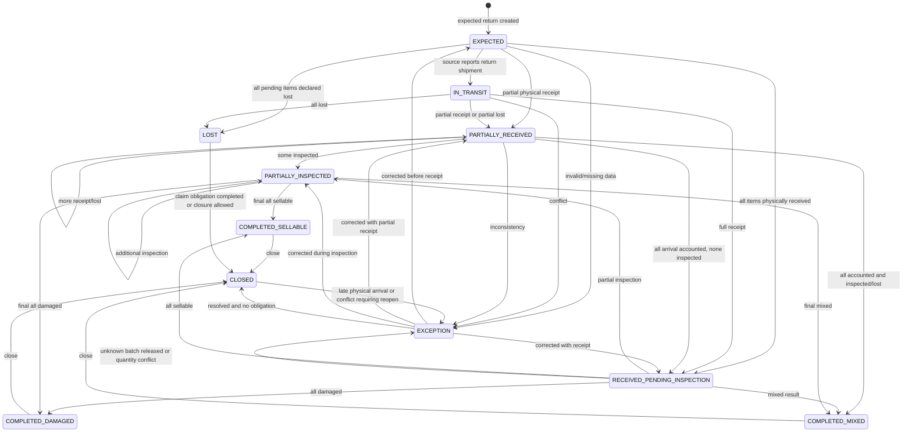
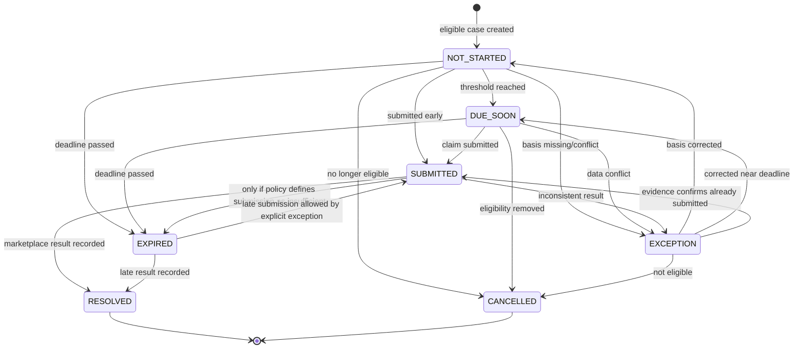

<!--
File: 09-return-and-claim-flow.md
Project: Sistem Rekonsiliasi Stok
Status: Approved design baseline for Phase 1
Version: 1.0.0
Last updated: 2026-07-12
Language: id-ID
Timezone: Asia/Jakarta
Role model: ADMIN only
Primary source: stok-management-system.pdf
Depends on:
  - 01-project-brief.md
  - 02-product-requirements.md
  - 03-business-rules.md
  - 04-stock-ledger-design.md
  - 05-database-schema.md
  - 06-user-roles-and-flows.md
  - 07-marketplace-simulator.md
  - 08-reconciliation-logic.md
-->

# Return and Claim Flow: Sistem Rekonsiliasi Stok

## 1. Tujuan Dokumen

Dokumen ini mendefinisikan alur retur dan klaim untuk Sistem Rekonsiliasi Stok fase 1.

Alur ini harus mampu menangani:

- informasi retur dari Shopee;
- informasi retur dari TikTok Shop;
- retur yang dibuat secara resmi oleh Admin;
- retur penuh;
- retur parsial;
- barang yang masih dalam perjalanan;
- barang yang diterima sebagian;
- barang yang diterima seluruhnya;
- barang layak jual;
- barang rusak;
- barang hilang dalam pengiriman;
- batch asal yang diketahui;
- batch yang tidak dapat diverifikasi;
- event marketplace yang duplikat;
- event yang terlambat atau tidak berurutan;
- klaim TikTok yang mendekati tenggat;
- klaim yang sudah diajukan;
- klaim yang telah selesai;
- klaim yang melewati tenggat;
- rekonsiliasi quantity retur dengan movement stok.

Tujuan utama alur ini bukan sekadar memindahkan status retur. Sistem harus memastikan bahwa:

1. stok hanya bertambah ketika barang benar-benar diterima secara fisik;
2. barang retur tidak langsung menjadi layak jual;
3. keputusan kondisi fisik dibuat setelah inspeksi;
4. setiap quantity memiliki status dan lokasi bucket yang dapat dijelaskan;
5. barang hilang tidak menciptakan stok;
6. klaim tidak mengubah stok;
7. setiap event, penerimaan, inspeksi, perubahan status, dan klaim dapat ditelusuri;
8. retur tidak dapat diproses melebihi quantity outbound yang sah;
9. semua perubahan stok diposting melalui ledger;
10. koreksi kesalahan dilakukan melalui reversal atau command koreksi yang sah.

> **Prinsip utama:** status retur dari marketplace bukan bukti bahwa barang telah kembali ke gudang.

---

## 2. Kedudukan Dokumen

Dokumen ini menjadi sumber kebenaran utama untuk:

- state machine retur;
- state machine klaim;
- pemisahan event marketplace dan kondisi fisik;
- quantity accounting retur;
- penerimaan fisik;
- quarantine;
- inspeksi;
- batch traceability;
- kehilangan;
- pembentukan klaim;
- perhitungan tenggat klaim;
- notifikasi klaim;
- idempotensi;
- koreksi;
- API;
- database amendment;
- UI;
- audit;
- rekonsiliasi;
- pengujian.

Urutan sumber kebenaran:

| Topik | Dokumen |
|---|---|
| Masalah dan keputusan klien | `stok-management-system.pdf` |
| Requirement produk | `02-product-requirements.md` |
| Aturan bisnis | `03-business-rules.md` |
| Ledger | `04-stock-ledger-design.md` |
| Schema baseline | `05-database-schema.md` |
| Role dan flow | `06-user-roles-and-flows.md` |
| Event marketplace simulator | `07-marketplace-simulator.md` |
| Rekonsiliasi | `08-reconciliation-logic.md` |
| Retur dan klaim | Dokumen ini |

Keputusan terbaru:

```text
Hanya ada satu user role aplikasi: ADMIN.
```

Karena itu:

- semua tindakan manusia pada modul retur dilakukan Admin;
- istilah Operator, Viewer, atau Approver dari dokumen lama tidak berlaku;
- proses otomatis dicatat sebagai `SYSTEM_PROCESS`, bukan sebagai user role;
- setiap akun Admin tetap harus individual;
- akun bersama tidak diperbolehkan.

---

## 3. Latar Belakang Operasional

Source proyek menyebut beberapa sumber utama selisih stok:

- pesanan batal setelah barang tercatat keluar;
- retur yang kembali layak jual;
- retur yang kembali rusak;
- retur yang hilang di ekspedisi;
- retur yang tidak pernah kembali;
- pencatatan spreadsheet yang hanya menunjukkan angka, bukan cerita pergerakannya.

Dalam proses lama, kolom `RETUR` dapat dengan mudah dipahami sebagai satu angka masuk.

Dalam sistem baru, satu retur dapat memiliki perjalanan berbeda:

```text
Retur dilaporkan
-> barang belum tiba
-> sebagian barang tiba dan dicatat stock-neutral
-> inspeksi memisahkan layak jual dan rusak
-> bagian layak jual masuk ke batch `RETURN` baru
-> bagian rusak tetap audit-only
-> sebagian tidak pernah tiba
-> klaim dibuat
-> proses selesai
```

Karena itu, satu kolom agregat tidak cukup sebagai source of truth.

Sistem harus dapat menjawab:

- retur berasal dari pesanan apa;
- item apa yang dikirim sebelumnya;
- quantity berapa yang masih dapat diretur;
- batch apa yang keluar;
- barang sudah tiba atau belum;
- quantity mana yang masih pending inspection secara operasional;
- quantity mana yang kembali sellable dan masuk ke batch `RETURN` baru;
- quantity mana yang damaged tanpa movement stok kedua;
- quantity mana yang hilang;
- provenance batch outbound asal;
- kapan klaim harus diajukan dari `return.created_at`;
- event apa yang membentuk perubahan;
- ledger transaction apa yang dihasilkan hanya untuk bagian sellable.

---

## 4. Sasaran

| ID | Sasaran |
|---|---|
| `RET-GOAL-001` | Retur expected tidak mengubah stok fisik. |
| `RET-GOAL-002` | Penerimaan fisik hanya mencatat receipt operasional dan tidak menulis movement stok. |
| `RET-GOAL-003` | `SELLABLE` dan `DAMAGED` hanya ditetapkan melalui inspeksi. |
| `RET-GOAL-004` | Barang hilang dan rusak tidak menghasilkan inbound atau movement stok kedua. |
| `RET-GOAL-005` | Total quantity retur tidak melebihi outbound yang dapat diretur. |
| `RET-GOAL-006` | Retur parsial tetap dapat dilacak per item dan komponen produk satuan. |
| `RET-GOAL-007` | Batch outbound asal disimpan sebagai provenance bila dapat ditelusuri. |
| `RET-GOAL-008` | Hasil sellable selalu masuk ke batch baru bertanda `RETURN`, bukan batch asal. |
| `RET-GOAL-009` | Event duplikat tidak menghasilkan movement ganda. |
| `RET-GOAL-010` | Klaim TikTok memakai `return.created_at` sebagai dasar deadline 40 hari dan menyimpan histori status. |
| `RET-GOAL-011` | Perubahan konfigurasi tidak mengubah deadline historis. |
| `RET-GOAL-012` | Klaim tidak menyimpan nilai uang pada fase 1. |
| `RET-GOAL-013` | Retur dapat direkonsiliasi dengan order, allocation, receipt operasional, inspection, ledger sellable, dan stock position. |
| `RET-GOAL-014` | Admin dapat menyelesaikan alur dari perangkat mobile. |
| `RET-GOAL-015` | Adapter API masa depan tidak mengubah logika retur inti. |

---

## 5. Bukan Tujuan

Fase 1 tidak:

- memproses refund uang;
- menyimpan nilai refund;
- menghitung kompensasi;
- mencatat biaya pengiriman retur;
- menghitung biaya kerusakan;
- mencatat jurnal akuntansi;
- memanggil API marketplace nyata;
- membuat dispute marketplace otomatis;
- mengunggah bukti ke marketplace;
- membuat label retur;
- mengelola chat pembeli;
- memutuskan kebijakan penerimaan refund;
- menilai kualitas produk secara otomatis;
- menganggap status marketplace sebagai hasil inspeksi gudang;
- mengedit ledger lama;
- membuat batch produksi palsu per retur;
- menambah stock karena klaim disetujui;
- menutup retur hanya agar daftar kerja terlihat bersih.

---

## 6. Prinsip Domain

### 6.1 Marketplace State dan Warehouse State Dipisahkan

Marketplace dapat memberi informasi:

```text
RETURN_REQUESTED
RETURN_IN_TRANSIT
RETURN_RECEIVED
RETURN_STATUS_CHANGED
RETURN_CLOSED
```

Gudang menetapkan:

```text
PHYSICALLY_RECEIVED
BATCH_IDENTIFIED
SELLABLE
DAMAGED
LOST
```

Keduanya disimpan terpisah.

`source_status_code` tidak boleh langsung dipakai sebagai `warehouse_status_code`.

### 6.2 Expected Return Bukan Stock

Membuat retur:

```text
EXPECTED
```

hanya menciptakan kewajiban operasional.

Movement:

```text
none
```

### 6.3 Receipt Bersifat Stock-Neutral

Barang yang benar-benar tiba menambah quantity receipt operasional dan pending inspection.

```text
received_qty_operational +qty
ledger movement          0
projection delta         0
```

Receipt tidak boleh membuat inbound ke `QUARANTINE`, `SELLABLE`, atau `DAMAGED`.

### 6.4 Inspection Menentukan Dampak Stok

Sellable:

```text
new RETURN batch / SELLABLE +qty
```

Damaged:

```text
condition audit +qty
ledger movement 0
projection delta 0
```

Pada inspeksi campuran, hanya quantity `SELLABLE` yang menghasilkan inbound fisik.

### 6.5 Lost Tidak Mengubah Stock

Lost:

```text
physical inbound = 0
ledger movement = 0
```

Lost dapat:

- memperbarui quantity accounting;
- membuat exception;
- membuat klaim;
- membuat notifikasi.

### 6.6 Klaim Bukan Inventory Movement

Status klaim:

```text
SUBMITTED
RESOLVED
EXPIRED
```

tidak mengubah stock.

Bila barang muncul kemudian:

- lakukan receipt fisik;
- jangan mengandalkan status klaim sebagai movement;
- tangani konflik operasional dan audit.

### 6.7 Semua Quantity Harus Rekonsiliasi

Untuk setiap return item:

```text
expected_qty
=
pending_arrival_qty
+ received_uninspected_qty
+ sellable_qty
+ damaged_qty
+ lost_qty
```

Tidak boleh ada quantity tanpa kategori.

---

## 7. Terminologi

| Istilah | Definisi |
|---|---|
| Return | Proses pengembalian barang setelah outbound. |
| Return header | Identitas satu kasus retur. |
| Return item | Produk/order item yang termasuk retur. |
| Expected quantity | Quantity yang dilaporkan akan diretur. |
| Returnable quantity | Batas maksimal quantity yang masih sah untuk diretur. |
| Physical receipt | Konfirmasi bahwa barang benar-benar tiba di gudang. |
| Quarantine | Bucket sementara sebelum inspeksi selesai. |
| Inspection | Penilaian kondisi fisik barang yang sudah diterima. |
| Sellable | Barang layak dijual kembali. |
| Damaged | Barang rusak dan tidak tersedia untuk penjualan. |
| Lost | Barang yang tidak pernah diterima secara fisik dan ditetapkan hilang. |
| Pending arrival | Quantity yang masih diharapkan tiba. |
| Pending inspection | Quantity yang sudah diterima tetapi belum diputuskan kondisinya. |
| Source status | Status mentah dari marketplace/simulator/impor. |
| Warehouse status | Status proses fisik internal. |
| Return outcome | Ringkasan hasil quantity akhir. |
| Claim | Kasus pengingat/tindak lanjut atas retur hilang atau exception yang eligible. |
| Claim basis | Tanggal dan kejadian yang menjadi dasar deadline. |
| Deadline snapshot | Deadline yang disimpan saat klaim dibentuk. |
| Evidence | Bukti berupa foto, catatan, tracking, event, dan referensi lain. |
| Original allocation | Batch dan quantity yang dipakai saat outbound. |
| Unidentified return batch | Batch placeholder terkontrol untuk barang quarantine yang lot aslinya belum terverifikasi. |

---

## 8. Sumber Retur

```text
SHOPEE_EVENT
TIKTOK_EVENT
CSV_IMPORT
SIMULATOR
ADMIN_MANUAL
POST_SHIPMENT_CANCELLATION
SYSTEM_EXCEPTION
```

Semua sumber masuk ke canonical command/event.

Perbedaan adapter hanya pada:

- parsing;
- source status mapping;
- source ID;
- timestamp;
- metadata;
- payload hash.

Logika berikut tetap sama:

- returnable quantity;
- receipt;
- batch assignment;
- quarantine;
- inspection;
- lost;
- claim;
- ledger;
- reconciliation.

---

## 9. Canonical Return Event

```ts
type CanonicalReturnEvent = {
  schemaVersion: 1
  organizationId: string
  source:
    | 'SHOPEE_EVENT'
    | 'TIKTOK_EVENT'
    | 'CSV_IMPORT'
    | 'SIMULATOR'
    | 'ADMIN_MANUAL'
    | 'SYSTEM_EXCEPTION'
  channel: 'SHOPEE' | 'TIKTOK_SHOP' | 'MANUAL'
  eventType:
    | 'RETURN_EXPECTED'
    | 'RETURN_IN_TRANSIT'
    | 'RETURN_SOURCE_RECEIVED'
    | 'RETURN_CANCELLED'
    | 'RETURN_LOST'
    | 'RETURN_SOURCE_CLOSED'
  externalEventId?: string
  externalReturnId?: string
  externalOrderId?: string
  occurredAt: string
  receivedAt: string
  correlationId: string
  idempotencyKey: string
  payloadHash: string
  items: Array<{
    externalOrderItemId?: string
    listingSku?: string
    productId?: string
    quantity: number
  }>
  sourceStatus: string
  rawPayload: Record<string, unknown>
}
```

Catatan:

- `RETURN_SOURCE_RECEIVED` berarti marketplace menyebut received;
- ini tidak otomatis sama dengan `PHYSICAL_RECEIPT_CONFIRMED`;
- warehouse receipt tetap command terpisah;
- sistem boleh menawarkan Admin untuk mencocokkan, tetapi tidak mem-posting stok otomatis tanpa keputusan desain eksplisit.

---

## 10. Command Internal

Command utama:

```text
CREATE_EXPECTED_RETURN
MARK_RETURN_IN_TRANSIT
CONFIRM_RETURN_RECEIPT
IDENTIFY_RETURN_BATCH
INSPECT_RETURN
MARK_RETURN_LOST
CLOSE_RETURN
REOPEN_RETURN_EXCEPTION
CREATE_CLAIM
SUBMIT_CLAIM
RESOLVE_CLAIM
EXPIRE_CLAIM
RECALCULATE_CLAIM_NOTIFICATION
REVERSE_RETURN_TRANSACTION
```

Semua mutation:

- server-side;
- tervalidasi;
- idempoten;
- terotorisasi;
- diaudit;
- atomik per command.

---

## 11. Model Status Retur

Status kanonis:

```text
EXPECTED
IN_TRANSIT
PARTIALLY_RECEIVED
RECEIVED_PENDING_INSPECTION
PARTIALLY_INSPECTED
COMPLETED_SELLABLE
COMPLETED_DAMAGED
COMPLETED_MIXED
LOST
CLOSED
EXCEPTION
```

### 11.1 Makna

| Status | Makna |
|---|---|
| `EXPECTED` | Retur tercatat, belum ada physical receipt. |
| `IN_TRANSIT` | Sumber menyatakan barang sedang dikirim kembali. |
| `PARTIALLY_RECEIVED` | Sebagian expected quantity telah diterima/lost, sebagian masih pending arrival. |
| `RECEIVED_PENDING_INSPECTION` | Semua quantity yang tiba masih menunggu inspeksi, tanpa pending arrival. |
| `PARTIALLY_INSPECTED` | Sebagian quantity diterima telah diinspeksi, tetapi masih ada obligation. |
| `COMPLETED_SELLABLE` | Seluruh expected quantity selesai dan hasil akhirnya sellable. |
| `COMPLETED_DAMAGED` | Seluruh expected quantity selesai dan hasil akhirnya damaged. |
| `COMPLETED_MIXED` | Hasil akhir terdiri atas lebih dari satu outcome. |
| `LOST` | Seluruh expected quantity ditetapkan lost dan tidak ada physical receipt. |
| `CLOSED` | Kasus telah ditutup setelah seluruh obligation selesai. |
| `EXCEPTION` | Data atau proses membutuhkan tindakan Admin. |

### 11.2 Status Sumber Tidak Sama dengan Status Kanonis

Contoh:

| Source status | Canonical warehouse effect |
|---|---|
| `RETURN_REQUESTED` | `EXPECTED`; no stock movement |
| `TO_RETURN` | `EXPECTED`/`IN_TRANSIT`; no movement |
| `RETURN_IN_TRANSIT` | `IN_TRANSIT`; no movement |
| `RETURN_RECEIVED` | Source observation; physical confirmation required |
| `CLOSED` | Tidak otomatis `CLOSED` bila warehouse obligation belum selesai |

---

## 12. Derived Status Algorithm

Status sebaiknya dihitung dari quantity dan exception, bukan dipilih bebas dari dropdown.

Precedence:

```text
1. EXCEPTION
2. CLOSED
3. terminal outcome
4. PARTIALLY_INSPECTED
5. RECEIVED_PENDING_INSPECTION
6. PARTIALLY_RECEIVED
7. IN_TRANSIT
8. EXPECTED
```

Pseudo-code:

```text
if active_exception:
  EXCEPTION

else if closed_at is not null:
  CLOSED

else if pending_arrival = 0
    and pending_inspection = 0:
  if lost = expected and received = 0:
    LOST
  else if sellable = expected:
    COMPLETED_SELLABLE
  else if damaged = expected:
    COMPLETED_DAMAGED
  else:
    COMPLETED_MIXED

else if inspected_total > 0:
  PARTIALLY_INSPECTED

else if pending_arrival = 0
    and received_uninspected > 0:
  RECEIVED_PENDING_INSPECTION

else if received_total + lost_total > 0:
  PARTIALLY_RECEIVED

else if source_in_transit:
  IN_TRANSIT

else:
  EXPECTED
```

`CLOSED` menyimpan status penutupan, sedangkan outcome final harus tetap tersedia pada:

```text
outcome_code
```

---

## 13. State Machine Retur



Closed return tidak boleh diedit.

Late arrival:

- membuka exception;
- membuat receipt baru melalui command khusus;
- mempertahankan histori closed sebelumnya;
- tidak menghapus claim history.

---

## 14. Quantity Accounting

Untuk setiap `return_item`:

```text
expected_qty > 0
```

Derived:

```text
received_qty
=
SUM(return_receipt_lines.received_qty)
```

```text
sellable_qty
=
SUM(inspections where condition = SELLABLE)
```

```text
damaged_qty
=
SUM(inspections where condition = DAMAGED)
```

```text
inspected_qty
=
sellable_qty + damaged_qty
```

```text
received_uninspected_qty
=
received_qty - inspected_qty
```

```text
pending_arrival_qty
=
expected_qty - received_qty - lost_qty
```

Invariant:

```text
expected_qty
=
pending_arrival_qty
+ received_uninspected_qty
+ sellable_qty
+ damaged_qty
+ lost_qty
```

Constraints:

```text
expected_qty > 0
received_qty >= 0
sellable_qty >= 0
damaged_qty >= 0
lost_qty >= 0
pending_arrival_qty >= 0
received_uninspected_qty >= 0
received_qty + lost_qty <= expected_qty
inspected_qty <= received_qty
```

---

## 15. Returnable Quantity

Batas retur berasal dari physical outbound, bukan ordered quantity semata.

```text
returnable_qty(order_item)
=
physical_outbound_qty
- active_or_completed_return_expected_qty
+ cancelled_return_qty
```

Catatan:

- reversal outbound mengubah basis;
- duplicate return tidak menambah expected;
- rejected/cancelled return dapat melepas quantity sesuai status;
- return yang sudah closed tetap mengonsumsi returnable quantity;
- quantity tidak boleh dikembalikan dua kali hanya karena marketplace membuat request baru.

Untuk order item bundle:

- return dipecah ke komponen unit sesuai recipe snapshot;
- quantity komponen tidak dihitung dari recipe terbaru;
- source item dan normalized item harus dapat ditelusuri.

---

## 16. Membuat Expected Return

### 16.1 Input

```ts
type CreateExpectedReturnCommand = {
  source: ReturnSource
  channel: 'SHOPEE' | 'TIKTOK_SHOP' | 'MANUAL'
  orderId: string
  externalReturnId?: string
  requestedAt: string
  sourceStatus?: string
  items: Array<{
    orderItemId: string
    expectedQty: number
  }>
  reasonCode?: string
  note?: string
  idempotencyKey: string
  requestHash: string
}
```

### 16.2 Validasi

- Admin aktif atau system process terotorisasi;
- organisasi sama;
- order ada;
- order pernah physical outbound;
- item milik order;
- expected quantity positif;
- total tidak melebihi returnable;
- source event valid;
- external return ID unik sesuai scope;
- idempotency valid;
- tidak ada payload conflict.

### 16.3 Efek

- buat return header;
- buat return items;
- simpan source snapshot;
- append return event;
- update order obligation;
- tidak membuat ledger;
- tidak mengubah projection;
- audit.

### 16.4 Hasil

```text
status = EXPECTED
stock_effect = NONE
```

---

## 17. Return in Transit

Event `RETURN_IN_TRANSIT`:

- memperbarui source timeline;
- dapat menyimpan tracking reference;
- dapat menyimpan estimated arrival;
- tidak mengubah stock;
- tidak mengubah batch;
- tidak otomatis membuat claim;
- tidak menutup return.

Data:

```text
carrier_code
tracking_ref_masked
source_shipped_at
estimated_arrival_at
```

Jangan menyimpan credential/logistics secret.

---

## 18. Penerimaan Fisik

### 18.1 Prinsip

Physical receipt adalah tindakan gudang.

Marketplace notification hanya dapat:

- menjadi evidence;
- memunculkan task;
- mengisi saran;
- tidak mem-posting movement tanpa kebijakan eksplisit.

### 18.2 Command

```ts
type ConfirmReturnReceiptCommand = {
  returnId: string
  receivedAt: string
  receiptReference?: string
  items: Array<{
    returnItemId: string
    receivedQty: number
    batchIdentification: {
      mode: 'ORIGINAL_ALLOCATION' | 'SCANNED' | 'MANUAL_VERIFIED' | 'UNIDENTIFIED'
      batchId?: string
      evidence?: Record<string, unknown>
    }
  }>
  note?: string
  evidenceIds?: string[]
  idempotencyKey: string
  requestHash: string
}
```

### 18.3 Validasi

- return dapat menerima barang;
- quantity > 0;
- total receipt tidak melebihi pending arrival;
- received time valid;
- batch milik product yang sama;
- batch original allocation sesuai;
- unidentified batch mengikuti policy;
- evidence reference valid;
- idempotency.

### 18.4 Posting Ledger

Transaction:

```text
transaction_type = RETURN_RECEIPT
source_type = RETURN
source_id = return_id
```

Entry:

```text
QUARANTINE +received_qty
```

Tidak ada sellable entry.

### 18.5 Atomicity

Dalam satu transaction:

- lock return;
- lock return items;
- recheck pending quantity;
- resolve batch;
- create receipt;
- create receipt lines;
- create stock transaction;
- create ledger entries;
- update projections;
- append return event;
- update derived status;
- audit;
- commit.

Semua berhasil atau rollback.

---

## 19. Partial Receipt

Contoh:

```text
expected = 10
receipt 1 = 4
receipt 2 = 3
lost = 3
```

Hasil:

```text
received = 7
lost = 3
pending arrival = 0
```

Setiap receipt:

- memiliki nomor;
- waktu;
- actor;
- line;
- batch;
- transaction;
- idempotency key.

Tidak boleh menimpa `received_qty` agregat secara manual.

---

## 20. Batch Traceability

### 20.1 Urutan Resolusi

1. original outbound allocation;
2. batch barcode/label yang terbaca;
3. verifikasi Admin menggunakan evidence;
4. controlled unidentified return batch.

### 20.2 Original Allocation

Jika outbound item berasal dari:

```text
Batch A: 3
Batch B: 2
```

dan return quantity 4:

sistem menampilkan kandidat asal.

Admin tidak bebas mengubah ke batch lain tanpa:

- alasan;
- evidence;
- audit.

### 20.3 Controlled Unidentified Return Batch

Jika batch asal tidak dapat diverifikasi:

- jangan membuat placeholder batch inventory;
- receipt tetap stock-neutral;
- simpan provenance sebagai `UNKNOWN`;
- hasil `SELLABLE` ditolak sampai provenance terverifikasi;
- hasil `DAMAGED` tetap dapat dicatat tanpa movement stok;
- penyelesaian provenance harus melalui audit event, bukan edit diam-diam.

Contoh status:

```text
batch_provenance_status = UNKNOWN
```

### 20.4 Identifikasi Setelah Receipt

Ketika batch outbound asal terverifikasi, sistem memperbarui provenance return item secara auditabel. Tidak ada reclassification ledger karena receipt tidak pernah membuat saldo batch.

Pada hasil `SELLABLE`, server membuat destination batch baru:

```text
batch_kind = RETURN
original_outbound_batch_id = verified batch, jika tersedia
```

Lalu server memposting satu inbound ke destination batch tersebut.

### 20.5 Larangan

Provenance retur:

- tidak boleh direkayasa menjadi batch produksi palsu;
- batch asal tidak boleh dipakai sebagai destination inbound retur;
- hasil `DAMAGED` tidak boleh membuat batch stok;
- destination batch `RETURN` hanya dibuat untuk quantity `SELLABLE`.

---

## 21. Inspeksi

### 21.1 Hasil

Fase 1:

```text
SELLABLE
DAMAGED
```

`LOST` bukan hasil inspeksi barang yang telah diterima.

Lost hanya untuk pending arrival yang tidak pernah tiba.

### 21.2 Command

```ts
type InspectReturnCommand = {
  returnId: string
  inspectedAt: string
  lines: Array<{
    returnItemId: string
    condition: 'SELLABLE' | 'DAMAGED'
    quantity: number
    note?: string
    evidenceIds?: string[]
  }>
  idempotencyKey: string
  requestHash: string
}
```

### 21.3 Validasi

- quantity > 0;
- quantity tidak melebihi uninspected received;
- return item/product cocok;
- provenance batch asal tervalidasi bila tersedia;
- destination batch dibuat server hanya untuk `SELLABLE`;
- condition valid;
- actor dan waktu tersedia;
- idempotency dan atomic rollback.

### 21.4 Sellable

Transaction:

```text
RETURN_SELLABLE_INBOUND
```

Entry:

```text
new RETURN batch / SELLABLE +qty
```

Batch outbound asal hanya disimpan sebagai provenance.

### 21.5 Damaged

```text
transaction     = none
ledger movement = 0
projection delta = 0
```

Kondisi rusak tetap disimpan untuk audit, klaim, dan keputusan loss/disposal berikutnya tanpa menulis movement kedua.

### 21.6 Mixed Inspection

Satu return item dapat menghasilkan:

```text
SELLABLE 6
DAMAGED 2
```

Boleh dalam:

- satu command dengan dua lines;
- beberapa inspection command.

Semua inspection record append-only.

---

## 22. Hasil Rusak

Barang `DAMAGED`:

- tetap tercatat sebagai fisik;
- tidak available;
- tidak eligible FEFO;
- dapat diproses disposal kemudian;
- tidak otomatis keluar dari stock saat inspeksi.

Pemusnahan:

```text
DAMAGED -qty
```

menggunakan transaction terpisah:

```text
DISPOSAL_DAMAGED
```

Inspeksi rusak bukan pemusnahan. Dua kejadian fisik berbeda, jadi ledger juga berbeda. Konsep ini tampaknya harus terus dijelaskan karena manusia sangat menikmati tombol serbaguna.

---

## 23. Lost

### 23.1 Syarat

Lost hanya dapat diterapkan pada:

```text
pending_arrival_qty
```

Tidak pada quantity yang sudah received.

### 23.2 Command

```ts
type MarkReturnLostCommand = {
  returnId: string
  declaredLostAt: string
  items: Array<{
    returnItemId: string
    lostQty: number
  }>
  reasonCode: string
  claimEligibility: 'ELIGIBLE' | 'NOT_ELIGIBLE' | 'UNKNOWN'
  claimBasisCode?: string
  claimBasisAt?: string
  note: string
  evidenceIds?: string[]
  idempotencyKey: string
  requestHash: string
}
```

### 23.3 Efek

- update quantity lost;
- update status;
- append event;
- create exception if eligibility unknown;
- optionally create claim;
- create notification schedule;
- no ledger;
- no projection change.

### 23.4 Late Arrival

Jika barang marked lost kemudian tiba:

1. return menjadi `EXCEPTION`;
2. Admin membuka late-arrival flow;
3. physical receipt dicatat stock-neutral;
4. lost quantity dikurangi melalui audited correction event;
5. claim tetap memiliki histori;
6. jika claim sudah resolved, buat operational warning;
7. inspeksi sellable, bila terjadi, membuat inbound ke batch `RETURN` baru;
8. tidak menghapus event lost lama.

---

## 24. Retur Dibatalkan

Return request dapat dibatalkan sebelum obligation fisik selesai.

Aturan:

- quantity yang belum received/lost dapat dilepas;
- quantity yang sudah received tidak dapat dibatalkan;
- movement yang sudah terjadi tidak dihapus;
- external cancellation disimpan;
- close hanya jika tidak ada obligation;
- returnable quantity dihitung ulang.

Status/events:

```text
RETURN_CANCELLED
```

Jika sebagian sudah received:

```text
EXCEPTION
```

atau partial cancellation dengan reason eksplisit.

---

## 25. Menutup Retur

Return dapat ditutup bila:

```text
pending_arrival_qty = 0
received_uninspected_qty = 0
active_exception_count = 0
```

Dan untuk lost:

- claim tidak wajib selesai bila policy mengizinkan closure terpisah;
- tetapi claim obligation harus tetap terlihat;
- order tidak boleh dianggap bebas obligation bila claim masih aktif, sesuai konfigurasi.

Close command menyimpan:

- final quantity summary;
- final outcome;
- close reason;
- actor;
- time;
- related claim status;
- evidence;
- rule version.

Closed return read-only.

Koreksi memakai reopen exception + command baru.

---

## 26. Retur Manual

Admin dapat membuat retur manual bila:

- source event tidak tersedia;
- data marketplace diimpor terlambat;
- kasus offline;
- exception operasional.

Wajib:

- channel;
- order;
- item;
- quantity;
- reason;
- requested at;
- source reference;
- note;
- audit.

Manual return tidak boleh digunakan untuk:

- menambah stok tanpa order/outbound;
- menutupi initial balance;
- menggantikan stocktake adjustment;
- mengakali missing receipt.

Unexpected physical return tanpa order menjadi exception workflow terpisah.

---

## 27. Unexpected Return

Barang fisik datang tetapi order tidak ditemukan.

Status:

```text
UNMATCHED_RETURN_EXCEPTION
```

Default:

- tidak langsung membuat sellable;
- identifikasi product wajib;
- masuk controlled quarantine only setelah Admin membuat receipt exception;
- source reference disimpan;
- investigation task dibuat;
- tidak mengarang order.

Pilihan penyelesaian:

1. cocokkan ke order yang ditemukan;
2. cocokkan ke manual outbound;
3. tandai source tidak diketahui dan tahan quarantine;
4. tangani melalui stocktake/investigation jika benar-benar tidak dapat dijelaskan.

---

## 28. Event Marketplace Duplikat

Unique scope:

```text
organization_id
channel_id
external_return_id
external_event_id
```

Duplicate identik:

```text
no new return
no new receipt
no new ledger
return existing result
```

Payload conflict:

```text
REJECTED
IDEMPOTENCY_PAYLOAD_MISMATCH
```

Simpan conflict evidence.

---

## 29. Event Out-of-Order

Contoh:

### 29.1 Closed Event Sebelum Expected

- simpan source event;
- tandai rejected/held;
- jangan membuat stock;
- buat exception;
- process kembali setelah reference tersedia bila policy.

### 29.2 Source Received Sebelum In Transit

Boleh disimpan.

Tetapi:

- tidak otomatis physical receipt;
- Admin tetap mengonfirmasi barang;
- status source timeline dapat melompat.

### 29.3 Expected Datang Setelah Physical Receipt Exception

- cocokkan ke unmatched return;
- jangan membuat receipt kedua;
- gunakan correlation/idempotency;
- audit merge.

### 29.4 Lost Setelah Received

- tolak quantity yang sudah received;
- hanya pending arrival dapat lost;
- error `LOST_QTY_EXCEEDS_PENDING`.

---

## 30. Claim Scope

Klaim fase 1 berfungsi untuk:

- menandai kasus retur hilang/exception;
- menghitung dan menampilkan tenggat;
- mengingatkan Admin;
- menyimpan status pengajuan;
- menyimpan referensi eksternal;
- menyimpan hasil;
- mempertahankan audit.

Klaim tidak:

- menyimpan nilai kompensasi;
- mem-posting uang;
- menambah stock;
- menutup retur secara otomatis;
- mengeksekusi API marketplace.

---

## 31. Claim Eligibility

Default claim type:

```text
LOST_RETURN
```

Tipe extensible:

```text
PARTIAL_RETURN_MISSING
DAMAGED_IN_TRANSIT
OTHER_RETURN_EXCEPTION
```

Eligibility:

```text
ELIGIBLE
NOT_ELIGIBLE
UNKNOWN
```

Claim hanya dibuat bila:

- return ada;
- item/quantity dapat diidentifikasi;
- case memenuhi rule;
- tanggal dasar tersedia atau status exception dibentuk;
- belum ada claim aktif yang identik;
- organization/channel benar.

---

## 32. Deadline Policy

### 32.1 Sumber Deadline

Urutan prioritas:

1. explicit deadline dari source marketplace;
2. deadline hasil konfigurasi berdasarkan claim basis;
3. exception bila tidak dapat dihitung.

### 32.2 Default Proyek

Source proyek menetapkan kebutuhan pengingat klaim TikTok sebelum batas 40 hari.

Default internal:

```text
claim_window_days = 40
```

Angka ini:

- configurable;
- disimpan sebagai snapshot per claim;
- tidak dianggap aturan universal semua market/API;
- tidak mengubah claim existing bila konfigurasi berubah.

### 32.3 Claim Basis

Untuk TikTok, basis final adalah waktu pembuatan retur internal:

```text
claim_basis_code = RETURN_CREATED_AT
claim_basis_at   = operations.returns.created_at
```

Basis lain tidak boleh dipilih untuk countdown TikTok 40 hari. Nilai tersebut disalin ke snapshot klaim agar perubahan data atau policy berikutnya tidak mengubah histori.

Jika relasi retur tidak valid, pembuatan klaim harus gagal; deadline tidak boleh ditebak dari shipment, expected arrival, atau lost declaration.

### 32.4 Perhitungan

```text
basis_local = operations.returns.created_at in Asia/Jakarta
deadline_at = basis_local + 40 calendar days
deadline_source = INTERNAL_RETURN_CREATED_AT
```

Simpan:

```text
claim_basis_code
claim_basis_at
deadline_source
deadline_policy_version
window_days_snapshot
timezone_snapshot
deadline_at
```

### 32.5 Calendar Day

Default:

```text
calendar days
timezone = Asia/Jakarta
```

Detail apakah deadline berada pada exact timestamp atau akhir tanggal harus configurable dan disetujui.

---

## 33. Claim Status

Status minimum:

```text
NOT_STARTED
DUE_SOON
SUBMITTED
RESOLVED
EXPIRED
EXCEPTION
CANCELLED
```

Resolution:

```text
APPROVED
REJECTED
PARTIALLY_APPROVED
NO_ACTION
OTHER
```

Tidak ada field nominal uang.

### 33.1 Derived dan Manual

`DUE_SOON` dapat dihitung dari:

```text
current time >= notification threshold
and current time < deadline
and claim not submitted/resolved/cancelled
```

`EXPIRED`:

```text
current time > deadline
and claim not submitted/resolved/cancelled
```

`SUBMITTED`, `RESOLVED`, `CANCELLED` memerlukan command.

---

## 34. State Machine Klaim



Tidak ada transisi claim yang mem-posting ledger.

---

## 35. Create Claim

Command:

```ts
type CreateClaimCommand = {
  returnId: string
  claimType: 'LOST_RETURN' | 'PARTIAL_RETURN_MISSING' | 'DAMAGED_IN_TRANSIT' | 'OTHER_RETURN_EXCEPTION'
  basisCode: string
  basisAt?: string
  marketplaceDeadlineAt?: string
  affectedItems: Array<{
    returnItemId: string
    quantity: number
  }>
  note?: string
  evidenceIds?: string[]
  idempotencyKey: string
  requestHash: string
}
```

Validasi:

- channel TikTok untuk default deadline rule;
- return/quantity eligible;
- no duplicate active claim;
- affected quantity > 0;
- affected quantity tidak melebihi lost/exception;
- basis/deadline policy valid;
- no money field;
- Admin/system authorized.

Efek:

- create claim;
- snapshot deadline policy;
- create claim items;
- append claim event;
- schedule notifications;
- audit;
- no stock movement.

---

## 36. Submit Claim

Command input:

```text
claim_id
submitted_at
external_claim_ref
note
evidence
idempotency
```

Validasi:

- claim belum resolved/cancelled;
- deadline status ditampilkan;
- external reference format aman;
- evidence optional/configurable;
- actor Admin.

Efek:

```text
status = SUBMITTED
submitted_at = input
```

Notifikasi due dapat ditutup.

No ledger.

---

## 37. Resolve Claim

Input:

```text
claim_id
resolved_at
resolution_code
external_claim_ref
note
evidence
```

Efek:

```text
status = RESOLVED
```

Tetap:

```text
stock effect = none
```

Bila hasil menyebut parcel ditemukan:

- jangan otomatis receive;
- buat task physical verification;
- hanya physical receipt yang menambah quarantine.

---

## 38. Expire Claim

Scheduler atau manual evaluation:

```text
now > deadline_at
and status in (NOT_STARTED, DUE_SOON)
```

Efek:

- status `EXPIRED`;
- notification critical/high sesuai policy;
- issue rekonsiliasi/operasional;
- no stock movement.

Jika deadline null:

```text
EXCEPTION
```

bukan expired.

---

## 39. Notification Policy

Default thresholds dapat dikonfigurasi:

```text
14 days before
7 days before
3 days before
1 day before
due date
overdue
```

Ini contoh default aplikasi, bukan kebijakan marketplace.

Dedupe key:

```text
claim:{claim_id}:threshold:{threshold_code}
```

Notification status:

```text
PENDING
SENT
READ
DISMISSED
CANCELLED
```

Notification tidak dibuat bila:

- claim resolved;
- claim cancelled;
- threshold event sudah dibuat;
- deadline null;
- user tidak berada di organization.

---

## 40. Reminder Calculation

Pseudo-code:

```text
for each active claim:
  if deadline_at is null:
    create/update basis-missing exception
    continue

  remaining = deadline_at - now

  if now > deadline_at:
    set EXPIRED if allowed
    ensure overdue notification
  else:
    find crossed thresholds
    create missing notifications idempotently
```

Timezone:

```text
Asia/Jakarta
```

Database menyimpan:

```text
timestamptz UTC
```

UI menampilkan waktu lokal.

---

## 41. Ledger Posting Matrix

| Kejadian | Transaction type | Entry |
|---|---|---|
| Expected return | None | None |
| Return in transit | None | None |
| Physical receipt | None | None; receipt operasional |
| Provenance correction | None | None; audit event |
| Inspection sellable | `RETURN_SELLABLE_INBOUND` | batch `RETURN` baru / `SELLABLE +qty` |
| Inspection damaged | None | None; audit kondisi fisik |
| Mark lost | None | None |
| Create claim | None | None |
| Submit claim | None | None |
| Resolve claim | None | None |
| Correct receipt quantity | None | Audited correction event; tidak ada ledger reversal |
| Reverse sellable inspection | `REVERSAL` | Kebalikan inbound sellable asal |

---

## 42. Reversal

### 42.1 Receipt Salah

Contoh receipt 5, seharusnya 3:

- append audited receipt correction sebesar `-2`;
- perbarui derived received dan pending inspection secara atomic;
- jangan membuat ledger reversal karena receipt Phase 2 tidak pernah membuat movement;
- jangan mengedit atau menghapus event receipt asli.

### 42.2 Inspection Salah

Contoh: 4 unit sudah diposting `SELLABLE`, tetapi hasil audit berikutnya menetapkan kondisi `DAMAGED`.

Koreksi wajib:

1. reverse quantity 4 dari transaction `RETURN_SELLABLE_INBOUND` asli;
2. reversal mengurangi `SELLABLE` pada batch `RETURN` yang sama;
3. append correction event yang menetapkan kondisi `DAMAGED`;
4. correction `DAMAGED` tidak membuat inbound, transfer bucket, atau movement stok kedua;
5. event inspeksi dan ledger asli tetap immutable.

Entry reversal:

```text
return batch / SELLABLE -4
```

Jika quantity sellable sudah teralokasi atau keluar, reversal ditolak dan kasus masuk exception untuk penyelesaian audit.

### 42.3 Constraints

- reversal tidak melebihi original;
- downstream stock harus cukup;
- bila sellable sudah terjual, reversal dapat ditolak dan menjadi exception;
- semua correction mempunyai reason dan audit.

---

## 43. Order Integration

Order obligation:

```text
has_open_return
has_open_claim
```

Order tidak boleh `CLOSED` bila:

- return pending;
- receipt pending;
- inspection pending;
- exception aktif;
- claim obligation dikonfigurasi sebagai blocking.

Pembatalan setelah physical outbound:

```text
CANCELLED_POST_SHIPMENT
-> RETURN_EXPECTED or EXCEPTION
```

Tidak:

```text
auto restock
```

---

## 44. Marketplace Mapping

### 44.1 Shopee

Adapter dapat menerima:

- order status push;
- return/refund change push;
- return detail;
- source status;
- return solution;
- proof/dispute status.

Internal effect:

- buat/update expected return;
- update source timeline;
- tidak memutuskan kondisi fisik;
- tidak mem-posting receipt tanpa warehouse confirmation.

### 44.2 TikTok Shop

Adapter dapat menerima:

- return/refund/cancel data;
- return status webhook;
- order status webhook;
- source deadline bila tersedia.

Internal effect sama:

- normalize event;
- update expected/source state;
- warehouse receipt tetap terpisah;
- deadline source marketplace disimpan bila tersedia;
- default project rule dipakai hanya jika explicit deadline tidak tersedia dan basis sah.

### 44.3 Versioning

Simpan:

```text
adapter_version
source_schema_version
mapping_version
```

Perubahan source status mapping harus diuji.

---

## 45. Database Schema Baseline

Baseline dari `05-database-schema.md`:

```text
returns.returns
returns.return_items
returns.return_inspections
returns.claims
```

Dokumen ini merekomendasikan perluasan berikut.

---

## 46. `returns.returns`

Kolom:

| Kolom | Tipe | Keterangan |
|---|---|---|
| `id` | `uuid` | PK |
| `organization_id` | `uuid` | Organization |
| `return_no` | `text` | Nomor internal |
| `channel_id` | `uuid` | Shopee/TikTok/Manual |
| `order_id` | `uuid` | Order asal |
| `external_return_id` | `text` | ID source |
| `source_code` | `text` | Sumber |
| `source_status_code` | `text` | Status mentah terbaru |
| `status_code` | `text` | Status kanonis |
| `outcome_code` | `text` | Outcome final/derived |
| `reason_code` | `text` | Alasan |
| `requested_at` | `timestamptz` | Waktu expected |
| `source_in_transit_at` | `timestamptz` | Waktu sumber |
| `first_received_at` | `timestamptz` | Receipt pertama |
| `fully_accounted_at` | `timestamptz` | Semua qty accounted |
| `closed_at` | `timestamptz` | Closed |
| `exception_code` | `text` | Exception |
| `created_by` | `uuid` | Actor |
| `created_at` | `timestamptz` | Audit |
| `updated_at` | `timestamptz` | Audit |
| `version_no` | `bigint` | Optimistic concurrency |

Unique:

```sql
create unique index uidx_returns_external
on returns.returns (
  organization_id,
  channel_id,
  external_return_id
)
where external_return_id is not null;
```

---

## 47. `returns.return_items`

Recommended fields:

```text
id
return_id
order_item_id
product_id
source_item_ref
expected_qty
lost_qty
cancelled_qty
batch_identification_status_code
created_at
updated_at
version_no
```

`received_qty`, `sellable_qty`, dan `damaged_qty` sebaiknya:

- derived dari child tables/ledger;
- atau cached projection yang dapat dibangun ulang;
- tidak diedit langsung.

Check:

```sql
check (expected_qty > 0);
check (lost_qty >= 0);
check (cancelled_qty >= 0);
check (lost_qty + cancelled_qty <= expected_qty);
```

---

## 48. `returns.return_events`

Tabel append-only:

```sql
create table returns.return_events (
  id uuid primary key default gen_random_uuid(),
  organization_id uuid not null,
  return_id uuid not null references returns.returns(id),
  event_type_code text not null,
  source_code text not null,
  source_status_code text,
  external_event_id text,
  occurred_at timestamptz not null,
  received_at timestamptz not null default now(),
  payload jsonb not null default '{}'::jsonb,
  payload_hash text,
  idempotency_key text,
  actor_type_code text not null,
  actor_user_id uuid,
  correlation_id uuid not null,
  created_at timestamptz not null default now()
);
```

Unique:

```sql
create unique index uidx_return_events_external
on returns.return_events (
  organization_id,
  source_code,
  external_event_id
)
where external_event_id is not null;
```

---

## 49. `returns.return_receipts`

```sql
create table returns.return_receipts (
  id uuid primary key default gen_random_uuid(),
  organization_id uuid not null,
  return_id uuid not null references returns.returns(id),
  receipt_no text not null,
  received_at timestamptz not null,
  receipt_reference text,
  status_code text not null default 'POSTED',
  stock_transaction_id uuid not null,
  idempotency_key text not null,
  request_hash text not null,
  note text,
  created_by uuid not null,
  created_at timestamptz not null default now(),
  unique (organization_id, receipt_no),
  unique (organization_id, idempotency_key)
);
```

Posted receipt immutable.

---

## 50. `returns.return_receipt_lines`

```sql
create table returns.return_receipt_lines (
  id uuid primary key default gen_random_uuid(),
  organization_id uuid not null,
  return_receipt_id uuid not null
    references returns.return_receipts(id),
  return_item_id uuid not null
    references returns.return_items(id),
  product_id uuid not null,
  batch_id uuid not null,
  batch_identification_mode_code text not null,
  received_qty bigint not null,
  evidence_metadata jsonb not null default '{}'::jsonb,
  created_at timestamptz not null default now(),
  check (received_qty > 0)
);
```

FK composite product/batch wajib.

---

## 51. `returns.return_inspections`

Tambahan rekomendasi:

```text
organization_id
batch_id
condition_code
inspected_qty
transaction_id
idempotency_key
request_hash
reversal_status
```

Unique idempotency.

Inspections append-only.

---

## 52. `returns.return_batch_identifications`

```sql
create table returns.return_batch_identifications (
  id uuid primary key default gen_random_uuid(),
  organization_id uuid not null,
  return_item_id uuid not null references returns.return_items(id),
  from_batch_id uuid not null,
  to_batch_id uuid not null,
  identified_qty bigint not null,
  identification_method_code text not null,
  stock_transaction_id uuid not null,
  evidence_metadata jsonb not null default '{}'::jsonb,
  identified_by uuid not null,
  identified_at timestamptz not null,
  created_at timestamptz not null default now(),
  check (identified_qty > 0),
  check (from_batch_id <> to_batch_id)
);
```

---

## 53. `returns.claims`

Recommended fields:

```text
id
organization_id
return_id
channel_id
claim_no
claim_type_code
eligibility_code
status_code
resolution_code
claim_basis_code
claim_basis_at
deadline_source_code
deadline_policy_version
window_days_snapshot
timezone_snapshot
deadline_at
submitted_at
resolved_at
external_claim_ref
exception_code
note
created_by
created_at
updated_at
version_no
```

Dilarang menambah:

```text
claim_amount
refund_amount
compensation_value
```

pada fase 1.

---

## 54. `returns.claim_items`

```sql
create table returns.claim_items (
  id uuid primary key default gen_random_uuid(),
  organization_id uuid not null,
  claim_id uuid not null references returns.claims(id),
  return_item_id uuid not null references returns.return_items(id),
  claimed_qty bigint not null,
  created_at timestamptz not null default now(),
  check (claimed_qty > 0),
  unique (claim_id, return_item_id)
);
```

---

## 55. `returns.claim_events`

Append-only:

```sql
create table returns.claim_events (
  id uuid primary key default gen_random_uuid(),
  organization_id uuid not null,
  claim_id uuid not null references returns.claims(id),
  event_type_code text not null,
  from_status_code text,
  to_status_code text not null,
  occurred_at timestamptz not null,
  actor_type_code text not null,
  actor_user_id uuid,
  note text,
  evidence_metadata jsonb not null default '{}'::jsonb,
  idempotency_key text,
  request_hash text,
  created_at timestamptz not null default now()
);
```

---

## 56. Evidence

Evidence metadata:

```text
PHOTO
TRACKING
MARKETPLACE_EVENT
WAREHOUSE_NOTE
BATCH_LABEL
PACKAGE_LABEL
VIDEO
DOCUMENT
OTHER
```

File binary tidak disimpan dalam JSONB.

Simpan:

- storage object ID;
- mime type;
- checksum;
- created by;
- created at;
- entity link;
- description.

Jangan simpan public URL permanen untuk bukti sensitif.

---

## 57. Views

Recommended:

```text
api.return_work_queue
api.return_details
api.return_item_quantity_positions
api.return_receipt_history
api.return_inspection_history
api.claim_work_queue
api.claim_deadline_alerts
api.return_ledger_trace
```

### 57.1 Return Work Queue

Field:

```text
return_no
channel
order_no
status
pending_arrival
pending_inspection
lost
oldest_pending_since
claim_status
exception
```

### 57.2 Claim Work Queue

Field:

```text
claim_no
return_no
status
deadline_at
days_remaining
eligibility
basis
submitted_at
resolution
```

---

## 58. Database Functions

Public domain functions:

```text
api.create_expected_return
api.mark_return_in_transit
api.receive_return
api.identify_return_batch
api.inspect_return
api.mark_return_lost
api.close_return
api.create_return_claim
api.submit_return_claim
api.resolve_return_claim
api.reverse_return_transaction
api.get_return_preview
```

Amendment:

Semua role minimum lama diganti menjadi:

```text
ADMIN
SYSTEM_PROCESS
```

---

## 59. API Routes

Recommended:

```text
POST /api/admin/returns
GET  /api/admin/returns
GET  /api/admin/returns/:returnId
POST /api/admin/returns/:returnId/receive
POST /api/admin/returns/:returnId/identify-batch
POST /api/admin/returns/:returnId/inspect
POST /api/admin/returns/:returnId/mark-lost
POST /api/admin/returns/:returnId/close
POST /api/admin/returns/:returnId/reopen
POST /api/admin/returns/:returnId/claims
GET  /api/admin/claims
GET  /api/admin/claims/:claimId
POST /api/admin/claims/:claimId/submit
POST /api/admin/claims/:claimId/resolve
```

Mutation tidak menggunakan GET.

---

## 60. Response Contract

Success:

```json
{
  "success": true,
  "data": {
    "returnId": "uuid",
    "status": "RECEIVED_PENDING_INSPECTION",
    "stockTransactionId": "uuid",
    "ledgerSeqFrom": 123,
    "ledgerSeqTo": 124
  },
  "correlationId": "uuid"
}
```

Error:

```json
{
  "success": false,
  "error": {
    "code": "RETURN_RECEIVED_EXCEEDS_EXPECTED",
    "message": "Jumlah diterima melebihi sisa retur yang diharapkan.",
    "fieldErrors": {
      "items.0.receivedQty": "Maksimum 2 unit."
    }
  },
  "correlationId": "uuid"
}
```

Jangan mengirim stack trace.

---

## 61. Concurrency

Lock order:

1. return header;
2. return items urut ID;
3. stock positions urut product;
4. batches urut deterministic;
5. idempotency command.

Skenario:

- dua Admin menerima retur sama bersamaan;
- kedua request membaca pending 5;
- request A menerima 5;
- request B harus recheck dan ditolak/idempoten;
- quantity tidak boleh menjadi 10.

Gunakan row lock dan transaction.

---

## 62. Idempotency Keys

Examples:

```text
return:create:{source}:{external_return_id}
return:receipt:{return_id}:{client_command_id}
return:inspect:{return_id}:{client_command_id}
return:lost:{return_id}:{client_command_id}
claim:create:{return_id}:{claim_type}:{basis}
claim:submit:{claim_id}:{client_command_id}
claim:resolve:{claim_id}:{client_command_id}
```

Identical hash:

```text
return existing result
```

Different hash:

```text
IDEMPOTENCY_PAYLOAD_MISMATCH
```

---

## 63. Validation Matrix

| Command | Required validations |
|---|---|
| Create expected | outbound reference, returnable qty, duplicate |
| Receive | pending qty, batch, quarantine, idempotency |
| Identify batch | placeholder qty, product match, evidence |
| Inspect | received uninspected, verified batch, bucket balance |
| Lost | pending arrival, eligibility, reason |
| Close | no pending, no exception |
| Create claim | eligible lost/exception qty, basis/deadline |
| Submit claim | active status, reference |
| Resolve claim | submitted/valid exception, outcome |
| Reverse | original reference, downstream balance |

---

## 64. Error Codes

| Code | Meaning |
|---|---|
| `RETURN_NOT_FOUND` | Return tidak ditemukan |
| `RETURN_SOURCE_REFERENCE_REQUIRED` | Referensi outbound tidak ada |
| `RETURN_EXCEEDS_OUTBOUND` | Expected melebihi returnable |
| `RETURN_DUPLICATE` | Return identik sudah ada |
| `RETURN_PAYLOAD_CONFLICT` | ID sama, payload berbeda |
| `RETURN_INVALID_STATUS_TRANSITION` | Transisi tidak legal |
| `RETURN_RECEIVED_EXCEEDS_EXPECTED` | Receipt melebihi pending |
| `RETURN_BYPASSED_QUARANTINE` | Receipt mencoba masuk sellable |
| `RETURN_BATCH_PRODUCT_MISMATCH` | Batch bukan product item |
| `RETURN_BATCH_UNVERIFIED` | Batch belum terverifikasi |
| `RETURN_UNIDENTIFIED_BATCH_RELEASED` | Placeholder mencoba keluar quarantine |
| `RETURN_INSPECTION_WITHOUT_RECEIPT` | Inspeksi tanpa receipt |
| `RETURN_INSPECTION_EXCEEDS_RECEIVED` | Inspection terlalu besar |
| `RETURN_LOST_EXCEEDS_PENDING` | Lost melebihi pending arrival |
| `RETURN_LOST_CREATED_STOCK` | Lost membuat movement |
| `RETURN_QUANTITY_RECONCILIATION_FAILED` | Quantity tidak balance |
| `RETURN_PARTIAL_CLOSED` | Return ditutup terlalu dini |
| `RETURN_POSTED_EDIT_FORBIDDEN` | Posted record diedit |
| `RETURN_REVERSE_DOWNSTREAM_CONFLICT` | Reversal konflik stock downstream |
| `CLAIM_NOT_ELIGIBLE` | Case tidak eligible |
| `CLAIM_DUPLICATE_ACTIVE` | Claim aktif duplikat |
| `CLAIM_BASIS_DATE_MISSING` | Basis deadline tidak ada |
| `CLAIM_DEADLINE_INVALID` | Perhitungan deadline invalid |
| `CLAIM_HISTORICAL_DEADLINE_MUTATION` | Deadline existing diubah diam-diam |
| `CLAIM_INVALID_STATUS_TRANSITION` | Transisi klaim invalid |
| `CLAIM_MONEY_OUT_OF_SCOPE` | Nilai uang dikirim |
| `CLAIM_ALREADY_RESOLVED` | Klaim selesai |
| `CLAIM_EXPIRED` | Tenggat lewat |
| `RETURN_ACCESS_FORBIDDEN` | Bukan Admin aktif/organization salah |
| `IDEMPOTENCY_PAYLOAD_MISMATCH` | Key sama, payload berbeda |
| `CONCURRENT_RETURN_UPDATE` | Version/lock conflict |

---

## 65. UI Information Architecture

```text
Retur & Klaim
├── Ringkasan
├── Retur
│   ├── Semua
│   ├── Menunggu Barang
│   ├── Menunggu Inspeksi
│   ├── Exception
│   └── Selesai
├── Klaim
│   ├── Belum Diajukan
│   ├── Mendekati Tenggat
│   ├── Diajukan
│   ├── Selesai
│   └── Kedaluwarsa
└── Riwayat
```

---

## 66. Return List

Filter:

- channel;
- status;
- product;
- order;
- return number;
- external ID;
- date;
- pending arrival;
- pending inspection;
- lost;
- claim;
- exception.

Card/table:

- return no;
- channel;
- order no;
- requested;
- status;
- expected;
- received;
- pending inspection;
- lost;
- claim deadline;
- action.

---

## 67. Return Detail

```text
Return Detail
├── Header
├── Source Timeline
├── Quantity Summary
├── Items
├── Physical Receipts
├── Batch Identification
├── Inspection
├── Ledger Movements
├── Claim
├── Evidence
├── Reconciliation Issues
└── Audit Timeline
```

Quantity summary:

```text
Expected
Pending Arrival
Received Uninspected
Sellable
Damaged
Lost
```

---

## 68. Receive Flow

Steps:

1. open return;
2. click `Terima Barang`;
3. choose item;
4. enter quantity;
5. scan/select batch or choose unidentified;
6. enter received time;
7. add evidence/note;
8. preview movement;
9. confirm;
10. view transaction.

Preview:

```text
Product A
Batch A
QUARANTINE +3
```

Tidak ada `SELLABLE +3`.

---

## 69. Inspection Flow

Steps:

1. open pending inspection;
2. select item/batch;
3. enter sellable quantity;
4. enter damaged quantity;
5. verify total <= uninspected;
6. add note/evidence;
7. preview transfers;
8. confirm;
9. view ledger.

Preview:

```text
QUARANTINE -5
SELLABLE   +4
DAMAGED    +1
Net         0
```

---

## 70. Lost Flow

UI wajib menampilkan:

- pending arrival;
- source tracking;
- last event;
- claim eligibility;
- claim basis;
- warning no stock movement.

Confirmation:

```text
Menandai 2 unit sebagai hilang tidak akan menambah stok.
Kasus dapat membentuk klaim dan pengingat tenggat.
```

---

## 71. Claim UI

Claim card:

- claim no;
- return;
- affected quantity;
- basis date;
- deadline;
- days remaining;
- status;
- external reference;
- action.

Urgency labels:

```text
Normal
Due Soon
Due Today
Overdue
Exception
```

Status tidak hanya dibedakan warna.

---

## 72. Mobile UX

- one-column forms;
- sticky summary;
- numeric keypad;
- scan button;
- batch candidate cards;
- receipt/inspection wizard;
- autosave draft allowed;
- posting requires online connection;
- offline data not shown as posted;
- evidence upload progress;
- conflict message;
- duplicate submit protection;
- touch target accessible;
- no primary horizontal scroll.

---

## 73. Draft dan Posted

Draft receipt/inspection:

- dapat diedit;
- tidak mengubah stock;
- bukan evidence movement final.

Posted:

- immutable;
- menghasilkan ledger;
- correction via reversal.

UI harus membedakan jelas:

```text
DRAFT
POSTED
REVERSED
PARTIALLY_REVERSED
```

---

## 74. Audit

Audit event minimum:

```text
RETURN_CREATED
RETURN_SOURCE_STATUS_UPDATED
RETURN_RECEIPT_POSTED
RETURN_BATCH_IDENTIFIED
RETURN_INSPECTION_POSTED
RETURN_MARKED_LOST
RETURN_EXCEPTION_CREATED
RETURN_CLOSED
RETURN_REOPENED
CLAIM_CREATED
CLAIM_DEADLINE_CALCULATED
CLAIM_DUE_SOON
CLAIM_SUBMITTED
CLAIM_RESOLVED
CLAIM_EXPIRED
RETURN_TRANSACTION_REVERSED
```

Simpan:

- actor;
- organization;
- before/after status;
- quantity;
- transaction;
- source;
- reason;
- timestamp;
- correlation ID;
- rule version.

---

## 75. Rekonsiliasi

Checks dari `08-reconciliation-logic.md`:

```text
RETURN_RECEIPT_CONSISTENCY
RETURN_INSPECTION_CONSISTENCY
REC_RETURN_SELLABLE_BEFORE_INSPECTION
REC_RETURN_QUANTITY
REC_RETURN_OVER_RECEIPT
REC_CLAIM_DEADLINE
```

Pending inspection adalah antrean operasional dan sumber notifikasi, bukan check code reconciliation yang terpisah.

Tambahan:

```text
REC_RETURN_BATCH_PLACEHOLDER_RELEASE
REC_RETURN_LEDGER_SOURCE
REC_RETURN_CLOSED_OBLIGATION
REC_CLAIM_BASIS_COMPLETENESS
REC_CLAIM_HISTORICAL_DEADLINE
REC_RETURN_DUPLICATE_EFFECT
```

---

## 76. Return Reconciliation Formula

Per item:

```text
expected
- cancelled
=
pending_arrival
+ received_uninspected
+ sellable
+ damaged
+ lost
```

Per receipt:

```text
receipt_line_qty
=
quarantine inbound ledger qty
```

Per inspection:

```text
inspection_qty
=
abs(quarantine outbound)
=
destination bucket inbound
```

Per claim:

```text
claimed_qty <= eligible lost/exception qty
```

---

## 77. Notifications

Return notifications:

- waiting arrival beyond SLA;
- waiting inspection;
- unknown batch;
- partial return idle;
- return exception;
- late arrival after lost;
- claim due soon;
- claim overdue.

Dedupe key versioned.

---

## 78. Scheduler

Jobs:

```text
evaluate_claim_deadlines
detect_return_sla_breaches
reconcile_return_quantities
notify_pending_inspections
```

Scheduler failure:

- logged;
- alert;
- does not change stock;
- does not mark claim safe.

---

## 79. Security

Every mutation verifies:

- authenticated user;
- active Admin;
- organization membership;
- entity ownership;
- allowed state;
- input schema;
- idempotency;
- RLS/grants;
- safe database function.

Next.js Route Handler/Server Function:

- treated as public-facing mutation boundary;
- checks auth and authorization;
- does not trust client role;
- does not accept organization as authority from body.

Supabase:

- RLS enabled on exposed tables;
- least privilege grants;
- internal tables not directly writable;
- security definer safe search path;
- service role server-only.

---

## 80. Privacy

Do not store unnecessary buyer PII.

Mask:

- recipient name;
- tracking;
- address;
- phone;
- email.

Evidence access scoped by organization.

Signed URLs short-lived.

Retention policy must be configured.

---

## 81. Observability

Metrics:

```text
returns_created_total
return_receipts_posted_total
return_units_received_total
return_units_sellable_total
return_units_damaged_total
return_units_lost_total
return_pending_arrival_units
return_pending_inspection_units
return_exceptions_open
claims_open_total
claims_due_soon_total
claims_expired_total
return_command_duration_ms
return_idempotency_conflicts_total
```

Logs structured with:

```text
return_id
claim_id
command
correlation_id
organization_id
result
error_code
```

No secrets/PII.

---

## 82. Unit Tests

Test:

- returnable quantity;
- quantity accounting;
- derived status;
- deadline snapshot;
- timezone;
- due soon;
- idempotency key;
- claim eligibility;
- batch placeholder restrictions;
- late arrival;
- mixed outcomes.

---

## 83. Database Tests

| ID | Test |
|---|---|
| `RET-DB-001` | Expected return no ledger |
| `RET-DB-002` | Receipt adds quarantine |
| `RET-DB-003` | Receipt cannot exceed expected |
| `RET-DB-004` | Sellable transfer net zero |
| `RET-DB-005` | Damaged transfer net zero |
| `RET-DB-006` | Inspection cannot exceed receipt |
| `RET-DB-007` | Lost creates no ledger |
| `RET-DB-008` | Duplicate receipt idempotent |
| `RET-DB-009` | Payload conflict rejected |
| `RET-DB-010` | Unknown batch cannot sell |
| `RET-DB-011` | Batch reclassification net zero |
| `RET-DB-012` | Partial receipt status correct |
| `RET-DB-013` | Mixed inspection status correct |
| `RET-DB-014` | Closed return immutable |
| `RET-DB-015` | Claim no money fields |
| `RET-DB-016` | Deadline snapshot immutable |
| `RET-DB-017` | Claim no stock effect |
| `RET-DB-018` | RLS organization isolation |
| `RET-DB-019` | Only Admin can mutation |
| `RET-DB-020` | Reversal reference required |

---

## 84. Integration Tests

- simulator `RETURN_REQUESTED` creates expected;
- simulator source received does not auto-stock;
- Admin receipt creates ledger;
- inspection creates transfer;
- claim notifications scheduled;
- route rejects direct cross-org ID;
- concurrency receipt safe;
- reconciliation catches mismatch.

---

## 85. E2E Scenarios

| ID | Scenario |
|---|---|
| `RET-E2E-001` | Shopee full return sellable |
| `RET-E2E-002` | TikTok full return damaged |
| `RET-E2E-003` | Partial receipt |
| `RET-E2E-004` | Mixed sellable/damaged |
| `RET-E2E-005` | Partial lost and claim |
| `RET-E2E-006` | Unknown batch then identify |
| `RET-E2E-007` | Duplicate event |
| `RET-E2E-008` | Duplicate receipt click |
| `RET-E2E-009` | Out-of-order source event |
| `RET-E2E-010` | Late arrival after lost |
| `RET-E2E-011` | Claim due soon |
| `RET-E2E-012` | Claim expired |
| `RET-E2E-013` | Claim resolved no stock effect |
| `RET-E2E-014` | Receipt reversal |
| `RET-E2E-015` | Inspection correction |
| `RET-E2E-016` | Mobile receive and inspect |
| `RET-E2E-017` | Unexpected return |
| `RET-E2E-018` | Post-shipment cancellation |
| `RET-E2E-019` | Return quantity exceeds outbound |
| `RET-E2E-020` | Reconciliation after return |

---

## 86. Acceptance Criteria

### Return Creation

- `RET-AC-001`: Expected return references order/outbound.
- `RET-AC-002`: Creation does not change stock.
- `RET-AC-003`: Quantity cannot exceed returnable.
- `RET-AC-004`: Duplicate source event idempotent.

### Receipt

- `RET-AC-005`: Physical receipt is explicit.
- `RET-AC-006`: Receipt enters quarantine.
- `RET-AC-007`: Receipt generates ledger.
- `RET-AC-008`: Partial receipts supported.
- `RET-AC-009`: Concurrent over-receipt prevented.
- `RET-AC-010`: Receipt posted immutable.

### Inspection

- `RET-AC-011`: Only received quantity inspected.
- `RET-AC-012`: Sellable transfers quarantine to sellable.
- `RET-AC-013`: Damaged transfers quarantine to damaged.
- `RET-AC-014`: Mixed result supported.
- `RET-AC-015`: Inspection has actor/time/note.
- `RET-AC-016`: Unknown batch cannot become sellable.

### Lost

- `RET-AC-017`: Lost only pending arrival.
- `RET-AC-018`: Lost creates no stock.
- `RET-AC-019`: Lost may create claim.
- `RET-AC-020`: Late arrival audited.

### Claim

- `RET-AC-021`: Claim has eligibility.
- `RET-AC-022`: Claim has basis/deadline or exception.
- `RET-AC-023`: Default project window is configurable 40 days.
- `RET-AC-024`: Historical deadline does not mutate automatically.
- `RET-AC-025`: Due notifications deduplicated.
- `RET-AC-026`: Claim status changes audited.
- `RET-AC-027`: Claim stores no money.
- `RET-AC-028`: Claim never changes stock.

### Security and Audit

- `RET-AC-029`: Only active Admin can act.
- `RET-AC-030`: Cross-org access rejected.
- `RET-AC-031`: Every movement has source.
- `RET-AC-032`: Every posted correction uses reversal.
- `RET-AC-033`: Evidence protected.
- `RET-AC-034`: Mobile flow usable.

### Reconciliation

- `RET-AC-035`: Return quantities balance.
- `RET-AC-036`: Receipt equals quarantine inbound.
- `RET-AC-037`: Inspection transfer net zero.
- `RET-AC-038`: Closed return has no obligation.
- `RET-AC-039`: Duplicate effect detected.
- `RET-AC-040`: Claim deadline check works.

---

## 87. Release Gates

Do not release if:

- expected return changes stock;
- source received auto-adds sellable;
- receipt bypasses quarantine;
- lost creates inbound;
- claim changes stock;
- returnable quantity not enforced;
- unknown batch can sell;
- duplicate receipt creates movement twice;
- inspection can exceed receipt;
- posted records editable;
- deadline history mutable;
- cross-org access possible;
- Admin role not verified server-side;
- reconciliation checks missing;
- critical E2E tests fail.

---

## 88. Definition of Done

Implemented when:

1. return event normalization exists;
2. expected return flow exists;
3. returnable formula exists;
4. partial receipt exists;
5. quarantine ledger posting exists;
6. batch traceability exists;
7. unknown batch policy exists;
8. inspection transfer exists;
9. sellable/damaged mixed outcome exists;
10. lost flow exists;
11. late arrival flow exists;
12. claim eligibility exists;
13. deadline snapshot exists;
14. reminder exists;
15. claim submit/resolve exists;
16. no money fields exist;
17. idempotency exists;
18. concurrency test passes;
19. reversal exists;
20. audit exists;
21. reconciliation exists;
22. mobile flow works;
23. RLS/grants tested;
24. simulator scenarios pass;
25. production deployment stable.

---

## 89. Traceability ke Source Proyek

| Source requirement | Design |
|---|---|
| Retur layak jual | Quarantine lalu sellable inspection |
| Retur rusak | Quarantine lalu damaged inspection |
| Retur hilang | Lost without stock movement |
| Retur tidak pernah kembali | Pending/lost quantity |
| Klaim TikTok sebelum 40 hari | Configurable deadline snapshot and notifications |
| Kondisi retur diputuskan gudang | Warehouse inspection separated from source status |
| Barang keluar berdasarkan physical status | Return references physical outbound |
| Ledger pusat | Receipt and inspection movements through ledger |
| Drill-down | Return, event, receipt, inspection, claim, ledger links |
| Tanpa harga | Claim and return contain no money |
| Simulator replaces API | Canonical return event adapter |
| One Admin role | All human flow restricted to Admin |

---

## 90. Amendment terhadap Dokumen Sebelumnya

Update required:

### `02-product-requirements.md`

Replace “Operator” with “Admin” in return acceptance criteria.

### `05-database-schema.md`

Add:

- return events;
- return receipts;
- receipt lines;
- batch identifications;
- claim items;
- claim events;
- detailed deadline snapshot;
- role amendment.

### `06-user-roles-and-flows.md`

Ensure return flows use only Admin.

### `07-marketplace-simulator.md`

Clarify:

```text
RETURN_RECEIVED source event != physical receipt
```

unless Admin explicitly confirms.

### `08-reconciliation-logic.md`

Add placeholder batch and claim basis checks.

---

## 91. Keputusan Terbuka

1. Claim basis final untuk default 40 hari TikTok.
2. Exact timestamp versus end-of-day deadline policy.
3. Whether marketplace-provided received status can prefill receipt.
4. Evidence mandatory threshold.
5. Whether unidentified damaged return may go directly to damaged.
6. Claim blocking effect on order closure.
7. SLA pending arrival.
8. SLA pending inspection.
9. Maximum evidence file size.
10. Retention policy.
11. Whether manual returns allowed without order in phase 1.
12. Whether blind batch suggestion is used.
13. Whether claim notifications use in-app only.
14. Whether second Admin review is required for large quantities.
15. Whether physical receipt supports barcode scanning in MVP.

Until decided, safe defaults in this document apply.

---

## 92. Referensi Teknis Resmi

Marketplace documentation is used to shape the adapter boundary, not to replace project business rules.

### Shopee Open Platform

- Push Mechanism
  - `https://open.shopee.com/developer-guide/18`
- Return/Refund Push
  - `https://open.shopee.com/push-mechanism/32`
- Return Status Flow
  - `https://open.shopee.com/developer-guide/227`
- Return Detail API
  - `https://open.shopee.com/documents/v2/v2.returns.get_return_detail?module=102&type=1`

### TikTok Shop Partner Center

- Return, Refund, and Cancel API Overview
  - `https://partner.tiktokshop.com/docv2/page/return-refund-and-cancel-api-overview`
- Return and Refund
  - `https://partner.tiktokshop.com/docv2/page/return-and-refund`
- Return Status Change Webhook
  - `https://partner.tiktokshop.com/docv2/page/12-return-status-change`
- Webhook Overview
  - `https://partner.tiktokshop.com/docv2/page/tts-webhooks-overview`

### Next.js

- Route Handlers
  - `https://nextjs.org/docs/app/getting-started/route-handlers`
- Authentication
  - `https://nextjs.org/docs/app/guides/authentication`
- Data Security
  - `https://nextjs.org/docs/app/guides/data-security`

### Supabase

- Row Level Security
  - `https://supabase.com/docs/guides/database/postgres/row-level-security`
- Securing Data
  - `https://supabase.com/docs/guides/database/secure-data`
- Database Functions
  - `https://supabase.com/docs/guides/database/functions`

### PostgreSQL

- Transaction Isolation
  - `https://www.postgresql.org/docs/current/transaction-iso.html`
- Explicit Locking
  - `https://www.postgresql.org/docs/current/explicit-locking.html`

---

## 93. Ringkasan Keputusan Final

Retur memiliki tiga tahap berbeda:

```text
EXPECTED
-> PHYSICALLY RECEIVED INTO QUARANTINE
-> INSPECTED INTO SELLABLE OR DAMAGED
```

Lost:

```text
NO PHYSICAL RECEIPT
NO LEDGER MOVEMENT
OPTIONAL CLAIM
```

Klaim:

```text
DEADLINE + STATUS + EVIDENCE
NO MONEY
NO STOCK EFFECT
```

Default deadline proyek:

```text
40 calendar days
```

tetapi wajib disimpan bersama:

```text
basis
policy version
timezone
window snapshot
calculated deadline
```

Marketplace event memberi informasi. Gudang memberi keputusan fisik. Ledger hanya mencatat dampak stok yang sah. Rekonsiliasi memastikan setiap quantity memiliki jejak operasional dan efek stok yang dapat dibuktikan.

Barang retur tidak kembali menjadi sellable hanya karena status marketplace berubah. Barang harus diterima secara operasional, diperiksa, lalu quantity layak jual diposting sebagai inbound ke batch baru bertanda `RETURN`. Quantity rusak atau hilang tetap tercatat untuk audit dan klaim tanpa movement stok kedua.
