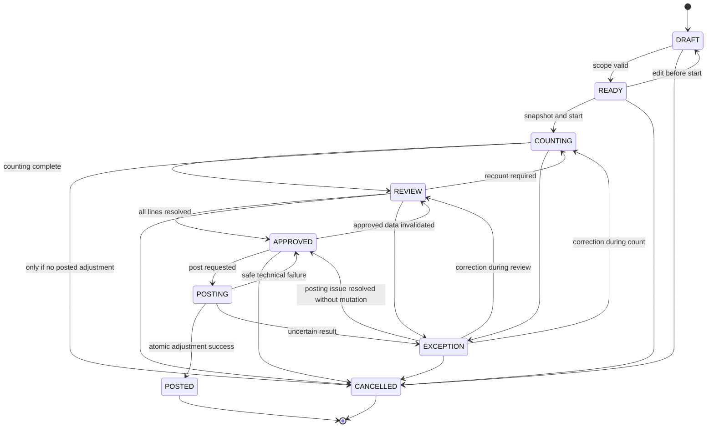

<!--
File: 11-stock-opname-flow.md
Project: Sistem Rekonsiliasi Stok
Status: Approved design baseline for Phase 1
Version: 1.0.0
Last updated: 2026-07-12
Language: id-ID
Timezone: Asia/Jakarta
Role model: ADMIN only
Primary source: stok-management-system.pdf
Depends on:
  - 01-project-brief.md
  - 02-product-requirements.md
  - 03-business-rules.md
  - 04-stock-ledger-design.md
  - 05-database-schema.md
  - 06-user-roles-and-flows.md
  - 07-marketplace-simulator.md
  - 08-reconciliation-logic.md
  - 09-return-and-claim-flow.md
  - 10-fefo-batch-allocation.md
-->

# Stock Opname Flow: Sistem Rekonsiliasi Stok

## 1. Tujuan Dokumen

Dokumen ini mendefinisikan alur lengkap **stok opname** untuk Sistem Rekonsiliasi Stok fase 1.

Stok opname adalah proses membandingkan quantity yang seharusnya ada menurut ledger dengan quantity yang benar-benar ditemukan secara fisik di gudang.

Dokumen ini mengatur:

- pembuatan sesi opname;
- jenis opname;
- pemilihan scope;
- validasi kesiapan;
- snapshot ledger;
- mode `FROZEN`;
- mode `CONTINUOUS`;
- blind count;
- count task;
- count attempt;
- recount;
- pencatatan barang nol;
- pencatatan barang tidak dikenal;
- pemisahan bucket;
- batch dan expiry;
- toleransi;
- review;
- investigasi;
- approval;
- posting adjustment;
- idempotensi;
- locking;
- audit;
- evidence;
- rekonsiliasi;
- laporan hasil;
- mobile flow;
- database amendment;
- API;
- testing;
- release gate.

Tujuan sistem bukan hanya mendapatkan angka variance.

Sistem harus mampu menjelaskan:

1. saldo ledger pada titik snapshot;
2. movement setelah snapshot;
3. quantity yang diharapkan pada waktu barang dihitung;
4. quantity fisik yang ditemukan;
5. variance per produk, batch, dan bucket;
6. siapa yang menghitung;
7. kapan barang dihitung;
8. berapa kali recount dilakukan;
9. alasan adjustment;
10. ledger transaction yang mengoreksi variance;
11. reconciliation run yang memverifikasi hasil posting.

> **Prinsip utama:** stok opname tidak mengedit saldo. Stok opname menghasilkan bukti, variance, dan adjustment ledger yang dapat ditelusuri.

---

## 2. Kedudukan Dokumen

Dokumen ini menjadi sumber kebenaran utama untuk:

- lifecycle stok opname;
- scope opname;
- blind dan non-blind count;
- mode frozen dan continuous;
- snapshot dan cutoff;
- count attempts;
- recount;
- toleransi;
- approval;
- posting;
- report;
- pengujian flow opname.

Urutan sumber kebenaran:

| Topik | Dokumen |
|---|---|
| Masalah dan arah klien | `stok-management-system.pdf` |
| Product requirements | `02-product-requirements.md` |
| Business rules | `03-business-rules.md` |
| Ledger | `04-stock-ledger-design.md` |
| Database | `05-database-schema.md` |
| Role dan flows | `06-user-roles-and-flows.md` |
| Simulator | `07-marketplace-simulator.md` |
| Rekonsiliasi | `08-reconciliation-logic.md` |
| Retur dan klaim | `09-return-and-claim-flow.md` |
| FEFO | `10-fefo-batch-allocation.md` |
| Stock opname | Dokumen ini |

Keputusan terbaru:

```text
Hanya ada satu user role aplikasi: ADMIN.
```

Konsekuensi:

- semua tindakan manusia dilakukan Admin;
- beberapa akun Admin individual boleh tersedia;
- akun bersama dilarang;
- proses otomatis menggunakan actor type `SYSTEM_PROCESS`;
- `SYSTEM_PROCESS` bukan user role;
- istilah Operator, Viewer, Approver, dan Supervisor dari dokumen lama tidak digunakan.

---

## 3. Latar Belakang

Source proyek menyebut stok opname saat ini dilakukan setiap 1–3 bulan.

Hasilnya berulang:

```text
catatan != fisik
```

Tetapi tidak ada penjelasan:

- selisih mulai terbentuk kapan;
- apakah karena order batal;
- apakah karena retur;
- apakah karena bonus;
- apakah karena promo;
- apakah karena sampel;
- apakah karena barang rusak;
- apakah karena barang kedaluwarsa;
- apakah karena salah batch;
- apakah karena saldo awal;
- apakah karena movement saat penghitungan;
- apakah karena count error;
- apakah karena projection drift.

Dalam sistem baru, stok opname harus menjadi bagian dari ledger dan rekonsiliasi.

Alur minimum:

```text
Create
-> Define Scope
-> Validate Readiness
-> Snapshot
-> Count
-> Recount if required
-> Review
-> Approve
-> Post Adjustment
-> Reconcile
-> Close
```

---

## 4. Dasar Praktik

Dokumentasi sistem inventaris resmi membedakan:

- **physical inventory**, yaitu penghitungan fisik pada scope besar atau menyeluruh; dan
- **cycle count**, yaitu penghitungan kelompok item tertentu secara periodik.

Dokumentasi Oracle juga mendukung:

- blind count;
- non-blind count;
- toleransi rekonsiliasi;
- pemilihan scope berdasarkan item atau lokasi;
- count melalui perangkat mobile;
- recount;
- pembaruan quantity setelah review.

Desain proyek mengadopsi prinsip tersebut, tetapi tetap mengikuti source of truth proyek:

```text
ledger
```

Bukan mutable stock field.

---

## 5. Sasaran

| ID | Sasaran |
|---|---|
| `STK-GOAL-001` | Setiap sesi memiliki scope dan boundary yang eksplisit. |
| `STK-GOAL-002` | Expected quantity selalu berasal dari ledger. |
| `STK-GOAL-003` | Count tidak mengubah stock sebelum posting. |
| `STK-GOAL-004` | Blind count dapat mencegah bias terhadap angka sistem. |
| `STK-GOAL-005` | Perubahan stock selama counting dapat dijelaskan. |
| `STK-GOAL-006` | Setiap count attempt dipertahankan. |
| `STK-GOAL-007` | Recount tidak menimpa count sebelumnya. |
| `STK-GOAL-008` | Variance dihitung per produk, batch, dan bucket. |
| `STK-GOAL-009` | Toleransi tidak menyembunyikan variance. |
| `STK-GOAL-010` | Adjustment hanya diposting setelah review dan approval. |
| `STK-GOAL-011` | Posting adjustment bersifat atomik dan idempoten. |
| `STK-GOAL-012` | Posted stocktake immutable. |
| `STK-GOAL-013` | Reconciliation otomatis memverifikasi hasil posting. |
| `STK-GOAL-014` | Flow utama dapat digunakan melalui perangkat mobile. |
| `STK-GOAL-015` | Tidak ada pencatatan harga atau nilai uang. |
| `STK-GOAL-016` | Setiap adjustment memiliki alasan dan evidence. |
| `STK-GOAL-017` | Admin dapat menelusuri variance sampai movement pembentuknya. |
| `STK-GOAL-018` | Full inventory dan cycle count memakai engine yang sama. |

---

## 6. Bukan Tujuan

Fase 1 tidak:

- menghitung nilai persediaan;
- menyimpan harga;
- membuat jurnal keuangan;
- mengelola lokasi rak kompleks;
- membuat warehouse map;
- mengoptimalkan rute penghitung;
- melakukan computer vision;
- menghitung barang otomatis dari foto;
- menggantikan barcode scanner khusus;
- menyediakan offline-first posting;
- menyelesaikan variance tanpa review;
- menulis langsung ke stock projection;
- menghapus ledger lama;
- menimpa count lama;
- menganggap variance dalam toleransi sebagai quantity nol;
- menganggap angka sistem benar bila count tidak diisi;
- membuat batch baru otomatis dari barang fisik tidak dikenal;
- mem-posting sebagian sesi jika sebagian line gagal;
- menjadikan approval sekadar checkbox client;
- menutup sesi dengan unresolved critical exception.

---

## 7. Terminologi

| Istilah | Definisi |
|---|---|
| Stocktake | Sesi stok opname. |
| Full physical inventory | Penghitungan seluruh scope organisasi/gudang. |
| Cycle count | Penghitungan subset item secara berkala. |
| Ad hoc count | Penghitungan khusus karena issue atau investigasi. |
| Scope | Produk, batch, dan bucket yang termasuk sesi. |
| Blind count | Expected quantity tidak ditampilkan saat count awal. |
| Non-blind count | Expected quantity dapat ditampilkan. |
| Snapshot | Saldo ledger pada boundary awal. |
| Snapshot ledger sequence | Sequence tertinggi yang termasuk snapshot. |
| Count cutoff | Boundary ledger pada waktu line dihitung. |
| Frozen mode | Mutation stock pada scope ditahan selama counting. |
| Continuous mode | Operasi stock tetap berjalan selama counting. |
| Count task | Unit pekerjaan penghitungan. |
| Count line | Product-batch-bucket yang harus dihitung. |
| Count attempt | Satu hasil hitung pada line. |
| Recount | Attempt baru setelah count sebelumnya. |
| Expected quantity | Quantity sistem pada cutoff line. |
| Physical quantity | Quantity hasil hitung fisik. |
| Variance | Physical minus expected. |
| Tolerance | Ambang review/recount, bukan penghapus variance. |
| Adjustment | Ledger movement untuk menyamakan catatan dengan physical approved. |
| Unknown item | Barang fisik yang tidak dapat dicocokkan ke product/batch yang sah. |
| Zero count | Konfirmasi eksplisit bahwa quantity fisik nol. |
| Integrity hold | Penahanan mutation karena issue rekonsiliasi. |
| Stocktake hold | Penahanan mutation karena frozen stocktake. |
| Count version | Versi hasil count line yang disetujui. |
| Approval version | Snapshot line dan variance yang disetujui. |
| Posting version | Version untuk idempotency adjustment. |

---

## 8. Jenis Stok Opname

```text
FULL
CYCLE
AD_HOC
POST_INCIDENT
POST_MIGRATION
```

### 8.1 `FULL`

Scope:

```text
seluruh active product
seluruh relevant batch
seluruh physical bucket
```

Digunakan:

- periodik;
- sebelum go-live;
- setelah incident besar;
- saat audit operasional.

### 8.2 `CYCLE`

Scope subset berdasarkan:

- produk;
- kategori;
- near-expiry;
- variance history;
- open issue;
- batch;
- sampling policy.

### 8.3 `AD_HOC`

Digunakan untuk:

- issue produk tertentu;
- batch tertentu;
- retur;
- dugaan salah bucket;
- investigasi manual.

### 8.4 `POST_INCIDENT`

Dibuat setelah:

- duplicate movement;
- projection incident;
- deployment error;
- data import error;
- correction besar.

### 8.5 `POST_MIGRATION`

Verifikasi saldo setelah:

- migration;
- initial load;
- projection rebuild;
- perubahan ledger schema.

---

## 9. Mode Penghitungan

```text
FROZEN
CONTINUOUS
```

### 9.1 Frozen

Seluruh mutation stock pada scope ditahan.

Keuntungan:

- expected quantity tetap;
- lebih mudah dioperasikan;
- risiko timing mismatch rendah.

Kekurangan:

- operasional outbound/inbound pada scope berhenti;
- kurang cocok bila count berlangsung lama.

### 9.2 Continuous

Operasi tetap berjalan.

Keuntungan:

- gudang tidak berhenti;
- cocok untuk count bertahap.

Kekurangan:

- membutuhkan line-level cutoff;
- movement timing harus akurat;
- review lebih kompleks.

### 9.3 Default

Rekomendasi:

```text
CYCLE/AD_HOC -> FROZEN
FULL -> dipilih berdasarkan durasi dan kebutuhan operasi
```

Mode wajib dipilih saat sesi dibuat.

Tidak boleh diubah setelah snapshot.

---

## 10. Count Visibility

```text
BLIND
NON_BLIND
```

### 10.1 Blind Count

Admin tidak melihat expected quantity saat memasukkan count awal.

Ditampilkan:

- SKU;
- product;
- batch;
- expiry;
- bucket;
- input quantity;
- catatan;
- evidence.

Tidak ditampilkan:

- system quantity;
- expected;
- variance;
- movement summary.

Tujuan:

- mendorong penghitungan fisik;
- mengurangi kecenderungan menyalin angka sistem;
- meningkatkan independensi count.

### 10.2 Non-Blind Count

Expected quantity ditampilkan.

Digunakan bila:

- investigasi terarah;
- kebutuhan operasional;
- keputusan organisasi.

### 10.3 Default

Rekomendasi fase 1:

```text
BLIND
```

untuk attempt pertama.

Saat review:

- expected dan variance ditampilkan.

Saat recount:

- policy dapat tetap blind;
- previous count dapat disembunyikan.

---

## 11. Scope Model

Scope disimpan terstruktur.

```ts
type StocktakeScope = {
  mode:
    | 'ALL_ACTIVE_INVENTORY'
    | 'PRODUCTS'
    | 'BATCHES'
    | 'PRODUCT_CATEGORY'
    | 'RECONCILIATION_ISSUES'
  productIds?: string[]
  batchIds?: string[]
  categoryIds?: string[]
  issueIds?: string[]
  bucketCodes: Array<'SELLABLE' | 'QUARANTINE' | 'DAMAGED'>
  includeZeroSystemBalance: boolean
  includeInactiveWithBalance: boolean
  includeBlockedBatches: boolean
  includeExpiredBatches: boolean
}
```

### 11.1 Scope Minimum

Setiap sesi harus memiliki:

- organization;
- bucket;
- set product/batch;
- mode;
- timezone;
- planned date.

### 11.2 Bucket

Default full:

```text
SELLABLE
QUARANTINE
DAMAGED
```

Bucket dihitung terpisah.

Barang tidak boleh digabung hanya karena product sama.

### 11.3 Include Zero

`includeZeroSystemBalance = true` direkomendasikan untuk:

- full inventory;
- product dengan riwayat variance;
- lokasi/rak bila kelak tersedia.

Alasan:

Barang fisik mungkin ada walaupun saldo sistem nol.

### 11.4 Inactive Product

Inactive product dengan physical ledger balance nonzero wajib masuk scope full.

---

## 12. Lifecycle Sesi

Status:

```text
DRAFT
READY
COUNTING
REVIEW
APPROVED
POSTING
POSTED
CANCELLED
EXCEPTION
```

### 12.1 State Machine



### 12.2 Status Tidak Boleh Dipilih Bebas

Transisi dilakukan melalui command.

Client tidak mengirim final status sebagai source of truth.

---

## 13. DRAFT

Pada `DRAFT`, Admin dapat mengubah:

- title;
- type;
- mode;
- count visibility;
- scope;
- note;
- planned date;
- tolerance policy;
- evidence policy.

Belum ada:

- snapshot;
- count line final;
- hold;
- physical count;
- adjustment.

---

## 14. READY

Sesi dapat `READY` bila:

- scope valid;
- tidak kosong;
- tidak overlap dengan active frozen stocktake;
- master data lengkap;
- ledger/projection integrity prerequisite memenuhi policy;
- tidak ada active critical hold yang membuat count tidak dapat dipercaya;
- Admin mengonfirmasi setup.

READY masih dapat dikembalikan ke DRAFT.

---

## 15. Pre-Start Validation

Check minimum:

```text
STK_PRE_001 organization active
STK_PRE_002 scope non-empty
STK_PRE_003 no duplicate product-batch-bucket line
STK_PRE_004 product exists
STK_PRE_005 batch belongs to product
STK_PRE_006 expiry data present for tracked product
STK_PRE_007 no active frozen overlap
STK_PRE_008 no active posting session overlap
STK_PRE_009 ledger available
STK_PRE_010 projection integrity acceptable
STK_PRE_011 no unresolved source transaction in critical state
STK_PRE_012 mode and visibility valid
STK_PRE_013 tolerance policy snapshot valid
STK_PRE_014 Admin active
```

Kegagalan menghasilkan actionable error.

---

## 16. Snapshot

Saat Admin memulai:

1. lock stocktake;
2. validate state `READY`;
3. acquire organization stocktake advisory lock;
4. resolve scope lines;
5. capture ledger sequence boundary;
6. aggregate ledger;
7. create immutable snapshot;
8. create count tasks;
9. create stocktake hold bila `FROZEN`;
10. update status `COUNTING`;
11. audit;
12. commit.

### 16.1 Boundary

```text
snapshot_ledger_seq
```

Expected snapshot:

```text
system_qty_at_snapshot
=
SUM(quantity_delta)
WHERE ledger_seq <= snapshot_ledger_seq
```

### 16.2 Snapshot Bukan Projection Copy

Projection dapat digunakan sebagai optimization hanya jika:

```text
REC_LEDGER_PROJECTION_BATCH = PASS
```

Tetapi snapshot tetap menyimpan:

```text
source = LEDGER
```

### 16.3 Snapshot Immutability

Setelah `COUNTING`:

- `snapshot_ledger_seq` immutable;
- scope immutable;
- mode immutable;
- visibility immutable;
- timezone immutable;
- policy snapshot immutable.

Perubahan membutuhkan cancel dan sesi baru.

---

## 17. Snapshot Transaction Isolation

Snapshot creation membutuhkan pandangan database yang konsisten.

Rekomendasi:

```sql
begin transaction isolation level repeatable read;

-- acquire advisory lock
-- validate scope
-- capture ledger_seq
-- aggregate ledger <= boundary
-- create snapshot and tasks
-- create holds
-- set COUNTING

commit;
```

Catatan penting:

- lock yang dibutuhkan harus diperoleh dengan urutan konsisten;
- jangan melakukan network call di dalam transaction;
- gunakan timeout;
- gagal berarti tidak ada snapshot parsial.

---

## 18. Advisory Lock

Key konseptual:

```text
stocktake:start:{organization_id}
```

Tujuan:

- mencegah dua start simultan;
- mencegah overlap yang tidak terdeteksi;
- mencegah duplicate line generation.

Jika lock gagal:

```text
STOCKTAKE_START_CONFLICT
```

---

## 19. Frozen Hold

### 19.1 Scope Hold

Saat mode `FROZEN`:

- product/batch/bucket scope ditahan;
- FEFO allocation ditolak;
- manual outbound ditolak;
- inbound pada batch scope ditolak;
- return receipt ditolak bila masuk scope;
- inspection transfer ditolak;
- adjustment lain ditolak;
- reversal ditolak;
- count tetap diperbolehkan.

### 19.2 Hold Granularity

Default:

```text
PRODUCT + BATCH + BUCKET
```

Bila entire product scope:

```text
PRODUCT
```

### 19.3 Function Enforcement

Semua mutation domain harus memeriksa hold.

Menyembunyikan tombol tidak cukup.

### 19.4 Release

Hold dilepas saat:

- session posted;
- session cancelled;
- approved invalidated dan session dibatalkan;
- exception diselesaikan sesuai procedure.

Release diaudit.

---

## 20. Continuous Mode

Mutation tetap berjalan.

Setiap count line menyimpan:

```text
counted_at
count_cutoff_ledger_seq
```

Expected:

```text
expected_qty_at_count
=
system_qty_at_snapshot
+
SUM(
  quantity_delta
  WHERE snapshot_ledger_seq < ledger_seq
    AND ledger_seq <= count_cutoff_ledger_seq
)
```

### 20.1 Cutoff Capture

Saat Admin menyimpan attempt:

1. server menangkap current ledger sequence untuk line;
2. server menyimpan `counted_at`;
3. server menyimpan count;
4. server menghitung expected di boundary tersebut;
5. server menyimpan formula version.

Client timestamp tidak menjadi source of truth.

### 20.2 Movement Setelah Cutoff

Movement setelah cutoff:

- tidak masuk expected line;
- akan tercermin pada stock position setelah count;
- adjustment posting harus memperhitungkan movement setelah count cutoff.

Lihat bagian posting continuous.

---

## 21. Count Line Model

Satu line merepresentasikan:

```text
organization
product
batch
bucket
```

Field:

```text
stocktake_line_id
product_id
batch_id
bucket_code
system_qty_at_snapshot
current_count_attempt_no
count_status
counted_qty_final
expected_qty_at_count
variance_qty
adjustment_qty_at_posting
exception_code
version_no
```

---

## 22. Count Task

Count task mengelompokkan line.

Grouping fase 1 dapat berdasarkan:

- product;
- batch;
- bucket;
- urutan SKU.

Karena lokasi rak belum dimodelkan, task tidak boleh mengarang location.

Task status:

```text
PENDING
IN_PROGRESS
COMPLETED
RECOUNT_REQUIRED
EXCEPTION
```

---

## 23. Count Attempt

Setiap attempt append-only.

```ts
type CountAttempt = {
  id: string
  stocktakeLineId: string
  attemptNo: number
  physicalQty: number
  countedAt: string
  countCutoffLedgerSeq: number
  countedBy: string
  countMethod: 'MANUAL_ENTRY' | 'BARCODE_ASSISTED'
  note?: string
  evidenceIds?: string[]
  clientCommandId: string
  idempotencyKey: string
  requestHash: string
}
```

### 23.1 Invariant

```text
attempt_no starts at 1
attempt_no increases by 1
physical_qty >= 0
```

### 23.2 Immutability

Attempt tidak diedit.

Kesalahan input:

- void attempt dengan reason;
- buat attempt baru.

---

## 24. Zero Count

Nol harus dikonfirmasi eksplisit.

UI:

```text
Jumlah fisik = 0
[Konfirmasi barang tidak ditemukan]
```

Alasan:

- empty input bukan nol;
- item terlewat tidak boleh dianggap nol;
- null berarti belum dihitung.

State:

```text
NOT_COUNTED
COUNTED_ZERO
COUNTED_POSITIVE
```

---

## 25. Unknown Item dan Unknown Batch

### 25.1 Unknown Product

Jika barang fisik tidak dapat dicocokkan:

- buat exception record;
- ambil evidence;
- jangan membuat product otomatis;
- jangan memasukkan quantity ke known line;
- jangan mem-posting adjustment sampai identifikasi selesai.

### 25.2 Unknown Batch

Jika product diketahui tetapi batch tidak:

- buat unknown batch exception;
- jangan memilih batch acak;
- gunakan flow identifikasi;
- jika benar-benar return unidentified, gunakan controlled quarantine policy dari dokumen retur;
- full stocktake adjustment ke sellable batch unknown dilarang.

### 25.3 Duplicate Physical Placement

Jika product/batch ditemukan di beberapa tempat:

- jumlah dapat dikumpulkan sebagai sub-count;
- sub-count append-only;
- final attempt menjumlahkan sub-count;
- evidence mempertahankan asal entry.

---

## 26. Count Entry Validation

- physical quantity integer;
- physical quantity >= 0;
- line active;
- session `COUNTING`;
- Admin organization sama;
- attempt version fresh;
- idempotency valid;
- evidence format valid;
- count cutoff captured by server;
- frozen hold masih aktif bila mode frozen;
- posted line tidak dapat dihitung ulang.

---

## 27. Draft Count

UI boleh menyimpan draft lokal/server.

Draft:

- bukan attempt final;
- tidak memengaruhi completeness;
- tidak memiliki expected/variance final;
- dapat diedit;
- diberi label `DRAFT`.

Posting count membutuhkan explicit submit.

---

## 28. Count Completion

Sesi dapat masuk `REVIEW` bila:

- seluruh mandatory line memiliki valid attempt;
- unknown item exception resolved atau diberi exception decision;
- tidak ada line `IN_PROGRESS`;
- hold masih valid;
- snapshot tersedia;
- count cutoff tersedia untuk continuous;
- no technical error.

Admin menekan:

```text
Selesaikan Penghitungan
```

Server memvalidasi ulang.

---

## 29. Expected Quantity

### 29.1 Frozen

```text
expected_qty_at_count
=
system_qty_at_snapshot
```

### 29.2 Continuous

```text
expected_qty_at_count
=
snapshot_qty
+ movements_until_line_cutoff
```

### 29.3 Formula Version

Simpan:

```text
expected_formula_version = "1.0.0"
```

Version naik bila semantics berubah.

---

## 30. Variance

```text
variance_qty
=
physical_qty
-
expected_qty_at_count
```

Interpretasi:

| Nilai | Makna |
|---:|---|
| `0` | Cocok |
| `> 0` | Fisik lebih besar |
| `< 0` | Fisik lebih kecil |

Contoh:

```text
expected = 20
physical = 17
variance = -3
```

Adjustment sementara:

```text
-3
```

---

## 31. Movement Breakdown

Review menampilkan:

```text
snapshot
+ maklon inbound
+ return receipt
+ return sellable transfer
- Shopee outbound
- TikTok outbound
- offline sale
- bonus
- promo
- sample
- damaged
- expired
+/- transfer
+/- reversal
+/- previous adjustment
= expected at count
```

Semua angka dapat dibuka ke ledger entry.

---

## 32. Toleransi

Toleransi bukan aturan untuk menghapus variance.

Toleransi menentukan:

- auto-pass review;
- recount wajib;
- evidence wajib;
- confirmation level.

### 32.1 Quantity Tolerance

```text
abs(variance_qty) <= tolerance_units
```

### 32.2 Percentage Tolerance

```text
variance_percent
=
abs(variance_qty) / max(abs(expected_qty), 1) * 100
```

### 32.3 Combined

Recount required bila:

```text
abs(variance_qty) > tolerance_units
OR
variance_percent > tolerance_percent
```

### 32.4 Default

Default aman:

```text
tolerance_units = 0
tolerance_percent = 0
```

Semua variance direview.

### 32.5 Snapshot

Policy disimpan per session.

Perubahan config tidak mengubah session berjalan.

---

## 33. Recount Policy

Recount wajib bila:

- variance di atas toleransi;
- unknown item;
- unknown batch;
- evidence kurang;
- count attempt invalid;
- Admin memilih recount;
- reconciliation critical;
- large absolute quantity;
- batch near expiry dengan mismatch;
- count timing conflict.

### 33.1 Recount Visibility

Default:

```text
blind
```

Recount tidak menampilkan:

- expected;
- previous count;

selama input.

### 33.2 Recount Outcome

Setelah attempt 2:

Policy:

```text
final count = latest approved attempt
```

Bukan average.

Admin memilih final attempt saat review bila hasil berbeda.

### 33.3 Attempt Disagreement

Jika attempt 1 dan 2 berbeda:

- variance tetap belum resolved;
- attempt 3 dapat diminta;
- evidence dan note wajib;
- tidak boleh mengambil rata-rata tanpa menghitung barang.

---

## 34. Review Status per Line

```text
MATCHED
WITHIN_TOLERANCE
RECOUNT_REQUIRED
VARIANCE_ACCEPTED
EXCEPTION
READY_TO_APPROVE
```

### 34.1 `MATCHED`

```text
variance = 0
```

### 34.2 `WITHIN_TOLERANCE`

Variance ada tetapi di bawah threshold.

Variance tetap tampil.

### 34.3 `RECOUNT_REQUIRED`

Attempt baru diperlukan.

### 34.4 `VARIANCE_ACCEPTED`

Admin menerima count sebagai physical truth dan memberi reason.

### 34.5 `EXCEPTION`

Line belum dapat diposting.

---

## 35. Variance Reason Codes

```text
UNRECORDED_MANUAL_OUTBOUND
UNRECORDED_INBOUND
RETURN_MISMATCH
WRONG_BATCH_COUNT
WRONG_BUCKET_COUNT
DAMAGE_NOT_RECORDED
EXPIRY_NOT_RECORDED
INITIAL_BALANCE_UNCERTAIN
COUNT_TIMING_DIFFERENCE
DUPLICATE_MOVEMENT
SOURCE_EVENT_FAILURE
PROJECTION_DRIFT
PHYSICAL_LOSS
PHYSICAL_SURPLUS
MASTER_DATA_ERROR
UNKNOWN
OTHER
```

`UNKNOWN` diperbolehkan, tetapi:

- note wajib;
- tidak boleh disamakan dengan resolved root cause;
- issue dapat tetap dibuat.

---

## 36. Root-Cause Hints

Menggunakan engine dari `08-reconciliation-logic.md`.

Hint:

- unrecorded manual outbound;
- missing inbound;
- return not received;
- wrong return condition;
- batch misidentification;
- initial balance uncertainty;
- duplicate outbound;
- damage/expiry not recorded;
- count timing mismatch;
- projection-only drift.

Hints tidak menjadi reason final otomatis.

Admin memilih reason setelah review evidence.

---

## 37. Review Flow

Per line:

1. lihat expected;
2. lihat physical;
3. lihat variance;
4. buka movement breakdown;
5. lihat attempt history;
6. lihat evidence;
7. lihat root-cause hints;
8. pilih recount atau accept;
9. pilih reason;
10. tulis note;
11. tandai line ready.

Sesi dapat `APPROVED` hanya jika seluruh line ready.

---

## 38. Single-Role Approval

Karena hanya ada satu role Admin:

- Admin dapat menghitung dan menyetujui;
- sistem tetap menyimpan actor per tindakan;
- akun individual wajib;
- approval memerlukan konfirmasi ulang;
- re-authentication disarankan untuk posting;
- optional second Admin review dapat diterapkan bila ada beberapa akun.

Second Admin bukan role baru.

---

## 39. Approval Snapshot

Approval menyimpan:

```text
approval_version
approved_at
approved_by
line_count_versions
final_attempt_ids
expected_formula_versions
snapshot_ledger_seq
count_cutoff_ledger_seq per line
variance values
reason codes
policy snapshot
```

Approval immutable.

---

## 40. Approval Invalidation

Approval batal bila:

- count attempt baru;
- final attempt berubah;
- reason berubah;
- scope berubah;
- evidence mandatory berubah;
- boundary/cutoff berubah;
- line exception berubah;
- reconciliation prerequisite gagal;
- session version berubah.

Status kembali:

```text
REVIEW
```

---

## 41. Posting Adjustment

Admin menekan:

```text
Posting Koreksi
```

Command:

```ts
type PostStocktakeCommand = {
  stocktakeId: string
  approvalVersion: number
  confirmation: true
  note?: string
  idempotencyKey: string
  requestHash: string
}
```

Client tidak mengirim adjustment quantity sebagai authority.

Server menghitung ulang.

---

## 42. Adjustment Formula: Frozen

```text
adjustment_qty
=
approved_physical_qty
-
current_ledger_qty
```

Dalam frozen mode, seharusnya:

```text
current_ledger_qty = expected_qty_at_count
```

Tetapi server tetap recheck.

---

## 43. Adjustment Formula: Continuous

Movement dapat terjadi setelah line dihitung.

Saat posting:

```text
movement_after_count
=
SUM(
  quantity_delta
  WHERE count_cutoff_ledger_seq < ledger_seq
    AND ledger_seq <= posting_ledger_seq_before
)
```

Current expected:

```text
current_expected_qty
=
expected_qty_at_count
+ movement_after_count
```

Target setelah adjustment:

```text
physical_qty_at_count
+ movement_after_count
```

Adjustment:

```text
target_after_adjustment
-
current_expected_qty
=
physical_qty_at_count
-
expected_qty_at_count
=
variance_qty
```

Secara matematis adjustment tetap variance line, selama movement setelah count valid dan tidak mengubah fakta count.

Tetapi server wajib mendeteksi:

- reversal terhadap movement sebelum count;
- correction source yang mengubah basis;
- line reclassification;
- batch merge/split;
- hold conflict.

Jika basis berubah secara material:

```text
STALE_STOCKTAKE_BASIS
```

dan kembali ke review/recount.

---

## 44. Posting Boundary

Sebelum posting, simpan:

```text
posting_ledger_seq_before
```

Setelah posting:

```text
posting_ledger_seq_after
```

Adjustment entries berada dalam rentang tersebut.

---

## 45. Ledger Transaction

Header:

```text
transaction_type = STOCKTAKE_ADJUSTMENT
source_type = STOCKTAKE
source_id = stocktake_id
```

Per line variance nonzero:

```text
quantity_delta = variance_qty
product_id = line.product_id
batch_id = line.batch_id
bucket_code = line.bucket_code
source_line_id = stocktake_line_id
reason_code = approved_reason
```

Variance nol:

- tidak membuat ledger entry;
- tetap tercatat matched.

---

## 46. Atomicity Posting

Semua adjustment dalam satu sesi diposting atomik.

Urutan:

1. lock idempotency;
2. lock stocktake;
3. validate `APPROVED`;
4. validate approval version;
5. acquire posting advisory lock;
6. lock affected products;
7. lock affected batch balances;
8. validate holds;
9. capture posting boundary;
10. recompute basis;
11. calculate adjustment;
12. validate no illegal state;
13. create transaction header;
14. create ledger entries;
15. update projections;
16. link line to ledger;
17. set `POSTED`;
18. release holds;
19. create reconciliation run;
20. audit;
21. commit.

Jika satu line gagal:

```text
rollback all
```

---

## 47. Idempotency

Key:

```text
stocktake:{stocktake_id}:post:{approval_version}
```

Identical retry:

- return existing transaction;
- no new ledger.

Different hash:

```text
IDEMPOTENCY_PAYLOAD_MISMATCH
```

Timeout browser tidak menjadi alasan membuat key baru.

---

## 48. Product Lock Order

Lock products:

```text
product_id ASC
```

Batch balances:

```text
product_id
batch_id
bucket
```

Urutan konsisten dengan FEFO dan mutation lain.

---

## 49. Concurrent Mutation

### 49.1 Frozen

Mutation domain menemukan hold dan ditolak.

### 49.2 Continuous

Mutation boleh berjalan.

Posting mengambil lock dan revalidasi basis.

### 49.3 Adjustment Bersamaan

Dua post request:

- idempotency + stocktake lock;
- satu sukses;
- satu mengembalikan hasil sama.

---

## 50. Projection Drift

Jika sebelum posting:

```text
ledger != projection
```

Jangan post stocktake adjustment untuk memperbaiki projection.

Alur:

1. create critical issue;
2. rebuild projection dari ledger;
3. verify;
4. resume posting bila basis valid.

Adjustment hanya untuk:

```text
physical vs ledger
```

Bukan:

```text
projection vs ledger
```

---

## 51. Initial Balance

Stocktake pertama dapat mengoreksi initial balance.

Reason:

```text
INITIAL_BALANCE_UNCERTAIN
```

Tetapi:

- saldo awal lama tetap ada;
- adjustment baru diposting;
- evidence stocktake disimpan;
- source story tetap dapat ditelusuri.

---

## 52. Batch Misidentification

Contoh:

```text
Batch A expected 10, physical 5
Batch B expected 5, physical 10
Total product = 15
```

Kemungkinan:

```text
wrong batch count
```

Review harus menawarkan:

- recount batch;
- batch evidence;
- variance pair hint.

Adjustment tetap per batch bila count final disetujui:

```text
Batch A -5
Batch B +5
```

Net product:

```text
0
```

---

## 53. Bucket Misidentification

Contoh:

```text
SELLABLE -3
DAMAGED +3
```

Jika barang sebenarnya rusak tetapi belum dicatat:

- stocktake adjustment dapat mengoreksi bucket;
- atau movement reason khusus internal reclassification dipilih sesuai evidence.

Rekomendasi:

Gunakan transaction internal transfer bila kedua bucket fisik ditemukan dan total product tetap.

Jangan menggunakan dua adjustment independen bila satu transfer lebih menjelaskan kejadian.

---

## 54. Unknown Physical Surplus

Jika product dan batch valid tetapi sistem balance nol:

- count line dapat ditambahkan melalui exception review;
- evidence wajib;
- adjustment +qty dapat diposting;
- reason dipilih;
- issue dibuat bila source tidak diketahui.

Jika product/batch tidak valid:

- tidak boleh post sampai identifikasi selesai.

---

## 55. Missing Physical Stock

Variance negatif:

- recount sesuai policy;
- inspect return/manual movement;
- reason;
- adjustment -qty;
- issue bila root cause unknown.

Sistem tidak menyatakan pencurian tanpa bukti.

---

## 56. Expired Batch Count

Expired batch tetap dihitung pada bucket fisiknya.

Jika berada di `SELLABLE`:

- tampilkan warning;
- reconciliation issue;
- count tetap dicatat;
- adjustment tidak otomatis memindahkan bucket.

Setelah opname, gunakan disposal/reclassification flow.

---

## 57. Blocked Batch Count

Blocked batch:

- tetap dihitung;
- tidak eligible FEFO;
- stocktake tidak otomatis unblock.

---

## 58. Return Quarantine Count

Return quarantine:

- dihitung per actual batch atau controlled unidentified batch;
- dibandingkan dengan return receipt;
- pending inspection tetap terlihat;
- variance menghasilkan return reconciliation issue.

---

## 59. Count Completeness

Sesi tidak dapat review bila:

- mandatory line belum counted;
- count null;
- attempt invalid;
- unknown item unresolved;
- cutoff missing;
- task masih in progress;
- zero system line belum dikonfirmasi bila included.

Completion percentage:

```text
valid_counted_lines / mandatory_lines * 100
```

---

## 60. Session Cancellation

Boleh cancel sebelum `POSTED`.

Syarat:

- reason;
- Admin;
- no adjustment posted;
- release holds;
- audit;
- snapshot dan attempts tetap disimpan;
- status `CANCELLED`;
- tidak delete.

---

## 61. Session Exception

Exception codes:

```text
SNAPSHOT_INCOMPLETE
HOLD_CREATION_FAILED
COUNT_CUTOFF_MISSING
UNKNOWN_ITEM
UNKNOWN_BATCH
PROJECTION_DRIFT
CONCURRENT_BASIS_CHANGE
APPROVAL_STALE
POSTING_RESULT_UNCERTAIN
RECONCILIATION_FAILED
```

Exception tidak otomatis membatalkan sesi.

---

## 62. Posting Result Uncertain

Jika client timeout tetapi database status tidak diketahui:

1. jangan retry dengan key baru;
2. query idempotency status;
3. query stocktake status;
4. return existing result;
5. bila tidak dapat dipastikan, status `EXCEPTION`;
6. investigasi sebelum posting ulang.

---

## 63. Setelah Posting

Sistem:

- session `POSTED`;
- line immutable;
- adjustment transaction linked;
- ledger boundary saved;
- holds released;
- reconciliation run dibuat;
- report final generated;
- notifications resolved;
- open issues updated bila sesuai.

---

## 64. Post-Posting Reconciliation

Checks:

```text
REC_STOCKTAKE_ADJUSTMENT_LINK
REC_POSTED_STOCKTAKE_TOTAL
REC_STOCKTAKE_IMMUTABLE
REC_LEDGER_PROJECTION_BATCH
REC_BATCH_PRODUCT_PROJECTION
REC_NEGATIVE_BUCKET
REC_PROJECTION_REBUILD
```

Additional:

```text
REC_STOCKTAKE_LINE_LEDGER_MATCH
REC_STOCKTAKE_APPROVAL_VERSION
REC_STOCKTAKE_HOLD_RELEASED
REC_STOCKTAKE_POST_IDEMPOTENCY
REC_STOCKTAKE_CONTINUOUS_CUTOFF
```

---

## 65. Issue Resolution

Stocktake dapat menjadi corrective reference.

Issue resolution:

```text
CORRECTED_BY_STOCKTAKE
```

Syarat:

- posting sukses;
- reconciliation pass;
- issue tidak lagi reproducible;
- evidence linked.

Tidak semua issue otomatis selesai hanya karena stocktake diposting.

---

## 66. Laporan Final

Report:

- stocktake no;
- type;
- mode;
- visibility;
- scope;
- created/started/completed/posted;
- Admin actors;
- snapshot boundary;
- posting boundary;
- total lines;
- matched;
- variance;
- recount;
- unknown;
- total positive adjustment;
- total negative adjustment;
- movement breakdown;
- reason distribution;
- issue links;
- reconciliation result.

Tidak ada nilai rupiah.

---

## 67. Line Report

Per line:

```text
SKU
Product
Batch
Expiry
Bucket
Snapshot
Movement until count
Expected
Attempt history
Final physical
Variance
Reason
Adjustment
Ledger entry
```

---

## 68. CSV Export

CSV dapat tersedia untuk:

- count sheet;
- review;
- final report.

Import count CSV optional.

Jika diimplementasikan:

- staging;
- validation;
- dry run;
- row error;
- idempotency;
- no direct post;
- Admin review tetap wajib.

---

## 69. Print Count Sheet

Blind count sheet:

- stocktake no;
- task;
- SKU;
- product;
- batch;
- expiry;
- bucket;
- blank quantity;
- count date;
- counter;
- note.

Tidak menampilkan expected.

Printed sheet bukan source of truth final.

---

## 70. Mobile Flow

```text
Open Stocktake
-> Select Task
-> Scan/Search Product
-> Confirm Batch
-> Enter Quantity
-> Add Note/Evidence
-> Submit Attempt
-> Continue
-> Complete Task
```

Mobile requirements:

- numeric keyboard;
- large touch target;
- clear zero confirmation;
- batch and expiry visible;
- progress;
- save draft;
- online posting;
- duplicate tap prevention;
- conflict warning;
- no primary horizontal scroll;
- camera evidence optional;
- barcode assisted search optional.

---

## 71. Barcode-Assisted Count

Fase 1 may support:

- product barcode search;
- batch code entry;
- manual expiry verification.

Barcode:

- membantu identifikasi;
- tidak menggantikan database validation;
- tidak membuat batch otomatis;
- tidak mengubah stock.

---

## 72. UI Information Architecture

```text
Stok Opname
├── Dashboard
├── Sesi
│   ├── Draft
│   ├── Sedang Dihitung
│   ├── Review
│   ├── Disetujui
│   ├── Selesai
│   └── Dibatalkan
├── Count Tasks
├── Variance Review
├── Adjustment Preview
└── Reports
```

---

## 73. Dashboard

Cards:

- active stocktake;
- completion;
- pending recount;
- variance lines;
- unknown items;
- waiting approval;
- posted this period;
- last reconciliation result.

---

## 74. Create Form

Fields:

```text
Title
Type
Mode
Count Visibility
Scope
Buckets
Include Zero
Tolerance
Planned Date
Note
```

Preview scope:

- products;
- batches;
- lines;
- zero lines;
- blocked/expired;
- estimated task count.

---

## 75. Counting Screen

Blind mode:

- no expected;
- no variance;
- no prior count;
- input only.

Header:

- stocktake;
- task;
- progress;
- mode;
- online status.

---

## 76. Review Screen

Filters:

- variance;
- recount;
- matched;
- unknown;
- product;
- batch;
- bucket;
- reason;
- expiry;
- issue.

Bulk action:

- only safe action;
- no bulk acceptance of unknown critical lines;
- no automatic reason assignment without review.

---

## 77. Adjustment Preview

Summary:

```text
Positive lines
Negative lines
Zero lines
Total units added
Total units removed
Transfer candidates
Exceptions
```

Per line:

- approved count;
- expected;
- variance;
- reason;
- proposed ledger effect.

---

## 78. Posting Confirmation

Dialog:

```text
Posting stok opname akan membuat adjustment ledger untuk {n} baris.

Penambahan: {positive_units}
Pengurangan: {negative_units}

Transaksi lama tidak akan diubah.
Hasil posting tidak dapat diedit dan hanya dapat dikoreksi melalui reversal atau sesi baru.
```

Requires:

- confirmation;
- re-auth if configured;
- current approval version.

---

## 79. Database Baseline

Existing schema from prior documents:

```text
operations.stocktakes
operations.stocktake_lines
operations.stocktake_adjustment_map
```

This document recommends additional tables and fields.

---

## 80. `operations.stocktakes`

Recommended fields:

```text
id
organization_id
stocktake_no
title
stocktake_type_code
mode_code
visibility_code
status_code
scope_definition
tolerance_policy_snapshot
rule_version
timezone_snapshot
planned_at
snapshot_ledger_seq
posting_ledger_seq_before
posting_ledger_seq_after
started_at
counting_completed_at
approved_at
approved_by
approval_version
posted_at
stock_transaction_id
reconciliation_run_id
created_by
created_at
updated_at
version_no
cancelled_at
cancelled_by
cancel_reason
exception_code
```

Checks:

```sql
check (mode_code in ('FROZEN','CONTINUOUS'));
check (visibility_code in ('BLIND','NON_BLIND'));
check (approval_version is null or approval_version > 0);
```

---

## 81. `operations.stocktake_snapshots`

```sql
create table operations.stocktake_snapshots (
  id uuid primary key default gen_random_uuid(),
  organization_id uuid not null,
  stocktake_id uuid not null references operations.stocktakes(id),
  stocktake_line_id uuid not null,
  product_id uuid not null,
  batch_id uuid not null,
  bucket_code text not null,
  snapshot_ledger_seq bigint not null,
  system_qty_at_snapshot bigint not null,
  batch_code_snapshot text not null,
  expiry_date_snapshot date,
  product_sku_snapshot text not null,
  product_name_snapshot text not null,
  created_at timestamptz not null default now(),
  unique (stocktake_id, stocktake_line_id)
);
```

Append-only.

---

## 82. `operations.stocktake_lines`

Fields/amendments:

```text
id
organization_id
stocktake_id
line_no
product_id
batch_id
bucket_code
system_qty_at_snapshot
final_attempt_id
final_physical_qty
expected_qty_at_count
variance_qty
adjustment_qty
count_status_code
review_status_code
reason_code
review_note
count_cutoff_ledger_seq
expected_formula_version
count_attempt_no
approved_line_version
ledger_entry_id
exception_code
created_at
updated_at
version_no
```

Unique:

```text
stocktake + product + batch + bucket
```

---

## 83. `operations.stocktake_count_attempts`

```sql
create table operations.stocktake_count_attempts (
  id uuid primary key default gen_random_uuid(),
  organization_id uuid not null,
  stocktake_id uuid not null references operations.stocktakes(id),
  stocktake_line_id uuid not null references operations.stocktake_lines(id),
  attempt_no integer not null,
  physical_qty bigint not null,
  counted_at timestamptz not null,
  count_cutoff_ledger_seq bigint not null,
  counted_by uuid not null,
  count_method_code text not null,
  status_code text not null default 'VALID',
  note text,
  idempotency_key text not null,
  request_hash text not null,
  created_at timestamptz not null default now(),
  voided_at timestamptz,
  voided_by uuid,
  void_reason text,
  unique (stocktake_line_id, attempt_no),
  unique (organization_id, idempotency_key),
  check (attempt_no > 0),
  check (physical_qty >= 0)
);
```

---

## 84. `operations.stocktake_count_parts`

Optional table for multiple physical piles/locations:

```sql
create table operations.stocktake_count_parts (
  id uuid primary key default gen_random_uuid(),
  organization_id uuid not null,
  count_attempt_id uuid not null
    references operations.stocktake_count_attempts(id),
  part_no integer not null,
  physical_qty bigint not null,
  reference_text text,
  note text,
  created_at timestamptz not null default now(),
  check (part_no > 0),
  check (physical_qty >= 0),
  unique (count_attempt_id, part_no)
);
```

Attempt quantity must equal sum parts when parts used.

---

## 85. `operations.stocktake_tasks`

```sql
create table operations.stocktake_tasks (
  id uuid primary key default gen_random_uuid(),
  organization_id uuid not null,
  stocktake_id uuid not null references operations.stocktakes(id),
  task_no text not null,
  status_code text not null,
  sort_order integer not null,
  line_count integer not null,
  completed_line_count integer not null default 0,
  started_at timestamptz,
  completed_at timestamptz,
  created_at timestamptz not null default now(),
  unique (organization_id, task_no),
  check (sort_order > 0),
  check (line_count >= 0),
  check (completed_line_count >= 0)
);
```

---

## 86. `operations.stocktake_task_lines`

```sql
create table operations.stocktake_task_lines (
  stocktake_task_id uuid not null
    references operations.stocktake_tasks(id),
  stocktake_line_id uuid not null
    references operations.stocktake_lines(id),
  sort_order integer not null,
  primary key (stocktake_task_id, stocktake_line_id),
  unique (stocktake_task_id, sort_order)
);
```

---

## 87. `operations.stocktake_exceptions`

```sql
create table operations.stocktake_exceptions (
  id uuid primary key default gen_random_uuid(),
  organization_id uuid not null,
  stocktake_id uuid not null references operations.stocktakes(id),
  stocktake_line_id uuid,
  exception_type_code text not null,
  status_code text not null default 'OPEN',
  product_reference text,
  batch_reference text,
  physical_qty bigint,
  note text not null,
  resolution_code text,
  resolved_at timestamptz,
  resolved_by uuid,
  created_by uuid not null,
  created_at timestamptz not null default now(),
  check (physical_qty is null or physical_qty >= 0)
);
```

---

## 88. `operations.stocktake_holds`

Could reuse:

```text
reconciliation.entity_holds
```

with:

```text
hold_type = STOCKTAKE
source_id = stocktake_id
```

Avoid duplicate hold engines.

---

## 89. `operations.stocktake_approval_snapshots`

```sql
create table operations.stocktake_approval_snapshots (
  id uuid primary key default gen_random_uuid(),
  organization_id uuid not null,
  stocktake_id uuid not null references operations.stocktakes(id),
  approval_version integer not null,
  approved_payload jsonb not null,
  payload_hash text not null,
  approved_by uuid not null,
  approved_at timestamptz not null,
  created_at timestamptz not null default now(),
  unique (stocktake_id, approval_version)
);
```

---

## 90. Views

```text
api.stocktake_list
api.stocktake_details
api.stocktake_count_tasks
api.stocktake_count_lines
api.stocktake_variance_review
api.stocktake_adjustment_preview
api.stocktake_report
api.stocktake_exceptions
```

Blind count view must omit:

```text
system quantity
expected quantity
variance
```

Do not rely only on frontend hiding columns.

---

## 91. Database Functions

Public:

```text
api.create_stocktake
api.prepare_stocktake
api.start_stocktake
api.submit_stocktake_count
api.void_stocktake_count_attempt
api.request_stocktake_recount
api.complete_stocktake_counting
api.review_stocktake_line
api.approve_stocktake
api.post_stocktake
api.cancel_stocktake
api.get_stocktake_report
```

Internal:

```text
operations.resolve_stocktake_scope
operations.capture_stocktake_snapshot
operations.create_stocktake_tasks
operations.capture_line_cutoff
operations.calculate_stocktake_expected
operations.calculate_stocktake_variance
operations.validate_stocktake_approval
operations.build_stocktake_adjustments
operations.release_stocktake_holds
```

Client cannot execute internal functions.

---

## 92. Route Handlers

```text
POST /api/admin/stocktakes
GET  /api/admin/stocktakes
GET  /api/admin/stocktakes/:id
POST /api/admin/stocktakes/:id/prepare
POST /api/admin/stocktakes/:id/start
POST /api/admin/stocktakes/:id/counts
POST /api/admin/stocktakes/:id/counts/:attemptId/void
POST /api/admin/stocktakes/:id/recounts
POST /api/admin/stocktakes/:id/complete-counting
POST /api/admin/stocktakes/:id/review-lines/:lineId
POST /api/admin/stocktakes/:id/approve
POST /api/admin/stocktakes/:id/post
POST /api/admin/stocktakes/:id/cancel
GET  /api/admin/stocktakes/:id/report
```

Mutation never uses GET.

---

## 93. Create Request

```json
{
  "title": "Opname Juli 2026",
  "stocktakeType": "FULL",
  "mode": "FROZEN",
  "visibility": "BLIND",
  "scope": {
    "mode": "ALL_ACTIVE_INVENTORY",
    "bucketCodes": ["SELLABLE", "QUARANTINE", "DAMAGED"],
    "includeZeroSystemBalance": true,
    "includeInactiveWithBalance": true,
    "includeBlockedBatches": true,
    "includeExpiredBatches": true
  },
  "tolerancePolicy": {
    "units": 0,
    "percent": 0
  },
  "plannedAt": "2026-07-15T08:00:00+07:00",
  "note": "Opname periodik"
}
```

Server obtains actor and organization from session.

---

## 94. Count Request

```json
{
  "stocktakeLineId": "uuid",
  "physicalQty": 17,
  "countMethod": "MANUAL_ENTRY",
  "note": "Dihitung ulang per dus dan satuan",
  "evidenceIds": [],
  "clientCommandId": "uuid"
}
```

Server:

- creates idempotency key;
- captures cutoff;
- creates attempt;
- does not return expected in blind counting response.

---

## 95. Approval Request

```json
{
  "confirmation": true,
  "reviewNote": "Seluruh variance telah direcount dan ditetapkan.",
  "clientCommandId": "uuid"
}
```

Server calculates approval snapshot.

---

## 96. Posting Response

```json
{
  "success": true,
  "data": {
    "stocktakeId": "uuid",
    "status": "POSTED",
    "stockTransactionId": "uuid",
    "postingLedgerSeqBefore": 150000,
    "postingLedgerSeqAfter": 150024,
    "adjustedLineCount": 24,
    "positiveUnits": 8,
    "negativeUnits": 12,
    "reconciliationRunId": "uuid"
  },
  "correlationId": "uuid"
}
```

---

## 97. Error Codes

| Code | Meaning |
|---|---|
| `STOCKTAKE_NOT_FOUND` | Sesi tidak ditemukan |
| `STOCKTAKE_ACCESS_FORBIDDEN` | Bukan Admin aktif/organization salah |
| `STOCKTAKE_INVALID_STATE` | Command tidak sesuai status |
| `STOCKTAKE_SCOPE_REQUIRED` | Scope kosong |
| `STOCKTAKE_SCOPE_OVERLAP` | Overlap forbidden |
| `STOCKTAKE_START_CONFLICT` | Start lock conflict |
| `STOCKTAKE_SNAPSHOT_FAILED` | Snapshot gagal |
| `STOCKTAKE_SNAPSHOT_INCOMPLETE` | Line snapshot tidak lengkap |
| `STOCKTAKE_HOLD_FAILED` | Hold gagal |
| `STOCKTAKE_LINE_NOT_FOUND` | Line tidak ada |
| `STOCKTAKE_COUNT_REQUIRED` | Line belum dihitung |
| `STOCKTAKE_INVALID_PHYSICAL_QTY` | Quantity invalid |
| `STOCKTAKE_ZERO_CONFIRMATION_REQUIRED` | Nol belum dikonfirmasi |
| `STOCKTAKE_COUNT_CUTOFF_MISSING` | Cutoff continuous hilang |
| `STOCKTAKE_COUNT_CONFLICT` | Concurrent/version conflict |
| `STOCKTAKE_DUPLICATE_COUNT` | Attempt identik sudah ada |
| `STOCKTAKE_RECOUNT_REQUIRED` | Recount wajib |
| `STOCKTAKE_UNKNOWN_PRODUCT` | Barang tidak dikenal |
| `STOCKTAKE_UNKNOWN_BATCH` | Batch tidak dikenal |
| `STOCKTAKE_EXCEPTION_OPEN` | Exception belum selesai |
| `STOCKTAKE_VARIANCE_REASON_REQUIRED` | Reason belum diisi |
| `STOCKTAKE_EVIDENCE_REQUIRED` | Evidence wajib |
| `STOCKTAKE_APPROVAL_STALE` | Data berubah setelah approval |
| `STOCKTAKE_REAUTH_REQUIRED` | Re-auth dibutuhkan |
| `STOCKTAKE_POST_LOCK_TIMEOUT` | Lock timeout |
| `STOCKTAKE_BASIS_CHANGED` | Basis continuous berubah material |
| `STOCKTAKE_PROJECTION_DRIFT` | Projection tidak dapat dipercaya |
| `STOCKTAKE_ADJUSTMENT_INVALID` | Adjustment invalid |
| `STOCKTAKE_POST_FAILED` | Posting gagal |
| `STOCKTAKE_POST_RESULT_UNCERTAIN` | Hasil posting belum pasti |
| `STOCKTAKE_ALREADY_POSTED` | Sudah posted |
| `STOCKTAKE_POSTED_EDIT_FORBIDDEN` | Posted data diedit |
| `IDEMPOTENCY_PAYLOAD_MISMATCH` | Key sama payload berbeda |

---

## 98. Security

Setiap mutation:

- authenticated;
- active Admin;
- organization scoped;
- entity ownership checked;
- state transition checked;
- server validation;
- idempotency;
- audit;
- RLS/grants;
- safe function boundary.

Client tidak dipercaya untuk:

- role;
- organization;
- expected quantity;
- variance;
- adjustment;
- approval version;
- ledger boundary;
- batch relation.

---

## 99. RLS

- Admin membaca own organization;
- direct write to snapshot/attempt/adjustment denied;
- write via functions;
- blind count view omits system quantity;
- evidence scoped;
- posted records immutable;
- no permissive always-true policy.

---

## 100. Audit Events

```text
STOCKTAKE_CREATED
STOCKTAKE_UPDATED
STOCKTAKE_PREPARED
STOCKTAKE_STARTED
STOCKTAKE_SNAPSHOT_CAPTURED
STOCKTAKE_HOLD_CREATED
STOCKTAKE_COUNT_SUBMITTED
STOCKTAKE_COUNT_VOIDED
STOCKTAKE_RECOUNT_REQUESTED
STOCKTAKE_COUNTING_COMPLETED
STOCKTAKE_LINE_REVIEWED
STOCKTAKE_APPROVED
STOCKTAKE_APPROVAL_INVALIDATED
STOCKTAKE_POST_STARTED
STOCKTAKE_POSTED
STOCKTAKE_POST_FAILED
STOCKTAKE_HOLD_RELEASED
STOCKTAKE_CANCELLED
STOCKTAKE_RECONCILIATION_COMPLETED
```

---

## 101. Evidence

Evidence types:

```text
COUNT_PHOTO
BATCH_LABEL
EXPIRY_LABEL
DAMAGED_ITEM
EMPTY_LOCATION
UNKNOWN_ITEM
COUNT_SHEET
NOTE
OTHER
```

Metadata:

- checksum;
- storage object;
- actor;
- captured at;
- related line/attempt;
- description.

File access:

- organization scoped;
- signed URL;
- short-lived;
- no public permanent URL.

---

## 102. Notifications

- planned stocktake;
- active frozen hold;
- pending count;
- pending recount;
- pending review;
- approval stale;
- posting failed;
- reconciliation failed;
- session completed.

In-app only for phase 1 unless changed.

---

## 103. Observability

Metrics:

```text
stocktakes_created_total
stocktakes_started_total
stocktakes_posted_total
stocktakes_cancelled_total
stocktake_lines_total
stocktake_count_attempts_total
stocktake_recounts_total
stocktake_variance_lines_total
stocktake_positive_variance_units
stocktake_negative_variance_units
stocktake_unknown_items_total
stocktake_duration_ms
stocktake_post_duration_ms
stocktake_lock_wait_ms
stocktake_post_failures_total
stocktake_reconciliation_failures_total
```

Logs include:

```text
stocktake_id
command
actor
organization
status
line_count
variance summary
correlation_id
error_code
```

No secrets or customer PII.

---

## 104. Performance

- scope resolution uses indexed product/batch tables;
- snapshot aggregates ledger by product/batch/bucket;
- batch insert lines;
- count submission updates only relevant line/task projections;
- posting locks only affected products/batches;
- reports use indexed lines and ledger references;
- large full counts processed in batches for read preparation;
- final adjustment remains one atomic posting transaction within practical limits.

If session becomes too large for one transaction:

- reassess product volume and batching policy;
- do not silently allow partial posting;
- phase 1 scale is expected to remain manageable.

---

## 105. Indexes

```sql
create index idx_stocktakes_org_status
on operations.stocktakes
  (organization_id, status_code, created_at desc);

create index idx_stocktake_lines_session_status
on operations.stocktake_lines
  (stocktake_id, count_status_code, review_status_code);

create index idx_stocktake_lines_entity
on operations.stocktake_lines
  (organization_id, product_id, batch_id, bucket_code);

create index idx_stocktake_attempts_line
on operations.stocktake_count_attempts
  (stocktake_line_id, attempt_no desc);

create index idx_stocktake_exceptions_open
on operations.stocktake_exceptions
  (organization_id, stocktake_id, status_code)
where status_code = 'OPEN';
```

---

## 106. Concurrency Tests

### 106.1 Two Counts Same Line

- two submit requests;
- same command -> idempotent;
- different count -> one accepted by version order, other conflict;
- no overwritten attempt.

### 106.2 Frozen Outbound

- FEFO outbound during frozen stocktake;
- rejected by hold.

### 106.3 Continuous Outbound

- count line and outbound overlap;
- cutoff determines expected;
- no timing ambiguity.

### 106.4 Two Post Requests

- one transaction;
- second returns same result;
- no duplicate ledger.

### 106.5 Approval Change

- line recounted after approval;
- approval invalidated;
- posting rejected.

---

## 107. Unit Tests

- scope validation;
- status transition;
- blind response DTO;
- expected frozen;
- expected continuous;
- variance;
- tolerance;
- recount;
- final attempt;
- approval hash;
- adjustment formula;
- idempotency;
- report totals.

---

## 108. Database Tests

| ID | Test |
|---|---|
| `STK-DB-001` | Draft does not change stock |
| `STK-DB-002` | Start captures ledger snapshot |
| `STK-DB-003` | Snapshot immutable |
| `STK-DB-004` | Frozen creates holds |
| `STK-DB-005` | Frozen blocks outbound |
| `STK-DB-006` | Continuous captures line cutoff |
| `STK-DB-007` | Blind view hides expected |
| `STK-DB-008` | Null count not zero |
| `STK-DB-009` | Zero requires confirmation |
| `STK-DB-010` | Attempts append-only |
| `STK-DB-011` | Recount does not overwrite |
| `STK-DB-012` | Variance formula correct |
| `STK-DB-013` | Tolerance does not erase variance |
| `STK-DB-014` | Unknown batch blocks posting |
| `STK-DB-015` | Approval snapshot immutable |
| `STK-DB-016` | Recount invalidates approval |
| `STK-DB-017` | Posting atomic |
| `STK-DB-018` | Posting idempotent |
| `STK-DB-019` | Adjustment equals approved variance |
| `STK-DB-020` | Zero variance creates no ledger |
| `STK-DB-021` | Posted session immutable |
| `STK-DB-022` | Holds released after posting |
| `STK-DB-023` | Reconciliation run linked |
| `STK-DB-024` | Cross-org denied |
| `STK-DB-025` | Direct adjustment write denied |

---

## 109. E2E Scenarios

| ID | Scenario |
|---|---|
| `STK-E2E-001` | Full frozen blind count exact |
| `STK-E2E-002` | Full frozen with shortage |
| `STK-E2E-003` | Full frozen with surplus |
| `STK-E2E-004` | Cycle count subset |
| `STK-E2E-005` | Continuous with inbound |
| `STK-E2E-006` | Continuous with outbound |
| `STK-E2E-007` | Count zero |
| `STK-E2E-008` | Include system-zero item |
| `STK-E2E-009` | Unknown batch |
| `STK-E2E-010` | Wrong batch offset |
| `STK-E2E-011` | Wrong bucket offset |
| `STK-E2E-012` | Recount required |
| `STK-E2E-013` | Attempts disagree |
| `STK-E2E-014` | Approval stale |
| `STK-E2E-015` | Duplicate post retry |
| `STK-E2E-016` | Posting technical failure |
| `STK-E2E-017` | Projection drift before post |
| `STK-E2E-018` | Retur quarantine count |
| `STK-E2E-019` | Expired batch count |
| `STK-E2E-020` | Mobile complete flow |

---

## 110. Property-Based Tests

Generate random:

- ledger histories;
- snapshot boundaries;
- movements;
- physical counts;
- count cutoffs;
- variances.

Properties:

```text
expected frozen = snapshot
expected continuous = snapshot + movements to cutoff
variance = physical - expected
adjustment = approved variance
posted ledger makes ledger position align to approved physical at count plus later movements
count attempts never overwritten
posting effect occurs at most once
```

---

## 111. Golden Fixture

Products/batches:

```text
SKU-A exact match
SKU-B shortage
SKU-C surplus
SKU-D wrong batch pair
SKU-E wrong bucket pair
SKU-F expired
SKU-G blocked
SKU-H quarantine return
SKU-I system zero physical positive
SKU-J unknown batch exception
```

Expected reports versioned in repository.

---

## 112. Acceptance Criteria

### Setup

- `STK-AC-001`: Admin can create session.
- `STK-AC-002`: Scope is explicit.
- `STK-AC-003`: Mode and visibility selected.
- `STK-AC-004`: Invalid overlap rejected.
- `STK-AC-005`: No stock effect in draft.

### Snapshot

- `STK-AC-006`: Snapshot uses ledger.
- `STK-AC-007`: Boundary stored.
- `STK-AC-008`: Snapshot immutable.
- `STK-AC-009`: Frozen hold enforced.
- `STK-AC-010`: Continuous mode has line cutoff.

### Count

- `STK-AC-011`: Blind count hides expected.
- `STK-AC-012`: Null is not zero.
- `STK-AC-013`: Zero explicit.
- `STK-AC-014`: Attempts append-only.
- `STK-AC-015`: Recount preserves history.
- `STK-AC-016`: Unknown item becomes exception.
- `STK-AC-017`: Mobile count works.

### Review

- `STK-AC-018`: Expected formula visible in review.
- `STK-AC-019`: Movement breakdown drillable.
- `STK-AC-020`: Variance formula correct.
- `STK-AC-021`: Tolerance does not hide variance.
- `STK-AC-022`: Reason required for accepted variance.
- `STK-AC-023`: Critical exception blocks approval.

### Approval

- `STK-AC-024`: Approval stores versions.
- `STK-AC-025`: Changed count invalidates approval.
- `STK-AC-026`: Only active Admin approves.
- `STK-AC-027`: Approval auditable.

### Posting

- `STK-AC-028`: Server computes adjustments.
- `STK-AC-029`: All lines post atomically.
- `STK-AC-030`: Zero variance no ledger.
- `STK-AC-031`: Nonzero variance ledger linked.
- `STK-AC-032`: Duplicate retry idempotent.
- `STK-AC-033`: Posted session immutable.
- `STK-AC-034`: Holds released.
- `STK-AC-035`: Reconciliation triggered.

### Security

- `STK-AC-036`: Cross-org denied.
- `STK-AC-037`: Direct table write denied.
- `STK-AC-038`: Blind data omitted server-side.
- `STK-AC-039`: No price fields.
- `STK-AC-040`: Evidence protected.

---

## 113. Release Gates

Jangan rilis bila:

- snapshot berasal dari editable stock field;
- blind count hanya disembunyikan CSS;
- null dianggap nol;
- attempt lama ditimpa;
- continuous mode tanpa cutoff;
- frozen mode tidak memblokir mutation;
- tolerance mengubah variance menjadi nol;
- approval tidak versioned;
- client mengirim adjustment authority;
- posting dapat parsial;
- duplicate request dapat membuat ledger kedua;
- posted session dapat diedit;
- projection drift diperbaiki lewat stocktake adjustment;
- critical tests gagal;
- reconciliation tidak berjalan.

---

## 114. Definition of Done

Selesai bila:

1. stocktake lifecycle tersedia;
2. full, cycle, dan ad hoc tersedia;
3. frozen dan continuous tersedia;
4. blind count tersedia;
5. scope resolver tersedia;
6. readiness validation tersedia;
7. ledger snapshot tersedia;
8. frozen holds tersedia;
9. line cutoff tersedia;
10. count tasks tersedia;
11. count attempts append-only;
12. zero count explicit;
13. unknown item flow tersedia;
14. recount tersedia;
15. tolerance policy tersedia;
16. review tersedia;
17. movement breakdown tersedia;
18. reason/evidence tersedia;
19. approval snapshot tersedia;
20. stale approval ditolak;
21. posting atomik;
22. idempotency tersedia;
23. ledger link tersedia;
24. holds dilepas;
25. reconciliation dipicu;
26. report tersedia;
27. mobile flow tersedia;
28. RLS/grants diuji;
29. pgTAP lulus;
30. E2E kritis lulus.

---

## 115. Traceability ke Source Proyek

| Source requirement | Stock opname design |
|---|---|
| Opname setiap 1–3 bulan | Full/cycle sessions |
| Catatan tidak cocok fisik | Expected vs physical |
| Hanya tahu angka selisih | Movement breakdown dan evidence |
| Saldo awal perkiraan | Initial balance reason |
| Retur beragam kondisi | Bucket-level count |
| Bonus/promo/sampel | Reason breakdown |
| Ledger pusat | Snapshot dan adjustment berbasis ledger |
| Rekonsiliasi saat opname | Post-stocktake reconciliation |
| Drill-down | Line ke ledger/source |
| Batch dan expiry | Count per batch |
| Hanya satu Admin | All human actions by Admin |
| Tanpa harga | Unit-only report |

---

## 116. Amendments terhadap Dokumen Sebelumnya

### `03-business-rules.md`

Pastikan role hanya Admin.

### `05-database-schema.md`

Tambahkan:

- snapshot table;
- count attempts;
- count parts;
- tasks;
- exceptions;
- approval snapshots;
- line-level cutoff.

### `08-reconciliation-logic.md`

Dokumen ini memperinci stocktake section, terutama:

- blind count;
- readiness;
- approval snapshot;
- continuous posting basis;
- unknown item flow.

### `10-fefo-batch-allocation.md`

Frozen stocktake hold harus diperiksa sebelum FEFO allocation.

---

## 117. Keputusan Terbuka

1. Default full stocktake mode.
2. Default tolerance.
3. Whether blind recount hides previous count.
4. Maximum recount attempts.
5. Evidence mandatory threshold.
6. Whether barcode-assisted count is MVP.
7. Whether count CSV import is MVP.
8. Whether printed count sheet is MVP.
9. Whether second Admin review is required above quantity threshold.
10. Whether continuous full stocktake is allowed in phase 1.
11. Whether expired and blocked batches always included.
12. Whether unknown item temporary quarantine is allowed.
13. Maximum session line count.
14. Whether task grouping uses product category.
15. Retention policy for photos.

Sebelum diputuskan, default aman dokumen ini berlaku.

---

## 118. Referensi Teknis Resmi

### Oracle Inventory Documentation

Oracle documents cycle counting as a method for maintaining inventory record accuracy by reconciling perpetual on-hand quantities with physical quantities. Oracle documentation also describes:

- blind counts that do not display expected quantities;
- non-blind counts;
- tolerance settings;
- physical and cycle counts;
- mobile counting;
- count sheets;
- variance review and adjustment.

Relevant official documentation:

- Cycle Counting  
  `https://docs.oracle.com/en/cloud/saas/supply-chain-and-manufacturing/25c/famml/cycle-counting.html`
- Count Types  
  `https://docs.oracle.com/en/applications/peoplesoft/financials-and-supply-chain-management/9.2.056/peoplesoft-inventory/count-types.html`
- Inventory Count Process  
  `https://docs.oracle.com/en/applications/peoplesoft/financials-and-supply-chain-management/9.2.056/peoplesoft-mobile-inventory-management/inventory-count-process.html`
- Mobile Inventory Stock Counts  
  `https://docs.oracle.com/en/applications/peoplesoft/financials-and-supply-chain-management/9.2.056/peoplesoft-mobile-inventory-management/understanding-inventory-stock-counts-using-mobile-devices.html`

### PostgreSQL

The snapshot and posting design relies on:

- transaction isolation;
- repeatable-read snapshots;
- explicit row locking;
- advisory locks;
- deterministic lock order.

Official documentation:

- Transaction Isolation  
  `https://www.postgresql.org/docs/current/transaction-iso.html`
- Explicit Locking  
  `https://www.postgresql.org/docs/current/explicit-locking.html`
- Application-Level Consistency Checks  
  `https://www.postgresql.org/docs/current/applevel-consistency.html`

### Supabase

Security and database testing rely on:

- Row Level Security;
- database functions;
- pgTAP;
- least privilege database access.

Official documentation:

- Row Level Security  
  `https://supabase.com/docs/guides/database/postgres/row-level-security`
- Database Functions  
  `https://supabase.com/docs/guides/database/functions`
- Testing Overview  
  `https://supabase.com/docs/guides/local-development/testing/overview`

---

## 119. Ringkasan Keputusan Final

Stok opname memiliki dua mode:

```text
FROZEN
CONTINUOUS
```

Default counting:

```text
BLIND
```

Alur final:

```text
DRAFT
-> READY
-> SNAPSHOT LEDGER
-> COUNTING
-> RECOUNT
-> REVIEW
-> APPROVED
-> ATOMIC LEDGER ADJUSTMENT
-> RECONCILIATION
-> POSTED
```

Frozen:

```text
scope mutation blocked
expected = snapshot
```

Continuous:

```text
operations continue
expected = snapshot + movements to line cutoff
```

Count attempt tidak pernah ditimpa. Recount membuat attempt baru. Toleransi menentukan kebutuhan review, bukan menghapus variance. Approval menyimpan versi. Posting menghitung adjustment di server, menulis ledger secara atomik, dan tidak mengedit transaksi lama.

Jika ledger dan projection berbeda:

```text
rebuild projection
```

Jika ledger dan fisik berbeda:

```text
review evidence
approve physical count
post stocktake adjustment
```

Stok opname akhirnya menjadi proses pembuktian, bukan ritual tiga bulanan untuk menemukan bahwa angka salah lalu mengetik angka baru ke sel yang sama. Sebuah peningkatan mengejutkan bagi spesies yang juga menciptakan tombol “overwrite”.
