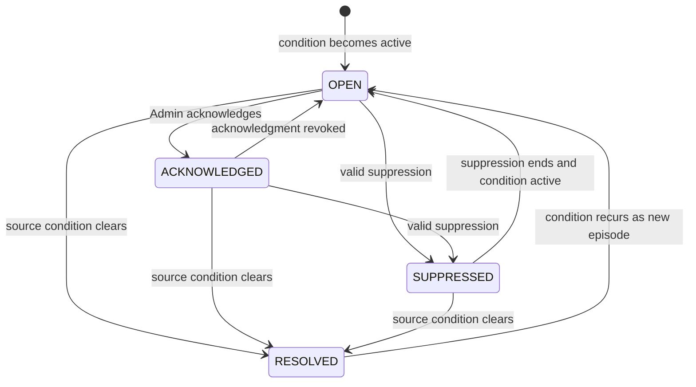

<!--
File: 12-notification-rules.md
Project: Sistem Rekonsiliasi Stok
Status: Approved design baseline for Phase 1
Version: 1.0.0
Last updated: 2026-07-12
Language: id-ID
Timezone: Asia/Jakarta
Role model: ADMIN only
Primary source: stok-management-system.pdf
Depends on:
  - 01-project-brief.md
  - 02-product-requirements.md
  - 03-business-rules.md
  - 04-stock-ledger-design.md
  - 05-database-schema.md
  - 06-user-roles-and-flows.md
  - 07-marketplace-simulator.md
  - 08-reconciliation-logic.md
  - 09-return-and-claim-flow.md
  - 10-fefo-batch-allocation.md
  - 11-stock-opname-flow.md
-->

# Notification Rules: Sistem Rekonsiliasi Stok

## 1. Tujuan Dokumen

Dokumen ini mendefinisikan aturan notifikasi fase 1 untuk Sistem Rekonsiliasi Stok.

Notifikasi harus membantu Admin mengetahui kondisi yang membutuhkan perhatian tanpa:

- mengubah stok;
- mengubah status bisnis sumber;
- membuat ledger movement;
- menutup issue;
- menandai klaim diajukan;
- menandai retur selesai;
- menyetujui stok opname;
- memproses ulang event;
- mengulang notifikasi identik tanpa batas.

Notifikasi fase 1 mencakup sedikitnya:

- batch mendekati tanggal kedaluwarsa;
- batch kedaluwarsa yang masih memiliki saldo fisik;
- retur yang menunggu inspeksi;
- klaim TikTok Shop yang mendekati tenggat;
- klaim yang melewati tenggat;
- issue rekonsiliasi baru dengan severity `HIGH` atau `CRITICAL`;
- kegagalan rekonsiliasi;
- kegagalan proses stok opname;
- kegagalan impor;
- event marketplace penting yang tertahan.

> **Prinsip utama:** notifikasi memberi tahu kondisi; notifikasi tidak menjadi pengganti tindakan domain.

Pusat notifikasi in-app adalah requirement wajib fase 1.

Email, WhatsApp, SMS, dan browser push tidak wajib pada fase 1.

---

## 2. Kedudukan Dokumen

Dokumen ini menjadi sumber kebenaran utama untuk:

- katalog notifikasi;
- rule evaluation;
- severity;
- trigger;
- threshold;
- deduplication;
- episode;
- escalation;
- read state;
- acknowledgment;
- resolution;
- deep link;
- outbox;
- scheduler;
- realtime refresh;
- schema;
- RLS;
- API;
- UI;
- accessibility;
- audit;
- testing.

Urutan sumber kebenaran:

| Topik | Dokumen |
|---|---|
| Masalah dan arah klien | `stok-management-system.pdf` |
| Requirement produk | `02-product-requirements.md` |
| Business rules | `03-business-rules.md` |
| Ledger dan transaksi | `04-stock-ledger-design.md` |
| Schema baseline | `05-database-schema.md` |
| User role | `06-user-roles-and-flows.md` |
| Simulator | `07-marketplace-simulator.md` |
| Rekonsiliasi | `08-reconciliation-logic.md` |
| Retur dan klaim | `09-return-and-claim-flow.md` |
| FEFO dan batch | `10-fefo-batch-allocation.md` |
| Stok opname | `11-stock-opname-flow.md` |
| Notifikasi | Dokumen ini |

Keputusan terbaru:

```text
Hanya ada satu user role aplikasi: ADMIN.
```

Konsekuensi:

- semua akun manusia yang memakai aplikasi memiliki role `ADMIN`;
- akun Admin tetap individual;
- satu Admin membaca notifikasi tidak menandai notifikasi sebagai dibaca bagi Admin lain;
- `SYSTEM_PROCESS` boleh membuat notifikasi, tetapi bukan user role;
- istilah Operator, Viewer, Approver, Supervisor, dan Notification Manager tidak digunakan sebagai role aplikasi.

---

## 3. Latar Belakang

Source proyek membutuhkan:

- notifikasi barang mendekati kedaluwarsa per batch;
- pengingat klaim TikTok sebelum batas 40 hari;
- rekonsiliasi yang menandai kejanggalan;
- penanganan retur;
- stok opname;
- simulator dan impor sebagai jalur input fase 1.

Dokumen produk sebelumnya menambahkan requirement:

```text
Batch approaching expiry
Batch expired with balance
Return waiting inspection
Claim approaching deadline
New HIGH/CRITICAL reconciliation issue
```

Masalah notifikasi yang harus dicegah:

- notifikasi dibuat setiap halaman dibuka;
- satu batch membuat puluhan notifikasi identik;
- notifikasi yang dibaca dianggap menyelesaikan sumber masalah;
- satu Admin membaca notifikasi untuk semua Admin;
- notifikasi lama tidak pernah resolved;
- threshold berubah dan mengubah histori;
- scheduler gagal tetapi dashboard tetap terlihat normal;
- notifikasi kedaluwarsa dibuat untuk batch bersaldo nol;
- klaim yang sudah diajukan tetap terus diberi reminder tenggat pengajuan;
- transaksi stok gagal karena insert notifikasi gagal.

---

## 4. Sasaran

| ID | Sasaran |
|---|---|
| `NTF-GOAL-001` | Setiap kondisi aktif memiliki maksimum satu notifikasi aktif per rule episode. |
| `NTF-GOAL-002` | Status baca disimpan per akun Admin. |
| `NTF-GOAL-003` | Mark as read tidak mengubah sumber bisnis. |
| `NTF-GOAL-004` | Notifikasi memiliki tautan menuju entitas sumber. |
| `NTF-GOAL-005` | Severity dan stage mengikuti kondisi aktual. |
| `NTF-GOAL-006` | Escalation tidak membuat spam duplikat. |
| `NTF-GOAL-007` | Rule dan threshold memiliki versi serta snapshot. |
| `NTF-GOAL-008` | Scheduled evaluation bersifat idempoten. |
| `NTF-GOAL-009` | Event-driven notification tidak membatalkan transaksi domain. |
| `NTF-GOAL-010` | Notification center tetap benar tanpa Realtime. |
| `NTF-GOAL-011` | Realtime hanya mempercepat refresh, bukan source of truth. |
| `NTF-GOAL-012` | Notification lifecycle dapat direkonsiliasi dengan source condition. |
| `NTF-GOAL-013` | Notifikasi dapat digunakan pada mobile dan assistive technology. |
| `NTF-GOAL-014` | Tidak ada secret atau PII sensitif pada pesan. |
| `NTF-GOAL-015` | External delivery dapat ditambahkan kelak tanpa mengubah rule engine inti. |
| `NTF-GOAL-016` | Sistem dapat membedakan informasi, peringatan, risiko tinggi, dan kondisi kritis. |
| `NTF-GOAL-017` | Riwayat perubahan stage dan severity dipertahankan. |
| `NTF-GOAL-018` | Kegagalan scheduler dapat diketahui dan diaudit. |

---

## 5. Bukan Tujuan

Fase 1 tidak:

- mengirim email;
- mengirim WhatsApp;
- mengirim SMS;
- mengirim browser push;
- meminta permission browser notification;
- membuat campaign marketing;
- mengirim promosi;
- membuat newsletter;
- mengelola preference per jenis kanal eksternal;
- menjamin delivery di luar aplikasi;
- mengubah status bisnis melalui mark as read;
- memproses domain action otomatis dari notification click;
- menaruh seluruh raw payload source pada message;
- membuat notification rule melalui kode frontend;
- menjadikan notifikasi sebagai queue transaksi;
- menggantikan audit trail;
- menggantikan reconciliation issue;
- menghapus notifikasi historis ketika kondisi resolved;
- membuat notifikasi low-stock karena requirement tersebut belum disepakati;
- mencatat harga atau nilai uang.

---

## 6. Prinsip Domain

### 6.1 Notification Is a Projection

Notifikasi adalah projection atas kondisi sumber.

Source of truth tetap:

- product batch;
- ledger;
- stock position;
- return;
- claim;
- reconciliation issue;
- stocktake;
- import job;
- marketplace event;
- scheduler job.

Jika notifikasi dan source berbeda:

```text
source condition wins
notification is re-evaluated
```

### 6.2 Notification Does Not Mutate Source

Aksi berikut hanya mengubah presentation state:

```text
MARK_READ
MARK_UNREAD
ARCHIVE_FOR_USER
UNARCHIVE_FOR_USER
```

Aksi berikut mengubah notification triage state, bukan source:

```text
ACKNOWLEDGE
```

Tidak ada aksi notification yang secara implisit:

```text
resolve issue
submit claim
inspect return
post stocktake
retry import
change stock
```

### 6.3 Source Action Is Explicit

Notification menyediakan:

```text
deep link
recommended action
```

Admin tetap membuka halaman sumber dan menjalankan command domain terpisah.

### 6.4 One Active Condition, One Active Notification

Untuk kombinasi:

```text
organization
rule
entity
condition episode
```

hanya ada satu notification aktif.

Stage dapat berubah pada row yang sama.

Riwayat stage disimpan append-only.

### 6.5 Read State Is Per User

Notification adalah organization-level condition.

Read state adalah per akun Admin.

```text
Admin A read != Admin B read
```

### 6.6 Notification Failure Must Not Roll Back Stock

Transaksi domain kritis tidak boleh gagal hanya karena notification renderer atau notification table sementara bermasalah.

Gunakan transactional outbox:

```text
domain transaction
-> commit domain state
-> commit outbox event
-> async/idempotent notification processor
```

Outbox insert boleh berada dalam transaksi domain karena hanya mencatat fakta kecil yang stabil.

Notification rendering dan user-state creation dilakukan setelahnya.

### 6.7 Scheduled Rules Are Re-Evaluation Rules

Rule berbasis waktu tidak membuat pesan setiap cron run.

Cron:

- mengevaluasi kondisi;
- membuat notification jika belum ada;
- memperbarui stage jika berubah;
- menambah occurrence bila kondisi terlihat lagi sesuai policy;
- resolve jika kondisi hilang;
- tidak menggandakan notification aktif.

---

## 7. Terminologi

| Istilah | Definisi |
|---|---|
| Rule | Definisi kondisi dan perilaku notifikasi. |
| Trigger | Kejadian atau jadwal yang memulai evaluasi. |
| Condition | Ekspresi yang menentukan apakah notification aktif. |
| Stage | Tahap kondisi dalam satu episode. |
| Episode | Periode sejak kondisi menjadi aktif sampai resolved. |
| Notification | Projection organization-level atas kondisi. |
| Notification event | Riwayat append-only perubahan notification. |
| User state | Status baca/arsip untuk satu akun Admin. |
| Deduplication key | Kunci unik untuk mencegah active duplicate. |
| Occurrence | Pengamatan ulang kondisi yang sama. |
| Escalation | Perubahan stage/severity menjadi lebih mendesak. |
| De-escalation | Penurunan stage akibat perbaikan data sebelum resolved. |
| Acknowledged | Admin menyatakan sudah mulai menindaklanjuti. |
| Resolved | Kondisi source tidak lagi aktif. |
| Archived | Notification disembunyikan untuk satu Admin, tanpa mengubah lifecycle. |
| Suppressed | Rule/episode tidak menghasilkan alert untuk periode tertentu dengan alasan. |
| Deep link | Route aman ke entitas sumber. |
| Action code | Tindakan yang direkomendasikan. |
| Outbox | Penyimpanan event domain untuk diproses notification engine. |
| Scheduled evaluation | Pemeriksaan berkala berbasis waktu. |
| Event-driven evaluation | Pemeriksaan akibat perubahan source. |
| Realtime | Mekanisme refresh UI, bukan source of truth. |
| Threshold snapshot | Nilai threshold yang berlaku pada episode. |
| Rule version | Versi logika rule. |
| Cooldown | Batas minimal sebelum reminder occurrence baru. |
| Reminder | Pengingat ulang dalam notification episode yang sama. |

---

## 8. Channel Fase 1

Channel wajib:

```text
IN_APP
```

Future channel:

```text
EMAIL
WEB_PUSH
WHATSAPP
SMS
```

Future channel tidak diimplementasikan fase 1.

Database rule engine tidak boleh mengasumsikan hanya satu channel selamanya, tetapi schema fase 1 tidak perlu membuat provider integration yang tidak dipakai.

---

## 9. Notification Categories

```text
EXPIRY
RETURN
CLAIM
RECONCILIATION
STOCKTAKE
IMPORT
MARKETPLACE_EVENT
SYSTEM_JOB
SIMULATOR
```

Core requirement:

```text
EXPIRY
RETURN
CLAIM
RECONCILIATION
```

Operational additions from prior project documents:

```text
STOCKTAKE
IMPORT
MARKETPLACE_EVENT
SYSTEM_JOB
SIMULATOR
```

---

## 10. Severity

Severity canonical:

```text
INFO
WARNING
HIGH
CRITICAL
```

### 10.1 Meaning

| Severity | Makna | UI |
|---|---|---|
| `INFO` | Perlu diketahui, belum mendesak. | Pusat notifikasi dan badge normal. |
| `WARNING` | Membutuhkan perhatian dalam waktu wajar. | Pusat notifikasi dan indicator warning. |
| `HIGH` | Berisiko mengganggu operasi atau deadline. | Prioritas tinggi dan persistent indicator. |
| `CRITICAL` | Integritas stok, deadline, atau proses kritis terancam. | Prioritas teratas; accessible urgent announcement saat muncul dalam sesi aktif. |

### 10.2 Severity Is Not Read State

Notification `CRITICAL` yang dibaca tetap `CRITICAL`.

Read state hanya:

```text
UNREAD
READ
```

### 10.3 Dynamic Severity

Rule dapat menaikkan atau menurunkan severity berdasarkan source condition.

Setiap perubahan disimpan pada notification event.

---

## 11. Lifecycle Notification

Lifecycle status:

```text
OPEN
ACKNOWLEDGED
RESOLVED
SUPPRESSED
```

### 11.1 OPEN

Kondisi aktif dan belum diakui secara organization-level.

### 11.2 ACKNOWLEDGED

Admin telah menyatakan kondisi sedang ditindaklanjuti.

Source condition masih aktif.

### 11.3 RESOLVED

Source condition tidak lagi aktif atau obligation selesai.

### 11.4 SUPPRESSED

Notification tidak aktif ditampilkan sementara/permanen berdasarkan rule yang sah.

Fase 1 dapat membatasi suppress kepada:

- rule disabled;
- entity excluded by explicit configuration;
- maintenance/demo condition.

Suppress membutuhkan:

- reason;
- actor;
- until time bila sementara;
- audit.

---

## 12. User Read State

Per user:

```text
UNREAD
READ
ARCHIVED
```

### 12.1 UNREAD

Belum dibaca akun Admin tersebut.

### 12.2 READ

Sudah dibuka atau ditandai dibaca oleh akun tersebut.

### 12.3 ARCHIVED

Disembunyikan dari default list akun tersebut.

Archive tidak:

- resolve;
- acknowledge;
- suppress;
- change source.

### 12.4 Re-Escalation

Jika notification yang sudah read mengalami escalation:

Default:

```text
user state becomes UNREAD again
```

untuk semua active Admin.

Alasan:

stage baru adalah informasi baru.

Event menyimpan:

```text
READ_STATE_RESET_BY_ESCALATION
```

---

## 13. Lifecycle State Machine



A recurrence setelah `RESOLVED` sebaiknya membuat episode baru.

Boleh menggunakan notification row baru atau row baru yang menautkan predecessor.

Default:

```text
new notification row for new episode
previous_notification_id link
```

---

## 14. Trigger Modes

```text
EVENT_DRIVEN
SCHEDULED
HYBRID
```

### 14.1 Event-Driven

Contoh:

- reconciliation issue dibuat;
- import gagal;
- stocktake posting gagal;
- return receipt membuat pending inspection;
- claim dibuat;
- marketplace event gagal.

### 14.2 Scheduled

Contoh:

- expiry threshold;
- claim remaining time;
- return inspection SLA;
- stale event;
- planned stocktake reminder;
- scheduler health check.

### 14.3 Hybrid

Event source membuat episode segera.

Scheduler memperbarui:

- stage;
- severity;
- reminder;
- resolution.

---

## 15. Transactional Outbox

### 15.1 Tujuan

Outbox memastikan fakta domain dan permintaan evaluasi notification tercatat bersama tanpa membuat domain transaction bergantung pada notification rendering.

### 15.2 Outbox Event

```ts
type NotificationOutboxEvent = {
  id: string
  organizationId: string
  eventType: string
  entityType: string
  entityId: string
  occurredAt: string
  payload: Record<string, unknown>
  payloadHash: string
  correlationId: string
  status: 'PENDING' | 'PROCESSING' | 'COMPLETED' | 'FAILED'
  attemptCount: number
}
```

### 15.3 Domain Function

Contoh:

```text
return receipt posted
-> return state committed
-> NOTIFICATION_EVALUATION_REQUESTED written to outbox
-> transaction commits
```

### 15.4 Processor

Processor:

1. lock pending outbox row;
2. evaluate relevant rules;
3. upsert notification idempotently;
4. append notification events;
5. mark outbox completed;
6. commit.

### 15.5 Failure

Jika processor gagal:

- outbox remains/reverts `PENDING` or `FAILED_RETRYABLE`;
- stock transaction remains valid;
- retry uses same outbox ID;
- no duplicate active notification.

---

## 16. Scheduler

Supabase Cron/`pg_cron` dapat menjalankan:

- SQL;
- database function;
- HTTP request;
- Edge Function.

Fase 1 recommendation:

```text
database functions for database-local evaluations
```

Cron configuration must be version-controlled through migrations.

### 16.1 Job Catalog

```text
notification.evaluate_expiry
notification.evaluate_claim_deadlines
notification.evaluate_pending_return_inspection
notification.evaluate_marketplace_events
notification.evaluate_stocktakes
notification.process_outbox
notification.check_job_health
```

### 16.2 Recommended Baseline Schedules

Nilai berikut adalah baseline proposal dan configurable:

| Job | Schedule |
|---|---|
| Process outbox | Every minute |
| Claim deadline | Hourly |
| Pending return inspection | Hourly |
| Marketplace event stalled | Every 15 minutes |
| Expiry | Daily after local date rollover |
| Stocktake reminders | Hourly |
| Notification resolution sweep | Hourly |
| Cron health | Every 15 minutes |

Exact cron expression disimpan dalam migration/config.

### 16.3 Timezone

Business timezone:

```text
Asia/Jakarta
```

Database stores `timestamptz`.

Expiry rules evaluate local calendar date.

Claim rules compare exact stored deadline timestamp.

### 16.4 Overlap

Only one active evaluation per:

```text
organization + rule family
```

Use advisory lock.

### 16.5 Job Failure

Cron/job failure:

- logged;
- recorded in evaluation run;
- retried according to policy;
- can create `SYSTEM_JOB_FAILED` notification through an independent health path;
- never treated as successful rule evaluation.

---

## 17. Rule Definition Model

```ts
type NotificationRuleDefinition = {
  code: string
  version: string
  category: NotificationCategory
  triggerMode: 'EVENT_DRIVEN' | 'SCHEDULED' | 'HYBRID'
  entityType: string
  severityStrategy: string
  stageStrategy: string
  conditionStrategy: string
  resolutionStrategy: string
  deduplicationStrategy: string
  cooldownStrategy: string
  templateVersion: string
  actionCode: string
  isActive: boolean
  config: Record<string, unknown>
}
```

Rule logic itself belongs in versioned server/database code.

`config` contains values, not executable SQL from user input.

---

## 18. Rule Versioning

Version changes when:

- condition changes;
- stage changes;
- severity changes materially;
- dedup dimension changes;
- resolution changes;
- threshold semantics change;
- timezone semantics change;
- message data contract changes materially.

Existing episode stores:

```text
rule_version_snapshot
config_snapshot
template_version_snapshot
```

Configuration change does not retroactively rewrite history.

Open notification may be re-evaluated under new rule only through explicit migration policy.

Default:

```text
existing episode keeps old threshold snapshot
new episode uses new config
```

Expiry stage may use updated future threshold only if explicitly approved; no silent history rewrite.

---

## 19. Deduplication

### 19.1 Active Dedup Key

General format:

```text
{rule_code}:{organization_id}:{entity_type}:{entity_id}:{episode_dimension}
```

Hash stored:

```text
SHA256(normalized key)
```

### 19.2 Examples

```text
EXPIRY_RISK:{org}:{batch_id}
CLAIM_DEADLINE:{org}:{claim_id}
RETURN_PENDING_INSPECTION:{org}:{return_id}
RECONCILIATION_ISSUE:{org}:{issue_id}
IMPORT_FAILURE:{org}:{import_job_id}
STOCKTAKE_POST_FAILURE:{org}:{stocktake_id}
MARKETPLACE_EVENT_STALLED:{org}:{event_id}
```

### 19.3 Active Unique Constraint

Only one active notification for dedup key.

Active:

```text
OPEN
ACKNOWLEDGED
SUPPRESSED
```

Resolved is historical.

### 19.4 Same Condition Seen Again

Update:

- `last_seen_at`;
- `occurrence_count`;
- current actual value;
- source snapshot;
- stage/severity if needed.

Do not insert duplicate.

### 19.5 New Episode

If prior resolved and condition recurs:

- create new row;
- increment episode number;
- link previous notification;
- user state starts unread.

---

## 20. Stage and Reminder

Stage represents condition severity progression.

Reminder does not create a new notification card by default.

Reminder:

- appends event;
- updates `last_reminded_at`;
- can reset user read state;
- respects cooldown.

### 20.1 Cooldown

Per rule.

Examples:

```text
expiry same stage: no reminder more than daily
return pending inspection: daily
claim due soon: when threshold crossed
critical reconciliation: no repeated reminder unless source updated or daily unresolved reminder configured
```

### 20.2 Occurrence Count

Increment only when:

- scheduled evaluation observes condition after cooldown;
- source event changes meaningful actual value;
- stage changes.

Do not increment on every page read.

---

## 21. Coalescing

One notification may summarize one source entity.

Do not coalesce unrelated entities into one notification row because deep link and resolution become ambiguous.

Digest/bulk summaries may be computed as UI projection:

```text
12 batches expire within 30 days
```

The source notifications remain per batch.

---

## 22. Notification Message Contract

Fields:

```text
title
summary
details_snapshot
severity
stage
created_at
last_seen_at
due_at
entity
action_label
action_route
```

Message requirements:

- concise;
- explains condition;
- gives quantity/date where useful;
- gives next action;
- no secret;
- no raw stack trace;
- no unnecessary PII;
- no claim that root cause is proven if only inferred.

Example:

```text
Batch SKN-2407-A kedaluwarsa dalam 30 hari dan masih memiliki 48 unit sellable.
```

Not:

```text
Segera cek!!!
```

---

## 23. Deep Link

Deep link generated server-side from:

```text
entity_type
entity_id
action_code
```

Client cannot store arbitrary external URLs.

Routes:

```text
/admin/products/{productId}/batches/{batchId}
/admin/returns/{returnId}
/admin/claims/{claimId}
/admin/reconciliation/issues/{issueId}
/admin/stocktakes/{stocktakeId}
/admin/imports/{importJobId}
/admin/marketplace/events/{eventId}
/admin/simulator/runs/{runId}
```

Route authorization rechecked when opened.

---

# PART A — CORE NOTIFICATION CATALOG

## 24. Expiry Notification Family

Rule family:

```text
EXPIRY_RISK
```

Source:

- product batch;
- physical bucket balances;
- expiry date;
- threshold config;
- batch status.

Default thresholds from prior project decisions:

```text
90 days
60 days
30 days
expired
```

### 24.1 Relevant Quantity

Approaching-expiry notification evaluates:

```text
risk_qty = SELLABLE + QUARANTINE
```

Damaged is excluded from approaching-sale risk but remains visible elsewhere.

Expired-with-balance evaluates:

```text
physical_qty = SELLABLE + QUARANTINE + DAMAGED
```

Reason:

- expired physical stock still requires operational disposition;
- damaged expired stock may still require disposal tracking.

### 24.2 No-Balance Rule

If relevant quantity is zero:

```text
no active expiry notification
```

Existing active episode is resolved.

### 24.3 Dynamic Eligibility

Notification does not depend only on batch status.

Expiry date is evaluated dynamically using local date.

---

## 25. Expiry Stage Mapping

Default proposal:

| Stage | Condition | Severity |
|---|---|---|
| `D90` | 61–90 days remaining | `INFO` |
| `D60` | 31–60 days remaining | `WARNING` |
| `D30` | 0–30 days remaining | `HIGH` |
| `EXPIRED` | local date past expiry and physical balance > 0 | `CRITICAL` |

If same-day expiry is considered eligible for sale under FEFO default:

```text
days_remaining = 0
stage = D30
```

`EXPIRED` begins after the expiry date has passed in `Asia/Jakarta`.

### 25.1 Severity Override

If risk quantity exceeds configured high-volume threshold, severity may increase one level.

The threshold is optional and must be configured, not guessed.

---

## 26. Expiry Deduplication

Dedup:

```text
EXPIRY_RISK:{batch_id}
```

One episode progresses:

```text
D90 -> D60 -> D30 -> EXPIRED
```

Do not create four simultaneously active cards.

Notification events preserve each stage crossing.

### 26.1 Stage Escalation

When stage changes:

- update severity;
- update title/message;
- append event;
- reset active Admin read states to `UNREAD`;
- update due date;
- no duplicate notification row.

### 26.2 De-Escalation

Possible if expiry date corrected with audit.

System:

- re-evaluates;
- appends `STAGE_DEESCALATED`;
- updates stage;
- does not erase history.

If correction places batch outside all thresholds:

```text
RESOLVED
```

---

## 27. Expiry Resolution

Resolve when:

- relevant balance becomes zero;
- batch is validly archived with zero balance;
- expiry date correction places it outside threshold;
- product/batch removed from tracked scope by approved rule change.

Do not resolve merely because:

- Admin read it;
- Admin acknowledged it;
- batch became blocked;
- batch was hidden in UI.

Blocked expired stock still exists physically.

---

## 28. Expiry Action

Action code:

```text
OPEN_BATCH_EXPIRY_DETAIL
```

Detail page shows:

- product;
- batch;
- expiry;
- physical buckets;
- FEFO eligibility;
- recent movement;
- disposal option if expired;
- reconciliation issues.

---

## 29. Return Pending Inspection Notification

Rule:

```text
RETURN_PENDING_INSPECTION
```

Source condition:

```text
received_uninspected_qty > 0
```

Timer starts:

```text
oldest_uninspected_receipt_at
```

### 29.1 Baseline SLA Proposal

Configurable baseline:

```text
warning_after_hours = 24
high_after_hours = 48
critical_after_hours = 72
```

These are project defaults for demo/phase 1 unless the organization sets another SLA.

They are not marketplace rules.

### 29.2 Stage Mapping

| Stage | Condition | Severity |
|---|---|---|
| `PENDING` | below warning threshold | no notification or optional `INFO` |
| `OVER_24H` | warning threshold crossed | `WARNING` |
| `OVER_48H` | high threshold crossed | `HIGH` |
| `OVER_72H` | critical threshold crossed | `CRITICAL` |

Default core behavior:

```text
create first active notification at warning threshold
```

---

## 30. Return Pending Inspection Dedup

Dedup:

```text
RETURN_PENDING_INSPECTION:{return_id}
```

Notification message includes:

- return no;
- quantity pending;
- oldest receipt time;
- channel;
- action.

If pending quantity changes:

- update snapshot;
- append occurrence;
- preserve episode.

---

## 31. Return Pending Inspection Resolution

Resolve when:

```text
received_uninspected_qty = 0
```

Possible outcomes:

- moved to sellable;
- moved to damaged;
- receipt reversed;
- return corrected.

Do not resolve when:

- notification read;
- return source closed;
- claim created;
- return partially inspected with remaining pending.

---

## 32. Return Unknown Batch Notification

Operational extension:

```text
RETURN_UNKNOWN_BATCH
```

Condition:

```text
quarantine quantity exists on controlled unidentified return batch
```

Severity:

```text
HIGH
```

Escalate to `CRITICAL` after configurable SLA.

Resolve when quantity reclassified to verified batch or reversed.

---

## 33. Return Pending Arrival Notification

Operational extension:

```text
RETURN_PENDING_ARRIVAL_SLA
```

Condition:

- return expected/in transit;
- pending arrival > 0;
- exceeded configurable SLA;
- not fully lost/cancelled.

Severity:

```text
WARNING -> HIGH
```

This notification does not mark items lost.

Action opens return detail.

---

## 34. Claim Deadline Notification Family

Rule family:

```text
CLAIM_DEADLINE
```

Source:

- claim;
- eligibility;
- status;
- deadline;
- basis;
- channel.

Core for TikTok Shop.

Default project claim window:

```text
40 calendar days
```

Actual notification uses:

```text
deadline_at snapshot
```

not recalculation from today.

### 34.1 Eligible Status

Active deadline reminder when claim status is:

```text
NOT_STARTED
DUE_SOON
EXCEPTION with valid deadline
```

Default reminder resolves when:

```text
SUBMITTED
RESOLVED
CANCELLED
```

`EXPIRED` remains active as overdue notification until handled or resolved by policy.

---

## 35. Claim Threshold Mapping

Default thresholds from return/claim design:

```text
14 days
7 days
3 days
1 day
due today
overdue
```

Suggested mapping:

| Stage | Condition | Severity |
|---|---|---|
| `D14` | 8–14 days | `INFO` |
| `D7` | 4–7 days | `WARNING` |
| `D3` | 2–3 days | `HIGH` |
| `D1` | 1 day | `HIGH` |
| `DUE_TODAY` | due date/time window | `CRITICAL` |
| `OVERDUE` | now > deadline | `CRITICAL` |

Exact boundary uses timestamp, not rounded UI label.

---

## 36. Claim Deduplication

Dedup:

```text
CLAIM_DEADLINE:{claim_id}
```

One episode escalates across thresholds.

Each threshold crossing:

- append event;
- reset read state;
- update severity;
- update message;
- preserve deadline snapshot.

---

## 37. Claim Basis Missing

Rule:

```text
CLAIM_BASIS_MISSING
```

Condition:

```text
claim eligible
and deadline_at is null
```

Severity:

```text
HIGH
```

Reason:

Without a deadline, reminder engine cannot protect the claim window.

Resolve when:

- basis corrected;
- deadline set;
- claim cancelled/not eligible.

This notification is separate from normal claim deadline episode.

---

## 38. Claim Overdue

Overdue notification remains active until:

- claim submitted under allowed late flow;
- claim resolved;
- claim cancelled;
- Admin resolves exception with source evidence.

Marking read does not change claim status.

No stock effect.

---

## 39. Claim Action

Action:

```text
OPEN_CLAIM_DETAIL
```

Detail displays:

- claim no;
- return;
- affected quantity;
- basis;
- deadline;
- days/time remaining;
- evidence;
- submit/resolve flow.

---

## 40. Reconciliation Issue Notification

Rules:

```text
RECONCILIATION_ISSUE_HIGH
RECONCILIATION_ISSUE_CRITICAL
```

Trigger:

- issue created;
- issue reopened;
- issue escalated.

Severity inherits source issue.

Dedup:

```text
RECONCILIATION_ISSUE:{issue_id}
```

### 40.1 Notification Creation

Only create for:

```text
HIGH
CRITICAL
```

`INFO` and `WARNING` remain visible in reconciliation center but do not require notification unless configured.

### 40.2 Stage

```text
NEW
REOPENED
ESCALATED
RECURRING
```

### 40.3 Resolution

Resolve when source issue:

```text
RESOLVED
DISMISSED
```

If issue reopens:

- create new episode or reopen linked notification according to episode policy;
- default new episode with predecessor link.

---

## 41. Reconciliation Run Failed

Rule:

```text
RECONCILIATION_RUN_FAILED
```

Severity:

```text
CRITICAL
```

Trigger:

- run status `FAILED`;
- check engine error prevents reliable result;
- scheduled run missed beyond threshold.

Dedup:

```text
RECONCILIATION_RUN_FAILED:{run_id}
```

If repeated failures are separate run IDs, UI may show aggregate banner in addition to individual notifications.

Resolve when:

- failed run investigated;
- subsequent successful verification run exists;
- Admin acknowledges resolution with reference.

Do not auto-resolve solely because next cron started.

---

## 42. Integrity Hold Notification

Rule:

```text
INTEGRITY_HOLD_ACTIVE
```

Condition:

- active hold from reconciliation;
- product/batch/order/organization mutation blocked.

Severity:

```text
CRITICAL
```

Dedup per hold ID.

Resolve when hold released.

---

# PART B — OPERATIONAL NOTIFICATION CATALOG

## 43. Stocktake Planned

Rule:

```text
STOCKTAKE_PLANNED
```

Condition:

- stocktake status `READY`;
- planned time within configured threshold.

Default proposal:

```text
24 hours before
1 hour before
```

One episode per stocktake.

Severity:

```text
INFO -> WARNING
```

Resolve when:

- stocktake starts;
- cancelled;
- planned time removed.

---

## 44. Stocktake Frozen Hold Active

Rule:

```text
STOCKTAKE_FROZEN_ACTIVE
```

Condition:

- frozen stocktake in `COUNTING`/`REVIEW`/`APPROVED`;
- active holds exist.

Severity:

```text
WARNING
```

This is operational awareness, not an error.

Resolve when holds released.

---

## 45. Stocktake Recount Required

Rule:

```text
STOCKTAKE_RECOUNT_REQUIRED
```

Condition:

```text
recount_required_line_count > 0
```

Severity:

```text
HIGH
```

Dedup per stocktake, not per line, to avoid one card per SKU.

Message includes count.

Deep link filters recount lines.

Resolve when count becomes zero or session cancelled/posted.

---

## 46. Stocktake Approval Stale

Rule:

```text
STOCKTAKE_APPROVAL_STALE
```

Trigger:

- count/reason/evidence changes after approval;
- server invalidates approval.

Severity:

```text
HIGH
```

Dedup per stocktake approval episode.

Resolve when re-approved or cancelled.

---

## 47. Stocktake Posting Failed

Rule:

```text
STOCKTAKE_POST_FAILED
```

Severity:

```text
CRITICAL
```

Trigger:

- posting transaction safely rolled back;
- posting result uncertain;
- post-reconciliation failed.

Stage:

```text
ROLLED_BACK
RESULT_UNCERTAIN
RECONCILIATION_FAILED
```

Different stages may share one episode per stocktake.

Resolve after safe verification and successful posting/reconciliation.

---

## 48. Import Failure

Rules:

```text
IMPORT_FAILED
IMPORT_PARTIAL_FAILURE
```

### 48.1 Failed

Condition:

```text
job status = FAILED
```

Severity:

```text
HIGH
```

Escalate to `CRITICAL` if import type could have produced stock movement and result is uncertain.

### 48.2 Partial

Condition:

```text
invalid_rows > 0
or processed_rows < valid_rows
```

Severity:

```text
WARNING or HIGH
```

### 48.3 Dedup

```text
IMPORT_FAILURE:{import_job_id}
```

### 48.4 Resolution

Resolve when:

- job corrected/reprocessed successfully;
- explicitly cancelled with audit;
- source issue linked and resolved.

A different import job is a new episode.

---

## 49. Marketplace Event Stalled

Rule:

```text
MARKETPLACE_EVENT_STALLED
```

Condition:

- event `RECEIVED`/`PROCESSING` beyond SLA;
- or retryable failed beyond retry threshold.

Severity:

- `WARNING` for non-stock event;
- `HIGH` for event expected to affect reservation;
- `CRITICAL` for event expected to trigger physical stock movement.

Dedup per event.

Resolve when event:

```text
PROCESSED
DUPLICATE
IGNORED_STALE
REJECTED_WITH_RESOLVED_EXCEPTION
```

---

## 50. Marketplace Payload Conflict

Rule:

```text
MARKETPLACE_EVENT_PAYLOAD_CONFLICT
```

Trigger:

```text
same idempotency/external event ID
different payload hash
```

Severity:

```text
HIGH
```

Resolve after investigation and source correction.

No automatic retry.

---

## 51. Simulator Run Failed

Rule:

```text
SIMULATOR_RUN_FAILED
```

Only active in demo-enabled organization/environment.

Severity:

```text
WARNING
```

`CRITICAL` only if simulator reveals a stock invariant failure.

Data marked demo.

Resolve when run investigated or new deterministic run passes.

Do not mix demo notification into production organization.

---

## 52. System Job Failed

Rule:

```text
SYSTEM_JOB_FAILED
```

Source:

- cron job;
- outbox processor;
- notification evaluation;
- projection job;
- reconciliation scheduler.

Severity:

- `HIGH` after one critical job failure;
- `CRITICAL` after consecutive failures or missed SLA.

Dedup:

```text
SYSTEM_JOB_FAILED:{job_code}
```

One active episode per job.

Resolve after configured consecutive successful runs.

---

## 53. Notification Processor Backlog

Rule:

```text
NOTIFICATION_OUTBOX_BACKLOG
```

Condition:

- pending outbox count or oldest age exceeds threshold.

Severity:

```text
WARNING -> HIGH -> CRITICAL
```

This rule should be emitted through an independent health query, not the same broken processor alone.

---

# PART C — RULE ENGINE BEHAVIOR

## 54. Rule Evaluation Result

```ts
type NotificationEvaluationResult = {
  ruleCode: string
  ruleVersion: string
  entityType: string
  entityId: string
  conditionActive: boolean
  stage?: string
  severity?: 'INFO' | 'WARNING' | 'HIGH' | 'CRITICAL'
  actualSnapshot: Record<string, unknown>
  dueAt?: string
  deduplicationKey: string
  actionCode: string
  resolutionReason?: string
}
```

---

## 55. Evaluation Algorithm

```text
evaluate source
-> validate rule active
-> calculate condition
-> calculate stage
-> calculate severity
-> calculate dedup key
-> lock active notification by dedup
-> if condition active:
     create or update episode
     append meaningful event
     update user read states on escalation
   else:
     resolve active episode if present
-> store evaluation run result
```

---

## 56. Meaningful Change

Append event and optionally notify users when:

- stage changes;
- severity changes;
- due date changes;
- relevant quantity changes beyond configured threshold;
- source reopened;
- action route changes due source correction;
- reminder cooldown elapsed;
- condition resolves.

Do not append noisy event for identical values every minute.

---

## 57. Acknowledgment

Admin can acknowledge:

```text
notification is being handled
```

Requires:

- note optional/required by severity;
- actor;
- timestamp.

Default:

- note required for `CRITICAL`;
- optional for others.

Acknowledgment:

- organization-level;
- does not mark read for every Admin;
- does not resolve source;
- can display acknowledged by Admin name.

---

## 58. Suppression

Suppression is dangerous because it can hide active risk.

Phase 1 default:

- no arbitrary permanent suppression from UI;
- rule can be disabled through configuration with audit;
- entity-specific temporary suppression may be allowed only for `INFO`/`WARNING`;
- `CRITICAL` cannot be silently suppressed.

Suppression fields:

```text
reason
suppressed_by
suppressed_at
suppressed_until
```

At end:

- re-evaluate;
- reopen if condition active;
- mark unread.

---

## 59. Resolution

Automatic resolution preferred.

Resolution conditions are rule-specific.

Notification resolution event stores:

```text
resolved_at
resolution_code
source_snapshot
source_reference
```

Manual resolution is not allowed for source-derived core rules unless:

- source condition cannot be queried;
- exception requires formal override;
- reason and evidence stored.

---

## 60. Reopening

If condition returns after resolution:

- create new episode;
- link previous notification;
- unread for all active Admin;
- preserve historical resolved row.

If condition flips briefly due transaction timing, use stability/debounce window where needed.

---

## 61. Debounce

Use debounce for eventually consistent source projections.

Examples:

- event processing status;
- projection refresh;
- short transaction transition.

Do not debounce:

- reconciliation critical issue;
- claim due today;
- expired batch with sellable quantity;
- stocktake posting uncertain.

---

## 62. Notification Storm Prevention

Controls:

- active dedup unique index;
- stage-based updates;
- cooldown;
- occurrence update;
- per-rule max reminder frequency;
- no notification generation on page load;
- no client-side generation;
- outbox idempotency;
- scheduler advisory lock;
- evaluation run idempotency;
- aggregate UI summary.

---

## 63. Mark as Read

Command:

```text
notification_id
user_id from session
```

Effects:

- upsert user state `READ`;
- set `read_at`;
- no notification lifecycle change;
- no source change;
- audit optional lightweight.

---

## 64. Mark All as Read

Scope:

```text
current Admin only
current organization only
current filter or all active notifications
```

Server must cap/batch safely.

It does not:

- acknowledge;
- resolve;
- archive;
- affect other Admin.

---

## 65. Archive for User

Archive hides notification from default list for that user.

If notification escalates:

Default:

```text
archive cleared
state = UNREAD
```

Resolved archived notifications remain in history.

---

## 66. Unread Count

```text
active notifications
where no user state exists or state = UNREAD
and not archived
```

Lifecycle active:

```text
OPEN
ACKNOWLEDGED
```

Suppressed excluded from normal count.

Resolved excluded from active badge.

---

## 67. Notification Badge

Badge should:

- show exact count up to configured display limit;
- use `99+` above limit;
- not rely on color alone;
- have accessible label.

Example:

```text
Notifikasi, 12 belum dibaca
```

---

## 68. In-App Realtime

Source of truth:

```text
notification tables
```

Possible refresh:

- query on page load;
- refetch on focus;
- periodic polling;
- Supabase Realtime.

For small phase 1 volume:

- Postgres Changes can be used for notification table updates;
- RLS remains enforced;
- polling fallback remains required.

For larger scale:

- Supabase recommends Broadcast for scalability/security compared with Postgres Changes;
- architecture may migrate without changing notification rule engine.

Realtime failure must not hide data permanently.

---

## 69. Realtime Event Scope

Subscribe only to organization/user-relevant changes.

Do not stream:

- raw outbox payload;
- audit secrets;
- all organizations;
- full source payload.

Client receives enough signal to refetch safe DTO.

Recommended pattern:

```text
realtime signal
-> invalidate/refetch notification query
```

rather than trusting full realtime payload as canonical UI state.

---

# PART D — DATABASE DESIGN

## 70. Schema Overview

Recommended schema:

```text
notification.rules
notification.rule_runs
notification.outbox_events
notification.notifications
notification.notification_events
notification.user_states
notification.suppressions
```

Optional future:

```text
notification.delivery_channels
notification.deliveries
notification.subscriptions
```

Future tables are not required phase 1.

---

## 71. `notification.rules`

Recommended fields:

```text
id
organization_id
code
version
category_code
trigger_mode_code
entity_type_code
severity_strategy_code
stage_strategy_code
condition_strategy_code
resolution_strategy_code
template_version
action_code
config
is_active
effective_from
effective_to
created_by
created_at
updated_by
updated_at
```

Unique:

```text
organization + code + version
```

Only one effective active version per organization/code.

---

## 72. Rule Config Examples

Expiry:

```json
{
  "thresholdDays": [90, 60, 30, 0],
  "timezone": "Asia/Jakarta",
  "approachingBuckets": ["SELLABLE", "QUARANTINE"],
  "expiredBuckets": ["SELLABLE", "QUARANTINE", "DAMAGED"],
  "reminderCooldownHours": 24
}
```

Claim:

```json
{
  "thresholdDays": [14, 7, 3, 1, 0],
  "timezone": "Asia/Jakarta",
  "reminderCooldownHours": 12
}
```

Return inspection:

```json
{
  "warningAfterHours": 24,
  "highAfterHours": 48,
  "criticalAfterHours": 72,
  "reminderCooldownHours": 24
}
```

---

## 73. `notification.outbox_events`

```sql
create table notification.outbox_events (
  id uuid primary key default gen_random_uuid(),
  organization_id uuid not null,
  event_type_code text not null,
  entity_type_code text not null,
  entity_id uuid not null,
  occurred_at timestamptz not null,
  payload jsonb not null default '{}'::jsonb,
  payload_hash text not null,
  correlation_id uuid not null,
  status_code text not null default 'PENDING',
  attempt_count integer not null default 0,
  available_at timestamptz not null default now(),
  locked_at timestamptz,
  locked_by text,
  completed_at timestamptz,
  last_error_code text,
  last_error_detail jsonb not null default '{}'::jsonb,
  created_at timestamptz not null default now(),
  check (attempt_count >= 0),
  check (status_code in (
    'PENDING',
    'PROCESSING',
    'COMPLETED',
    'FAILED_RETRYABLE',
    'FAILED_FINAL'
  ))
);
```

Unique event identity can use source command/event ID.

---

## 74. `notification.rule_runs`

```sql
create table notification.rule_runs (
  id uuid primary key default gen_random_uuid(),
  organization_id uuid,
  rule_code text not null,
  rule_version text not null,
  trigger_type_code text not null,
  triggered_by_outbox_event_id uuid,
  status_code text not null,
  started_at timestamptz not null,
  completed_at timestamptz,
  evaluated_count integer not null default 0,
  created_count integer not null default 0,
  updated_count integer not null default 0,
  resolved_count integer not null default 0,
  error_count integer not null default 0,
  summary jsonb not null default '{}'::jsonb,
  error_code text,
  error_detail jsonb not null default '{}'::jsonb,
  correlation_id uuid not null,
  check (evaluated_count >= 0),
  check (created_count >= 0),
  check (updated_count >= 0),
  check (resolved_count >= 0),
  check (error_count >= 0)
);
```

---

## 75. `notification.notifications`

Amend baseline schema to separate lifecycle from read state.

```sql
create table notification.notifications (
  id uuid primary key default gen_random_uuid(),
  organization_id uuid not null,
  rule_id uuid not null references notification.rules(id),
  rule_code_snapshot text not null,
  rule_version_snapshot text not null,
  template_version_snapshot text not null,
  notification_type_code text not null,
  category_code text not null,
  entity_type_code text not null,
  entity_id uuid not null,
  episode_no integer not null default 1,
  previous_notification_id uuid,
  deduplication_key text not null,
  deduplication_hash text not null,
  lifecycle_status_code text not null default 'OPEN',
  stage_code text not null,
  severity_code text not null,
  title text not null,
  message text not null,
  action_code text not null,
  action_route text not null,
  condition_started_at timestamptz not null,
  due_at timestamptz,
  first_seen_at timestamptz not null,
  last_seen_at timestamptz not null,
  last_reminded_at timestamptz,
  occurrence_count integer not null default 1,
  acknowledged_at timestamptz,
  acknowledged_by uuid,
  acknowledgment_note text,
  resolved_at timestamptz,
  resolution_code text,
  resolution_snapshot jsonb,
  source_snapshot jsonb not null default '{}'::jsonb,
  config_snapshot jsonb not null default '{}'::jsonb,
  created_at timestamptz not null default now(),
  updated_at timestamptz not null default now(),
  version_no bigint not null default 1,
  check (episode_no > 0),
  check (occurrence_count > 0),
  check (severity_code in ('INFO','WARNING','HIGH','CRITICAL')),
  check (lifecycle_status_code in (
    'OPEN',
    'ACKNOWLEDGED',
    'RESOLVED',
    'SUPPRESSED'
  ))
);
```

---

## 76. Active Dedup Index

```sql
create unique index uidx_notifications_active_dedup
on notification.notifications (
  organization_id,
  deduplication_hash
)
where lifecycle_status_code in (
  'OPEN',
  'ACKNOWLEDGED',
  'SUPPRESSED'
);
```

Resolved historical episodes do not block new episode.

---

## 77. `notification.notification_events`

Append-only:

```sql
create table notification.notification_events (
  id uuid primary key default gen_random_uuid(),
  organization_id uuid not null,
  notification_id uuid not null
    references notification.notifications(id),
  event_type_code text not null,
  from_lifecycle_status_code text,
  to_lifecycle_status_code text,
  from_stage_code text,
  to_stage_code text,
  from_severity_code text,
  to_severity_code text,
  source_snapshot jsonb not null default '{}'::jsonb,
  note text,
  actor_type_code text not null,
  actor_user_id uuid,
  process_name text,
  occurred_at timestamptz not null,
  correlation_id uuid not null,
  created_at timestamptz not null default now(),
  check ((actor_user_id is not null) <> (process_name is not null))
);
```

Event types:

```text
CREATED
SEEN_AGAIN
STAGE_ESCALATED
STAGE_DEESCALATED
SEVERITY_CHANGED
REMINDER_EMITTED
ACKNOWLEDGED
ACKNOWLEDGMENT_REVOKED
SUPPRESSED
SUPPRESSION_ENDED
RESOLVED
REOPENED_AS_NEW_EPISODE
SOURCE_SNAPSHOT_UPDATED
```

---

## 78. `notification.user_states`

```sql
create table notification.user_states (
  id uuid primary key default gen_random_uuid(),
  organization_id uuid not null,
  notification_id uuid not null
    references notification.notifications(id),
  user_id uuid not null,
  read_state_code text not null default 'UNREAD',
  read_at timestamptz,
  archived_at timestamptz,
  last_seen_version_no bigint,
  created_at timestamptz not null default now(),
  updated_at timestamptz not null default now(),
  unique (notification_id, user_id),
  check (read_state_code in ('UNREAD','READ','ARCHIVED'))
);
```

Missing user-state row is treated as `UNREAD`.

---

## 79. `notification.suppressions`

Optional phase 1 controlled table:

```sql
create table notification.suppressions (
  id uuid primary key default gen_random_uuid(),
  organization_id uuid not null,
  rule_id uuid not null references notification.rules(id),
  entity_type_code text,
  entity_id uuid,
  reason_code text not null,
  note text not null,
  starts_at timestamptz not null,
  ends_at timestamptz,
  created_by uuid not null,
  created_at timestamptz not null default now(),
  revoked_at timestamptz,
  revoked_by uuid,
  check (ends_at is null or ends_at > starts_at)
);
```

Critical core rules may ignore suppression by policy.

---

## 80. Indexes

```sql
create index idx_notifications_org_active
on notification.notifications (
  organization_id,
  lifecycle_status_code,
  severity_code,
  last_seen_at desc
);

create index idx_notifications_entity
on notification.notifications (
  organization_id,
  entity_type_code,
  entity_id,
  created_at desc
);

create index idx_notification_user_states_user
on notification.user_states (
  organization_id,
  user_id,
  read_state_code,
  updated_at desc
);

create index idx_notification_outbox_pending
on notification.outbox_events (
  available_at,
  created_at
)
where status_code in ('PENDING','FAILED_RETRYABLE');

create index idx_notification_rule_runs_status
on notification.rule_runs (
  rule_code,
  status_code,
  started_at desc
);
```

---

## 81. Views

```text
api.notification_center
api.notification_unread_count
api.notification_details
api.notification_history
api.notification_rule_health
api.expiry_notification_candidates
api.claim_notification_candidates
api.return_inspection_notification_candidates
```

### 81.1 Notification Center View

Joins user state using authenticated user context or function parameter.

Fields:

```text
notification_id
type
severity
stage
title
message
lifecycle_status
read_state
created_at
last_seen_at
due_at
action_route
entity summary
acknowledged by
```

### 81.2 Blind Organization Isolation

No cross-org rows.

---

## 82. Database Functions

Public functions:

```text
api.list_notifications
api.get_notification
api.mark_notification_read
api.mark_notification_unread
api.mark_all_notifications_read
api.archive_notification_for_user
api.unarchive_notification_for_user
api.acknowledge_notification
api.revoke_notification_acknowledgment
api.get_notification_unread_count
```

Internal functions:

```text
notification.process_outbox
notification.evaluate_rule
notification.upsert_active_notification
notification.append_notification_event
notification.resolve_notification
notification.reset_user_read_states
notification.evaluate_expiry
notification.evaluate_claim_deadlines
notification.evaluate_pending_return_inspection
notification.evaluate_marketplace_events
notification.evaluate_stocktakes
notification.evaluate_job_health
```

Internal functions not executable by browser client.

---

## 83. Outbox Processing Lock

Outbox worker may use queue-style locking.

Unlike FEFO allocation, `SKIP LOCKED` is acceptable for independent outbox jobs because order selection is queue work, not a business ordering rule.

Example:

```sql
select id
from notification.outbox_events
where status_code in ('PENDING','FAILED_RETRYABLE')
  and available_at <= now()
order by created_at
for update skip locked
limit 100;
```

This distinction must be explicit:

```text
SKIP LOCKED forbidden for FEFO decision
SKIP LOCKED acceptable for independent outbox worker rows
```

---

## 84. Failure Isolation

Notification rule error does not mutate source.

If one entity evaluation fails:

- record error;
- continue other entities where safe;
- job may be `PARTIALLY_FAILED`;
- failed entity retried;
- no false resolution.

If whole rule fails:

- rule run failed;
- notification job health may alert;
- active notifications remain as last known state;
- do not resolve based on missing evaluation.

---

## 85. Idempotency

Outbox event ID is idempotency identity.

Scheduled rule run uses:

```text
rule_code + organization + evaluation_window
```

Notification upsert uses active dedup hash.

User command uses:

```text
notification:{id}:user:{user_id}:{action}:{client_command_id}
```

Identical retry returns existing result.

Payload conflict rejected.

---

# PART E — API AND UI

## 86. Routes

```text
GET  /api/admin/notifications
GET  /api/admin/notifications/unread-count
GET  /api/admin/notifications/:notificationId
POST /api/admin/notifications/:notificationId/read
POST /api/admin/notifications/:notificationId/unread
POST /api/admin/notifications/:notificationId/archive
POST /api/admin/notifications/:notificationId/unarchive
POST /api/admin/notifications/:notificationId/acknowledge
POST /api/admin/notifications/:notificationId/revoke-acknowledgment
POST /api/admin/notifications/read-all
```

No mutation through GET.

---

## 87. List Request

Query:

```text
status
readState
severity
category
dateFrom
dateTo
entityType
search
page
pageSize
sort
```

Server:

- validates;
- applies organization;
- applies current user;
- limits page size;
- returns safe DTO.

---

## 88. List Response

```json
{
  "items": [
    {
      "id": "uuid",
      "category": "EXPIRY",
      "type": "EXPIRY_RISK",
      "severity": "HIGH",
      "stage": "D30",
      "title": "Batch mendekati kedaluwarsa",
      "message": "Batch SKN-2407-A kedaluwarsa dalam 30 hari dan masih memiliki 48 unit.",
      "lifecycleStatus": "OPEN",
      "readState": "UNREAD",
      "dueAt": "2026-08-11T16:59:59Z",
      "action": {
        "label": "Lihat batch",
        "route": "/admin/products/uuid/batches/uuid"
      },
      "createdAt": "2026-07-12T01:00:00Z",
      "lastSeenAt": "2026-07-12T01:00:00Z"
    }
  ],
  "page": 1,
  "pageSize": 20,
  "total": 1,
  "unreadCount": 1
}
```

---

## 89. Mark Read Request

```json
{
  "clientCommandId": "uuid"
}
```

Response:

```json
{
  "success": true,
  "notificationId": "uuid",
  "readState": "READ",
  "readAt": "2026-07-12T10:00:00+07:00"
}
```

No source change.

---

## 90. Acknowledge Request

```json
{
  "note": "Sedang dilakukan pengecekan batch fisik.",
  "clientCommandId": "uuid"
}
```

For `CRITICAL`, note required.

Response includes lifecycle `ACKNOWLEDGED`.

---

## 91. UI Information Architecture

```text
Notifications
├── Bell and Unread Badge
├── Notification Center
│   ├── Unread
│   ├── All Active
│   ├── Acknowledged
│   ├── Resolved History
│   └── Archived for Me
├── Notification Detail
├── Rule Health (Admin diagnostics)
└── Configuration
```

Configuration may be limited to:

- expiry thresholds;
- claim reminder thresholds;
- return inspection SLA;
- enable/disable noncritical operational rules.

Core critical rules cannot be disabled without explicit audit/guardrail.

---

## 92. Bell Menu

Bell menu shows latest active notifications.

Minimum:

- severity;
- title;
- relative time;
- unread state;
- action.

Bell menu is not full notification center.

Provide:

```text
Lihat semua notifikasi
```

---

## 93. Notification Card

Card:

- severity icon and text;
- category;
- title;
- message;
- stage;
- due/time;
- read indicator;
- acknowledgment;
- action button;
- overflow menu for read/archive.

Do not use color alone.

---

## 94. Notification Detail

```text
Notification
├── Current condition
├── Source entity
├── Current stage/severity
├── Due date
├── Recommended action
├── Source snapshot
├── Notification history
├── Acknowledgment
└── Related audit/reconciliation
```

Raw JSON hidden behind diagnostics, not primary UI.

---

## 95. Mobile UX

- notification cards;
- one-column filters;
- sticky severity filters optional;
- action reachable;
- unread indicator with text;
- no horizontal scroll;
- touch targets;
- deep link returns to notification center;
- pagination/infinite scroll with stable cursor;
- safe loading and error states.

---

## 96. Accessibility

### 96.1 Status Messages

Passive updates such as:

```text
Notifikasi ditandai dibaca
3 notifikasi baru dimuat
```

use an accessible status region, for example semantics equivalent to:

```html
<div role="status" aria-live="polite"></div>
```

### 96.2 Urgent Alerts

New critical condition appearing while the user is actively using the application may use an assertive alert region.

Do not announce every routine realtime refresh assertively.

### 96.3 Focus

Opening a notification should not unexpectedly move focus unless a dialog is intentionally opened.

### 96.4 Text

Error and status descriptions use text, not icon/color alone.

### 96.5 Reduced Interruption

Ordinary notifications remain in the center and do not open modal dialogs automatically.

Critical confirmation dialogs are reserved for user-initiated destructive actions, not background alert storms.

---

## 97. Realtime UI Behavior

When signal arrives:

1. update unread count or trigger refetch;
2. announce only meaningful new unread condition;
3. avoid duplicate toast;
4. maintain current scroll/filter;
5. do not mark notification read merely because bell menu opened unless product behavior explicitly requires it.

Default:

```text
mark read when user explicitly opens item or selects mark read
```

---

## 98. Toasts

Toasts are transient UI feedback, not notification records.

Examples:

```text
Notifikasi ditandai dibaca
Pengingat telah diakui
```

Do not create persistent notification row for successful mark-read.

Critical domain errors may have both:

- immediate error UI;
- persistent notification if condition remains.

---

# PART F — SECURITY, AUDIT, AND PRIVACY

## 99. Authentication and Authorization

Every endpoint/function:

- verifies authentication;
- verifies active Admin profile;
- derives organization from server context;
- verifies notification organization;
- applies action permission;
- does not trust role from client.

Server Actions/Route Handlers are treated as externally callable mutation boundaries.

---

## 100. RLS

Policies:

- Admin reads notifications in own organization;
- Admin reads/writes own user state;
- Admin cannot change another user state;
- Admin acknowledgment uses function;
- direct insert notification denied;
- direct update lifecycle denied;
- outbox internal;
- rules configuration controlled;
- audit/history append-only.

---

## 101. Safe Message Content

Do not include:

- password;
- token;
- session;
- service key;
- buyer full address;
- buyer phone;
- raw marketplace credentials;
- full raw source payload;
- stack trace;
- SQL statement containing sensitive data.

Return/order reference may be masked if exposed broadly.

---

## 102. Action Route Security

Stored route is internal.

When opened:

- server rechecks organization;
- not-found and forbidden separated appropriately;
- no open redirect;
- no arbitrary `javascript:` URL;
- no user-supplied external route.

---

## 103. Audit Events

```text
NOTIFICATION_RULE_CREATED
NOTIFICATION_RULE_UPDATED
NOTIFICATION_RULE_DISABLED
NOTIFICATION_CREATED
NOTIFICATION_STAGE_CHANGED
NOTIFICATION_SEVERITY_CHANGED
NOTIFICATION_REMINDER_EMITTED
NOTIFICATION_ACKNOWLEDGED
NOTIFICATION_ACKNOWLEDGMENT_REVOKED
NOTIFICATION_RESOLVED
NOTIFICATION_SUPPRESSED
NOTIFICATION_SUPPRESSION_ENDED
NOTIFICATION_MARKED_READ
NOTIFICATION_MARKED_UNREAD
NOTIFICATION_ARCHIVED
NOTIFICATION_OUTBOX_FAILED
NOTIFICATION_RULE_RUN_FAILED
```

Mark-read audit may be lightweight or retained through user state timestamps.

---

## 104. Observability

Metrics:

```text
notification_active_total
notification_unread_total
notification_created_total
notification_resolved_total
notification_escalated_total
notification_rule_runs_total
notification_rule_run_failures_total
notification_outbox_pending_total
notification_outbox_oldest_age_seconds
notification_outbox_failures_total
notification_processing_duration_ms
notification_duplicate_prevented_total
notification_realtime_refetch_total
notification_job_missed_total
```

Labels should avoid unbounded entity IDs.

---

## 105. Structured Logs

```json
{
  "event": "notification_rule_evaluated",
  "ruleCode": "EXPIRY_RISK",
  "ruleVersion": "1.0.0",
  "organizationId": "uuid",
  "evaluatedCount": 70,
  "createdCount": 2,
  "updatedCount": 4,
  "resolvedCount": 1,
  "durationMs": 145,
  "correlationId": "uuid"
}
```

No sensitive source payload.

---

## 106. Health Dashboard

Shows:

- cron job status;
- last successful evaluation per rule;
- last failed run;
- outbox pending count;
- oldest pending age;
- active notification count;
- active critical count;
- dedup conflicts;
- Realtime status optional.

This is diagnostics, not a new user role.

---

# PART G — RECONCILIATION AND CONSISTENCY

## 107. Notification Reconciliation Checks

```text
REC_NOTIFICATION_SOURCE_ACTIVE
REC_NOTIFICATION_SOURCE_RESOLVED
REC_NOTIFICATION_ACTIVE_DUPLICATE
REC_NOTIFICATION_RULE_VERSION
REC_NOTIFICATION_DEEP_LINK
REC_NOTIFICATION_USER_STATE_SCOPE
REC_NOTIFICATION_CLAIM_DEADLINE
REC_NOTIFICATION_EXPIRY_THRESHOLD
REC_NOTIFICATION_OUTBOX_BACKLOG
REC_NOTIFICATION_JOB_HEALTH
REC_NOTIFICATION_CRITICAL_SUPPRESSION
```

---

## 108. Source Active Check

For active notification:

```text
source condition should still be active
```

If false:

- resolve;
- append correction event;
- issue warning if stale beyond SLA.

---

## 109. Missing Notification Check

For source condition requiring notification:

```text
active notification exists
```

If absent beyond evaluation SLA:

- create critical system issue;
- repair notification projection;
- do not alter source.

---

## 110. Duplicate Check

For active notifications:

```text
count by organization + dedup hash <= 1
```

Unique index is primary prevention.

Reconciliation verifies.

---

## 111. Claim Deadline Consistency

```text
notification due_at = claim deadline_at
```

Threshold/stage derived from same deadline snapshot.

Notification does not recompute 40 days independently.

---

## 112. Expiry Consistency

```text
days_remaining
=
batch expiry local date - operational local date
```

Relevant balance must satisfy config.

Batch with zero relevant balance should not have active expiry episode.

---

## 113. User State Isolation

Verify:

- user state user belongs to organization;
- notification organization matches;
- one row per user/notification;
- one Admin reading does not mutate another state.

---

# PART H — TESTING

## 114. Unit Tests

- stage calculation;
- severity mapping;
- expiry local date;
- claim threshold;
- return SLA;
- dedup key;
- episode number;
- cooldown;
- read state reset;
- resolution;
- message template;
- safe route;
- config validation.

---

## 115. Database Tests

| ID | Test |
|---|---|
| `NTF-DB-001` | Active dedup unique |
| `NTF-DB-002` | Resolved allows new episode |
| `NTF-DB-003` | Mark read per user |
| `NTF-DB-004` | Mark read does not resolve |
| `NTF-DB-005` | Admin A read does not affect Admin B |
| `NTF-DB-006` | Escalation resets read |
| `NTF-DB-007` | Expiry zero balance resolves |
| `NTF-DB-008` | Expiry stage progresses |
| `NTF-DB-009` | Claim due stage progresses |
| `NTF-DB-010` | Submitted claim resolves deadline reminder |
| `NTF-DB-011` | Return inspection resolution |
| `NTF-DB-012` | Reconciliation issue inheritance |
| `NTF-DB-013` | Outbox retry idempotent |
| `NTF-DB-014` | Outbox failure does not change source |
| `NTF-DB-015` | Cross-org denied |
| `NTF-DB-016` | Direct notification insert denied |
| `NTF-DB-017` | Critical suppression forbidden |
| `NTF-DB-018` | Rule version snapshot immutable |
| `NTF-DB-019` | Deep link internal |
| `NTF-DB-020` | Notification event append-only |
| `NTF-DB-021` | Mark all read only current user |
| `NTF-DB-022` | Archived escalation becomes unread |
| `NTF-DB-023` | Job run failure recorded |
| `NTF-DB-024` | Duplicate cron run no duplicate |
| `NTF-DB-025` | Claim due_at matches claim |

---

## 116. Integration Tests

- domain transaction writes outbox;
- outbox processor creates notification;
- Realtime signal triggers refetch;
- polling fallback returns same state;
- claim scheduler;
- expiry scheduler;
- reconciliation event;
- stocktake failure;
- import failure;
- marketplace event stalled;
- rule config update.

---

## 117. E2E Scenarios

| ID | Scenario |
|---|---|
| `NTF-E2E-001` | Batch enters 90-day threshold |
| `NTF-E2E-002` | Batch escalates 90 to 60 |
| `NTF-E2E-003` | Batch escalates to expired |
| `NTF-E2E-004` | Batch balance becomes zero |
| `NTF-E2E-005` | Return pending inspection |
| `NTF-E2E-006` | Return inspected resolves |
| `NTF-E2E-007` | Claim reaches 14/7/3/1/day due |
| `NTF-E2E-008` | Claim overdue |
| `NTF-E2E-009` | Claim submitted resolves reminder |
| `NTF-E2E-010` | Claim basis missing |
| `NTF-E2E-011` | High reconciliation issue |
| `NTF-E2E-012` | Critical issue escalates |
| `NTF-E2E-013` | Issue resolved |
| `NTF-E2E-014` | Import failed |
| `NTF-E2E-015` | Marketplace event stalled |
| `NTF-E2E-016` | Stocktake recount required |
| `NTF-E2E-017` | Stocktake posting failed |
| `NTF-E2E-018` | Two Admin read independently |
| `NTF-E2E-019` | Realtime disconnected, polling works |
| `NTF-E2E-020` | Outbox retry creates one notification |
| `NTF-E2E-021` | Escalation resets unread |
| `NTF-E2E-022` | Mark all read current user only |
| `NTF-E2E-023` | Critical cannot be suppressed |
| `NTF-E2E-024` | New episode after recurrence |
| `NTF-E2E-025` | Mobile notification action |

---

## 118. Accessibility Tests

- badge accessible name;
- unread status not color-only;
- keyboard navigation;
- focus order;
- status messages announced politely;
- critical alert announced once;
- no repeated assertive announcements on polling;
- action buttons named;
- message text clear;
- screen-reader route and severity readable.

---

## 119. Load Tests

Test:

- 70 products;
- multiple batches;
- hundreds of events/day;
- multiple Admin sessions;
- expiry sweep;
- claim hourly sweep;
- outbox burst;
- Realtime reconnect;
- unread count query.

Success:

- no duplicate active notification;
- evaluation within target;
- no source transaction rollback;
- UI remains responsive.

---

## 120. Property-Based Tests

Generate random:

- source state changes;
- threshold crossings;
- repeated evaluations;
- read actions;
- resolution and recurrence.

Properties:

```text
active dedup count <= 1
mark read never changes source
same evaluation is idempotent
escalation monotonic for same unchanged source time
resolution clears active badge
recurrence creates new episode
notification failure does not mutate source
```

---

# PART I — ACCEPTANCE AND RELEASE

## 121. Acceptance Criteria

### Core Behavior

- `NTF-AC-001`: Notification never changes stock.
- `NTF-AC-002`: Notification never resolves source by read.
- `NTF-AC-003`: In-app center exists.
- `NTF-AC-004`: Every notification has type, severity, stage, entity, time, and action.
- `NTF-AC-005`: Active duplicate prevented.

### User State

- `NTF-AC-006`: Read state is per Admin.
- `NTF-AC-007`: Mark all read affects current Admin only.
- `NTF-AC-008`: Archive is per Admin.
- `NTF-AC-009`: Escalation resets unread.
- `NTF-AC-010`: Acknowledgment does not resolve source.

### Expiry

- `NTF-AC-011`: Default thresholds 90/60/30/expired supported.
- `NTF-AC-012`: Local calendar used.
- `NTF-AC-013`: Zero-balance batch has no active expiry alert.
- `NTF-AC-014`: Stage updates one episode.
- `NTF-AC-015`: Deep link opens batch.

### Return and Claim

- `NTF-AC-016`: Pending inspection rule works.
- `NTF-AC-017`: Inspection completion resolves.
- `NTF-AC-018`: Claim reminder uses stored deadline.
- `NTF-AC-019`: Claim stage escalates.
- `NTF-AC-020`: Submitted/resolved claim clears submission reminder.
- `NTF-AC-021`: Missing basis creates separate alert.

### Reconciliation

- `NTF-AC-022`: New HIGH issue creates notification.
- `NTF-AC-023`: New CRITICAL issue creates notification.
- `NTF-AC-024`: Issue resolution resolves notification.
- `NTF-AC-025`: Failed run creates critical notification.

### Reliability

- `NTF-AC-026`: Domain transaction not rolled back by renderer failure.
- `NTF-AC-027`: Outbox retries idempotently.
- `NTF-AC-028`: Cron overlap prevented.
- `NTF-AC-029`: Job failure visible.
- `NTF-AC-030`: Realtime is optional enhancement.
- `NTF-AC-031`: Polling fallback works.

### Security

- `NTF-AC-032`: Only active Admin can access.
- `NTF-AC-033`: Cross-org denied.
- `NTF-AC-034`: Client cannot create notification directly.
- `NTF-AC-035`: Action route safe.
- `NTF-AC-036`: Message excludes secret/PII.

### Accessibility

- `NTF-AC-037`: Severity not color-only.
- `NTF-AC-038`: Status changes are programmatically exposed.
- `NTF-AC-039`: Critical announcement is not repeated noisily.
- `NTF-AC-040`: Mobile center usable.

---

## 122. Release Gates

Jangan rilis bila:

- mark as read menyelesaikan source;
- user read state organization-wide;
- notification dibuat saat page load;
- active duplicate masih mungkin;
- expiry alert dibuat untuk balance nol;
- claim reminder menghitung deadline sendiri dan berbeda dari claim;
- source transaction dapat gagal karena notification renderer;
- outbox retry membuat duplicate;
- critical issue tidak menghasilkan notification;
- scheduler failure tidak terlihat;
- client dapat insert notification;
- cross-org data bocor;
- Realtime menjadi satu-satunya cara data muncul;
- notification hanya dibedakan warna;
- critical tests gagal.

---

## 123. Definition of Done

Selesai bila:

1. rule registry tersedia;
2. rule version tersedia;
3. in-app notification center tersedia;
4. user read state per Admin tersedia;
5. active dedup index tersedia;
6. episode lifecycle tersedia;
7. stage escalation tersedia;
8. resolution tersedia;
9. outbox tersedia;
10. outbox processor tersedia;
11. expiry rule tersedia;
12. return inspection rule tersedia;
13. claim deadline rule tersedia;
14. reconciliation rule tersedia;
15. stocktake operational rules tersedia;
16. import rule tersedia;
17. event stalled rule tersedia;
18. job health tersedia;
19. deep link tersedia;
20. mark read/unread tersedia;
21. mark all read tersedia;
22. archive per user tersedia;
23. acknowledgment tersedia;
24. scheduler tersedia;
25. RLS tersedia;
26. audit tersedia;
27. observability tersedia;
28. accessibility tersedia;
29. pgTAP tests lulus;
30. E2E tests lulus.

---

## 124. Traceability ke Source Proyek

| Source requirement | Notification design |
|---|---|
| Notifikasi barang mendekati kedaluwarsa | `EXPIRY_RISK` |
| Per batch | Entity is batch |
| Batch tanpa saldo tidak perlu alert | Balance condition |
| Klaim TikTok sebelum 40 hari | Claim deadline snapshot and stages |
| Retur berbagai kondisi | Pending inspection/arrival rules |
| Rekonsiliasi menandai kejanggalan | HIGH/CRITICAL issue notifications |
| Drill-down | Safe action route |
| Tanpa harga | No money fields |
| Hanya satu role Admin | Admin access, per-account read state |
| Tidak ada stok berubah tanpa jejak | Notifications never mutate stock |
| Import/simulator | Failure/stalled operational rules |
| Stok opname | Planned/recount/post failure notifications |

---

## 125. Amendments terhadap Dokumen Sebelumnya

### `02-product-requirements.md`

Clarify:

```text
mark as read is per Admin account
```

### `03-business-rules.md`

Add:

- notification lifecycle separate from read state;
- escalation resets read state;
- domain transaction independent through outbox;
- notification is source-derived projection.

### `05-database-schema.md`

Replace single `status_code = OPEN/READ/RESOLVED/DISMISSED` with:

```text
lifecycle_status_code
+
notification.user_states.read_state_code
```

Add:

- outbox;
- notification events;
- rule runs;
- per-user states;
- rule version/config snapshot.

### `08-reconciliation-logic.md`

Add notification consistency checks.

### `09-return-and-claim-flow.md`

Use claim `deadline_at` as source of truth for reminder.

### `11-stock-opname-flow.md`

Map stocktake failure and recount states to rules in this document.

---

## 126. Keputusan Terbuka

1. Final return inspection SLA.
2. Whether D90 expiry is `INFO` or `WARNING`.
3. Whether damaged quantity participates in approaching-expiry risk.
4. Whether acknowledgment note is required for `HIGH`.
5. Whether resolved history is retained indefinitely.
6. Whether temporary suppression is included in MVP.
7. Exact polling interval.
8. Whether Realtime uses Postgres Changes or Broadcast in MVP.
9. Whether stocktake planned reminders are required in initial demo.
10. Whether system-job notifications are shown in the same center or diagnostics tab.
11. Whether notification configuration is editable in UI or migration-only.
12. Whether archived notification reappears on any source quantity change or only escalation.
13. Whether critical notification reminder repeats daily.
14. Whether browser push is added after phase 1.
15. Whether digest summary is shown on dashboard.

Until decided, safe defaults in this document apply.

---

## 127. Referensi Teknis Resmi

### Supabase Cron

Supabase Cron schedules recurring jobs using cron syntax inside Postgres and provides job-run monitoring.

- `https://supabase.com/docs/guides/cron`
- `https://supabase.com/docs/guides/cron/quickstart`

### Supabase Realtime

Supabase supports database change subscriptions.

Its documentation distinguishes:

- Broadcast, recommended for scalability and security;
- Postgres Changes, simpler but with different scaling characteristics.

- `https://supabase.com/docs/guides/realtime/subscribing-to-database-changes`
- `https://supabase.com/docs/guides/realtime/postgres-changes`
- `https://supabase.com/docs/guides/realtime/broadcast`

### Supabase Security

- Row Level Security:
  `https://supabase.com/docs/guides/database/postgres/row-level-security`
- Database Functions:
  `https://supabase.com/docs/guides/database/functions`

### Next.js

Sensitive server-side mutations require authentication and authorization checks at the mutation boundary.

- Authentication:
  `https://nextjs.org/docs/app/guides/authentication`
- Data Security:
  `https://nextjs.org/docs/app/guides/data-security`
- Server-side operations:
  `https://nextjs.org/docs/app/api-reference/directives/use-server`

### Accessibility

WCAG 2.2 Success Criterion 4.1.3 requires status messages to be programmatically determinable without receiving focus.

WAI techniques describe:

- `role="status"` for polite status messages;
- alert/live-region semantics for important errors;
- text descriptions rather than color-only indicators.

- `https://www.w3.org/WAI/WCAG22/Understanding/status-messages.html`
- `https://www.w3.org/WAI/WCAG22/Techniques/aria/ARIA22`
- `https://www.w3.org/WAI/WCAG22/Techniques/aria/ARIA19`

### Future Push Notifications

Browser/system notification delivery is out of scope for phase 1.

Future implementation should use the relevant platform standards:

- Notifications API:
  `https://notifications.spec.whatwg.org/`
- Push API:
  `https://www.w3.org/TR/push-api/`

---

## 128. Ringkasan Keputusan Final

Pusat notifikasi fase 1 bersifat:

```text
IN_APP ONLY
```

Notification architecture:

```text
DOMAIN EVENT
-> TRANSACTIONAL OUTBOX
-> RULE EVALUATION
-> ONE ACTIVE EPISODE
-> PER-ADMIN READ STATE
-> SAFE DEEP LINK
```

Core rules:

```text
EXPIRY
RETURN PENDING INSPECTION
CLAIM DEADLINE
HIGH/CRITICAL RECONCILIATION
```

Operational rules:

```text
STOCKTAKE
IMPORT
MARKETPLACE EVENT
SYSTEM JOB
SIMULATOR
```

Status bisnis notification:

```text
OPEN
ACKNOWLEDGED
RESOLVED
SUPPRESSED
```

Status baca:

```text
UNREAD
READ
ARCHIVED
```

Keduanya tidak boleh dicampur.

Satu Admin membaca notifikasi tidak memengaruhi Admin lain. Mark as read tidak menyelesaikan claim, retur, issue, stocktake, import, atau batch expiry. Escalation memperbarui satu episode aktif dan membuatnya unread kembali. Scheduled evaluation dan outbox processing harus idempoten.

Realtime hanya memberi sinyal untuk refresh. Database tetap source of truth. Browser push tetap di luar fase 1. Notifikasi yang baik membantu manusia bertindak; notifikasi yang buruk hanya mengubah layar menjadi pohon Natal administratif. Proyek ini memilih yang pertama, sebuah standar yang rupanya perlu ditulis sepanjang dokumen.
