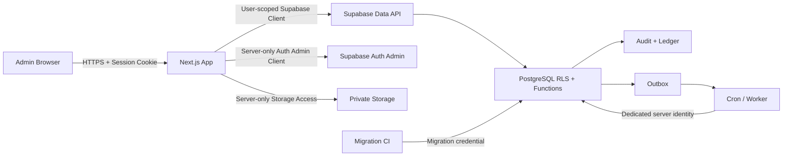

<!--
File: 13-security-and-rls.md
Project: Sistem Rekonsiliasi Stok
Status: Approved security baseline for Phase 1
Version: 1.0.0
Last updated: 2026-07-12
Language: id-ID
Timezone: Asia/Jakarta
Application role model: ADMIN only
Primary source: stok-management-system.pdf
Depends on:
  - 01-project-brief.md
  - 02-product-requirements.md
  - 03-business-rules.md
  - 04-stock-ledger-design.md
  - 05-database-schema.md
  - 06-user-roles-and-flows.md
  - 07-marketplace-simulator.md
  - 08-reconciliation-logic.md
  - 09-return-and-claim-flow.md
  - 10-fefo-batch-allocation.md
  - 11-stock-opname-flow.md
  - 12-notification-rules.md
-->

# Security and Row Level Security (RLS): Sistem Rekonsiliasi Stok

## 1. Tujuan Dokumen

Dokumen ini mendefinisikan baseline keamanan aplikasi, database, storage, autentikasi, otorisasi, dan Row Level Security (RLS) untuk Sistem Rekonsiliasi Stok fase 1.

Sistem menangani data operasional yang menentukan:

- jumlah stok fisik;
- saldo batch;
- tanggal kedaluwarsa;
- reservasi;
- pesanan marketplace;
- retur;
- klaim;
- stok opname;
- rekonsiliasi;
- adjustment;
- reversal;
- audit;
- bukti foto atau dokumen;
- akun Admin.

Kesalahan kontrol akses tidak hanya dapat membocorkan data. Kesalahan tersebut dapat:

- mengubah saldo;
- membuat barang seolah keluar dua kali;
- menghapus jejak sumber;
- mencampur data demo dan produksi;
- membuka data organisasi lain;
- memalsukan actor;
- menonaktifkan Admin;
- menutup issue;
- menambah atau mengurangi quantity tanpa ledger.

Tujuan utama dokumen ini adalah memastikan:

1. pengguna harus terautentikasi;
2. pengguna harus memiliki profil Admin aktif;
3. organisasi tidak pernah dipercaya dari input client;
4. client tidak memperoleh akses bebas ke tabel internal;
5. mutation kritis hanya dilakukan melalui command/function terkontrol;
6. RLS membatasi baris berdasarkan organisasi dan akun;
7. fungsi privileged memvalidasi actor, organisasi, state, dan invariant;
8. service-role tidak pernah tersedia pada browser;
9. ledger dan audit tidak dapat dimutasi langsung;
10. file evidence disimpan secara privat;
11. setiap tindakan sensitif dapat diaudit;
12. pengujian negatif membuktikan akses yang dilarang benar-benar gagal.

> **Prinsip utama:** UI bukan batas keamanan. Route, function, grants, RLS, constraint, dan audit harus tetap aman ketika request dibuat langsung tanpa melalui tombol aplikasi.

---

## 2. Kedudukan Dokumen

Dokumen ini menjadi sumber kebenaran utama untuk:

- autentikasi;
- sesi;
- invitation;
- deactivation;
- MFA;
- model Admin tunggal;
- organization isolation;
- RLS;
- grants;
- schema exposure;
- view security;
- `SECURITY DEFINER`;
- service-role;
- Server Actions;
- Route Handlers;
- CSRF;
- IDOR;
- input validation;
- storage;
- upload;
- secret management;
- audit security;
- security logging;
- HTTP security headers;
- rate limiting;
- environment isolation;
- security testing;
- release gate.

Urutan sumber kebenaran:

| Topik | Dokumen |
|---|---|
| Masalah dan scope | `stok-management-system.pdf` |
| Requirement produk | `02-product-requirements.md` |
| Aturan bisnis | `03-business-rules.md` |
| Ledger | `04-stock-ledger-design.md` |
| Database baseline | `05-database-schema.md` |
| Role dan user flow | `06-user-roles-and-flows.md` |
| Simulator | `07-marketplace-simulator.md` |
| Rekonsiliasi | `08-reconciliation-logic.md` |
| Retur dan klaim | `09-return-and-claim-flow.md` |
| FEFO | `10-fefo-batch-allocation.md` |
| Stok opname | `11-stock-opname-flow.md` |
| Notifikasi | `12-notification-rules.md` |
| Security dan RLS | Dokumen ini |

Bila dokumen lama masih menyebut:

```text
WAREHOUSE_OPERATOR
OWNER_VIEWER
APPROVER
SUPERVISOR
```

maka istilah tersebut tidak berlaku untuk fase 1.

Keputusan terbaru:

```text
Hanya ada satu user role aplikasi: ADMIN.
```

---

## 3. Ruang Lingkup Keamanan

### 3.1 Termasuk

- Next.js App Router;
- Server Components;
- Client Components;
- Server Actions;
- Route Handlers;
- Supabase Auth;
- Supabase SSR;
- Supabase Data API;
- PostgreSQL;
- RLS;
- database functions;
- database views;
- Supabase Storage;
- Realtime;
- Cron;
- simulator;
- impor;
- bukti/evidence;
- deployment preview;
- production deployment;
- migration;
- testing;
- logging;
- audit.

### 3.2 Tidak Termasuk Fase 1

- SSO enterprise;
- SAML;
- SCIM;
- device management;
- endpoint detection and response;
- hardware security key wajib;
- customer-facing public API;
- third-party marketplace API credentials produksi;
- payment processing;
- monetary claim;
- SIEM enterprise;
- dedicated SOC;
- WAF rule tuning enterprise;
- penetration test pihak ketiga wajib.

Hal-hal tersebut dapat menjadi tahap berikutnya.

---

## 4. Sasaran Keamanan

| ID | Sasaran |
|---|---|
| `SEC-GOAL-001` | Tidak ada akses aplikasi untuk role `anon`. |
| `SEC-GOAL-002` | Hanya profil Admin aktif yang dapat menggunakan aplikasi. |
| `SEC-GOAL-003` | Data selalu terisolasi berdasarkan `organization_id`. |
| `SEC-GOAL-004` | Actor, organisasi, dan role tidak dipercaya dari request body. |
| `SEC-GOAL-005` | Tidak ada direct mutation ke ledger, projection, audit, allocation, atau posted document. |
| `SEC-GOAL-006` | Semua mutation kritis memakai database function terkontrol. |
| `SEC-GOAL-007` | Semua exposed relation memiliki RLS atau kontrol setara yang terdokumentasi. |
| `SEC-GOAL-008` | Service-role hanya digunakan pada server untuk tugas administrasi terbatas. |
| `SEC-GOAL-009` | Fungsi privileged memakai fixed `search_path`, explicit authorization, dan grant minimum. |
| `SEC-GOAL-010` | Semua object ID diverifikasi terhadap organisasi untuk mencegah IDOR. |
| `SEC-GOAL-011` | Semua input client divalidasi server-side. |
| `SEC-GOAL-012` | File evidence dan import disimpan pada private bucket. |
| `SEC-GOAL-013` | Secret tidak masuk client bundle, log, error, atau repository. |
| `SEC-GOAL-014` | Sensitive action memerlukan reason, confirmation, audit, dan MFA/re-auth sesuai environment. |
| `SEC-GOAL-015` | Audit dan ledger append-only. |
| `SEC-GOAL-016` | Data demo tidak dapat mencemari organisasi produksi. |
| `SEC-GOAL-017` | RLS dan grants diuji sebagai bagian migration/CI. |
| `SEC-GOAL-018` | Kegagalan security control terlihat melalui log dan alert. |
| `SEC-GOAL-019` | Response hanya mengembalikan data yang diperlukan. |
| `SEC-GOAL-020` | Session revocation/deactivation membatasi akses tanpa menunggu perubahan JWT authorization claim. |

---

## 5. Prinsip Keamanan

### 5.1 Defense in Depth

Kontrol berlapis:

```text
Authentication
-> Active profile
-> Organization context
-> Route/Action authorization
-> DTO validation
-> Function authorization
-> Grants
-> RLS
-> Constraints
-> Audit
```

Tidak ada satu lapisan yang dianggap sempurna.

### 5.2 Default Deny

Jika policy, grant, profil, session, atau mapping tidak tersedia:

```text
deny
```

Bukan:

```text
allow and hope
```

### 5.3 Least Privilege

Satu role aplikasi tidak berarti semua komponen teknis memiliki privilege sama.

Pisahkan:

- browser user;
- user-scoped server client;
- Auth administration client;
- notification worker;
- scheduler;
- migration identity;
- database object owner;
- backup identity.

### 5.4 Verify Near the Data

Page redirect dan route guard membantu UX.

Keputusan final tetap diperiksa:

- pada server mutation boundary;
- di database function;
- melalui RLS/constraint.

### 5.5 Immutable History

Posted records:

- tidak diedit;
- tidak dihapus client;
- dikoreksi dengan reversal atau command baru.

### 5.6 No Client Authority

Client tidak menentukan:

- `organization_id`;
- `actor_user_id`;
- `actor_role`;
- stock balance;
- expected quantity;
- variance;
- batch FEFO final;
- ledger sequence;
- status posted;
- approval version;
- claim deadline final;
- audit actor;
- notification lifecycle.

### 5.7 Minimize Data

Response hanya berisi field yang dibutuhkan UI.

Raw tables dan raw marketplace payload tidak dikirim ke client tanpa kebutuhan eksplisit.

---

## 6. Threat Model Ringkas

### 6.1 Aset

- akun Admin;
- session;
- service-role key;
- database password;
- Auth admin capability;
- ledger;
- projection;
- product/batch;
- order dan return;
- stocktake;
- reconciliation evidence;
- audit;
- private files;
- migration;
- backup.

### 6.2 Aktor Ancaman

```text
UNAUTHENTICATED_ATTACKER
COMPROMISED_ADMIN_ACCOUNT
MALICIOUS_OR_CARELESS_ADMIN
AUTOMATED_BOT
MALICIOUS_UPLOAD
COMPROMISED_DEPENDENCY
LEAKED_SERVER_SECRET
MISCONFIGURED_DATABASE
BUGGY_SERVER_ACTION
FAILED_WORKER
```

### 6.3 Ancaman Utama

| Ancaman | Dampak |
|---|---|
| Broken access control | Data atau mutation lintas organisasi. |
| IDOR | Resource dibuka dengan mengganti UUID. |
| Service key leak | RLS dapat dilewati. |
| Direct table write | Ledger/projection dimutasi tanpa invariant. |
| Unsafe security definer | Privilege escalation. |
| Unsafe search path | Object shadowing/Trojan function. |
| Stale JWT authorization | User nonaktif masih diterima. |
| CSRF | Mutation dilakukan tanpa niat user. |
| Replay/double submit | Movement ganda. |
| SQL injection | Data dibaca atau dimutasi di luar kontrak. |
| XSS | Session/action disalahgunakan. |
| Malicious upload | Stored content atau malware. |
| Public bucket | Evidence bocor. |
| Cross-environment data | Data produksi masuk preview/demo. |
| Audit tampering | Jejak tindakan hilang. |
| Log secret leakage | Credential bocor. |
| RLS recursion/performance | API gagal atau lambat. |
| Broad grants | Surface serangan membesar. |
| Cache leakage | Data satu user tampil ke user lain. |

---

## 7. Trust Boundaries



Trust rules:

- browser is untrusted;
- request body is untrusted;
- URL/UUID is untrusted;
- JWT identity is trusted only after Supabase verification;
- role/organization authorization is rechecked in `app.user_profiles`;
- service-role context is highly trusted and narrowly used;
- database constraints remain final integrity control.

---

## 8. Identity Model

### 8.1 Supabase Auth

Identity source:

```text
auth.users
```

Aplikasi tidak menyimpan password.

Application profile:

```text
app.user_profiles
```

### 8.2 User Profile Baseline

```sql
create table app.user_profiles (
  user_id uuid primary key
    references auth.users(id) on delete cascade,
  organization_id uuid not null
    references app.organizations(id),
  display_name text not null,
  employee_code text,
  role_code text not null default 'ADMIN',
  is_active boolean not null default true,
  activated_at timestamptz,
  deactivated_at timestamptz,
  deactivated_by uuid,
  deactivation_reason text,
  created_at timestamptz not null default now(),
  updated_at timestamptz not null default now(),
  constraint ck_user_profiles_admin_only
    check (role_code = 'ADMIN')
);
```

### 8.3 Role

```text
ADMIN
```

Tidak ada runtime role assignment table pada fase 1.

### 8.4 Actor Type

Audit dapat memakai:

```text
ADMIN
SYSTEM_PROCESS
MIGRATION
```

`SYSTEM_PROCESS` dan `MIGRATION` bukan user role.

---

## 9. Authentication Baseline

### 9.1 Invite Only

Production:

```text
public sign-up disabled
Admin created/invited by existing authorized process
```

Tidak ada halaman signup publik.

### 9.2 Login

Fase 1:

- email + password atau passwordless yang disetujui;
- Supabase Auth;
- error tidak mengungkap apakah email terdaftar secara berlebihan;
- Auth rate limits aktif;
- CAPTCHA dapat ditambahkan bila abuse terdeteksi.

### 9.3 Password

Bila password login dipakai:

- gunakan kebijakan password Supabase;
- jangan menyimpan hash sendiri;
- jangan log password;
- reset melalui flow Auth resmi;
- jangan mengirim password lewat chat/admin note.

### 9.4 MFA

Karena seluruh user adalah Admin:

```text
MFA required for production
```

Baseline:

- TOTP MFA;
- production sensitive functions require `aal2`;
- preview/demo dapat dikonfigurasi `aal1` hanya bila data benar-benar sintetis;
- Admin yang belum enrol MFA diarahkan ke setup sebelum menggunakan mutation sensitif.

### 9.5 Authentication Assurance

Helper:

```sql
create or replace function private.current_aal()
returns text
language sql
stable
security invoker
set search_path = pg_catalog
as $$
  select coalesce(auth.jwt() ->> 'aal', 'aal1')
$$;
```

Sensitive function:

```text
require current_aal = aal2
```

---

## 10. Session Management

### 10.1 SSR

Gunakan:

```text
@supabase/ssr
```

Session tersedia pada server melalui cookie.

### 10.2 Cookie

Production:

- `Secure`;
- `HttpOnly` sesuai implementasi Auth;
- `SameSite=Lax` atau lebih ketat bila flow mendukung;
- domain/path minimum;
- HTTPS only.

### 10.3 Session Verification

Jangan hanya memercayai state client.

Server:

- membaca session;
- memverifikasi user;
- mengambil profil aktif;
- memperoleh organisasi.

### 10.4 Session Refresh

SSR middleware/proxy dapat membantu refresh token.

Namun:

- proxy bukan authorization final;
- action dan DAL tetap memeriksa;
- database tetap memeriksa.

### 10.5 Logout

Logout:

- menggunakan command POST/Server Action;
- menghapus session;
- tidak melalui GET query parameter;
- redirect ke login;
- tidak dianggap cukup untuk revoke semua device bila akun compromised.

### 10.6 Deactivation

Saat Admin dinonaktifkan:

1. set `app.user_profiles.is_active = false`;
2. simpan actor/reason;
3. revoke active sessions melalui Auth Admin API bila diperlukan;
4. seluruh helper authorization menolak;
5. audit.

Authorization tidak hanya mengandalkan role/org dalam JWT karena JWT dapat stale.

---

## 11. Authorization Context

### 11.1 Context Source

Server/database memperoleh:

```text
user_id = auth.uid()
organization_id = active profile organization
role = ADMIN
```

Tidak menerima nilai tersebut dari body.

### 11.2 User Metadata

Dilarang memakai:

```text
raw_user_meta_data
```

sebagai sumber authorization.

Alasan:

- user dapat memperbaruinya;
- tidak cocok untuk role/org.

`raw_app_meta_data` lebih aman terhadap perubahan user, tetapi JWT dapat stale.

Default fase 1:

```text
authorization source = app.user_profiles lookup
```

JWT dipakai untuk:

- verified identity;
- authentication assurance level;
- standard Auth claims.

### 11.3 Immediate Deactivation

Karena setiap policy/function memeriksa `app.user_profiles.is_active`, deactivation berlaku tanpa menunggu JWT role refresh.

---

## 12. Authorization Helper Schema

Security helper ditempatkan pada:

```text
private
```

Schema `private`:

- tidak termasuk exposed schemas;
- tidak diberikan `USAGE` kepada `anon`;
- tidak diberikan `CREATE` kepada runtime role;
- function execute diberikan selektif;
- object dimiliki dedicated no-login owner.

---

## 13. Current Admin Context

Type:

```sql
create type private.admin_context as (
  user_id uuid,
  organization_id uuid,
  role_code text,
  is_active boolean
);
```

Function:

```sql
create or replace function private.current_admin_context()
returns private.admin_context
language sql
stable
security definer
set search_path = pg_catalog
as $$
  select row(
    p.user_id,
    p.organization_id,
    p.role_code,
    p.is_active
  )::private.admin_context
  from app.user_profiles p
  where p.user_id = auth.uid()
    and p.is_active = true
    and p.role_code = 'ADMIN'
$$;
```

Implementation hardening:

- fully qualify all objects;
- fixed `search_path`;
- no dynamic SQL;
- no user-supplied user ID;
- owned by dedicated role;
- revoke execute from `PUBLIC`;
- grant execute only to required role;
- function not in exposed schema.

---

## 14. Scalar Helpers

```sql
create or replace function private.is_active_admin()
returns boolean
language sql
stable
security definer
set search_path = pg_catalog
as $$
  select exists (
    select 1
    from app.user_profiles p
    where p.user_id = auth.uid()
      and p.is_active = true
      and p.role_code = 'ADMIN'
  )
$$;
```

```sql
create or replace function private.current_organization_id()
returns uuid
language sql
stable
security definer
set search_path = pg_catalog
as $$
  select p.organization_id
  from app.user_profiles p
  where p.user_id = auth.uid()
    and p.is_active = true
    and p.role_code = 'ADMIN'
$$;
```

Use in RLS:

```sql
(select private.current_organization_id())
```

This allows statement-level initialization and avoids unnecessary repeated calls where the optimizer can apply it safely.

---

## 15. Require Helpers

```sql
create or replace function private.require_active_admin()
returns private.admin_context
language plpgsql
stable
security definer
set search_path = pg_catalog
as $$
declare
  ctx private.admin_context;
begin
  select private.current_admin_context() into ctx;

  if ctx.user_id is null then
    raise exception using
      errcode = '42501',
      message = 'APP_AUTH_REQUIRED';
  end if;

  return ctx;
end;
$$;
```

AAL2:

```sql
create or replace function private.require_admin_aal2()
returns private.admin_context
language plpgsql
stable
security definer
set search_path = pg_catalog
as $$
declare
  ctx private.admin_context;
begin
  ctx := private.require_active_admin();

  if coalesce(auth.jwt() ->> 'aal', 'aal1') <> 'aal2' then
    raise exception using
      errcode = '42501',
      message = 'APP_MFA_REQUIRED';
  end if;

  return ctx;
end;
$$;
```

---

## 16. Organization Isolation

### 16.1 Current Scope

Source proyek hanya menyebut satu brand.

Schema tetap memakai:

```text
organization_id
```

untuk:

- isolasi;
- kesiapan multi-tenant;
- demo tenant;
- test tenant;
- mencegah accidental cross-context.

### 16.2 Invariant

Setiap operational entity memiliki `organization_id`.

Child entity memastikan organisasi konsisten melalui:

- composite FK;
- function validation;
- RLS;
- constraint.

### 16.3 Never Trust Organization Input

Jika request membawa `organizationId`:

- field ditolak;
- atau diabaikan;
- current organization selalu dari profil.

### 16.4 IDOR Prevention

Setiap lookup:

```sql
where id = p_id
  and organization_id = ctx.organization_id
```

Bukan:

```sql
where id = p_id
```

lalu berharap UUID sulit ditebak.

### 16.5 Demo Organization

Simulator hanya pada:

- dedicated demo organization;
- allowed environment;
- explicit config.

Production organization ID tidak boleh sama dengan demo organization ID.

---

## 17. Database Schema Exposure

### 17.1 Exposed Schema

Rekomendasi:

```text
api
```

Hanya schema `api` dimasukkan ke Data API exposed schemas untuk aplikasi.

Internal schemas:

```text
app
catalog
commerce
inventory
operations
returns
reconciliation
notification
integration
audit
private
```

tidak diekspos langsung.

### 17.2 `public`

Jangan menaruh application tables pada `public`.

Revoke:

```sql
revoke create on schema public from public;
```

Periksa `USAGE` sesuai kebutuhan extension.

### 17.3 Anon

```sql
revoke all on schema api from anon;
revoke all on all tables in schema api from anon;
revoke all on all functions in schema api from anon;
```

Login dilakukan melalui Supabase Auth, bukan app Data API.

### 17.4 Authenticated

`authenticated` hanya mendapat:

- `USAGE` pada `api`;
- `SELECT` pada safe read views;
- `EXECUTE` pada approved wrapper functions;
- no direct table mutation.

---

## 18. Grants Baseline

```sql
revoke all on schema app from anon, authenticated;
revoke all on schema catalog from anon, authenticated;
revoke all on schema commerce from anon, authenticated;
revoke all on schema inventory from anon, authenticated;
revoke all on schema operations from anon, authenticated;
revoke all on schema returns from anon, authenticated;
revoke all on schema reconciliation from anon, authenticated;
revoke all on schema notification from anon, authenticated;
revoke all on schema integration from anon, authenticated;
revoke all on schema audit from anon, authenticated;
revoke all on schema private from anon, authenticated;

grant usage on schema api to authenticated;
```

Read views may require selective underlying table privileges for `security_invoker`.

Grant only tables used by the view and protected by RLS.

---

## 19. Default Privileges

PostgreSQL grants `EXECUTE` on new functions to `PUBLIC` by default.

Migration baseline:

```sql
alter default privileges
for role app_owner
revoke execute on functions from public;

alter default privileges
for role app_owner
revoke all on tables from public;

alter default privileges
for role app_owner
revoke all on sequences from public;
```

Also revoke existing object privileges explicitly.

Create function and revoke/grant within the same transaction to avoid temporary exposure.

---

## 20. Object Ownership

Recommended no-login roles:

```text
app_owner
app_function_owner
app_migration_owner
```

Rules:

- runtime users do not own tables;
- `authenticated` owns nothing;
- `anon` owns nothing;
- function owner cannot login;
- object owner privileges are documented;
- no untrusted role has `CREATE` in trusted schemas;
- no runtime role has `BYPASSRLS`.

---

## 21. RLS Coverage

RLS must be enabled on all organization-scoped application tables, including tables not directly exposed, as defense in depth.

```sql
alter table catalog.products enable row level security;
```

Where appropriate:

```sql
alter table catalog.products force row level security;
```

Caveat:

- superuser and roles with `BYPASSRLS` still bypass;
- table owners normally bypass unless `FORCE RLS`;
- privileged security-definer command functions intentionally operate with elevated privileges only after explicit authorization.

RLS is not a substitute for function authorization.

---

## 22. RLS Policy Style

### 22.1 Explicit Role

Always specify:

```sql
to authenticated
```

### 22.2 Explicit Authentication

Policy helper returns null/false for unauthenticated access.

Do not create broad policy for `anon`.

### 22.3 Same Organization

```sql
using (
  organization_id =
    (select private.current_organization_id())
);
```

### 22.4 Active Admin

```sql
using (
  (select private.is_active_admin())
  and organization_id =
      (select private.current_organization_id())
);
```

### 22.5 Update

Use both:

```text
USING
WITH CHECK
```

But direct update is generally denied; mutation should use function.

### 22.6 Index

Index columns used by policy:

```text
organization_id
user_id
status
```

---

## 23. Generic Read Policy

```sql
create policy products_read_same_org_admin
on catalog.products
for select
to authenticated
using (
  (select private.is_active_admin())
  and organization_id =
      (select private.current_organization_id())
);
```

No insert/update/delete policy means default deny for those commands.

---

## 24. Self Profile Policy

Admin may read their own profile directly if needed:

```sql
create policy user_profile_read_self
on app.user_profiles
for select
to authenticated
using (
  user_id = (select auth.uid())
  and is_active = true
);
```

User must not update:

- role;
- organization;
- active status.

Profile update, if allowed, uses function and field allowlist.

---

## 25. Same-Organization Admin List

Admin user list should use a safe API function/view.

Do not expose raw `auth.users`.

Return DTO:

```text
user_id
display_name
employee_code
is_active
created_at
```

Email may be returned only if needed for account management.

No Auth metadata/token.

---

## 26. Table Category Matrix

| Category | Direct Select | Direct DML | Access Pattern |
|---|---:|---:|---|
| Master data | Safe view only | No | API view + command function |
| Orders/events | Safe view | No | API view/function |
| Ledger | Safe read view | Never | View + domain functions write |
| Projection | Safe view | Never | Domain functions/system |
| Reservations | Safe view | Never | Domain functions |
| Returns/claims | Safe view | No | Domain functions |
| Stocktake draft | Safe view | No direct | Domain functions |
| Reconciliation | Safe view | No direct | Reconciliation functions |
| Notification user state | Own row | Function | User-state functions |
| Audit | Safe view | Never | System append |
| Raw import/event payload | No | No | Server diagnostic only |
| Idempotency table | No | No | Internal functions |
| Outbox | No | No | Worker only |

---

## 27. Ledger RLS and Grants

### 27.1 Read

Admin may read ledger only through:

```text
api.stock_ledger_search
api.stock_transaction_details
```

Views/DTO mask fields not needed.

### 27.2 Write

```sql
revoke insert, update, delete, truncate
on inventory.stock_ledger_entries
from anon, authenticated;
```

No direct mutation policy.

### 27.3 Immutability Trigger

Defense-in-depth trigger rejects:

```text
UPDATE
DELETE
```

for non-migration correction paths.

### 27.4 Function Write

Only approved internal functions insert ledger entries.

Every entry requires:

- transaction;
- source;
- organization;
- actor/process;
- quantity;
- product/batch/bucket;
- correlation;
- reason.

---

## 28. Projection RLS

Projection tables:

```text
inventory.stock_batch_balances
inventory.stock_product_positions
```

- read through safe views;
- no direct client DML;
- update only within posting/rebuild functions;
- ledger reconciliation verifies.

---

## 29. Audit RLS

Audit events:

- append-only;
- no direct client insert;
- no update/delete;
- Admin reads own organization via safe view;
- sensitive raw request data excluded/masked;
- migration/maintenance access documented.

---

## 30. Notification RLS

Notification:

- organization-level condition;
- user state per account.

Policies:

```text
notifications: read own organization
user_states: read/write own user only
rules: read safe configuration; no direct mutation
outbox: no client access
events: read own organization; no mutation
```

Example:

```sql
create policy notification_user_state_self
on notification.user_states
for select
to authenticated
using (
  user_id = (select auth.uid())
  and organization_id =
      (select private.current_organization_id())
);
```

Mutation remains through function to enforce lifecycle rules.

---

## 31. Storage RLS

### 31.1 Buckets

Private buckets:

```text
evidence
imports
exports
```

No public bucket for sensitive data.

### 31.2 Object Path

```text
{organization_id}/{entity_type}/{entity_id}/{uuid}.{ext}
```

Do not trust original filename as object key.

### 31.3 Access

- Admin own organization;
- server validates entity relation;
- signed URL short-lived;
- no directory listing outside own org;
- delete restricted;
- posted evidence may not be deleted from normal UI.

### 31.4 Service Key

Storage service key bypasses RLS.

It remains server-only.

---

## 32. Private Signed URLs

Evidence download:

1. Admin opens entity;
2. server verifies entity organization;
3. server creates short-lived signed URL;
4. URL returned;
5. expiry short, for example 5 minutes.

Do not store signed URL in database.

Signed URL remains valid until expiry, so keep duration minimum.

---

## 33. Upload Security

Allowed file types phase 1:

```text
image/jpeg
image/png
application/pdf
text/csv
application/vnd.ms-excel (only after content validation)
```

Recommended:

- disallow SVG;
- disallow HTML;
- disallow executable/archive unless required;
- file size limit;
- extension allowlist;
- server MIME/signature inspection;
- random object name;
- checksum;
- private bucket;
- metadata sanitization;
- virus scanning when production risk justifies.

Client-provided `Content-Type` is not trusted as sole validation.

---

## 34. Evidence Upload Flow

```text
Request upload intent
-> Auth + organization + entity verification
-> Validate type/size
-> Generate controlled object path
-> Upload to private bucket
-> Verify object metadata/checksum
-> Create evidence record
-> Link entity
-> Audit
```

Evidence row is not created as final until upload verified.

Orphan upload cleanup job required.

---

## 35. Import File Security

Import workflow:

- CSV only for phase 1;
- private bucket;
- maximum rows;
- maximum file size;
- no spreadsheet formula execution;
- parser treats values as data;
- normalize text;
- validate encoding;
- store file hash;
- staging only;
- dry run;
- Admin review;
- explicit posting;
- idempotency;
- row-level errors.

CSV export should neutralize dangerous formula prefixes when opened by spreadsheet software:

```text
=
+
-
@
```

Apply safe escaping where relevant.

---

## 36. Views

### 36.1 Security Invoker

Safe read views should prefer:

```sql
with (security_invoker = true)
```

so base table privileges and RLS apply to the invoking user.

### 36.2 Security Barrier

Use:

```sql
security_barrier = true
```

when view conditions are intended as a security boundary and user predicates/functions could leak information.

### 36.3 Updatable Views

Safe API views should be read-only.

If a view is automatically updatable:

- revoke DML;
- or use non-updatable structure;
- do not rely on UI.

### 36.4 DTO Minimization

View exposes only needed columns.

No:

- raw payload;
- secret metadata;
- service identifiers;
- internal error detail;
- private evidence URL.

---

## 37. View Example

```sql
create view api.product_stock_positions
with (
  security_invoker = true,
  security_barrier = true
)
as
select
  p.id as product_id,
  p.sku,
  p.name,
  s.sellable_qty,
  s.reserved_qty,
  s.available_qty,
  s.quarantine_qty,
  s.damaged_qty
from catalog.products p
join inventory.stock_product_positions s
  on s.organization_id = p.organization_id
 and s.product_id = p.id
where p.organization_id =
  (select private.current_organization_id());
```

Grant:

```sql
grant select on api.product_stock_positions to authenticated;
```

Base tables must have RLS and appropriate selective read privileges for invoker semantics.

---

## 38. Security Definer Policy

### 38.1 When Allowed

Use `SECURITY DEFINER` only for:

- domain mutation requiring atomic multi-table write;
- helper authorization;
- controlled read requiring privileged internal join;
- system command that cannot be expressed safely through direct RLS.

### 38.2 When Not Needed

Use `SECURITY INVOKER` for:

- simple same-org reads;
- calculations that require no elevated privilege;
- wrapper validation where underlying access is already sufficient.

### 38.3 Requirements

Every security-definer function must:

- use fixed `search_path`;
- fully qualify objects;
- avoid dynamic SQL;
- validate active Admin/system identity;
- derive organization internally;
- validate state;
- validate entity ownership;
- enforce idempotency where relevant;
- write audit;
- return safe DTO;
- revoke execute from `PUBLIC`;
- grant execute selectively;
- have dedicated owner;
- be tested negatively.

### 38.4 Location

Privileged implementation functions belong in:

```text
private
```

not exposed schema.

---

## 39. API Wrapper Pattern

Exposed wrapper:

```sql
create or replace function api.post_manual_outbound(
  p_payload jsonb,
  p_idempotency_key text
)
returns jsonb
language sql
security invoker
set search_path = pg_catalog
as $$
  select private.post_manual_outbound(
    p_payload,
    p_idempotency_key
  )
$$;
```

Private implementation:

```sql
create or replace function private.post_manual_outbound(
  p_payload jsonb,
  p_idempotency_key text
)
returns jsonb
language plpgsql
security definer
set search_path = pg_catalog
as $$
declare
  ctx private.admin_context;
begin
  ctx := private.require_active_admin();

  -- validate, lock, post ledger, audit

  return jsonb_build_object('success', true);
end;
$$;
```

The private function is not directly exposed by the Data API.

---

## 40. Function Privileges

Within one migration transaction:

```sql
begin;

create or replace function private.post_manual_outbound(...)
returns jsonb
language plpgsql
security definer
set search_path = pg_catalog
as $$ ... $$;

revoke all on function private.post_manual_outbound(...)
from public, anon, authenticated;

grant execute on function private.post_manual_outbound(...)
to authenticated;

create or replace function api.post_manual_outbound(...)
returns jsonb
language sql
security invoker
set search_path = pg_catalog
as $$ ... $$;

revoke all on function api.post_manual_outbound(...)
from public, anon;

grant execute on function api.post_manual_outbound(...)
to authenticated;

commit;
```

Even if private execute is granted to `authenticated`, it is not callable through Data API because `private` is not exposed.

---

## 41. Dynamic SQL

Avoid dynamic SQL.

If unavoidable:

- identifier allowlist;
- `format('%I', identifier)`;
- parameters through `USING`;
- no concatenation of user strings;
- dedicated review;
- tests.

No user-provided SQL expression.

---

## 42. Service-Role

### 42.1 Properties

Supabase `service_role` bypasses RLS.

Therefore:

```text
never browser
never NEXT_PUBLIC
never client bundle
never localStorage
never user-visible error
```

### 42.2 Allowed Uses

Server-only:

- invite Admin;
- revoke sessions;
- Auth administration;
- limited background tasks requiring explicit bypass;
- controlled maintenance.

### 42.3 Not Allowed

Do not use service-role as default server database client for normal user requests.

Otherwise:

- RLS becomes irrelevant;
- organization bug becomes data breach;
- function audit context may be lost.

### 42.4 Dedicated Clients

```text
createUserScopedClient()
createAuthAdminClient()
createSystemWorkerClient()
```

Separate modules and environment variables.

### 42.5 Server-Only Module

```ts
import 'server-only'
```

Auth admin/service client module must never be imported by Client Component.

---

## 43. Migration Identity

Migration identity:

- separate from runtime;
- available only CI/secure developer environment;
- not in deployed client;
- can alter schema/policies;
- audited through migration history;
- rotated when leaked;
- production migration approval required.

No runtime request executes arbitrary migration SQL.

---

## 44. Next.js Data Access Layer

Create server-only DAL:

```text
src/server/auth
src/server/dal
src/server/commands
src/server/supabase
```

DAL responsibilities:

- verify session;
- verify active profile;
- derive organization;
- validate IDs;
- call safe view/RPC;
- map errors;
- return DTO.

Client Components do not import database modules.

---

## 45. Server Components

Server Component:

- can read through DAL;
- does not pass entire database row to client;
- uses DTO;
- does not create side effects during rendering;
- handles unauthorized/not-found safely.

Sensitive data stays server-side unless needed.

---

## 46. Server Actions

Treat every exported Server Action as directly callable via POST.

Each action:

1. verifies session;
2. verifies active Admin;
3. validates input;
4. verifies organization/entity;
5. checks MFA for sensitive command;
6. calls domain function;
7. returns safe response.

Page-level redirect is not enough.

---

## 47. Route Handlers

Route Handlers use:

- allowed HTTP methods;
- content type check;
- body size limit;
- schema validation;
- auth;
- authorization;
- rate limit;
- idempotency;
- safe errors.

No mutation through GET.

---

## 48. CSRF

### 48.1 Server Actions

Next.js compares request origin with host for Server Actions and supports configured safe origins.

Do not broaden `allowedOrigins` unnecessarily.

### 48.2 Route Handlers

For cookie-authenticated mutation Route Handlers:

- verify `Origin` against allowlist;
- optionally verify `Host`/forwarded host;
- POST/PATCH/DELETE only;
- SameSite cookie;
- CSRF token if deployment architecture requires;
- reject missing/mismatched origin for browser mutation.

### 48.3 No GET Side Effects

GET must not:

- logout;
- delete;
- post stock;
- resolve issue;
- retry event;
- mark return;
- create signed mutation.

---

## 49. IDOR

Every URL parameter is untrusted:

```text
productId
batchId
orderId
returnId
stocktakeId
issueId
notificationId
fileId
```

Lookup must include organization.

Do not rely on UUID randomness.

Negative test:

- Admin Org A requests valid ID from Org B;
- result `404` or safe forbidden according to disclosure policy;
- no metadata leakage.

---

## 50. Input Validation

Use shared schema validation, for example Zod.

Validate:

- UUID;
- enum;
- integer;
- max quantity;
- timestamp;
- string length;
- allowed reason;
- file metadata;
- nested line count;
- no unknown critical fields;
- normalization.

Database revalidates invariants.

Client validation is UX only.

---

## 51. SQL Injection

Controls:

- Supabase query builder;
- parameterized SQL;
- database function parameters;
- no string-concatenated query;
- no raw user sort column without allowlist;
- no arbitrary filter SQL;
- no dynamic table names from request.

Search/sort uses explicit map:

```ts
const allowedSort = {
  sku: 'sku',
  expiry: 'expiry_date',
  createdAt: 'created_at',
} as const
```

---

## 52. Mass Assignment

Do not spread request body into database write:

```ts
// forbidden
insert(payload)
```

Map allowed fields explicitly.

Server-owned fields are never accepted.

---

## 53. Safe Error Contract

Client response:

```json
{
  "success": false,
  "error": {
    "code": "APP_ACCESS_FORBIDDEN",
    "message": "Anda tidak memiliki akses untuk tindakan ini."
  },
  "correlationId": "uuid"
}
```

Do not return:

- SQL;
- schema names unnecessarily;
- stack trace;
- service URL;
- secret;
- raw Postgres error;
- cross-org existence.

Detailed error goes to secure log.

---

## 54. Sensitive Actions

Require:

- active Admin;
- production MFA `aal2`;
- fresh confirmation;
- reason;
- preview;
- idempotency;
- audit.

Actions:

```text
INVITE_ADMIN
DEACTIVATE_ADMIN
POST_INITIAL_BALANCE
POST_MANUAL_OUTBOUND
REVERSE_STOCK_TRANSACTION
POST_STOCKTAKE
DISPOSE_DAMAGED
DISPOSE_EXPIRED
CHANGE_BATCH_EXPIRY
BLOCK_OR_UNBLOCK_BATCH
RESOLVE_CRITICAL_RECONCILIATION
ENABLE_SIMULATOR_IN_RESTRICTED_ENV
EXPORT_SENSITIVE_DATA
```

Additional confirmation may require typing document number.

---

## 55. Account Management

### 55.1 Invite

Server-only:

1. current Admin with AAL2;
2. validate email;
3. Auth Admin invite using service-role;
4. create pending profile;
5. user accepts;
6. activate profile;
7. audit.

Because Auth and application DB operations are separate services:

- use idempotency;
- record invitation state;
- compensate failed profile creation;
- do not create multiple invites silently.

### 55.2 Deactivate

- no self-deactivate if last active Admin;
- reason required;
- profile inactive;
- revoke sessions;
- audit;
- existing historical actor remains.

### 55.3 Last Admin Guard

At least one active Admin remains per production organization.

Use database transaction/lock on organization Admin count.

---

## 56. Rate Limiting

Apply rate limits to:

- login/reset;
- invitation;
- file upload;
- import;
- simulator;
- reconciliation manual run;
- stocktake posting;
- reversal;
- exports;
- expensive search.

Dimensions:

```text
user
IP
organization
endpoint
```

Auth endpoint rate limits configured in Supabase.

Application rate limits implemented at server/platform layer.

Rate limit does not replace authorization or idempotency.

---

## 57. Replay Protection

For mutation:

- idempotency key;
- request hash;
- unique constraint;
- result reuse;
- payload mismatch rejection.

Sensitive confirmation token:

- short-lived;
- tied to user;
- organization;
- action;
- preview hash;
- expiration;
- one-time/limited use.

---

## 58. Realtime Security

### 58.1 Use

Realtime only signals UI refresh.

Client refetches safe DTO.

### 58.2 RLS

Realtime table access remains organization-scoped.

Do not broadcast:

- raw event payload;
- service metadata;
- private evidence;
- all-organization notification.

### 58.3 Channel Names

Channel name should not reveal sensitive tenant data unnecessarily.

### 58.4 Fallback

Polling/refetch works if Realtime unavailable.

---

## 59. Cron and Worker Security

Worker:

- dedicated server identity;
- minimum function execute;
- no Auth user administration unless required;
- organization scope explicit for each job;
- advisory lock;
- idempotency;
- audit/process name.

Cron SQL not editable from browser.

Migration controls schedule.

---

## 60. Simulator Security

- disabled in production by default;
- allowed only demo organization;
- source marked `SIMULATOR`;
- demo data marked;
- event limit;
- rate limit;
- no service key in browser;
- same domain pipeline;
- no direct stock write;
- no reset production;
- scenario error visible.

Production enabling requires:

- explicit environment;
- organization allowlist;
- AAL2;
- audit.

---

## 61. Import Security

- private upload;
- file validation;
- staging;
- no direct table write;
- dry run;
- row errors;
- explicit post;
- idempotency;
- safe parser;
- maximum limits;
- audit.

Imported `organization_id`, role, actor, batch owner are ignored or validated against current context.

---

## 62. Marketplace Event Security

Event source fase 1:

- simulator;
- CSV.

Future webhook/API:

- verify signature/credential;
- replay protection;
- timestamp window;
- payload hash;
- external event uniqueness;
- raw payload private;
- adapter normalization;
- domain processing separate.

No stock movement from unauthenticated arbitrary webhook.

---

## 63. Notification Security

- organization-scoped;
- read state user-scoped;
- action route internal;
- no arbitrary URL;
- mark read no source mutation;
- direct insert denied;
- outbox internal;
- message masks PII.

---

## 64. Caching Security

User-specific data:

- not publicly cached;
- no shared cache key without user/org dimension;
- sensitive responses use private/no-store semantics;
- do not cache service-role response across users;
- authorization check occurs before cache use.

Next.js cache must not cause Org A DTO to appear for Org B.

---

## 65. HTTP Security Headers

Baseline:

```text
Content-Security-Policy
X-Content-Type-Options: nosniff
Referrer-Policy: strict-origin-when-cross-origin
Permissions-Policy
Strict-Transport-Security
frame-ancestors 'none'
```

Optional compatibility:

```text
X-Frame-Options: DENY
```

Disable:

```text
X-Powered-By
```

### 65.1 CSP

Use CSP tailored to required origins.

Avoid:

```text
script-src 'unsafe-inline'
script-src *
```

Use nonce/hash where needed.

Allow Supabase origins narrowly:

- project API;
- storage;
- Realtime WebSocket;
- no wildcard Supabase domains if exact project URL works.

### 65.2 Example Skeleton

```text
default-src 'self';
script-src 'self' 'nonce-{NONCE}';
style-src 'self' 'unsafe-inline';
img-src 'self' data: blob: https://<project>.supabase.co;
connect-src 'self' https://<project>.supabase.co wss://<project>.supabase.co;
font-src 'self';
object-src 'none';
base-uri 'self';
form-action 'self';
frame-ancestors 'none';
upgrade-insecure-requests;
```

Final policy must be tested with actual libraries.

---

## 66. XSS Prevention

- React escaping by default;
- avoid `dangerouslySetInnerHTML`;
- sanitize unavoidable rich text;
- no raw HTML from notes;
- CSP;
- safe URL generation;
- no SVG upload by default;
- no untrusted script;
- dependency review.

Markdown rendering, if introduced, requires sanitization.

---

## 67. Clickjacking

CSP:

```text
frame-ancestors 'none'
```

Optional:

```text
X-Frame-Options: DENY
```

No embedding in third-party iframe during phase 1.

---

## 68. Secrets

### 68.1 Public Values

May be exposed:

```text
NEXT_PUBLIC_SUPABASE_URL
NEXT_PUBLIC_SUPABASE_PUBLISHABLE_KEY
```

Publishable key still relies on RLS.

### 68.2 Secret Values

Server-only:

```text
SUPABASE_SERVICE_ROLE_KEY
DATABASE_URL
DIRECT_URL
AUTH_ADMIN_SECRET
SMTP credentials
S3 credentials
```

No `NEXT_PUBLIC_` prefix.

### 68.3 Storage

Use deployment secret manager/environment variables.

Do not:

- commit `.env`;
- paste secrets to issue/chat;
- log environment;
- send secret to client;
- bundle secret in source map.

### 68.4 Rotation

Document:

- owner;
- rotation process;
- affected systems;
- validation;
- emergency revoke.

Rotate immediately after suspected exposure.

---

## 69. Logging

Security-relevant logs:

- login failure;
- MFA failure;
- access denied;
- cross-org attempt;
- payload conflict;
- rate limit;
- invite/deactivate;
- service action;
- RLS/function error;
- storage denial;
- upload rejection;
- security-definer failure;
- migration;
- simulator production attempt.

Do not log:

- password;
- access/refresh token;
- service key;
- cookie;
- private signed URL;
- full address/phone;
- raw evidence;
- full JWT.

---

## 70. Audit

Audit event requires:

- actor user/process;
- organization;
- action;
- entity;
- timestamp;
- request/correlation;
- reason;
- result;
- source reference;
- safe before/after snapshot where relevant.

Audit cannot be updated/deleted by Admin.

---

## 71. Data Privacy

Collect only operational data needed.

Marketplace data:

- mask recipient;
- avoid full address;
- avoid phone;
- avoid storing unnecessary chat;
- avoid raw credential.

Evidence:

- access limited;
- retention configured;
- private.

Exports:

- explicit;
- audited;
- safe filename;
- short-lived link;
- no public URL.

---

## 72. Environment Isolation

Separate:

```text
LOCAL
TEST
PREVIEW
DEMO
PRODUCTION
```

Prefer separate Supabase projects for production and non-production.

Rules:

- no production service key in preview;
- no production database URL in local;
- no copying raw production buyer data to demo;
- seed script refuses production unless explicit protected workflow;
- simulator production disabled;
- debug logs disabled/reduced production;
- migration target verified.

---

## 73. Backup and Restore Security

- backup credentials restricted;
- restore tested;
- backup files encrypted by platform/process;
- access audited;
- no download to unmanaged personal device;
- restore into isolated environment;
- production restore requires approval;
- RLS/grants verified after restore.

---

## 74. Migration Security

Every schema/security change through migration.

Migration includes:

- schema;
- owner;
- grants;
- RLS enablement;
- policies;
- function privileges;
- tests;
- rollback/forward correction plan.

No manual dashboard policy change without capturing migration afterward.

---

## 75. RLS Migration Order

```text
1. roles/owners
2. schemas
3. tables
4. constraints
5. indexes
6. enable RLS
7. helper functions
8. policies
9. views
10. private functions
11. API wrappers
12. revoke defaults
13. grants
14. pgTAP tests
15. verification report
```

---

## 76. RLS Policy Naming

Format:

```text
{table}_{command}_{subject}_{scope}
```

Examples:

```text
products_select_admin_same_org
user_profiles_select_self
notifications_select_admin_same_org
notification_user_states_select_self
storage_objects_select_admin_org_path
```

No vague:

```text
allow users
general access
```

---

## 77. RLS Inventory

Maintain machine-readable inventory:

```text
schema
table
RLS enabled
FORCE RLS
select policy
insert policy
update policy
delete policy
direct grants
access path
owner
test file
```

CI fails if exposed table missing expected RLS.

---

## 78. Exposed Object Allowlist

Maintain allowlist:

```text
api.product_stock_positions
api.batch_stock_positions
api.stock_ledger_search
api.return_work_queue
api.claim_work_queue
api.stocktake_list
api.notification_center
api.post_receipt
api.post_manual_outbound
api.process_marketplace_event
api.receive_return
api.inspect_return
api.post_stocktake
```

Any new exposed object requires security review.

---

## 79. Direct Table Access Test

Authenticated Admin should fail:

```sql
insert into inventory.stock_ledger_entries ...
update inventory.stock_batch_balances ...
delete from audit.events ...
```

Safe view/function should succeed for own org.

Cross-org should fail.

---

## 80. RLS Performance

Recommendations:

- index `organization_id`;
- index `user_id`;
- use explicit `TO authenticated`;
- wrap stable helper call in scalar `select`;
- avoid expensive per-row joins;
- use security-definer helper carefully;
- inspect query plans;
- test at expected row volume.

Security optimization must not weaken isolation.

---

## 81. RLS Recursion

Avoid policy on `app.user_profiles` that calls helper which queries `app.user_profiles` and triggers recursion.

Pattern:

- self policy uses `auth.uid()` directly;
- helper security-definer reads profile;
- target table policies call helper;
- helper is locked down.

Test recursion explicitly.

---

## 82. Security Definer Ownership

Dedicated owner must not:

- be member of untrusted roles;
- have login;
- have broad schema CREATE;
- own unnecessary tables;
- have unrelated Auth administration.

If function owner is superuser/table owner and bypasses RLS:

- function must perform explicit organization checks;
- this bypass is intentional;
- tests must prove no parameter can select another organization.

---

## 83. `search_path`

Preferred:

```text
SET search_path = pg_catalog
```

Fully qualify all application objects.

Alternative:

```text
SET search_path = pg_catalog, private, app
```

only if all schemas are trusted and no untrusted `CREATE`.

Never include writable `public` before trusted schemas.

---

## 84. Function Return Types

Return:

- explicit composite/JSON DTO;
- no `select *` from sensitive table;
- no internal secret fields;
- stable error contract.

Avoid exposing entire row after privileged mutation.

---

## 85. Function Parameter Policy

Do not accept:

```text
p_actor_user_id
p_actor_role
p_organization_id
p_is_admin
p_ledger_seq
```

from browser-facing wrapper.

System worker functions may accept organization only when:

- caller identity is dedicated;
- grant isolated;
- function not callable by authenticated user;
- audit process name.

---

## 86. Security Error Codes

| Code | Meaning |
|---|---|
| `APP_AUTH_REQUIRED` | Tidak ada session valid. |
| `APP_PROFILE_INACTIVE` | Profil nonaktif. |
| `APP_ADMIN_REQUIRED` | Bukan Admin aktif. |
| `APP_MFA_REQUIRED` | AAL2 diperlukan. |
| `APP_ORGANIZATION_REQUIRED` | Konteks organisasi tidak tersedia. |
| `APP_ACCESS_FORBIDDEN` | Akses tidak diizinkan. |
| `APP_ENTITY_NOT_FOUND` | Entitas tidak ditemukan dalam scope. |
| `APP_CROSS_ORG_ACCESS` | Upaya lintas organisasi terdeteksi. |
| `APP_CSRF_ORIGIN_INVALID` | Origin tidak valid. |
| `APP_RATE_LIMITED` | Rate limit. |
| `APP_PAYLOAD_INVALID` | Payload invalid. |
| `APP_FILE_TYPE_FORBIDDEN` | Tipe file dilarang. |
| `APP_FILE_TOO_LARGE` | File terlalu besar. |
| `APP_SERVICE_CONTEXT_FORBIDDEN` | Service operation tidak diizinkan. |
| `APP_DIRECT_WRITE_FORBIDDEN` | Direct table mutation dilarang. |
| `APP_SENSITIVE_CONFIRMATION_REQUIRED` | Konfirmasi belum valid. |
| `APP_IDEMPOTENCY_CONFLICT` | Key sama payload berbeda. |
| `APP_SECURITY_POLICY_ERROR` | Security policy/config error. |

---

## 87. Security Testing Strategy

### 87.1 Static

- TypeScript strict;
- ESLint;
- dependency audit;
- secret scanning;
- migration lint;
- SQL lint;
- no service key pattern in client files;
- no `NEXT_PUBLIC_*SERVICE*`.

### 87.2 Unit

- auth context;
- DTO;
- input schema;
- route origin;
- error mapping;
- allowlist;
- file validation;
- safe route generation.

### 87.3 pgTAP

- RLS enabled;
- policies exist;
- grants correct;
- anon denied;
- inactive Admin denied;
- cross-org denied;
- own org read allowed;
- direct DML denied;
- function execute allowed selectively;
- service function not exposed;
- ledger immutable;
- audit immutable;
- storage policies.

### 87.4 Integration

- user-scoped client obeys RLS;
- service client server-only;
- invitation;
- deactivation;
- MFA sensitive command;
- signed URL;
- upload;
- CSRF/origin;
- Realtime org isolation.

### 87.5 E2E

- unauthenticated redirect and API 401;
- inactive profile blocked;
- Org A cannot read Org B;
- direct request to Server Action fails without auth;
- UUID replacement fails;
- simulator production blocked;
- file forbidden;
- service key absent from browser bundle;
- sensitive action requires MFA.

---

## 88. pgTAP Test Catalog

| ID | Test |
|---|---|
| `SEC-DB-001` | `anon` has no app schema access. |
| `SEC-DB-002` | Authenticated inactive user denied. |
| `SEC-DB-003` | Active Admin reads own product. |
| `SEC-DB-004` | Active Admin cannot read other organization product. |
| `SEC-DB-005` | Organization from profile, not payload. |
| `SEC-DB-006` | Direct product insert denied. |
| `SEC-DB-007` | Direct ledger insert denied. |
| `SEC-DB-008` | Direct ledger update denied. |
| `SEC-DB-009` | Direct audit delete denied. |
| `SEC-DB-010` | Approved function works own org. |
| `SEC-DB-011` | Approved function rejects cross-org entity ID. |
| `SEC-DB-012` | Private function not exposed by Data API schema. |
| `SEC-DB-013` | Function execute revoked from PUBLIC. |
| `SEC-DB-014` | Search path fixed. |
| `SEC-DB-015` | User metadata cannot grant Admin. |
| `SEC-DB-016` | Deactivation immediately blocks helper. |
| `SEC-DB-017` | AAL1 cannot post sensitive action in production. |
| `SEC-DB-018` | AAL2 can post sensitive action. |
| `SEC-DB-019` | Notification user state isolated per user. |
| `SEC-DB-020` | Storage path isolated per organization. |
| `SEC-DB-021` | Signed evidence unavailable without authorization. |
| `SEC-DB-022` | Security invoker view obeys RLS. |
| `SEC-DB-023` | Raw integration payload not client-readable. |
| `SEC-DB-024` | Idempotency table not client-readable. |
| `SEC-DB-025` | Last active Admin cannot be deactivated. |
| `SEC-DB-026` | `FORCE RLS` status matches inventory. |
| `SEC-DB-027` | Exposed relation allowlist exact. |
| `SEC-DB-028` | Migration-created function default grants revoked. |
| `SEC-DB-029` | Worker function not executable by authenticated. |
| `SEC-DB-030` | Demo organization cannot mutate production organization. |

---

## 89. Route/API Security Tests

| ID | Test |
|---|---|
| `SEC-API-001` | Missing session returns 401. |
| `SEC-API-002` | Inactive profile returns 403. |
| `SEC-API-003` | Invalid UUID returns validation error. |
| `SEC-API-004` | Org ID in body ignored/rejected. |
| `SEC-API-005` | Actor ID in body ignored/rejected. |
| `SEC-API-006` | Cross-org resource returns safe response. |
| `SEC-API-007` | Mutation through GET rejected. |
| `SEC-API-008` | Invalid origin rejected. |
| `SEC-API-009` | Oversized body rejected. |
| `SEC-API-010` | Unknown fields rejected for critical command. |
| `SEC-API-011` | Rate limit works. |
| `SEC-API-012` | Duplicate request idempotent. |
| `SEC-API-013` | Same key/different payload rejected. |
| `SEC-API-014` | AAL2 required. |
| `SEC-API-015` | Safe error has correlation ID. |
| `SEC-API-016` | Stack trace not exposed. |
| `SEC-API-017` | DTO omits raw payload. |
| `SEC-API-018` | File upload type spoof rejected. |
| `SEC-API-019` | Signed URL short-lived and scoped. |
| `SEC-API-020` | Service-only route unavailable to Admin browser. |

---

## 90. Browser/Build Security Tests

- inspect client JavaScript;
- no service-role key;
- no database URL secret;
- no private signed URL fixture;
- no source map containing secret;
- CSP active;
- security headers active;
- app cannot be framed;
- production debug endpoint disabled;
- error page safe.

---

## 91. Manual Security Review Checklist

### Auth

- invite only;
- MFA;
- rate limits;
- deactivation;
- last Admin guard.

### Database

- exposed schemas;
- grants;
- RLS;
- FORCE RLS;
- function owners;
- search path;
- PUBLIC execute.

### API

- direct Server Action call;
- IDOR;
- CSRF;
- validation;
- rate limit;
- DTO.

### Storage

- public bucket;
- path traversal;
- MIME spoof;
- signed URL;
- cross-org.

### Operations

- production secrets;
- preview data;
- backups;
- logs;
- audit;
- simulator.

---

## 92. Security Observability

Metrics:

```text
security_auth_failures_total
security_inactive_profile_denials_total
security_cross_org_denials_total
security_mfa_required_denials_total
security_rate_limit_denials_total
security_invalid_origin_total
security_file_rejections_total
security_rls_policy_errors_total
security_function_denials_total
security_service_operations_total
security_sensitive_actions_total
security_secret_scan_failures_total
```

Avoid high-cardinality entity IDs as metric labels.

---

## 93. Security Alerts

Alert on:

- repeated cross-org attempt;
- service-role usage from unexpected route;
- migration credential used by runtime;
- sudden RLS errors;
- repeated function authorization failures;
- unexpected public bucket;
- function granted to PUBLIC;
- simulator enabled production;
- notification outbox backlog;
- audit append failure;
- critical database policy test failure.

---

## 94. Incident Response Minimum

When suspected breach:

1. disable affected account;
2. revoke sessions;
3. rotate exposed secret;
4. disable compromised integration;
5. preserve logs/audit;
6. identify organization/entities;
7. run ledger/reconciliation verification;
8. review service-role usage;
9. verify RLS/grants;
10. document correction;
11. restore only if needed;
12. test before reopening.

Do not delete evidence while “membersihkan sistem”.

---

## 95. Secure Development Workflow

- branch review;
- migration review;
- security checklist;
- tests;
- preview deployment with synthetic data;
- dependency lockfile;
- automated secret scanning;
- production approval;
- post-deploy smoke test;
- RLS verification query.

No security policy change by copy-paste during demo panic.

---

## 96. Security Review Required Changes

Mandatory security review for:

- new exposed schema;
- new table;
- new security-definer function;
- new service-role route;
- new file type;
- new public route;
- new external integration;
- new Realtime publication;
- new cron;
- new user-management operation;
- change to organization isolation;
- change to CSP;
- change to MFA requirement.

---

## 97. Baseline SQL Hardening

```sql
begin;

revoke create on schema public from public;

revoke all on schema api from anon;
grant usage on schema api to authenticated;

revoke all on all tables in schema inventory
from anon, authenticated;

revoke all on all tables in schema audit
from anon, authenticated;

revoke all on all functions in schema private
from public, anon;

alter table catalog.products enable row level security;
alter table catalog.product_batches enable row level security;
alter table inventory.stock_transactions enable row level security;
alter table inventory.stock_ledger_entries enable row level security;

commit;
```

Exact grants are provided through table/function-specific migrations.

---

## 98. RLS Example: Product

```sql
alter table catalog.products enable row level security;

create policy products_select_admin_same_org
on catalog.products
for select
to authenticated
using (
  (select private.is_active_admin())
  and organization_id =
      (select private.current_organization_id())
);
```

No client DML policies.

---

## 99. RLS Example: Batch

```sql
create policy batches_select_admin_same_org
on catalog.product_batches
for select
to authenticated
using (
  (select private.is_active_admin())
  and organization_id =
      (select private.current_organization_id())
);
```

Composite constraints prevent mismatched product/batch.

---

## 100. RLS Example: Notification State

```sql
create policy notification_user_states_select_self
on notification.user_states
for select
to authenticated
using (
  (select private.is_active_admin())
  and organization_id =
      (select private.current_organization_id())
  and user_id = (select auth.uid())
);
```

Direct mutation can remain denied and use function.

---

## 101. RLS Example: Storage

Conceptual policy:

```sql
create policy evidence_select_admin_org
on storage.objects
for select
to authenticated
using (
  bucket_id = 'evidence'
  and (storage.foldername(name))[1] =
      (select private.current_organization_id())::text
  and (select private.is_active_admin())
);
```

Upload policy additionally validates controlled path and server intent.

For stronger entity validation, upload uses server-generated signed upload or server route.

---

## 102. Sensitive Function Example

```sql
create or replace function private.post_stocktake_secure(
  p_stocktake_id uuid,
  p_approval_version integer,
  p_idempotency_key text,
  p_request_hash text
)
returns jsonb
language plpgsql
security definer
set search_path = pg_catalog
as $$
declare
  ctx private.admin_context;
begin
  ctx := private.require_admin_aal2();

  if not exists (
    select 1
    from operations.stocktakes s
    where s.id = p_stocktake_id
      and s.organization_id = ctx.organization_id
      and s.status_code = 'APPROVED'
      and s.approval_version = p_approval_version
  ) then
    raise exception using
      errcode = '42501',
      message = 'STOCKTAKE_NOT_ACCESSIBLE_OR_STALE';
  end if;

  -- idempotency
  -- lock
  -- server-side adjustment calculation
  -- ledger
  -- projection
  -- audit

  return jsonb_build_object(
    'success', true,
    'stocktakeId', p_stocktake_id
  );
end;
$$;
```

---

## 103. Capability Matrix

Walaupun role aplikasi hanya Admin, command exposure tetap minimum.

| Component | Read Stock | Post Stock | Manage Users | Auth Admin | Alter Schema |
|---|:---:|:---:|:---:|:---:|:---:|
| Browser client | Via safe DTO | No direct | Via server flow | No | No |
| User-scoped server | Via RLS | Approved RPC | No direct | No | No |
| Auth admin server module | Minimal | No | Yes | Yes | No |
| Notification worker | Needed source | No stock | No | No | No |
| Reconciliation worker | Needed source | Projection rebuild only if approved | No | No | No |
| Migration identity | Yes | Technical | Technical | No | Yes |
| Service role | Technically broad | Avoid normal use | Limited server flow | Yes | No schema by API |

---

## 104. Security Acceptance Criteria

### Authentication

- `SEC-AC-001`: Public signup disabled in production.
- `SEC-AC-002`: Only Supabase Auth identities are accepted.
- `SEC-AC-003`: Only active Admin profiles access app.
- `SEC-AC-004`: MFA required for production sensitive actions.
- `SEC-AC-005`: Deactivation immediately fails authorization helper.

### Organization

- `SEC-AC-006`: Organization derived from profile.
- `SEC-AC-007`: Body organization cannot change scope.
- `SEC-AC-008`: Every entity lookup includes organization.
- `SEC-AC-009`: Cross-org UUID fails.
- `SEC-AC-010`: Demo and production organizations isolated.

### Database

- `SEC-AC-011`: Only `api` exposed.
- `SEC-AC-012`: `anon` has no app data access.
- `SEC-AC-013`: RLS enabled per inventory.
- `SEC-AC-014`: Direct ledger DML denied.
- `SEC-AC-015`: Direct audit DML denied.
- `SEC-AC-016`: Function `PUBLIC` execute revoked.
- `SEC-AC-017`: Security-definer functions use fixed search path.
- `SEC-AC-018`: Views use safe security semantics.
- `SEC-AC-019`: RLS policies specify `TO authenticated`.
- `SEC-AC-020`: Policy columns indexed.

### Server

- `SEC-AC-021`: Every Server Action verifies auth/authz.
- `SEC-AC-022`: Every mutation validates input.
- `SEC-AC-023`: GET has no side effects.
- `SEC-AC-024`: Origin protection active.
- `SEC-AC-025`: DTO minimizes data.
- `SEC-AC-026`: Safe errors omit stack/SQL.
- `SEC-AC-027`: Sensitive command requires reason/confirmation.
- `SEC-AC-028`: Idempotency protects replay.

### Secrets and Storage

- `SEC-AC-029`: Service-role absent from browser bundle.
- `SEC-AC-030`: Secret absent from repository.
- `SEC-AC-031`: Evidence bucket private.
- `SEC-AC-032`: File type/size validated.
- `SEC-AC-033`: Signed URL short-lived.
- `SEC-AC-034`: Storage path organization-scoped.

### Operations

- `SEC-AC-035`: Simulator disabled production by default.
- `SEC-AC-036`: Migration identity separate.
- `SEC-AC-037`: Security logs available.
- `SEC-AC-038`: Audit immutable.
- `SEC-AC-039`: RLS tests run in CI.
- `SEC-AC-040`: Security headers active.

---

## 105. Release Gates

Jangan rilis bila:

- service-role ditemukan pada client bundle;
- public signup produksi aktif tanpa keputusan;
- MFA sensitive action tidak tersedia;
- `anon` dapat membaca app data;
- exposed table tidak memiliki RLS/control;
- direct ledger DML berhasil;
- cross-org test berhasil membaca data;
- function security definer memakai unsafe search path;
- function masih executable oleh `PUBLIC`;
- client dapat memilih organization/actor;
- Server Action hanya mengandalkan page guard;
- Route Handler mutation tidak memeriksa origin;
- public storage bucket memuat evidence;
- upload menerima SVG/HTML tanpa kontrol;
- simulator aktif pada production organization;
- audit dapat dihapus Admin;
- security tests gagal;
- RLS inventory tidak lengkap.

---

## 106. Definition of Done

`13-security-and-rls.md` dinyatakan terimplementasi bila:

1. Auth invite-only production;
2. Admin profile aktif;
3. single role constraint;
4. MFA production;
5. SSR session;
6. DAL server-only;
7. organization helper;
8. active Admin helper;
9. AAL2 helper;
10. only `api` exposed;
11. internal schemas hidden;
12. anon grants revoked;
13. authenticated grants allowlisted;
14. RLS inventory complete;
15. RLS policies migrated;
16. direct DML revoked;
17. ledger/audit immutable;
18. safe views;
19. private security-definer functions;
20. API wrappers;
21. fixed search path;
22. PUBLIC execute revoked;
23. service client separated;
24. storage private;
25. upload validated;
26. CSRF/origin protection;
27. IDOR tests;
28. rate limit;
29. CSP/headers;
30. pgTAP and E2E security tests pass.

---

## 107. Traceability ke Source Proyek

| Source requirement | Security design |
|---|---|
| Stack Next.js + Supabase | Server boundaries, Auth, RLS, functions. |
| Ledger pusat | Direct DML denied and immutable. |
| Angka tidak berubah tanpa jejak | Functions + audit + idempotency. |
| Simulator tanpa API | Demo isolation and same pipeline. |
| Impor tersedia | Private staging and explicit posting. |
| Retur dan klaim | Organization-scoped commands and evidence. |
| Stok opname | MFA-sensitive atomic posting. |
| FEFO otomatis | Client cannot choose final batch. |
| Rekonsiliasi | Worker privilege separated and issues protected. |
| Hanya satu role Admin | Admin-only profile with component least privilege. |
| Submission live | Production security gates and secret isolation. |
| Operator gudang bukan developer | Safe errors and no raw database exposure. |

---

## 108. Amendments terhadap Dokumen Sebelumnya

### `05-database-schema.md`

Update:

- remove runtime role tables;
- only `ADMIN`;
- expose `api` only;
- private security implementation schema;
- add RLS inventory;
- split view/function patterns;
- revoke default PUBLIC execute;
- add object-owner roles.

### `06-user-roles-and-flows.md`

Upgrade:

```text
MFA production required
```

not merely “considered”.

### `07-marketplace-simulator.md`

Add:

- dedicated demo organization;
- production AAL2 enablement guard;
- server-only environment validation.

### `09-return-and-claim-flow.md`

Evidence uses private Storage and signed URLs.

### `11-stock-opname-flow.md`

Posting requires AAL2 production.

### `12-notification-rules.md`

Notification reads per user/org and outbox worker has narrow privilege.

---

## 109. Open Decisions

1. Password versus passwordless default.
2. Whether MFA enrollment is mandatory at first login or before first mutation.
3. Signed URL exact lifetime.
4. File scanning provider.
5. Evidence retention period.
6. Rate-limit values.
7. CSP nonce versus hash strategy.
8. Whether preview deployment uses separate Supabase project.
9. Whether `FORCE RLS` is applied to every organization table or documented subset.
10. Whether public Data API is used only through Next.js or also directly from browser for reads.
11. Whether security-invoker views receive selective underlying grants or reads move entirely to RPC.
12. Whether second Admin confirmation is required for very large adjustment.
13. Whether security event alerting integrates external service.
14. Backup retention and restore approval.
15. Formal penetration test timing.

Until decided, safe defaults in this document apply.

---

## 110. Referensi Teknis Resmi

### Supabase

1. Row Level Security  
   `https://supabase.com/docs/guides/database/postgres/row-level-security`

2. Securing the Data API  
   `https://supabase.com/docs/guides/api/securing-your-api`

3. Postgres Roles  
   `https://supabase.com/docs/guides/database/postgres/roles`

4. Database Functions  
   `https://supabase.com/docs/guides/database/functions`

5. Server-Side Auth  
   `https://supabase.com/docs/guides/auth/server-side`

6. Next.js Auth Quickstart  
   `https://supabase.com/docs/guides/auth/quickstarts/nextjs`

7. Multi-Factor Authentication  
   `https://supabase.com/docs/guides/auth/auth-mfa`

8. Auth Rate Limits  
   `https://supabase.com/docs/guides/auth/rate-limits`

9. Storage Access Control  
   `https://supabase.com/docs/guides/storage/security/access-control`

10. Storage Buckets  
    `https://supabase.com/docs/guides/storage/buckets/fundamentals`

11. Serving Private Files  
    `https://supabase.com/docs/guides/storage/serving/downloads`

12. Database Testing  
    `https://supabase.com/docs/guides/local-development/testing/overview`

### PostgreSQL

1. Row Security Policies  
   `https://www.postgresql.org/docs/current/ddl-rowsecurity.html`

2. CREATE FUNCTION  
   `https://www.postgresql.org/docs/current/sql-createfunction.html`

3. Function Security  
   `https://www.postgresql.org/docs/current/perm-functions.html`

4. CREATE VIEW  
   `https://www.postgresql.org/docs/current/sql-createview.html`

5. Schemas and Privileges  
   `https://www.postgresql.org/docs/current/ddl-schemas.html`

6. Privileges  
   `https://www.postgresql.org/docs/current/ddl-priv.html`

7. ALTER DEFAULT PRIVILEGES  
   `https://www.postgresql.org/docs/current/sql-alterdefaultprivileges.html`

8. Transaction Isolation  
   `https://www.postgresql.org/docs/current/transaction-iso.html`

9. Explicit Locking  
   `https://www.postgresql.org/docs/current/explicit-locking.html`

### Next.js

1. Authentication  
   `https://nextjs.org/docs/app/guides/authentication`

2. Data Security  
   `https://nextjs.org/docs/app/guides/data-security`

3. Mutating Data  
   `https://nextjs.org/docs/app/getting-started/mutating-data`

4. `use server` Security  
   `https://nextjs.org/docs/app/api-reference/directives/use-server`

5. Server Action Origins  
   `https://nextjs.org/docs/app/api-reference/config/next-config-js/serverActions`

6. Content Security Policy  
   `https://nextjs.org/docs/app/guides/content-security-policy`

7. Production Checklist  
   `https://nextjs.org/docs/app/guides/production-checklist`

### OWASP

1. Authorization Cheat Sheet  
   `https://cheatsheetseries.owasp.org/cheatsheets/Authorization_Cheat_Sheet.html`

2. Multi-Tenant Security Cheat Sheet  
   `https://cheatsheetseries.owasp.org/cheatsheets/Multi_Tenant_Security_Cheat_Sheet.html`

3. IDOR Prevention Cheat Sheet  
   `https://cheatsheetseries.owasp.org/cheatsheets/Insecure_Direct_Object_Reference_Prevention_Cheat_Sheet.html`

4. CSRF Prevention Cheat Sheet  
   `https://cheatsheetseries.owasp.org/cheatsheets/Cross-Site_Request_Forgery_Prevention_Cheat_Sheet.html`

5. File Upload Cheat Sheet  
   `https://cheatsheetseries.owasp.org/cheatsheets/File_Upload_Cheat_Sheet.html`

6. SQL Injection Prevention Cheat Sheet  
   `https://cheatsheetseries.owasp.org/cheatsheets/SQL_Injection_Prevention_Cheat_Sheet.html`

7. Secrets Management Cheat Sheet  
   `https://cheatsheetseries.owasp.org/cheatsheets/Secrets_Management_Cheat_Sheet.html`

8. Logging Cheat Sheet  
   `https://cheatsheetseries.owasp.org/cheatsheets/Logging_Cheat_Sheet.html`

---

## 111. Ringkasan Keputusan Final

Model aplikasi:

```text
ONE APPLICATION ROLE: ADMIN
MULTIPLE INDIVIDUAL ADMIN ACCOUNTS
```

Model keamanan:

```text
SUPABASE AUTH
-> ACTIVE ADMIN PROFILE
-> ORGANIZATION CONTEXT
-> NEXT.JS SERVER AUTHORIZATION
-> SAFE API VIEW / WRAPPER
-> PRIVATE SECURITY-DEFINER FUNCTION
-> GRANTS + RLS + CONSTRAINTS
-> LEDGER + AUDIT
```

Production baseline:

```text
INVITE ONLY
MFA / AAL2 FOR SENSITIVE ACTIONS
NO ANON APP ACCESS
ONLY API SCHEMA EXPOSED
NO DIRECT LEDGER WRITE
PRIVATE STORAGE
SERVICE ROLE SERVER-ONLY
```

RLS melindungi direct data access. Database function melindungi multi-table mutation. Next.js memverifikasi setiap action. Service-role dipisahkan untuk Auth administration terbatas. Organization tidak diterima dari client. Ledger dan audit immutable. File evidence privat. Semua akses negatif diuji.

Satu role bukan alasan membangun satu privilege raksasa. Itu hanya berarti semua manusia memakai label Admin, sementara browser, route, worker, migration, storage, function, dan database tetap memperoleh hak sekecil yang mereka perlukan. Jika semua diberi service-role karena “lebih gampang”, itu bukan arsitektur keamanan. Itu kunci gudang yang difotokopi lalu dibagikan di grup.
