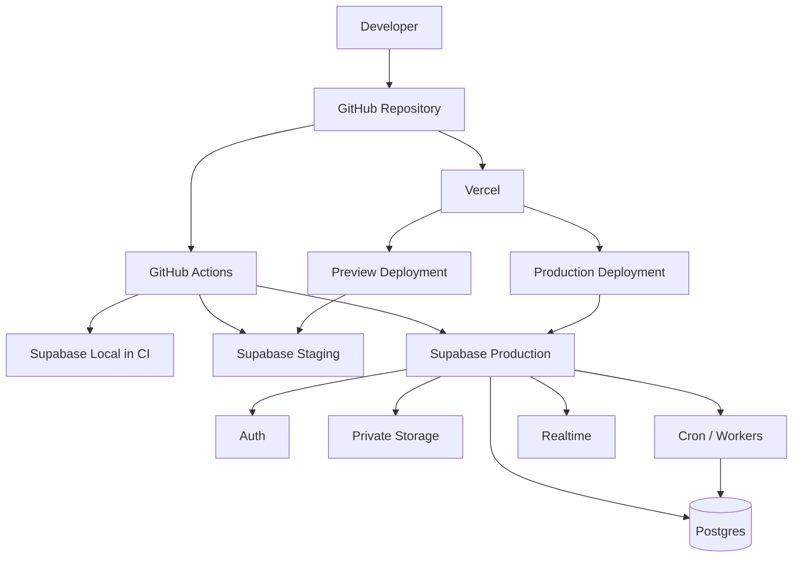

<!--
File: 16-deployment-guide.md
Project: Sistem Rekonsiliasi Stok
Status: Approved deployment baseline for Phase 1
Version: 1.0.0
Last updated: 2026-07-13
Language: id-ID
Timezone: Asia/Jakarta
Application role model: ADMIN only
Primary source: stok-management-system.pdf
Recommended platform:
  - Frontend and Next.js server runtime: Vercel
  - Database, Auth, Storage, Realtime, Cron: Supabase Cloud
Depends on:
  - 01-project-brief.md
  - 02-product-requirements.md
  - 03-business-rules.md
  - 04-stock-ledger-design.md
  - 05-database-schema.md
  - 06-user-roles-and-flows.md
  - 07-marketplace-simulator.md
  - 08-reconciliation-logic.md
  - 09-return-and-claim-flow.md
  - 10-fefo-batch-allocation.md
  - 11-stock-opname-flow.md
  - 12-notification-rules.md
  - 13-security-and-rls.md
  - 14-testing-scenarios.md
  - 15-demo-script.md
-->

# Deployment Guide: Sistem Rekonsiliasi Stok

## 1. Tujuan Dokumen

Dokumen ini mendefinisikan cara membangun, mengonfigurasi, menguji, merilis, memantau, mencadangkan, memulihkan, dan melakukan rollback Sistem Rekonsiliasi Stok fase 1.

Brief proyek mewajibkan:

```text
Next.js + TypeScript + Supabase (Postgres)
submission live
deployment stabil
```

Karena itu, deployment tidak dianggap selesai hanya karena:

- aplikasi memperoleh URL;
- build berhasil;
- halaman login dapat dibuka;
- migration pernah dijalankan manual;
- developer dapat mengakses database;
- simulator dapat diklik;
- satu happy path berhasil.

Deployment dinyatakan siap bila:

1. source dapat dibangun secara reproducible;
2. database dapat dibuat ulang dari migration;
3. environment terisolasi;
4. secret tidak masuk client;
5. Auth production terkonfigurasi;
6. RLS dan grants telah diuji;
7. storage private;
8. cron dan worker aktif;
9. aplikasi production terhubung ke database production yang benar;
10. simulator production aman;
11. deployment melewati test gate;
12. backup dan restore tersedia;
13. rollback aplikasi dan forward-fix database terdokumentasi;
14. log serta health check dapat digunakan saat incident;
15. demo tenant dapat di-reset tanpa menyentuh data production.

> **Prinsip utama:** deployment adalah perubahan terkoordinasi atas aplikasi, database, konfigurasi, Auth, storage, dan job. Deployment bukan tindakan mengunggah frontend lalu berharap seluruh bagian lain memahami maksud developer secara telepati.

---

## 2. Kedudukan Dokumen

Dokumen ini menjadi sumber kebenaran utama untuk:

- topologi deployment;
- environment;
- Vercel project;
- Supabase project;
- environment variables;
- migration deployment;
- CI/CD;
- branch strategy;
- preview deployment;
- production promotion;
- custom domain;
- Auth redirect configuration;
- SMTP;
- storage;
- cron;
- monitoring;
- health check;
- backup;
- restore;
- rollback;
- incident deployment;
- demo reset;
- release gate.

Aturan domain tetap mengacu pada dokumen `01` sampai `15`.

Keputusan role terbaru:

```text
Hanya ada satu user role aplikasi: ADMIN.
```

Deployment identity seperti:

```text
CI
MIGRATION
SYSTEM_WORKER
VERCEL_BUILD
SUPABASE_SERVICE_ROLE
```

bukan user role aplikasi.

---

## 3. Keputusan Deployment Fase 1

### 3.1 Baseline yang Direkomendasikan

```text
GitHub
  -> Vercel
      -> Next.js application
  -> GitHub Actions
      -> Supabase migrations and tests

Supabase Cloud
  -> Postgres
  -> Auth
  -> Storage
  -> Realtime
  -> Cron
```

### 3.2 Alasan

- Next.js memiliki dukungan native di Vercel.
- Preview deployment tersedia per branch/pull request.
- Supabase menyediakan Postgres, Auth, Storage, Realtime, dan Cron.
- Infrastruktur server tidak perlu dikelola manual.
- Fokus fase 1 tetap pada correctness stok.
- Deployment live dapat direproduksi.
- Adapter marketplace masa depan tetap dapat ditambahkan tanpa mengubah topologi inti.

### 3.3 Alternatif

Next.js dapat di-self-host pada:

- Node.js server;
- Docker;
- platform container.

Alternatif tersebut berada di luar baseline fase 1 karena membutuhkan pengelolaan:

- runtime;
- reverse proxy;
- TLS;
- autoscaling;
- process manager;
- health routing;
- log aggregation;
- patching.

Self-hosting tidak dilarang, tetapi harus mengganti bagian Vercel pada dokumen ini dengan runbook setara.

### 3.4 Provider Lock-In

Domain logic harus tetap berada pada:

- TypeScript domain layer;
- PostgreSQL migration/function;
- canonical event contract.

Hindari memasukkan business rule stok pada konfigurasi provider deployment.

---

## 4. Arsitektur Deployment



### 4.1 Trust Boundary

```text
browser
-> Vercel application
-> user-scoped Supabase access
-> RLS/functions
```

Service-role:

```text
server-only
limited use
not default request client
```

---

## 5. Environment Matrix

Environment minimum:

```text
LOCAL
TEST
PREVIEW/STAGING
DEMO
PRODUCTION
```

### 5.1 Matrix

| Environment | Vercel | Supabase | Data | Simulator | Public Access |
|---|---|---|---|---|---|
| Local | Local dev | Local CLI | Synthetic | Enabled | No |
| Test/CI | CI process | Local ephemeral | Synthetic | Enabled | No |
| Preview | Preview URL | Staging/branch | Synthetic | Enabled | Protected |
| Demo | Demo URL or protected production deployment | Demo/staging project or isolated demo org | Synthetic | Enabled | Limited |
| Production | Production domain | Production project | Real | Disabled by default | Authenticated users |

### 5.2 Aturan Mutlak

- Preview tidak memakai production database.
- Demo tidak memakai data pelanggan production.
- Local tidak memakai production service-role.
- Seed demo tidak dapat dijalankan ke production.
- Simulator tidak aktif untuk production organization.
- Production migration tidak dijalankan dari laptop developer sebagai prosedur normal.
- Secret berbeda per environment.
- Auth redirect terdaftar per environment.
- Storage path tidak dibagi lintas project.

### 5.3 Rekomendasi Project

Minimum:

```text
Supabase project 1: staging/demo
Supabase project 2: production
Vercel environment: Preview -> staging
Vercel environment: Production -> production
```

Lebih kuat:

```text
Supabase branches per preview
```

bila plan dan workflow mendukung.

---

## 6. Ownership dan Akses

### 6.1 Pemilik

Tetapkan owner untuk:

- GitHub organization/repository;
- Vercel team/project;
- Supabase staging;
- Supabase production;
- domain/DNS;
- SMTP;
- backup;
- incident;
- billing.

### 6.2 Akses Tim

Gunakan akun individual.

Dilarang:

```text
shared GitHub account
shared Supabase password
shared Vercel login
shared Admin application account
```

### 6.3 Minimum Access

| Actor | GitHub | Vercel | Supabase | Production DB |
|---|---|---|---|---|
| Developer | Read/write code | Preview | Staging | No direct normal access |
| Reviewer | Review | Preview read | Staging read if needed | No |
| Release owner | Approve | Promote/rollback | Migration deploy | Limited |
| Incident owner | Read logs | Rollback | Restore/health | Controlled |
| CI | Checkout/checks | Status/deploy integration | Migration secrets | Automated only |

### 6.4 Two-Person Rule

Direkomendasikan untuk:

- destructive migration;
- production restore;
- secret rotation;
- simulator enablement production;
- deactivation of last Admin;
- production data export.

---

# PART A — REPOSITORY DAN BUILD

## 7. Struktur Repository

Baseline:

```text
.
├── app/
├── components/
├── src/
│   ├── server/
│   ├── domain/
│   ├── validation/
│   └── lib/
├── public/
├── supabase/
│   ├── migrations/
│   ├── seed.sql
│   ├── config.toml
│   ├── functions/
│   └── tests/
├── tests/
├── scripts/
│   ├── verify-env.ts
│   ├── seed-demo.ts
│   ├── smoke-production.ts
│   └── check-release.ts
├── .github/
│   └── workflows/
├── .env.example
├── package.json
├── pnpm-lock.yaml
├── next.config.ts
├── vercel.json
└── README.md
```

### 7.1 Source of Truth

Semua perubahan berikut harus versioned:

- application source;
- migration;
- database function;
- RLS;
- grants;
- seed;
- cron setup;
- storage policy;
- config templates;
- test;
- deployment workflow.

Perubahan dashboard manual harus diterjemahkan ke migration/config terdokumentasi bila dapat dikelola sebagai code.

---

## 8. Package Manager

Baseline:

```text
pnpm
```

Lockfile wajib:

```text
pnpm-lock.yaml
```

CI:

```bash
pnpm install --frozen-lockfile
```

Dilarang:

- menghapus lockfile sebelum deploy;
- mengabaikan perubahan dependency;
- memakai versi package berbeda di CI dan lokal tanpa alasan.

### 8.1 Node.js Version

Pin versi Node.js melalui salah satu:

```text
package.json engines
.nvmrc
.tool-versions
```

Contoh:

```json
{
  "engines": {
    "node": ">=22 <23"
  }
}
```

Versi final mengikuti versi Next.js dan provider yang digunakan saat implementasi.

---

## 9. Package Scripts

Baseline yang direkomendasikan:

```json
{
  "scripts": {
    "dev": "next dev",
    "build": "next build",
    "start": "next start",
    "lint": "eslint .",
    "typecheck": "tsc --noEmit",
    "test": "vitest",
    "test:run": "vitest run",
    "test:coverage": "vitest run --coverage",
    "test:db": "supabase test db",
    "test:e2e": "playwright test",
    "test:demo": "playwright test --grep @demo",
    "verify:env": "tsx scripts/verify-env.ts",
    "verify:release": "tsx scripts/check-release.ts"
  }
}
```

Nama script dapat disesuaikan.

Vercel Deployment Checks mengenali script:

```text
lint
typecheck / type-check / check-types
```

### 9.1 Build Command

```bash
pnpm build
```

### 9.2 Install Command

```bash
pnpm install --frozen-lockfile
```

### 9.3 Output

Gunakan default Next.js output untuk Vercel.

Jika self-hosting container:

```text
output: standalone
```

dapat dipertimbangkan sesuai dokumentasi Next.js.

---

## 10. `.env.example`

File ini hanya berisi nama variable dan placeholder.

```dotenv
# Application
APP_ENV=local
APP_BASE_URL=http://localhost:3000
NEXT_PUBLIC_APP_MODE=LOCAL
NEXT_PUBLIC_APP_VERSION=dev
NEXT_PUBLIC_TIMEZONE=Asia/Jakarta

# Supabase browser-safe
NEXT_PUBLIC_SUPABASE_URL=http://127.0.0.1:54321
NEXT_PUBLIC_SUPABASE_PUBLISHABLE_KEY=replace-me

# Server-only
SUPABASE_SERVICE_ROLE_KEY=replace-server-only
DATABASE_URL=replace-server-only
DIRECT_URL=replace-server-only

# Simulator
MARKETPLACE_SIMULATOR_ENABLED=true
MARKETPLACE_SIMULATOR_ALLOW_COMMIT=true
MARKETPLACE_SIMULATOR_MAX_EVENTS_PER_RUN=50
MARKETPLACE_SIMULATOR_DEMO_ORG_ID=replace-demo-org-uuid

# Deployment metadata
DEPLOYMENT_ENV=local
DEPLOYMENT_COMMIT_SHA=local
DEPLOYMENT_URL=http://localhost:3000

# Optional
SENTRY_DSN=
LOG_LEVEL=info
```

Dilarang mengisi real secret pada `.env.example`.

---

## 11. Environment Variable Classification

### 11.1 Browser-Safe

Prefix:

```text
NEXT_PUBLIC_
```

Boleh berisi:

- Supabase URL;
- publishable/anon key;
- app mode;
- app version;
- timezone;
- public feature label.

Tidak boleh berisi:

- service-role;
- database password;
- SMTP password;
- access token;
- Vercel token;
- Supabase personal access token.

### 11.2 Server-Only

```text
SUPABASE_SERVICE_ROLE_KEY
DATABASE_URL
DIRECT_URL
SUPABASE_ACCESS_TOKEN
SUPABASE_DB_PASSWORD
SMTP_PASSWORD
VERCEL_TOKEN
```

### 11.3 Build-Time vs Runtime

Dokumentasikan apakah variable dibaca:

```text
build time
runtime
both
```

Variable `NEXT_PUBLIC_*` dapat tertanam pada bundle saat build.

Jangan mengharapkan perubahan variable public memperbarui deployment lama.

### 11.4 Perubahan Variable Vercel

Perubahan environment variable hanya berlaku pada deployment baru.

Setelah perubahan:

```text
redeploy
```

Rollback ke deployment lama juga memakai environment snapshot build lama untuk nilai yang dibundel.

---

## 12. Environment Validation

Buat server-only validator.

Contoh konsep:

```ts
import 'server-only'
import { z } from 'zod'

const serverEnvSchema = z.object({
  APP_ENV: z.enum(['local', 'test', 'preview', 'demo', 'production']),
  APP_BASE_URL: z.string().url(),
  NEXT_PUBLIC_SUPABASE_URL: z.string().url(),
  NEXT_PUBLIC_SUPABASE_PUBLISHABLE_KEY: z.string().min(1),
  SUPABASE_SERVICE_ROLE_KEY: z.string().min(1),
  MARKETPLACE_SIMULATOR_ENABLED: z.enum(['true', 'false']),
  MARKETPLACE_SIMULATOR_DEMO_ORG_ID: z.string().uuid().optional(),
})

export const env = serverEnvSchema.parse(process.env)
```

### 12.1 Production Guards

Fail startup/build bila:

```text
APP_ENV=production
and simulator enabled without isolated demo policy

APP_ENV=production
and APP_BASE_URL uses localhost

APP_ENV=production
and service key missing

APP_ENV=production
and public Supabase URL points staging

APP_ENV=preview
and Supabase project is production
```

---

# PART B — SUPABASE SETUP

## 13. Project Supabase

Buat:

```text
stok-management-staging
stok-management-production
```

Catat:

- project ref;
- region;
- organization owner;
- database password owner;
- plan;
- backup policy;
- custom domain status;
- Auth config;
- storage buckets;
- extensions.

### 13.1 Region

Pilih region dekat pengguna utama dan deployment compute.

Untuk pengguna Indonesia, pilih region yang memberikan latency terbaik berdasarkan pilihan yang tersedia saat provisioning.

Uji:

- database latency;
- Auth;
- storage upload;
- Vercel function to Supabase latency.

### 13.2 Project Pause

Production tidak boleh bergantung pada project yang dapat pause karena inactivity bila availability submission/operasional membutuhkan akses stabil.

Pilih plan sesuai kebutuhan.

---

## 14. Supabase Local

Setup:

```bash
npx supabase init
npx supabase start
npx supabase status
```

Reset:

```bash
npx supabase db reset
```

Test:

```bash
npx supabase test db
```

Stop:

```bash
npx supabase stop
```

### 14.1 Local Source of Truth

Local dashboard boleh digunakan untuk eksplorasi.

Perubahan final harus masuk:

```text
migration
seed
config
```

---

## 15. Link Project

Staging:

```bash
supabase link --project-ref "$SUPABASE_STAGING_PROJECT_ID"
```

Production linking normalnya dilakukan CI dengan secret environment.

Jangan menyimpan project DB password pada repository.

### 15.1 CI Secrets

Supabase CLI non-interactive membutuhkan:

```text
SUPABASE_ACCESS_TOKEN
SUPABASE_DB_PASSWORD
SUPABASE_PROJECT_ID
```

Simpan sebagai encrypted CI secrets/environment secrets.

Pisahkan:

```text
STAGING_*
PRODUCTION_*
```

---

## 16. Migration

### 16.1 Membuat Migration

```bash
supabase migration new create_stock_ledger
```

Atau generate diff setelah local changes:

```bash
supabase db diff -f create_stock_ledger
```

Review SQL manual.

### 16.2 Larangan

- migration tanpa review;
- schema edit production via dashboard lalu tidak dicatat;
- `DROP` tanpa data-impact plan;
- grant/policy change tanpa pgTAP;
- function security-definer tanpa fixed search path;
- migration yang menulis ledger tanpa source;
- seed tercampur migration production.

### 16.3 Deploy Migration

```bash
supabase db push
```

Production:

```text
dijalankan CI/CD
bukan laptop developer sebagai prosedur normal
```

### 16.4 Migration History

Setelah deploy:

- verifikasi migration list;
- verifikasi hash/commit;
- catat release;
- jalankan pgTAP;
- jalankan schema smoke.

---

## 17. Expand-Contract Migration

Gunakan pola:

```text
EXPAND
-> DEPLOY APP COMPATIBLE
-> BACKFILL
-> SWITCH READ/WRITE
-> VERIFY
-> CONTRACT LATER
```

### 17.1 Expand

Contoh:

- tambah nullable column;
- tambah table;
- tambah function version baru;
- tambah index concurrently bila sesuai;
- jangan hapus column yang masih dipakai app lama.

### 17.2 App Compatibility

App release harus kompatibel dengan:

- schema sebelum promotion;
- schema sesudah expand.

### 17.3 Backfill

Backfill:

- idempoten;
- terukur;
- batch kecil;
- progress dicatat;
- tidak memblokir ledger write terlalu lama.

### 17.4 Contract

Hapus legacy column/function pada release berikutnya setelah:

- tidak dipakai;
- telemetry membuktikan;
- backup tersedia;
- test lulus.

### 17.5 Mengapa

Rollback app Vercel dapat cepat.

Rollback database destructive tidak cepat dan sering tidak aman.

Karena itu migration harus membuat app lama tetap dapat berjalan bila production app di-rollback.

---

## 18. Database Function Versioning

Untuk perubahan kontrak besar:

```text
api.post_manual_outbound_v1
api.post_manual_outbound_v2
```

Atau wrapper stabil yang memanggil private version.

Jangan mengubah parameter/function behavior secara breaking bersamaan dengan app deploy tanpa compatibility window.

---

## 19. Data Migration

### 19.1 Initial Balance

Cutover awal memakai:

```text
INITIAL_BALANCE
```

Bukan direct update projection.

### 19.2 Import Existing Spreadsheet

Alur:

```text
upload private
-> staging
-> validate
-> dry run
-> Admin review
-> post canonical command
-> ledger
-> reconcile
```

### 19.3 Cutover Window

Pilih:

- waktu aktivitas gudang rendah;
- freeze spreadsheet;
- final count;
- import;
- reconciliation;
- sign-off;
- system becomes source of record.

### 19.4 Cutover Checklist

- [ ] Produk final.
- [ ] Batch final.
- [ ] Expiry final.
- [ ] Mapping marketplace final.
- [ ] Bundle recipe final.
- [ ] Physical count final.
- [ ] Initial balance posted.
- [ ] Ledger/projection match.
- [ ] Admin trained.
- [ ] Spreadsheet read-only/archive.
- [ ] Rollback/correction plan ready.

---

## 20. Seed

### 20.1 `seed.sql`

Berisi:

- lookup code;
- movement reason;
- channel;
- test/demo catalog bila aman;
- no production customer data.

### 20.2 Production

Production seed:

- configuration minimum;
- no demo order;
- no simulator scenario execution;
- no fake Admin unless explicit bootstrap.

### 20.3 Demo Seed

Demo seed:

- synthetic organization;
- synthetic Admin invitation/profile;
- products/batches;
- listing mapping;
- golden quantities;
- `is_demo_data=true`.

### 20.4 Guard

Demo reset script harus memeriksa:

```text
APP_ENV != production
or
target organization equals configured demo organization
and
explicit confirmation token
```

---

## 21. Type Generation

Setelah schema stabil:

```bash
supabase gen types typescript --local > src/types/database.types.ts
```

Untuk linked project bila diperlukan:

```bash
supabase gen types typescript --linked > src/types/database.types.ts
```

CI dapat memeriksa diff type.

Production build tidak perlu memperoleh broad DB credential untuk generate type.

---

## 22. RLS dan Grants Deployment

Setiap migration security:

1. create/alter table;
2. enable RLS;
3. create helper;
4. create policy;
5. revoke default grants;
6. grant allowlist;
7. create safe views/functions;
8. run pgTAP negative/positive.

Release diblokir bila:

- exposed table tidak memiliki RLS;
- anon dapat membaca data;
- ledger direct DML berhasil;
- function masih executable `PUBLIC`;
- cross-org test gagal.

---

## 23. Data API Exposure

Recommended exposed schema:

```text
api
```

Internal:

```text
private
inventory
commerce
returns
operations
reconciliation
notification
integration
audit
```

tidak diekspos langsung.

Setelah config berubah:

- verify Data API;
- verify view/RPC;
- verify RLS;
- verify Realtime publication.

---

## 24. Database Connection Strategy

### 24.1 Default Application Access

Gunakan:

```text
Supabase client
Data API
RPC
```

untuk sebagian besar request.

### 24.2 Direct SQL

Jika app memakai driver SQL/ORM langsung:

- Vercel/serverless memakai Supavisor transaction mode;
- connection count rendah;
- migration memakai connection yang sesuai untuk DDL;
- jangan memakai connection pool besar per function instance.

### 24.3 URLs

Pisahkan:

```text
DATABASE_URL
DIRECT_URL
```

`DATABASE_URL`:

- pooled serverless runtime bila direct client diperlukan.

`DIRECT_URL`:

- migration/administration only;
- server/CI secret;
- tidak dipakai browser.

### 24.4 Long Transaction

Stock command harus singkat.

Jangan menempatkan:

- network call;
- file upload;
- email;
- marketplace request;
- user interaction;

di dalam database transaction.

---

# PART C — AUTH DAN STORAGE

## 25. Supabase Auth Production

### 25.1 Signup

Production:

```text
public signup disabled
invite-only
```

### 25.2 Site URL

Set:

```text
https://stock.example.com
```

Bukan:

```text
http://localhost:3000
```

Site URL menjadi default redirect saat code tidak memberi `redirectTo`.

### 25.3 Redirect URLs

Daftarkan:

```text
http://localhost:3000/**
https://staging-stock.example.com/**
https://stock.example.com/**
preview pattern yang disetujui
```

Production redirect sebaiknya exact dan minimal.

Wildcard preview digunakan hanya untuk domain preview yang dikelola.

### 25.4 Password Reset dan Invite

Uji:

- invite link;
- expired link;
- password reset;
- redirect;
- logout;
- inactive profile;
- MFA.

### 25.5 SMTP

Untuk production:

```text
custom SMTP required
```

Supabase built-in mail cocok untuk demo/pengujian ringan, bukan jalur production yang diandalkan.

Konfigurasi:

- provider;
- verified sender/domain;
- from address;
- template;
- rate limits;
- bounce handling;
- credential rotation.

### 25.6 MFA

Production sensitive command membutuhkan:

```text
aal2
```

Uji login/invite/MFA sebelum cutover.

---

## 26. Storage

Buckets:

```text
evidence
imports
exports
```

Semua private.

### 26.1 Policy

- path organization-scoped;
- upload intent;
- file type/size validation;
- signed URL short-lived;
- posted evidence immutable dari UI;
- no public listing.

### 26.2 Deployment Checklist

- [ ] Bucket dibuat.
- [ ] Public = false.
- [ ] RLS policy applied.
- [ ] Cross-org test lulus.
- [ ] Signed URL lulus.
- [ ] File type spoof ditolak.
- [ ] Orphan cleanup job aktif.
- [ ] Retention policy documented.

### 26.3 Storage Migration

Bucket/policy setup dibuat melalui migration/script yang repeatable sejauh platform mendukung.

Manual dashboard setup harus dicatat pada deployment checklist.

---

# PART D — CRON, WORKER, DAN REALTIME

## 27. Cron Jobs

Dari notification/reconciliation design:

```text
daily reconciliation
claim deadline evaluation
expiry evaluation
pending return inspection
notification outbox processor
marketplace event stalled detection
stocktake reminders
job health check
```

### 27.1 Deployment

Cron definition:

- versioned migration;
- environment-aware;
- idempotent;
- no duplicate schedule;
- process name audit.

### 27.2 Timezone

Store timestamps UTC.

Business evaluation:

```text
Asia/Jakarta
```

Cron expression tetap diverifikasi terhadap timezone job/database.

### 27.3 Secure Invocation

Jika Cron memanggil Edge Function:

- secret disimpan di Vault/secret manager;
- no secret in SQL plaintext where avoidable;
- function verifies expected secret/identity;
- retry idempotent.

### 27.4 Job Health

Setiap job menyimpan:

```text
last_started_at
last_succeeded_at
last_failed_at
duration
evaluated count
error code
```

Health notification dibuat bila missed SLA.

---

## 28. Outbox Worker

Outbox worker:

- menggunakan queue lock;
- batch size terkontrol;
- retry backoff;
- dead-letter/final failure;
- metrics;
- no stock mutation;
- idempotent.

Deploy worker update secara backward-compatible terhadap outbox payload version.

---

## 29. Realtime

Realtime:

- enhancement untuk UI refresh;
- bukan source of truth;
- RLS/organization scope;
- polling fallback.

Setelah deploy:

- verify subscription;
- disconnect/reconnect test;
- verify no cross-org payload;
- verify notification unread count after refetch.

---

## 30. Edge Functions

Edge Functions tidak wajib untuk seluruh domain.

Gunakan bila:

- webhook masa depan;
- scheduled external call;
- email integration;
- isolated server-side integration.

Deploy:

```bash
supabase functions deploy <function-name>
```

Secrets:

```bash
supabase secrets set --env-file supabase/.env.production
```

Jangan commit `.env.production`.

### 30.1 Function Release

- version payload;
- deploy staging;
- integration test;
- deploy production;
- smoke;
- monitor logs;
- rollback/redeploy previous source if needed.

---

# PART E — VERCEL SETUP

## 31. Membuat Project Vercel

1. buat Vercel team/project;
2. import GitHub repository;
3. pilih Next.js framework;
4. set root directory;
5. set production branch:
   ```text
   main
   ```
6. set install/build command;
7. set Node.js version;
8. set environment variables;
9. enable preview deployment;
10. configure Deployment Protection;
11. configure domain;
12. configure checks.

### 31.1 Git Integration

Default:

- pull request -> Preview Deployment;
- merge/push production branch -> Production build.

Recommended:

```text
build and promotion separated by required checks
```

bila fitur/plan tersedia.

---

## 32. Vercel Environment Variables

Scope:

```text
Development
Preview
Production
```

### 32.1 Mapping

| Variable | Development | Preview | Production |
|---|---|---|---|
| `APP_ENV` | local | preview/demo | production |
| `APP_BASE_URL` | localhost | preview URL strategy | production domain |
| Supabase URL/key | local | staging | production |
| Service role | local/staging | staging | production |
| Simulator enabled | yes | yes | no default |
| Demo org ID | local/demo | demo | optional isolated demo only |

### 32.2 Branch-Specific Preview

Jika preview branch memerlukan config berbeda:

- use branch-specific Preview environment variable;
- do not point arbitrary PR to production Supabase.

### 32.3 Sensitive Variables

Mark sensitive where supported.

Access to Vercel project settings should be limited because project members may access environment variable metadata/values according to platform permissions.

### 32.4 Redeploy

Setelah mengubah environment variable:

```text
create a new deployment
```

Deployment lama tidak otomatis memakai nilai baru.

---

## 33. Deployment Protection

Preview deployment sebaiknya dilindungi.

Pilihan Vercel:

- Vercel Authentication;
- password protection sesuai plan;
- trusted IP sesuai plan;
- other approved provider.

### 33.1 Automation

Playwright/CI membutuhkan:

- protected automation bypass sesuai platform;
- secret hanya di CI;
- tidak dipasang pada browser public;
- scope minimal.

### 33.2 Production

Aplikasi sendiri tetap memakai Supabase Auth.

Deployment Protection bukan pengganti application authentication.

---

## 34. Production Branch

Baseline:

```text
main
```

Branch protection:

- pull request required;
- required CI checks;
- no force push;
- review required;
- signed commits optional;
- release owner approval for migration-sensitive changes.

---

## 35. Preview Deployment

Setiap pull request:

1. CI static/unit/db tests;
2. Vercel build preview;
3. preview points staging database;
4. migration preview/staging applied safely;
5. Playwright smoke;
6. reviewer tests UI;
7. deployment protected.

### 35.1 Shared Staging Caveat

Jika semua preview berbagi staging database:

- test data namespaced;
- destructive migration serialized;
- concurrent PR schema changes dapat konflik;
- reset tidak boleh menghapus reviewer data tanpa koordinasi.

Preferred:

```text
Supabase branch per PR
```

bila tersedia.

---

## 36. Production Build dan Promotion

Recommended:

```text
merge main
-> create production build
-> run required deployment checks
-> promote/alias to production domain
```

Deployment Checks dapat menahan release sampai:

- lint;
- typecheck;
- GitHub Actions;
- integration;
- E2E;
- other checks;

lulus.

### 36.1 Force Promote

Force promote hanya untuk incident/approved exception.

Wajib:

- reason;
- release owner;
- audit;
- post-deploy verification;
- defect ticket.

Tidak digunakan karena “test lama”.

---

## 37. Deployment Metadata

Expose safe metadata pada diagnostic page:

```text
app version
commit SHA
build time
deployment environment
database migration version
schema compatibility version
```

Jangan expose:

- secret;
- project access token;
- database password;
- service key.

---

## 38. Health Endpoints

Recommended:

```text
GET /api/health/live
GET /api/health/ready
```

### 38.1 Liveness

Checks:

```text
process responds
```

Tidak perlu query berat.

Response:

```json
{
  "status": "ok",
  "version": "commit-sha"
}
```

### 38.2 Readiness

Checks:

- environment valid;
- Supabase reachable;
- safe read RPC;
- expected migration compatibility;
- no critical deployment config missing.

Jangan melakukan:

- stock mutation;
- expensive reconciliation;
- service-role data dump.

### 38.3 Protected Diagnostics

Detailed diagnostics:

```text
Admin only
or deployment-protected
```

---

# PART F — CI/CD

## 39. CI Workflow

Pull request checks:

```text
install
typecheck
lint
unit/component
Supabase local start/reset
pgTAP
integration
build
Playwright smoke
secret scan
```

### 39.1 Example `.github/workflows/ci.yml`

```yaml
name: CI

on:
  pull_request:
  workflow_dispatch:

permissions:
  contents: read

jobs:
  test:
    runs-on: ubuntu-latest
    timeout-minutes: 30

    steps:
      - uses: actions/checkout@v4

      - uses: pnpm/action-setup@v4
        with:
          version: 10

      - uses: actions/setup-node@v4
        with:
          node-version: 22
          cache: pnpm

      - run: pnpm install --frozen-lockfile
      - run: pnpm typecheck
      - run: pnpm lint
      - run: pnpm test:run

      - uses: supabase/setup-cli@v1
        with:
          version: latest

      - run: supabase start
      - run: supabase db reset
      - run: supabase test db

      - run: pnpm build

      - run: pnpm exec playwright install --with-deps chromium
      - run: pnpm test:e2e --grep @smoke
```

Pin action versions/SHAs according to repository security policy.

---

## 40. Staging Migration Workflow

Trigger:

```text
push develop/staging branch
manual workflow
```

Environment protection:

```text
staging
```

Example:

```yaml
name: Deploy Database Staging

on:
  push:
    branches: [develop]
    paths:
      - "supabase/migrations/**"
      - "supabase/functions/**"
      - ".github/workflows/deploy-db-staging.yml"
  workflow_dispatch:

permissions:
  contents: read

jobs:
  deploy:
    runs-on: ubuntu-latest
    environment: staging
    timeout-minutes: 20

    env:
      SUPABASE_ACCESS_TOKEN: ${{ secrets.SUPABASE_ACCESS_TOKEN }}
      SUPABASE_DB_PASSWORD: ${{ secrets.SUPABASE_DB_PASSWORD }}
      SUPABASE_PROJECT_ID: ${{ secrets.SUPABASE_PROJECT_ID }}

    steps:
      - uses: actions/checkout@v4

      - uses: supabase/setup-cli@v1
        with:
          version: latest

      - run: supabase link --project-ref "$SUPABASE_PROJECT_ID"
      - run: supabase db push
      - run: supabase test db --linked
```

Periksa dukungan flag `--linked` pada versi CLI actual dan sesuaikan.

Jika remote pgTAP tidak dijalankan langsung, gunakan smoke RPC/SQL terkontrol setelah push.

---

## 41. Production Migration Workflow

Trigger:

```text
manual approval
release tag
or protected main workflow
```

Environment:

```text
production
```

Example:

```yaml
name: Deploy Database Production

on:
  workflow_dispatch:
    inputs:
      release:
        description: "Release version"
        required: true
        type: string

permissions:
  contents: read

jobs:
  deploy:
    runs-on: ubuntu-latest
    environment: production
    timeout-minutes: 30

    env:
      SUPABASE_ACCESS_TOKEN: ${{ secrets.SUPABASE_ACCESS_TOKEN }}
      SUPABASE_DB_PASSWORD: ${{ secrets.SUPABASE_DB_PASSWORD }}
      SUPABASE_PROJECT_ID: ${{ secrets.SUPABASE_PROJECT_ID }}

    steps:
      - uses: actions/checkout@v4

      - uses: supabase/setup-cli@v1
        with:
          version: latest

      - name: Verify release
        run: |
          pnpm install --frozen-lockfile
          pnpm verify:release

      - name: Link production
        run: supabase link --project-ref "$SUPABASE_PROJECT_ID"

      - name: Apply migrations
        run: supabase db push

      - name: Record migration result
        run: |
          echo "release=${{ inputs.release }}"
          echo "commit=${GITHUB_SHA}"
```

Production environment pada GitHub harus memiliki:

- required reviewer;
- restricted branches;
- separate secrets;
- deployment history.

---

## 42. Application Deployment Workflow

### 42.1 Recommended Git Integration

Vercel automatically builds from GitHub.

CI status/deployment checks gate promotion.

### 42.2 Optional CLI

Preview:

```bash
vercel deploy
```

Production:

```bash
vercel deploy --prod
```

CI secrets:

```text
VERCEL_TOKEN
VERCEL_ORG_ID
VERCEL_PROJECT_ID
```

Git integration lebih sederhana untuk fase 1.

### 42.3 Prebuilt

Bila memakai controlled CI build:

```bash
vercel pull --yes --environment=production
vercel build --prod
vercel deploy --prebuilt --prod
```

Gunakan hanya jika tim memahami env/build snapshot.

---

## 43. Release Order

### 43.1 Backward-Compatible Release

Recommended:

```text
1. CI lulus.
2. Backup/restore point verified.
3. Apply expand migration.
4. Verify DB/RLS.
5. Build production app.
6. Run deployment checks.
7. Promote app.
8. Smoke test.
9. Reconciliation.
10. Observe.
```

### 43.2 App-First Release

Hanya bila app kompatibel dengan schema lama.

### 43.3 DB-First Release

Hanya untuk expand migration yang kompatibel dengan app lama.

### 43.4 Destructive Change

Gunakan:

- maintenance window;
- backup;
- data migration;
- staged app;
- explicit approval;
- no automatic promotion;
- tested forward correction.

---

## 44. Deployment Check Set

Required:

```text
typecheck
lint
unit
pgTAP
integration P0
build
Playwright smoke
security secret scan
migration compatibility
```

Release:

```text
full P0/P1
concurrency
RLS negative
demo smoke
```

### 44.1 Required GitHub Checks

Recommended names:

```text
ci / static
ci / unit
ci / database
ci / integration
ci / build
ci / e2e-smoke
security / secret-scan
```

Keep names stable because branch protection and deployment checks identify checks by name.

---

## 45. Release Artifact

Record:

```text
release version
commit SHA
Vercel deployment ID/URL
Supabase migration version
database project ref (masked)
test report
migration result
smoke result
reconciliation run ID
release owner
timestamp
```

No secret.

---

# PART G — INITIAL DEPLOYMENT RUNBOOK

## 46. Phase 0: Prerequisites

- [ ] GitHub repo ready.
- [ ] Main protected.
- [ ] Vercel project created.
- [ ] Supabase staging created.
- [ ] Supabase production created.
- [ ] Domain controlled.
- [ ] SMTP provider ready.
- [ ] Production owner assigned.
- [ ] Backup plan selected.
- [ ] CI secrets stored.
- [ ] Demo tenant policy decided.

---

## 47. Phase 1: Validate Locally

```bash
pnpm install --frozen-lockfile
supabase start
supabase db reset
supabase test db
pnpm typecheck
pnpm lint
pnpm test:run
pnpm build
pnpm test:e2e --grep @smoke
```

Expected:

- all pass;
- no secret;
- migration fresh database succeeds;
- seed deterministic;
- ledger reconciliation pass.

---

## 48. Phase 2: Deploy Staging Database

1. link staging;
2. push migration;
3. create/config storage;
4. configure Auth staging;
5. configure redirect URLs;
6. configure SMTP staging or approved test provider;
7. create demo Admin;
8. run staging seed;
9. deploy Edge Functions if any;
10. verify cron;
11. run pgTAP/smoke.

### 48.1 Verify Staging

- [ ] Login.
- [ ] RLS.
- [ ] Receipt.
- [ ] Reservation.
- [ ] FEFO.
- [ ] Return.
- [ ] Stocktake.
- [ ] Notification.
- [ ] Reconciliation.
- [ ] Private storage.
- [ ] Simulator.

---

## 49. Phase 3: Deploy Preview App

1. connect Vercel;
2. set Preview env to staging;
3. enable deployment protection;
4. create preview;
5. run Playwright;
6. review runtime logs;
7. UAT.

Expected:

```text
preview never talks to production Supabase
```

---

## 50. Phase 4: Configure Production Supabase

### Database

- [ ] Plan/compute adequate.
- [ ] Backups enabled.
- [ ] PITR decision documented.
- [ ] Network/connection config.
- [ ] Migrations applied.
- [ ] RLS tested.
- [ ] Cron jobs installed.
- [ ] Realtime configured.
- [ ] extensions correct.

### Auth

- [ ] Public signup disabled.
- [ ] Site URL production.
- [ ] Redirect URLs exact.
- [ ] Custom SMTP.
- [ ] Email templates.
- [ ] MFA.
- [ ] Rate limits.
- [ ] Admin invite flow.
- [ ] Last Admin guard.

### Storage

- [ ] Private buckets.
- [ ] Policies.
- [ ] Signed URL.
- [ ] Cross-org test.
- [ ] File limits.

### Security

- [ ] only `api` exposed;
- [ ] anon denied;
- [ ] service-role server-only;
- [ ] secrets rotated after setup if needed;
- [ ] audit works.

---

## 51. Phase 5: Production Data Cutover

Jika aplikasi pertama kali dipakai operasional:

1. freeze spreadsheet at agreed timestamp;
2. export products/batches;
3. validate import;
4. perform physical count;
5. post initial balance;
6. import open order/reservation only if business rule supports;
7. import/record pending returns;
8. reconcile;
9. sign off;
10. archive spreadsheet read-only.

### 51.1 No Dual Write

Jangan menjalankan spreadsheet dan sistem baru sebagai dua source of truth tanpa aturan.

Jika parallel run diperlukan:

- define authoritative system;
- define reconciliation frequency;
- define cutover end;
- no silent overwrite.

---

## 52. Phase 6: Production App

1. set Production env;
2. verify URLs/project refs;
3. build production;
4. run checks;
5. promote deployment;
6. verify custom domain;
7. verify Auth redirects;
8. login Admin;
9. run safe smoke;
10. run reconciliation;
11. monitor.

### 52.1 Safe Smoke

Boleh:

- login;
- read stock;
- read ledger;
- create and cancel draft;
- notification read state;
- demo tenant transaction if isolated.

Jangan membuat real stock movement sembarang.

---

## 53. Phase 7: Hypercare

First 24–72 hours:

- monitor 5xx;
- monitor Auth failure;
- monitor DB connections;
- monitor lock timeout;
- monitor outbox backlog;
- daily reconciliation;
- review user reports;
- keep release owner available;
- no unrelated migration;
- document incident.

---

# PART H — CUSTOM DOMAIN DAN SSL

## 54. Domain Strategy

Recommended:

```text
stock.example.com
```

Optional:

```text
staging-stock.example.com
```

Avoid using random preview URL as final production Site URL.

---

## 55. Add Domain to Vercel

1. Project Settings;
2. Domains;
3. add domain;
4. configure DNS:
   - apex -> A record as instructed;
   - subdomain -> CNAME as instructed;
5. verify domain;
6. wait DNS propagation;
7. verify SSL.

Vercel attempts automatic certificate issuance after DNS validation.

---

## 56. Domain Verification

Commands:

```bash
dig A example.com +short
dig CNAME stock.example.com +short
```

Verify:

```bash
curl -I https://stock.example.com
```

Check:

- HTTPS;
- certificate;
- redirect;
- HSTS after confidence;
- no preview content on production domain.

---

## 57. After Domain Change

Update:

```text
APP_BASE_URL
Supabase Auth Site URL
Supabase Redirect URLs
SMTP template links
CORS/origin allowlist
CSRF origin allowlist
CSP connect/img sources
documentation
health check
```

Then:

```text
redeploy Vercel
```

because environment changes do not update previous deployment.

---

## 58. Supabase Custom Domain

Optional.

Use if:

- Auth/API branding matters;
- URLs stored externally;
- future webhook portability;
- migration portability.

Not required for phase 1 frontend deployment.

If used:

```text
api.example.com
```

Update:

- Supabase client URL;
- redirects;
- CSP;
- DNS;
- test.

---

# PART I — MONITORING DAN OPERATIONS

## 59. Monitoring Sources

### Vercel

- build logs;
- runtime logs;
- function errors;
- activity logs;
- observability;
- deployment state.

### Supabase

- Postgres logs;
- Auth logs;
- API logs;
- Storage logs;
- Edge Function logs;
- Cron job runs;
- database metrics;
- backups.

### Application

- audit;
- reconciliation;
- notification job health;
- correlation ID;
- deployment metadata.

---

## 60. Log Requirements

Every server request/mutation:

```text
timestamp
environment
deployment version
correlation ID
organization ID
user/process ID
command
result
error code
duration
```

Do not log:

```text
password
token
cookie
service-role
database URL
signed file URL
raw PII
```

---

## 61. Runtime Log Commands

Examples:

```bash
vercel logs --environment production --status-code 5xx --since 30m
```

Inspect deployment:

```bash
vercel inspect <deployment-url>
vercel inspect <deployment-url> --logs
```

Use current CLI syntax from installed Vercel version.

---

## 62. Health Dashboard

Admin diagnostics:

- app version;
- DB reachable;
- migration compatible;
- last daily reconciliation;
- active critical issue;
- cron last success;
- outbox backlog;
- notification rule health;
- storage test status;
- simulator environment policy.

Do not expose internal diagnostics publicly.

---

## 63. Operational Alerts

Alert conditions:

```text
5xx spike
database unreachable
daily reconciliation missed
critical reconciliation issue
notification outbox backlog
cron failure
Auth email failure
storage upload failure
migration compatibility mismatch
negative stock invariant
service key/config error
```

Channel external dapat ditentukan kemudian.

Fase 1 minimal:

- in-app system job notification;
- responsible operator/developer checks dashboard.

---

## 64. Correlation ID

Generate per request/command.

Propagate:

```text
Next.js
-> database function
-> stock transaction
-> audit
-> outbox
-> notification
-> log
```

Error response returns safe correlation ID.

---

## 65. Capacity Baseline

Expected:

```text
~70 products
hundreds of packages/day
significant returns
few Admin users
```

Monitor:

- database connections;
- query latency;
- lock wait;
- function duration;
- event backlog;
- storage;
- egress;
- logs.

### 65.1 Direct Connection

Serverless direct SQL client should use appropriate pooler configuration.

Avoid one large pool per function instance.

### 65.2 Scaling Trigger

Review capacity when:

- p95 write > threshold;
- lock timeout frequent;
- DB CPU/memory high;
- connection saturation;
- outbox delay;
- reconciliation exceeds window;
- storage/egress close to quota.

---

## 66. Maintenance Window

Required for:

- destructive migration;
- large backfill;
- restore;
- cutover;
- major data correction.

Communicate:

```text
start
expected duration
affected features
read-only status
owner
rollback/forward plan
```

---

## 67. Read-Only Maintenance Mode

Optional recommended variable:

```text
APP_MAINTENANCE_MODE=read-only
```

Server enforces:

- reads allowed;
- stock mutation denied;
- Admin sees banner;
- health/incident operations allowed.

Do not rely on hidden buttons.

---

# PART J — BACKUP DAN RESTORE

## 68. Backup Policy

Before production, decide:

- Supabase plan;
- daily backup retention;
- PITR;
- logical backup;
- restore owner;
- RPO;
- RTO;
- test frequency.

### 68.1 Proposed Phase 1

```text
Daily managed backup
PITR if business requires low RPO
Logical dump before destructive migration
Quarterly restore test
```

Final depends on plan and operational criticality.

---

## 69. Logical Backup

Use Supabase CLI:

```bash
supabase db dump
```

Store backup securely.

Do not:

- commit dump;
- put dump in public file share;
- retain plaintext on unmanaged device;
- include credential in filename/log.

### 69.1 Before Risky Migration

- verify managed backup;
- create logical schema/data backup if appropriate;
- record timestamp;
- record migration target;
- test restore on staging where feasible.

---

## 70. Restore

Managed restore can make project temporarily inaccessible.

Plan downtime.

### 70.1 Restore Runbook

1. declare incident;
2. stop mutation/read-only;
3. identify restore point;
4. preserve current logs/evidence;
5. approve restore;
6. restore managed backup/PITR;
7. verify database available;
8. apply/reconcile migration if needed;
9. verify Auth/Storage/Realtime;
10. run RLS tests;
11. rebuild projection if required;
12. run reconciliation;
13. smoke app;
14. reopen traffic;
15. document data loss window.

### 70.2 Restore Environment

Practice restore into isolated environment when possible.

Production restore is not the first time anyone should discover which button exists.

---

## 71. RPO dan RTO

Define:

```text
RPO = maximum acceptable data loss
RTO = maximum acceptable recovery time
```

Record target.

Example proposal:

```text
RPO <= 24 hours with daily backup
lower with PITR
RTO <= 4 hours for phase 1
```

Do not state SLA externally until plan and tests support it.

---

## 72. Backup Verification

A backup is not considered useful until restore test proves:

- schema;
- ledger;
- RLS;
- grants;
- functions;
- Auth linkage;
- storage references;
- projection;
- reconciliation.

---

# PART K — ROLLBACK DAN FORWARD FIX

## 73. Application Rollback

Vercel can point production domain to a previous deployment.

CLI:

```bash
vercel rollback <previous-deployment-url-or-id>
vercel rollback status
```

Verify:

```bash
vercel logs --environment production --status-code 5xx --since 5m
```

### 73.1 Important

Instant rollback does not rebuild.

Environment variable changes are not re-evaluated through a new build.

Rollback target must remain compatible with current database schema.

---

## 74. Database Rollback Policy

Default:

```text
forward-fix
```

Do not execute destructive down migration automatically.

### 74.1 Forward Fix

- create new corrective migration;
- preserve data;
- preserve ledger;
- restore compatibility;
- test staging;
- deploy approved.

### 74.2 Restore

Use backup/PITR only when:

- corruption severe;
- forward fix insufficient;
- impact understood;
- downtime approved;
- data loss assessed.

### 74.3 Ledger

Never rollback business ledger by deleting entries.

Business correction:

```text
reversal
corrective transaction
```

Infrastructure restore is different and must preserve incident evidence.

---

## 75. Rollback Decision Matrix

| Incident | App Rollback | DB Forward Fix | Restore |
|---|:---:|:---:|:---:|
| UI crash | Yes | No | No |
| Server route bug | Yes | Maybe | No |
| New app incompatible | Yes if schema compatible | Maybe | No |
| RLS policy error | Maybe | Yes | Rare |
| Projection bug | Maybe | Rebuild/fix | No |
| Ledger duplicate bug | Stop mutation | Corrective migration/reversal | Rare |
| Destructive migration loss | App rollback insufficient | Maybe | Possible |
| Secret exposure | Redeploy after rotation | No | No |
| Auth redirect error | Config + redeploy | No | No |
| Cron duplicate | Disable/fix | Yes config/migration | No |

---

## 76. Bad Deployment Runbook

1. confirm issue;
2. set maintenance/read-only if integrity risk;
3. inspect logs;
4. stop simulator/worker if source;
5. rollback app if safe;
6. check schema compatibility;
7. run reconciliation;
8. create forward fix;
9. deploy preview;
10. test;
11. promote;
12. monitor;
13. postmortem.

---

# PART L — ROUTINE RELEASE RUNBOOK

## 77. Before Merge

- [ ] Requirement accepted.
- [ ] Migration reviewed.
- [ ] Expand-contract verified.
- [ ] Tests added.
- [ ] Security reviewed.
- [ ] No secret.
- [ ] Preview passes.
- [ ] UAT if needed.
- [ ] Release notes prepared.

---

## 78. Before Production Migration

- [ ] CI green.
- [ ] Production secret correct.
- [ ] Target project ref verified.
- [ ] Backup/PITR verified.
- [ ] Maintenance requirement decided.
- [ ] App compatibility documented.
- [ ] Rollback/forward fix documented.
- [ ] Release owner online.

---

## 79. Apply Migration

```text
production workflow approval
-> supabase link
-> supabase db push
-> migration verification
-> RLS/security smoke
```

Stop if unexpected migration appears.

---

## 80. Build Application

Production build must run after required environment values exist.

```bash
pnpm install --frozen-lockfile
pnpm typecheck
pnpm lint
pnpm test:run
pnpm build
```

---

## 81. Pre-Promotion Checks

- [ ] Production build ready.
- [ ] Deployment check green.
- [ ] App health against production safe read.
- [ ] Auth config correct.
- [ ] No 5xx.
- [ ] Migration compatibility.
- [ ] Simulator guard.
- [ ] Security headers.
- [ ] No production data leak.

---

## 82. Promote

Use:

- automatic alias after checks;
- manual promote;
- staged production promotion.

Record deployment ID.

---

## 83. Post-Deploy Smoke

Within 5 minutes:

- [ ] health live;
- [ ] health ready;
- [ ] login;
- [ ] own-org stock read;
- [ ] ledger read;
- [ ] notification read;
- [ ] private file access;
- [ ] safe RPC;
- [ ] cron health;
- [ ] no 5xx.

For stock mutation, use isolated demo org only.

---

## 84. Post-Deploy Reconciliation

Run:

```text
internal daily-style reconciliation
```

Verify:

- ledger vs projection;
- allocation;
- reservation;
- return;
- notification;
- negative bucket;
- duplicate effect.

Unexpected critical issue:

```text
release incident
```

---

## 85. Observation Window

Minimum:

```text
30–60 minutes
```

Longer for risky release.

Monitor:

- errors;
- latency;
- locks;
- Auth;
- DB connections;
- outbox;
- job health;
- user reports.

---

## 86. Release Completion

Release complete only after:

- checks pass;
- smoke pass;
- reconciliation pass;
- observation pass;
- artifact recorded;
- owner signs off.

---

# PART M — DEMO DEPLOYMENT

## 87. Demo Topology

Recommended:

```text
demo deployment
-> staging Supabase
-> isolated ORG_DEMO
```

Alternative:

```text
production app
-> production Supabase
-> isolated demo organization
```

Alternative memiliki risiko lebih tinggi.

### 87.1 Default

Gunakan staging/demo environment.

### 87.2 Fixed Data

Demo seed/golden script:

- deterministic;
- resettable;
- versioned;
- no production.

### 87.3 Reset

Reset:

```text
delete/recreate demo tenant
or restore demo baseline
```

Bukan:

```text
truncate production tables
delete where note like '%demo%'
```

### 87.4 Protection

Demo URL:

- Vercel Authentication/password protection;
- app Auth;
- no anonymous Data API.

---

## 88. Demo Release Checklist

- [ ] `@demo` Playwright passes.
- [ ] Golden quantity correct.
- [ ] Simulator enabled only demo.
- [ ] Deployment banner.
- [ ] No production secret.
- [ ] Reconciliation clean.
- [ ] Notification thresholds ready.
- [ ] Backup/fallback evidence.
- [ ] URL reachable.
- [ ] Login works.
- [ ] Mobile viewport works.

---

# PART N — SECURITY DEPLOYMENT CHECKLIST

## 89. Secrets

- [ ] `.env*` ignored except example.
- [ ] secret scan passes.
- [ ] service-role server-only.
- [ ] Vercel token CI-only.
- [ ] Supabase access token CI-only.
- [ ] DB password CI-only.
- [ ] SMTP secret protected.
- [ ] rotation owner documented.

---

## 90. Auth

- [ ] Site URL production.
- [ ] Redirect exact.
- [ ] Public signup disabled.
- [ ] MFA.
- [ ] Custom SMTP.
- [ ] rate limits.
- [ ] inactive Admin denied.
- [ ] last Admin guard.
- [ ] logout/reset tested.

---

## 91. Database

- [ ] RLS enabled.
- [ ] `api` exposure only.
- [ ] anon denied.
- [ ] direct ledger denied.
- [ ] audit immutable.
- [ ] functions fixed search path.
- [ ] `PUBLIC EXECUTE` revoked.
- [ ] organization indexes.
- [ ] pgTAP passes.

---

## 92. Application

- [ ] every mutation auth/authz;
- [ ] origin/CSRF checks;
- [ ] body size;
- [ ] validation;
- [ ] safe errors;
- [ ] security headers;
- [ ] CSP;
- [ ] no debug route;
- [ ] no stack trace client;
- [ ] no cache cross-user.

---

## 93. Storage

- [ ] private;
- [ ] RLS;
- [ ] signed URL;
- [ ] MIME/content validation;
- [ ] file size;
- [ ] no SVG/HTML default;
- [ ] orphan cleanup;
- [ ] retention.

---

## 94. Environment Isolation

- [ ] separate Supabase project;
- [ ] separate secret;
- [ ] separate Vercel env;
- [ ] production branch protected;
- [ ] preview protected;
- [ ] simulator guard;
- [ ] seed guard;
- [ ] production project ref verified.

---

# PART O — TROUBLESHOOTING

## 95. Build Gagal

Check:

```text
Node version
lockfile
TypeScript
lint
missing env
Next.js runtime compatibility
server-only import
bundle secret check
```

Reproduce:

```bash
pnpm install --frozen-lockfile
pnpm build
```

---

## 96. Login Redirect ke Localhost

Check:

- Supabase Site URL;
- Redirect URLs;
- `redirectTo`;
- `APP_BASE_URL`;
- Vercel production env;
- redeploy after env change.

Auth redirect URL must match allowlist.

---

## 97. Preview Login Gagal

Check:

- preview wildcard/pattern;
- branch URL;
- deployment protection automation;
- staging key;
- cookie domain;
- origin;
- HTTPS.

Do not add wildcard broader than needed.

---

## 98. Database Migration Gagal

1. stop release;
2. inspect failing statement;
3. verify migration history;
4. do not edit applied migration file;
5. create correction migration;
6. repair history only with documented command when truly needed;
7. test fresh reset and upgrade path.

---

## 99. App Bisa Build tetapi Runtime 500

Check:

- runtime env missing;
- Supabase URL/key;
- database compatibility;
- server-only module;
- function name/signature;
- RLS;
- logs with correlation ID.

---

## 100. RLS Menolak Semua

Check:

- authenticated user;
- profile active;
- organization;
- helper function grants;
- exposed schema;
- JWT/session;
- policy recursion;
- migration applied.

Do not solve with:

```text
disable RLS
use service-role for all requests
```

---

## 101. Too Many Database Connections

Check:

- direct SQL client;
- serverless pool mode;
- connection limit;
- long transaction;
- duplicate client creation;
- slow query;
- pooler config.

Prefer Data API/RPC or proper Supavisor transaction pool for serverless direct connections.

---

## 102. Cron Tidak Jalan

Check:

- extension/job exists;
- schedule;
- timezone;
- permissions;
- secret/Vault;
- function URL;
- job run log;
- advisory lock;
- previous run stuck.

---

## 103. Notification Tidak Muncul

Check:

- source condition;
- outbox;
- processor;
- rule version;
- dedup;
- cron;
- user state;
- Realtime/polling;
- RLS.

Do not insert notification manually.

---

## 104. Custom Domain Pending

Check:

- domain added;
- A/CNAME/TXT;
- DNS propagation;
- certificate;
- CAA;
- registrar;
- Vercel verification.

Use:

```bash
dig
curl -I
```

---

## 105. Environment Variable Tidak Berubah

Reason:

```text
old deployment
```

Action:

```text
redeploy
```

Verify deployment environment scope.

---

## 106. Rollback App Tidak Memperbaiki

Kemungkinan:

- database migration breaking;
- environment config;
- external Auth/DNS;
- cached client;
- worker/cron;
- data corruption.

Switch to incident runbook.

---

# PART P — ACCEPTANCE DAN RELEASE GATES

## 107. Deployment Acceptance Criteria

### Reproducibility

- `DEP-AC-001`: Fresh local database dapat dibangun dari migration.
- `DEP-AC-002`: Seed menghasilkan dataset deterministik.
- `DEP-AC-003`: Production build dapat dibuat dari clean checkout.
- `DEP-AC-004`: Lockfile digunakan.
- `DEP-AC-005`: Environment validator bekerja.

### Isolation

- `DEP-AC-006`: Preview tidak memakai production DB.
- `DEP-AC-007`: Demo data terisolasi.
- `DEP-AC-008`: Secret berbeda per environment.
- `DEP-AC-009`: Simulator production disabled.
- `DEP-AC-010`: Seed production guard aktif.

### Supabase

- `DEP-AC-011`: Production migrations melalui CI/CD.
- `DEP-AC-012`: RLS tests lulus.
- `DEP-AC-013`: Private Storage lulus.
- `DEP-AC-014`: Auth Site URL/redirect benar.
- `DEP-AC-015`: Custom SMTP tersedia.
- `DEP-AC-016`: Cron jobs terpasang.
- `DEP-AC-017`: Backup policy aktif.
- `DEP-AC-018`: Restore test terdokumentasi.

### Vercel

- `DEP-AC-019`: Git integration/build tersedia.
- `DEP-AC-020`: Environment vars scoped.
- `DEP-AC-021`: Preview protection aktif.
- `DEP-AC-022`: Custom domain HTTPS.
- `DEP-AC-023`: Deployment checks/gates tersedia.
- `DEP-AC-024`: Rollback telah diuji non-production.

### Security

- `DEP-AC-025`: Service-role tidak ada di browser.
- `DEP-AC-026`: No anonymous app data access.
- `DEP-AC-027`: Security headers aktif.
- `DEP-AC-028`: Secret scan lulus.
- `DEP-AC-029`: Direct ledger write ditolak.
- `DEP-AC-030`: Cross-org test ditolak.

### Release

- `DEP-AC-031`: P0/P1 test lulus.
- `DEP-AC-032`: Smoke production lulus.
- `DEP-AC-033`: Reconciliation pass.
- `DEP-AC-034`: No unexpected critical notification.
- `DEP-AC-035`: Release metadata disimpan.
- `DEP-AC-036`: Logs dapat diakses.
- `DEP-AC-037`: Health endpoint bekerja.
- `DEP-AC-038`: Observation window selesai.
- `DEP-AC-039`: Demo script dapat dijalankan.
- `DEP-AC-040`: Release owner sign-off.

---

## 108. Absolute Release Blockers

Jangan promote bila:

```text
migration gagal
fresh reset gagal
pgTAP gagal
RLS cross-org gagal
direct ledger write berhasil
service-role ada di client
production env menunjuk staging atau sebaliknya
simulator production tidak terkontrol
backup tidak tersedia untuk risky change
Auth redirect masih localhost
custom SMTP belum siap untuk invite/reset operasional
P0 test gagal
negative stock
duplicate movement
ledger/projection mismatch
return bypass quarantine
stocktake partial post
```

---

## 109. Definition of Done

Deployment guide terimplementasi bila:

1. repository terhubung GitHub;
2. Vercel project tersedia;
3. staging Supabase tersedia;
4. production Supabase tersedia;
5. environment isolation;
6. env validator;
7. migration CI;
8. preview deploy;
9. production checks;
10. custom domain;
11. Auth Site URL;
12. redirects;
13. custom SMTP;
14. private storage;
15. cron jobs;
16. Realtime/polling;
17. health endpoints;
18. logs;
19. backup policy;
20. restore test;
21. app rollback test;
22. forward-fix DB policy;
23. demo reset;
24. security gates;
25. smoke/reconciliation;
26. release artifact;
27. operational ownership;
28. incident runbook;
29. UAT/demo sign-off;
30. live submission stable.

---

## 110. Traceability ke Source Proyek

| Source requirement | Deployment response |
|---|---|
| Next.js + TypeScript | Vercel production build |
| Supabase Postgres | Separate staging/production projects |
| Submission live | Production domain and smoke |
| Stable deployment | Checks, health, logs, rollback |
| Ledger correctness | Migration, tests, reconciliation |
| Simulator | Demo-only env guard |
| Import | Private storage and canonical pipeline |
| No price | Schema/test gate |
| Ease of warehouse use | Production UAT/mobile smoke |
| Technical quality | CI/CD, RLS, backup, monitoring |
| Drill-down | Live database/read views |
| Daily reconciliation | Cron deployment |
| Expiry notification | Scheduled rule deployment |
| Claim deadline | Cron/outbox |
| Only Admin | Auth production profile and MFA |

---

## 111. Amendments terhadap Dokumen Sebelumnya

### `01-project-brief.md`

README/repo deployment section mengacu ke dokumen ini.

### `02-product-requirements.md`

`NFR-010`, `NFR-011`, dan release gate deployment dirinci di sini.

### `07-marketplace-simulator.md`

Production deployment default:

```text
MARKETPLACE_SIMULATOR_ENABLED=false
```

### `12-notification-rules.md`

Cron dan outbox deployment mengikuti bagian Cron/Worker.

### `13-security-and-rls.md`

Environment, secret, Auth, Storage, dan migration deployment mengikuti guide ini.

### `14-testing-scenarios.md`

CI/release gate menggunakan test matrix dokumen tersebut.

### `15-demo-script.md`

Demo URL memakai staging/demo deployment dengan golden seed.

---

## 112. Keputusan Terbuka

1. Domain production final.
2. Vercel plan.
3. Supabase plan.
4. PITR requirement.
5. RPO/RTO final.
6. Staging project versus Supabase branch per PR.
7. Fixed custom Supabase domain.
8. SMTP provider.
9. External error monitoring provider.
10. External alert channel.
11. Maintenance mode implementation.
12. Production promotion automatic versus manual.
13. Deployment Checks availability/plan.
14. Log retention.
15. Restore test frequency.
16. UAT owner.
17. Production cutover date.
18. Whether direct SQL driver is used.
19. Whether Edge Functions are needed in phase 1.
20. Whether demo deployment uses separate Vercel project.

Default:

```text
Vercel + GitHub integration
separate staging and production Supabase
manual approval for production DB migration
production promotion after checks
custom SMTP
private storage
daily backup
PITR decision based on RPO
simulator disabled production
```

---

## 113. Referensi Teknis Resmi

### Next.js

1. Production Checklist  
   `https://nextjs.org/docs/app/guides/production-checklist`

2. Deploying  
   `https://nextjs.org/docs/app/getting-started/deploying`

3. Self-Hosting  
   `https://nextjs.org/docs/app/guides/self-hosting`

4. Data Security  
   `https://nextjs.org/docs/app/guides/data-security`

### Supabase Deployment

1. Production Checklist  
   `https://supabase.com/docs/guides/deployment/going-into-prod`

2. Managing Environments  
   `https://supabase.com/docs/guides/deployment/managing-environments`

3. Branching  
   `https://supabase.com/docs/guides/deployment/branching`

4. Local Development  
   `https://supabase.com/docs/guides/local-development`

5. Database Testing  
   `https://supabase.com/docs/guides/database/testing`

### Supabase Database

1. Connect to Postgres  
   `https://supabase.com/docs/guides/database/connecting-to-postgres`

2. Database Backups  
   `https://supabase.com/docs/guides/platform/backups`

3. Row Level Security  
   `https://supabase.com/docs/guides/database/postgres/row-level-security`

4. Cron  
   `https://supabase.com/docs/guides/cron`

### Supabase Auth and Storage

1. Redirect URLs  
   `https://supabase.com/docs/guides/auth/redirect-urls`

2. Custom SMTP  
   `https://supabase.com/docs/guides/auth/auth-smtp`

3. MFA  
   `https://supabase.com/docs/guides/auth/auth-mfa`

4. Storage Access Control  
   `https://supabase.com/docs/guides/storage/security/access-control`

5. Serving Private Files  
   `https://supabase.com/docs/guides/storage/serving/downloads`

### Vercel

1. Next.js on Vercel  
   `https://vercel.com/docs/frameworks/full-stack/nextjs`

2. Environment Variables  
   `https://vercel.com/docs/environment-variables`

3. Managing Environment Variables  
   `https://vercel.com/docs/environment-variables/managing-environment-variables`

4. Environments  
   `https://vercel.com/docs/deployments/environments`

5. Deployment Protection  
   `https://vercel.com/docs/deployment-protection`

6. Deployment Checks  
   `https://vercel.com/docs/deployment-checks`

7. Promoting Deployments  
   `https://vercel.com/docs/deployments/promoting-a-deployment`

8. Rollback Production  
   `https://vercel.com/docs/deployments/rollback-production-deployment`

9. Custom Domains  
   `https://vercel.com/docs/domains/working-with-domains/add-a-domain`

10. SSL  
    `https://vercel.com/docs/domains/working-with-ssl`

11. Logs  
    `https://vercel.com/docs/logs`

### OWASP

1. CI/CD Security Cheat Sheet  
   `https://cheatsheetseries.owasp.org/cheatsheets/CI_CD_Security_Cheat_Sheet.html`

2. Secrets Management Cheat Sheet  
   `https://cheatsheetseries.owasp.org/cheatsheets/Secrets_Management_Cheat_Sheet.html`

3. Environment Isolation  
   `https://owasp.org/www-project-non-human-identities-top-10/2025/8-environment-isolation/`

---

## 114. Ringkasan Keputusan Final

Topologi fase 1:

```text
GitHub
-> CI
-> Vercel Next.js
-> Supabase Cloud
```

Environment:

```text
LOCAL
TEST
PREVIEW/STAGING
DEMO
PRODUCTION
```

Release production:

```text
CI PASS
-> BACKUP VERIFIED
-> BACKWARD-COMPATIBLE MIGRATION
-> DB VERIFY
-> PRODUCTION BUILD
-> DEPLOYMENT CHECKS
-> PROMOTE
-> SMOKE
-> RECONCILIATION
-> OBSERVE
```

Rollback:

```text
application -> previous Vercel deployment
database -> forward-fix by default
business stock -> reversal, never delete ledger
```

Production baseline:

```text
invite-only Auth
custom SMTP
private Storage
RLS
MFA sensitive actions
simulator disabled
separate production Supabase
backup/restore plan
```

Deployment yang layak tidak hanya menghasilkan URL. Ia menghasilkan keadaan yang dapat direproduksi, diuji, dipantau, dipulihkan, dan dijelaskan. Menekan “Deploy” memang hanya satu klik. Memastikan klik itu tidak menghubungkan build preview ke database produksi adalah bagian yang rupanya masih membutuhkan beberapa ribu kata.
